# UX v11.2 run report (C3)

## Progress

- Status: FINAL, refreshed 2026-09-29 on the integration head `feat/ux-v1-v11` be059cc. Every page is DONE; the
  pages with deferred items say which and why. Every checker issue is closed (C1-001..002, C2-001..008,
  C3-001..009). The two completeness audits found 21 gaps (AUDIT-X1 10, AUDIT-X2 11); the final verifier V
  re-checked all of them on a flag-on production build of 2a6cbef: **18 fixed, 0 not fixed, 3 deferred**
  (`checks/qa/FINAL-VERIFY.md` section 8).
- After V: A0 fix 8 merged (PR #86, merge be059cc; f4ff6d6 + a5b2ac7; A0.md section 15). It closes V's two new A0
  items: (1) the light nav and tab bar glass are 94% opaque (was 86%), so the nav text stays AA over anything
  scrolled under it (the 4.46:1 case over the pink button on /blindtest and /blindtest/ranked is gone); (2) the
  kit.spec card height test measures each card's own height and the row stretch, as the prototype. Proofs are A0's
  (dev server), not re-run by C3 or V.
- What changed since the loop 2 report (which still said "Quizzes (P2): PENDING"): P2 /quizzes merged (PR #77);
  every X1 and X2 gap fixed or deferred with a reason; the owner's two requests (nav spacing, warm light ground)
  and the tablet chrome up to 900px merged as deviations from the prototype; legacy toast and settings save bar
  lifted above the tab bar; one final verification of everything on 2a6cbef.
- Sources (read, not re-run by C3): `v11/RUN-STATE.md` (log, pending migrations, owner decisions),
  `v11/AUDIT-X1.md`, `v11/AUDIT-X2.md`, the final verification `v11/checks/qa/FINAL-VERIFY.md` (V's
  verify.md, copied), the agents' reports `v11/reports/<id>.md` (their fix sections), C1 `v11/checks/pixel/`,
  C2 `v11/checks/backend/`, C3's own loop 1 and 2 evidence in `v11/checks/qa/`.
- Branches: `ux11/c3-report2` (from d3e8c99, merged as PR #85, 09d8bfd), then `ux11/c3-report3` (from be059cc,
  A0 fix 8 marked merged), each a PR into `feat/ux-v1-v11`. No server, no build and no check was run for these
  refreshes: they are documentation updates from existing evidence.
- No production write in any check: every mutating request was answered locally (`guardWrites`), signed in only
  through the Playwright setup project, `/me` and `/profile` never loaded signed in.

## At a glance (final: V on 2a6cbef, then A0 fix 8 at be059cc)

| Check | Result | Evidence |
|---|---|---|
| Unit (vitest) | **920 / 920** (37 files) on be059cc (917 at 2a6cbef + 3 new glass contrast cases); whole-app tsc 0 errors; both re-run by ORCH on be059cc, same as A0's | A0.md 15.3; ORCH re-run on be059cc; FINAL-VERIFY section 7 for 917 at 2a6cbef |
| Audit gaps (X1 + X2 = 21) | **18 FIXED, 0 NOT FIXED, 3 DEFERRED** (X1-002 pending migration, code done; X1-009 owner decisions 1 and 4; X2-003 owner decision, SEO-locked copy) | FINAL-VERIFY 1a, 1b, 8 |
| Owner requests and follow-ups (6) | **6 FIXED**: nav spacing; warm ground + white surfaces + dark unchanged; tablet chrome to 900 with no sideways scroll; legacy toast above the tab bar; save bar above the tab bar (V); text AA of the warm nav glass, the part V found NOT FIXED, fixed by A0 fix 8 (PR #86, 94% glass) | FINAL-VERIFY 2, 3, 4; A0.md 15.1 |
| A0 fix 8 (PR #86, after V) | qa-a11y blindtest case 3 / 3 light + 3 / 3 dark at 1440 (fails with 86% put back); nav scan 0 of 18,283 checks over 11 pages at 1280 and 1440, light and dark; tab bar scan 0 of 7,249 at 390; kit + shell 57 pass at 1440, kit + shell + 32 qa-a11y cases 78 pass at 390; kit card heights 6 / 6; tsc 0; flag off identical. Worst text on the light glass now 4.76 (nav muted over black) and 4.54 (tab bar pink-ink over black), was 3.94 / 3.76 | A0.md 15.1 to 15.3, `reports/A0/fix8-flag-off.txt` |
| The 38 capture states at 1440 light and 390 dark (76 captures) + /quizzes in 4 combos | 76 / 76 rendered, 0 driver errors, 0 horizontal scroll, 11 writes attempted, all answered locally. Nothing differs from X2's audited capture beyond data, merged fixes and documented owner deviations | FINAL-VERIFY 5, 6 |
| X2's extra prototype states touched by fixes (17) | re-captured at 1440 light and 390 dark: every touched gap FIXED | FINAL-VERIFY 1b |
| Owner specs `e2e/ux-v1/*` (all but parity.spec), ux-1440, V on 2a6cbef | **452 passed, 16 failed, 5 skipped by design, 0 flaky** (12.5 min). Failures: 14 axe cases on legacy pages inside the shell (known, no owner in this run), 1 axe case on /blindtest (the nav glass AA), 1 kit.spec card height (data-dependent test). The last two are fixed by A0 fix 8 (PR #86) per A0's report; not re-run by C3 | FINAL-VERIFY 7; A0.md 15.3 |
| Owner specs, ux-390 (touch phone), V on 2a6cbef | **442 passed, 15 failed, 1 flaky, 15 skipped by design** (11.7 min). Failures: the same 14 legacy axe cases + the same kit card height test, the latter fixed by A0 fix 8 (PR #86) per A0's report; not re-run by C3. Flaky: kit "late island hydrates" (auth probe timing under load, passed on retry) | FINAL-VERIFY 7; A0.md 15.3 |
| Tablet and sideways scroll | 19 pages x 768 / 800 / 820 / 900 / 901 / 1024 / 1100 x guest and signed in x mouse and touch: 70 page runs, 490 width checks, sideways scroll 0 everywhere | FINAL-VERIFY 4 |
| Flag off | unchanged by construction: only 6 non-v11 source files changed since C3's flag-off / SEO pass (each change behind `UX_V1` or text-identical); every fix PR carries its own flag-off diff (identical) | FINAL-VERIFY 7, reports |
| Pixel (C1 loop 2, cc6c394) | 152 checks: 136 pass, 0 fail, 16 not verified (quizzes x4 pre-P2, ranked x4 not-live only, btend-ranked x4 and post-challenge x4 need migrations). C1 did not re-run quizzes after the P2 merge: X2 and V did (Quizzes section) | `checks/pixel/README.md` |
| Wiring (C2 loop 3) | 267 rows: 196 PASS, 0 FAIL, 33 NOT VERIFIED (production writes, migrations), 7 PENDING (the /quizzes rows, never re-run by C2 after the merge), 31 N/A | `checks/backend/README.md` |
| a11y (C3 loop 2, cc6c394) | axe 0 serious or critical on 190 / 190 v11 state runs; keyboard walk on 14 pages; 17 / 17 sheet and popover checks; live regions announce results | `checks/qa/QA-A11Y-loop2.md` |
| SEO (C3 loops 1 and 2) | title, description, robots, canonical, hreflang, og, H1 identical flag on / off / live; JSON-LD identical except live counters; robots.txt identical; sitemap 2998 URLs both ways; new pages noindex, out of the sitemap | `checks/qa/seo-loop2/SUMMARY.md`, `checks/qa/seo/SUMMARY.md` |
| Performance (390, DPR 3, 4x CPU, slow 4G; Playwright) | LCP flag on / off: home 2.42 / 3.28 s, BLACKPINK hub 3.01 / 3.31 s, quiz 2.34 / 2.42 s, /blindtest 2.22 / 2.05 s; CLS <= 0.054. **Lighthouse scores (perf >= 85, SEO 100, a11y >= 95) PENDING the owner's OK** (not installed: a new dependency) | `checks/qa/perf/` |

## Deviations from the prototype

Items 1 to 3 are owner-approved. Item 4 is not: it waits for the owner (RUN-STATE decision 37).

1. **Nav spacing** (owner request in chat 2026-09-27, "give a bit more space to the navbar between buttons"; A0 fix
   5, PR #76; A0.md 4 item 12 and 12.1). The prototype has `.links{gap:0}`; the bar now has 8px between the pills
   for guests and signed-in fans without a streak pill at 1280 and 1440, shrinking evenly to 5.5 / 3.7 / 1.8 / 0px
   next to a 1 / 2 / 3 / 4-digit streak pill so the bar stays on one line. V measured exactly that (light and dark,
   1280 and 1440, 0 scroll, right cluster ending at the content edge). A full 8px next to a streak pill is an owner
   call (RUN-STATE decision 34: hide the link icons, Create as an icon, or a wider bar).
2. **Warm light ground** (owner request in chat 2026-09-27; A0 fix 5, PR #76, then the S1 token sweep, PR #80, one
   commit per page owner; A0.md 4 item 13 and 12.2). Light page #FAF8F5 (the live `--bg`) instead of white, warm nav
   glass; cards, panels, sheets, fields, ticker and tab bar stay white; `--ux-surface` #F1EFEA, `--ux-surface-2`
   #EAE7E1, `--ux-pink-ink` #C43565, accents and rarity words re-clamped to AA. Dark unchanged. V: FIXED on 10 pages
   (computed styles), every text field white, 390 dark pixel-identical to X2's capture, token contrast >= 4.5 on
   every ground that carries text. The one follow-up V found NOT FIXED (the nav glass AA case) is fixed by A0 fix 8
   (PR #86): see item 4.
3. **Tablet chrome up to 900px** (A0 fix 6, PR #81; ORCH's pick between A0's two measured options, A0.md 4 item 14
   and 13.2; RUN-STATE decision 35; listed by ORCH as owner-approved). From 761 to 900px the site uses the
   prototype's phone chrome (top bar + bottom tab bar); from 901 to 959px Create shows as its round icon next to a
   streak pill. Follow-ups merged: the legacy toast stack above the tab bar up to 900px (A0 fix 7, PR #82) and the
   settings save bar above it (P10 fix 4, PR #83). V: 0 sideways scroll at every tested width; toast 19px and save
   bar 11px above the tab bar up to 900, none of it from 901. Open, pre-existing: on touch screens at 1280+ with a
   4-digit streak the right cluster ends 7.9px into the gutter (no scroll).
4. **Nav and tab bar glass 94% opaque, NOT owner-approved yet** (A0 fix 8, PR #86, merge be059cc; A0.md 4 item 15
   and 15.1; ORCH's call for AA, pending the owner: RUN-STATE decision 37, keep 94% for AA or go back to the
   prototype's 86%, one value in design-tokens.ts and one in a0.css). The prototype's light glasses are 86%
   opaque; the warm nav glass `rgba(250,248,245,.94)` and the white tab bar glass `rgba(255,255,255,.94)` keep
   every text on them AA over
   anything scrolled under (at 86%: 4.46:1 over the pink button in axe, 3.94 nav muted and 3.76 tab bar pink-ink
   over black; at 94%: 4.76 and 4.54 over black). At rest the nav paints the page colour exactly as before; while
   scrolling the page shows through less (6% instead of 14%). Text colours, blur, saturate and dark (84%) unchanged.

## Per page

Status: DONE = every check passes or is NOT verified / deferred for a stated reason. "After the audits" = fixes
merged after AUDIT-X1 and AUDIT-X2 (PR numbers on `feat/ux-v1-v11`). "V" = the final verification on 2a6cbef.
"Loop 2" = the checkers' earlier numbers (C1 pixel, C2 wiring, C3 e2e / a11y / SEO / perf on cc6c394 or later).
Thumbnails: C1's reference | implementation (1440 light), captured before the warm ground; V's final captures
stay in its scratchpad.

### Shell, nav, tab bar, footer, sheets, tokens (A0): DONE

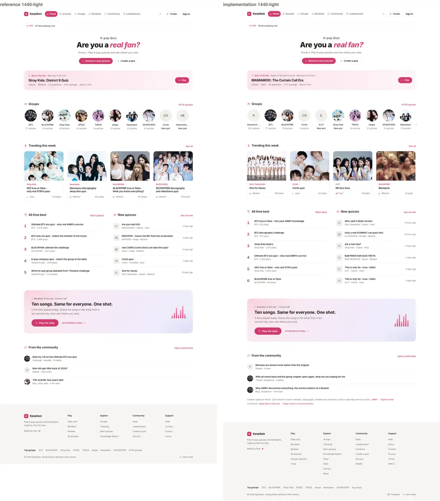

- After the audits: X1-003 avatar menu "My quizzes" opens the passport Quizzes tab with this device's draft count
  (PR #72, with P10 PR #75); X2-001 64px (not 136) under the phone footer (#72); X2-008 default 1080 x 1920 Story
  image tile on every share sheet (#72); X2-011 dropdown triggers keep their label (`showValue={false}`, #72, used
  by P2); owner requests 1 and 2 (#76); tablet chrome to 900px (#81); legacy toast above the tab bar (#82).
- V: all of these FIXED; shell.spec and kit.spec pass at both widths except the kit card height test. V also
  found the nav glass AA case (4.46:1 over a pink button when scrolled).
- After V: A0 fix 8 (PR #86, be059cc) makes the light nav and tab bar glass 94% opaque and measures the kit card
  heights as the prototype does; A0's proofs: qa-a11y blindtest 3 / 3 light and 3 / 3 dark at 1440, nav scan 0 of
  18,283, tab bar scan 0 of 7,249, kit + shell 57 pass at 1440 and 78 at 390, vitest 920 / 920, tsc 0, flag off
  identical (A0.md section 15, section "A0 fix 8" below).
- Loop 2: shell landmarks pass in every state, C1-002 fixed; wiring 29 PASS / 2 N/A, C2-001 fixed (every new
  endpoint 404 flag off); axe 0 and every sheet check on sign-in, search, account menu, bell; the shell adds about
  15 links per page and removes none.
- Owner decisions: logo swap (5), contrast tokens (6), cleanup items (22).

### Home (P1): DONE

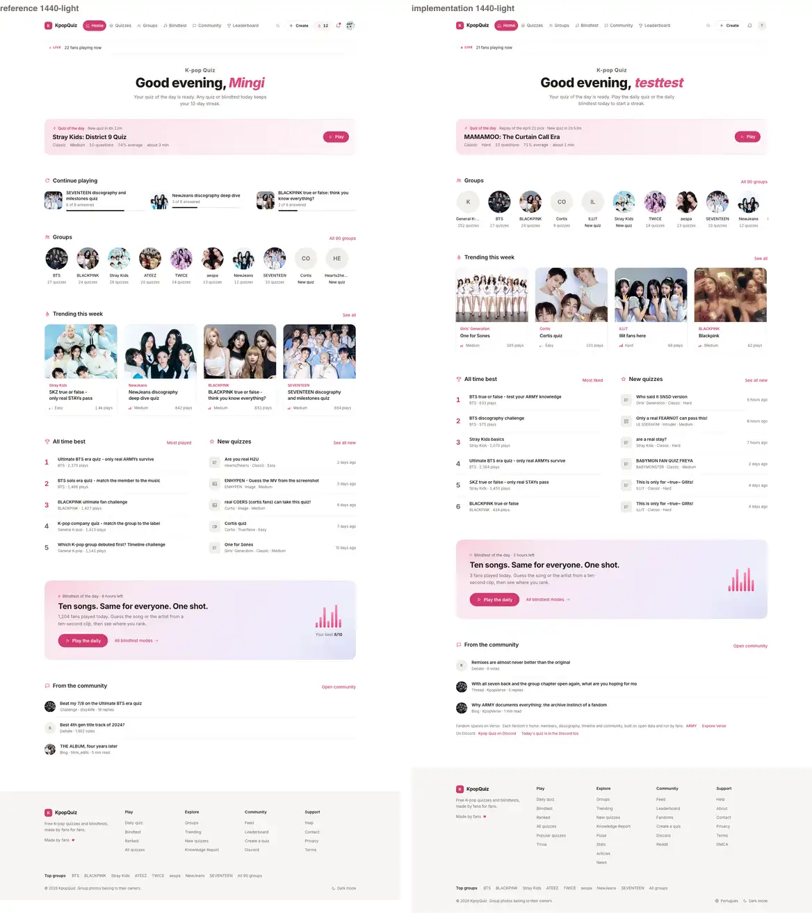 

- After the audits: X2-002 no 1px sliver of the 11th rail tile at 1440; X2-007 no pulse dot once today's blindtest
  is played (PR #74; P1.md section 9, p1.spec 41 / 41, link set of `/` and `/pt` unchanged).
- V: both FIXED (`crops/home-1440-light-railedge.png`, `x-home-daily-played`); p1.spec passes at both widths.
- Loop 2: pixel home 17 / 17 and home-guest 19 / 19; wiring 16 PASS / 1 N/A; axe 0; SEO fields identical, only the
  live 404 links and parked Verse links dropped; LCP 2.42 s (off 3.28 s), CLS 0.054, images 495 KB.
- Deferred: QOTD rotation fix behind `QOTD_ROTATION_FIX` (decision 15); ticker random floor (decision 7).

### Quizzes (P2): DONE with deferred owner decisions

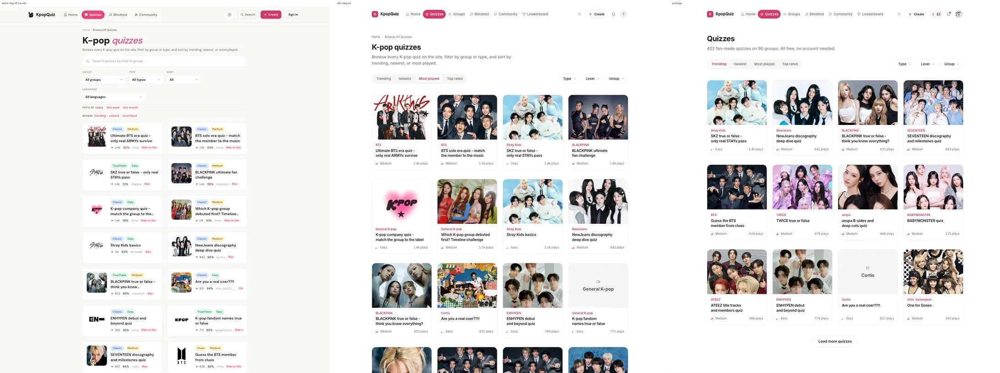

(P2's before | after | prototype, round 2, before the warm ground.)

- After the audits: X1-006 merged (PR #77, ab6fd66, pushed by ORCH on the owner's explicit go). Round 2 pixel pass
  (P2.md section 7): A0's Segmented / UxDropdown href options, breadcrumb spacing, menu gap and placement, the FAQ
  in the prototype's accordion; X2-011 triggers keep "Type" / "Level" / "Group" (A0 #72 + P2 17da344).
- X2 re-check (63d8ef4): matches the prototype within owner decisions A and B. V (2a6cbef, 4 combos): Type / Level
  / Group, first card, phone Create and Load more at the prototype's x and size; the whole grid +48 to +49px at
  1440 and +68 to +69px at 390 = decisions A and B; only card order differs from X2's capture (data).
- e2e: p2.spec passes at both widths (V); the loop 2 keyboard failure on the pre-P2 page and the /quizzes axe case
  now pass (V section 7). SEO + link set (P2.md 3.4, 11 URLs): 0 links lost, metadata, H1, intro, FAQ, JSON-LD same.
- Not re-run by the checkers after the merge: C1's quizzes x4 (its verdict file still says "not verified",
  pre-P2) and C2's 7 /quizzes rows (still PENDING in C2's table). Covered instead by X2's re-check, V's 4-combo
  check, p2.spec and P2's own wiring proof (P2.md section 4).
- Deferred (owner): A. the visible live breadcrumb (+20.8px at 1440, +40.8px at 390); B. the live two-line intro
  (+27.9px) (decision 32); default sort Most played, ?page=N, Level noindex, no Language dropdown or Create banners
  (decision 19).

### Groups and group hubs (P3): DONE with one deferred item

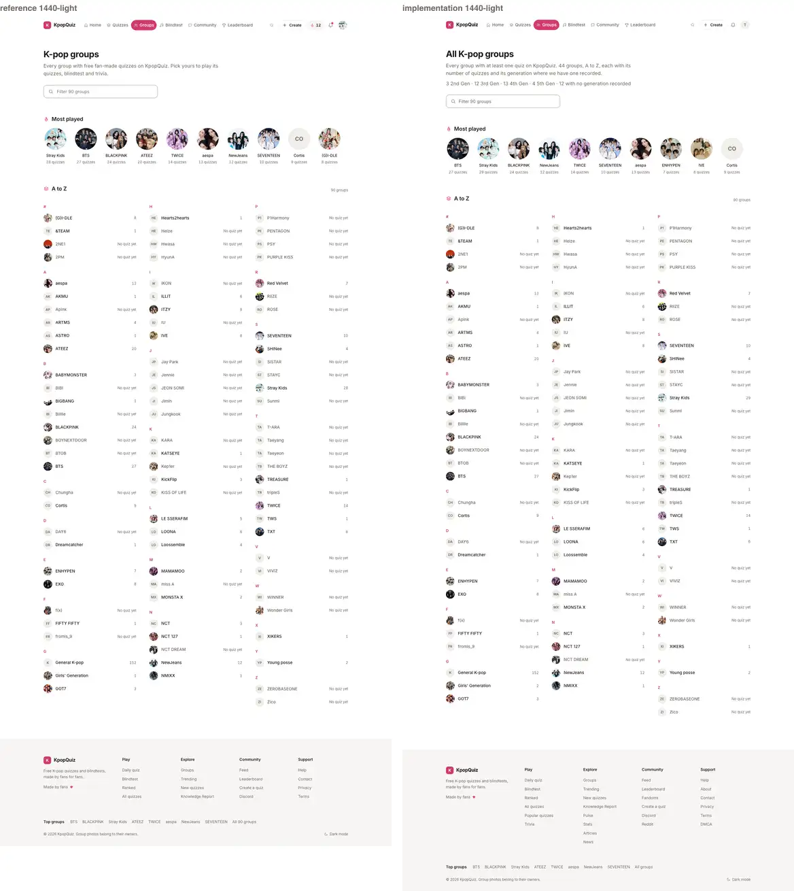 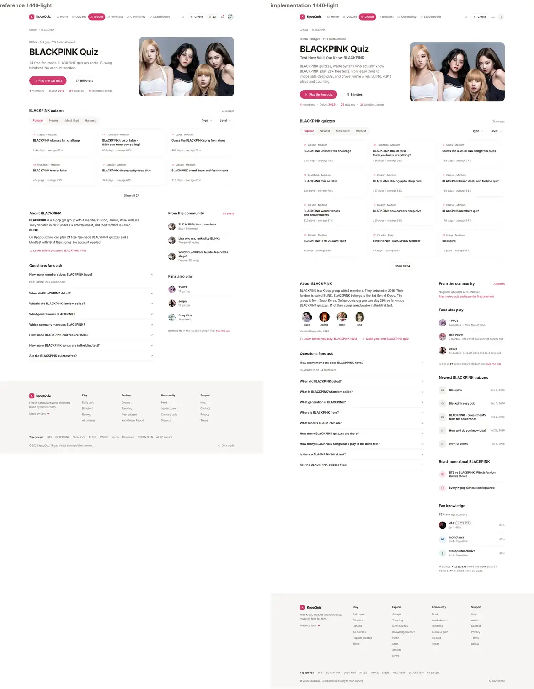

- After the audits: X1-005 an open Verse space with no posts opens the thread editor (`/community?compose=thread`);
  X2-004 the hub members row is one scrolling rail (80px faces), no orphan (PR #69; P3.md Fix 2 and Fix 2b).
- V: both FIXED (`crops/hub-ateez-1440-light-members.png`); p3.spec passes at both widths.
- Deferred: X2-003 the SEO-locked /groups intro says "45 groups, A to Z" while the list shows 91 (owner decisions
  20 and 21). Notify me waits for `v11-p3-group-quiz-alerts.sql`.
- Loop 2: pixel /groups 11 / 11, hubs 14 / 14, empty hub 8 / 8; wiring 18 PASS / 1 NOT VERIFIED / 1 N/A; axe 0;
  every hub quiz a visible server link; BLACKPINK LCP 3.01 s (off 3.31 s).
- Owner: the shared hub reads patch (decision 29), thin hubs noindex (decision 8).

### Quiz page, game, results, share (P4): DONE with one deferred item

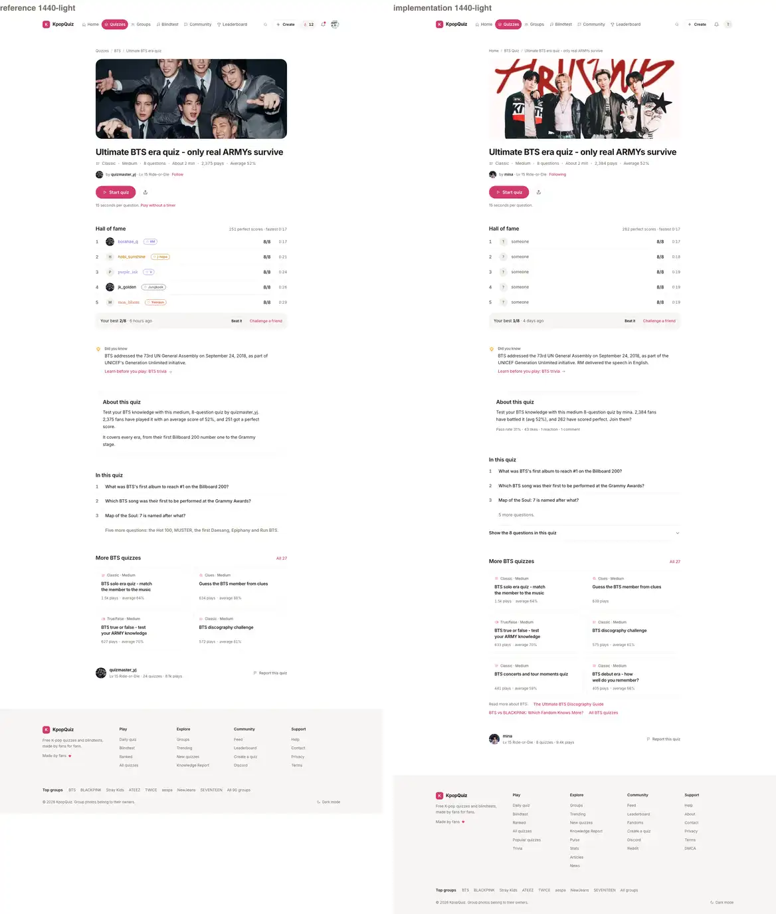 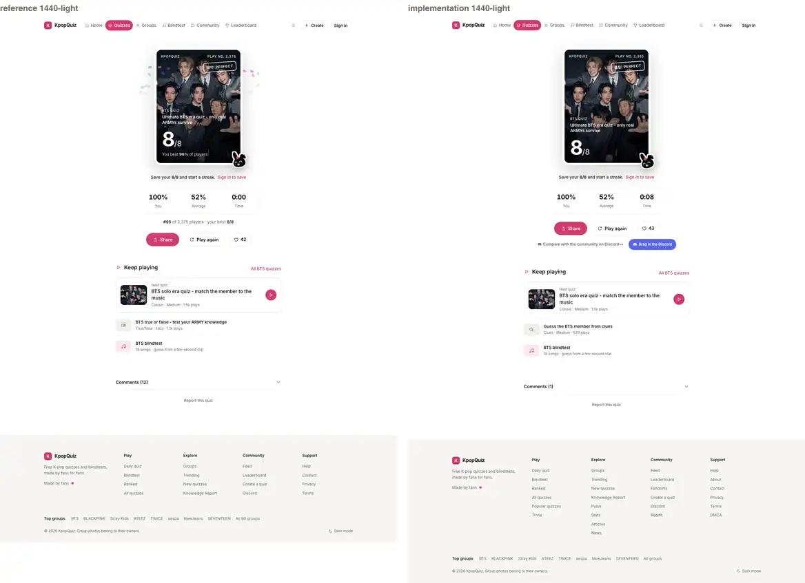

- After the audits: X1-002 results comments get a heart + count and Reply on a new store behind new routes
  (PR #78, P4.md section 11); until the migration the page shows no heart and no Reply, the write routes answer 503
  before any write. Fix 4 (PR #84, P4.md section 12): the C2-008 cases on a `next start` build ignore only the
  local `/_vercel/insights` script error (spec only, no app change). X2-008 Story image on the quiz and challenge
  sheets comes from A0 (#72).
- V: X1-002 DEFERRED (pending migration), code FIXED: the endpoint answers `live:false` today and the results show
  no dead control; p4.spec "results comments (guest, store live)" passes with a read stub on the 2a6cbef build.
- Deferred: `v11-p4-comment-likes.sql`, `v11-p4-relaxed-runs.sql`, `v11-p4-rank-for-score.sql` (not applied).
- Loop 2: pixel 7 states pass (the live Discord + Brag row a known deviation, decision 30); wiring 49 PASS / 4 NOT
  VERIFIED / 6 N/A, C2-008 fixed; axe 0, quit confirm and share sheets pass; SEO and JSON-LD identical; LCP 2.34 s.
- Owner: `battles` public inserts (11), hall of fame naming (10), `/_vercel/` through the middleware for local
  `next start` (RUN-STATE log 2026-09-29).

### Create (P5): DONE

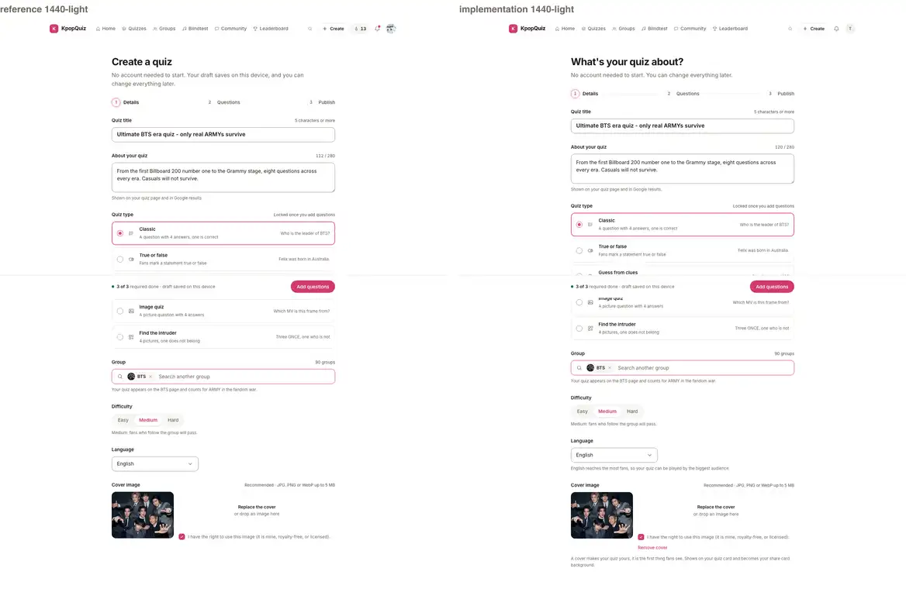

- After the audits: X2-009 the done state has "It's live" and its sentence, buttons full width and stacked on
  phones (PR #70, P5.md section 11).
- V: FIXED (`crops/x-create-done-390-dark-done.png`); p5.spec passes at both widths.
- Loop 2: pixel create-1/2/3 and signin pass; wiring 19 PASS / 4 NOT VERIFIED (publish is a production write) / 2
  N/A; axe 0; noindex as today, 0 lost text or links.
- Not verified: a real publish (decision 1). Owner: SEO-locked H1 and intro (decision 23).

### Blindtest (P6): DONE with deferred owner decisions

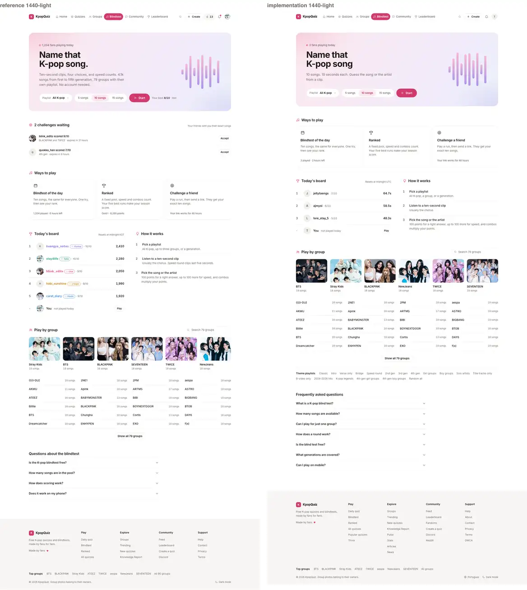 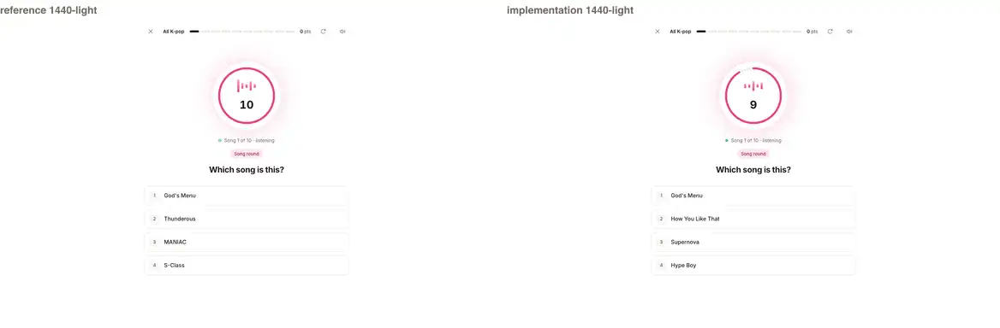

- After the audits: X1-001 (blocker) every group and theme blindtest door plays: flag on, `/blindtest/<mode>`
  keeps today's SEO copy and Play starts the v11 game for that playlist (PR #67, P6.md section 10: 105 / 105 real
  generate bodies OK, 0 links lost). X2-006 results share sheet "Share your blindtest" with the Challenge link
  block; X2-005 the results kicker names the run (PR #71, P6.md section 11).
- V: all three FIXED (`probe-btmode.json`, kicker and sheet crops); p6.spec passes at both widths; the
  /blindtest/<mode> pages left the legacy contrast list.
- The nav glass AA case V found on /blindtest when scrolled (A0's nav, not P6) is fixed by A0 fix 8 (PR #86): the
  qa-a11y blindtest case passes 3 / 3 light and dark at 1440 per A0's report.
- Deferred (owner): 9 of 18 static modes play the closest playlist and say so; title tracks plays the hits
  (decision 33); streak, XP, guest challenges, mixes (decision 12); the Intro 301 (decision 13).
- Loop 2: pixel 5 states pass; wiring 21 PASS / 3 NOT VERIFIED / 13 N/A; axe 0; SEO identical, 0 links lost.

### Ranked (P7): DONE for the not-live state; populated states NOT verified

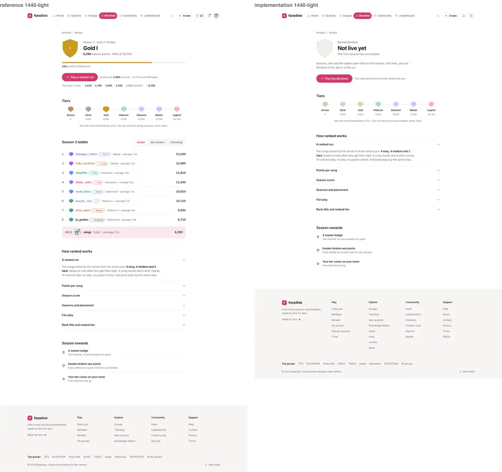

- No change after the audits (none filed on P7). V: ranked and btend-ranked captures unchanged from X2's.
- NOT verified until `v11-p7-ranked.sql` is applied (decision 2): populated board, btend-ranked, the ranked
  leaderboard tab. The not-live state passes (p7.spec, API 503 not_live before any write).
- The nav glass AA case V found on /blindtest/ranked when scrolled is fixed by A0 fix 8 (PR #86): 0 hits in A0's
  nav scan of that page at 1280 and 1440, light and dark.
- Owner: season rewards shown but not built, no /pt mirror (decision 18); ranked_plays open insert (decision 3).

### Community (P8): DONE; migration-gated states NOT verified

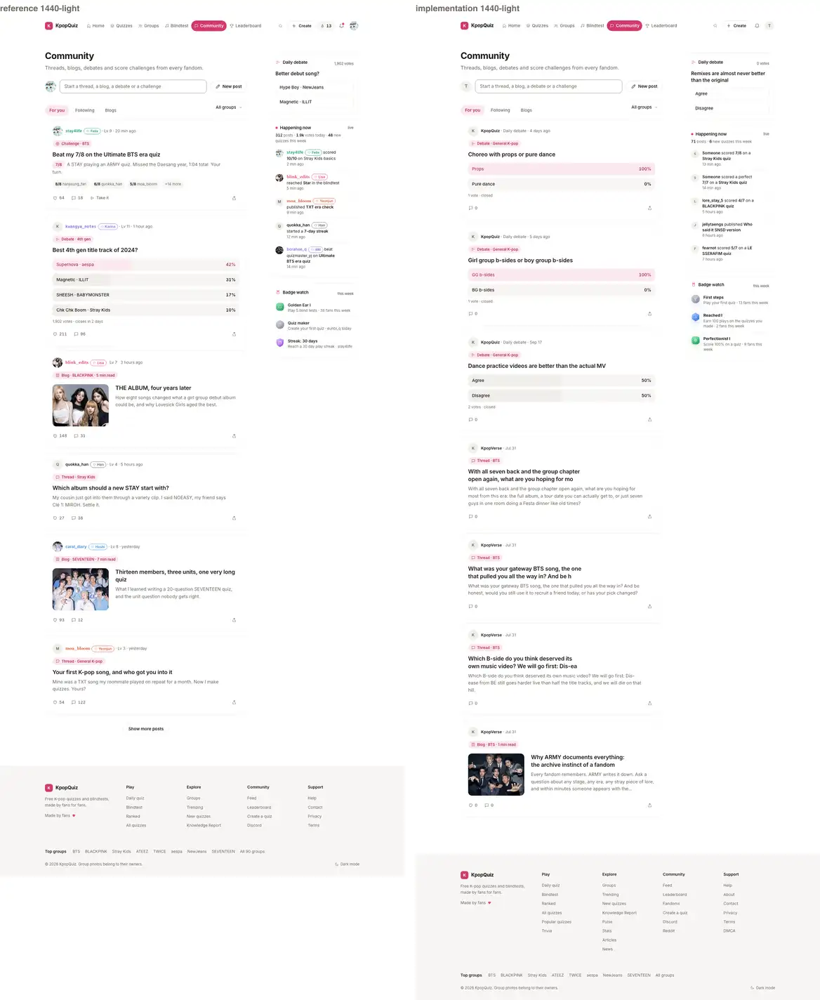 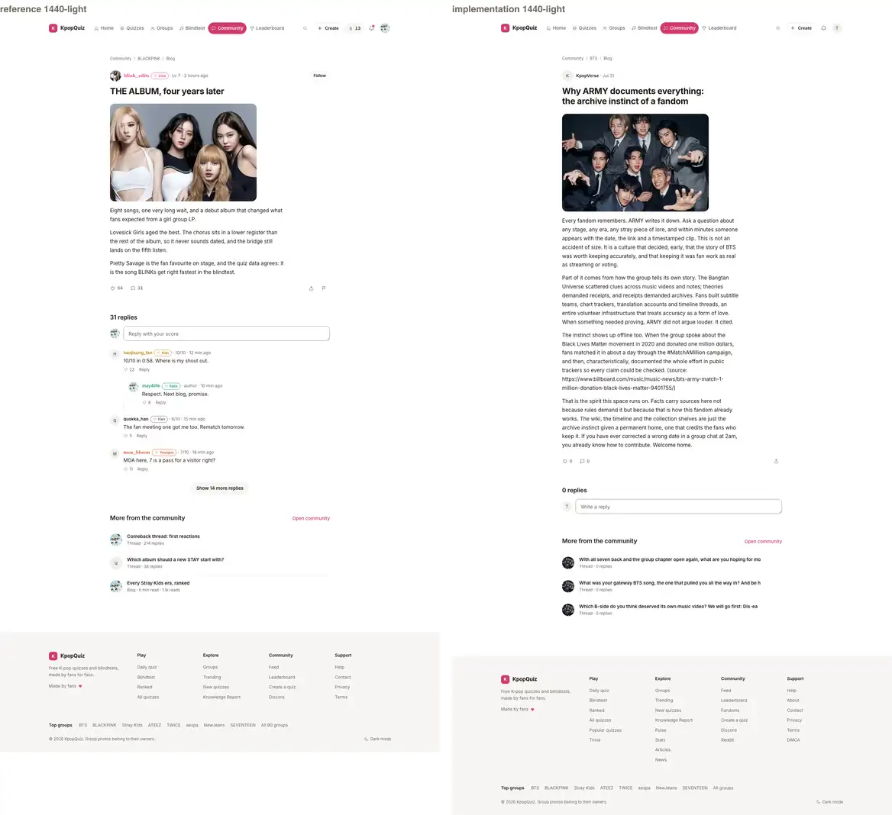

- After the audits: the post share sheet gains the Story image tile through A0's default (X2-008, #72); warm
  ground sweep (#80).
- V: community, post-blog, post-debate, editor, post-challenge captures show only data differences; p8.spec
  passes at both widths.
- NOT verified until `v11-p8-community.sql`: post-challenge content, fan debates, hearts (decision 27).
- Loop 2: wiring 17 PASS / 1 NOT VERIFIED / 3 N/A; axe 0; new URLs 200 noindex flag on, 301 flag off.
- Owner: daily debate rotation (DAILY DEBATE ROTATION note), Verse write routes (decision 26).

### Leaderboard (P9): DONE

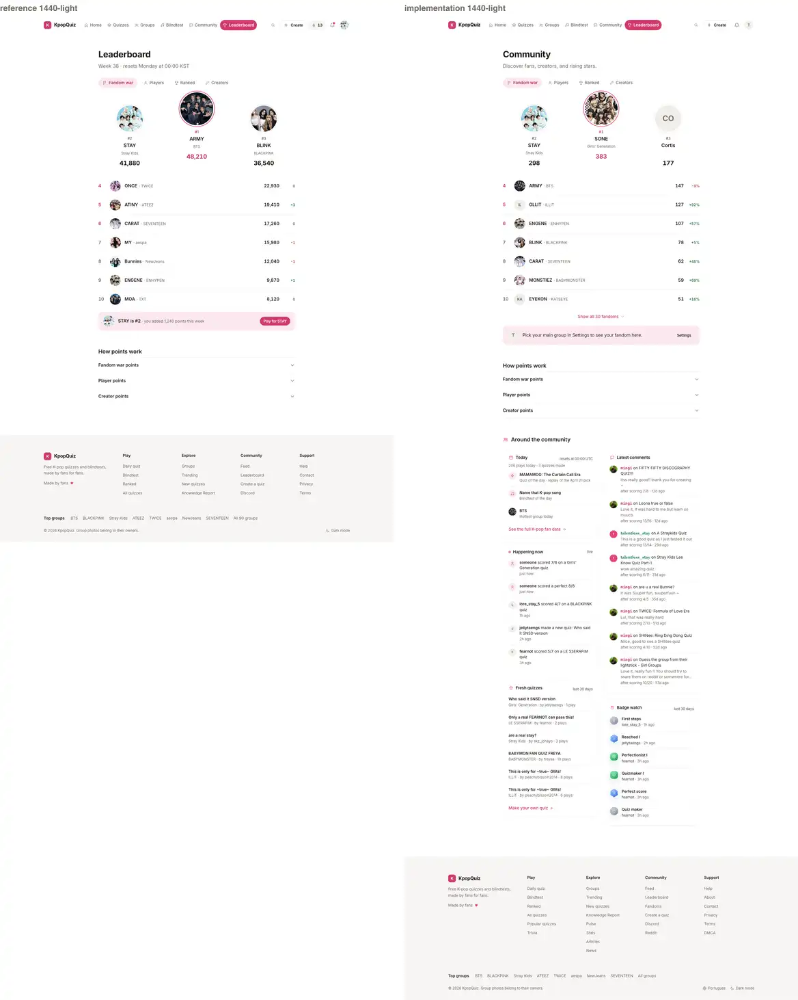

- No change after the audits (none filed on P9; X2's Players / Ranked / Creators tabs match). V: order differs
  only by data; p9.spec passes at both widths.
- Loop 2: pixel 8 / 8; wiring 5 PASS / 2 N/A; axe 0; 0 links lost.
- Owner: SEO-locked H1 "Community", all-time Players, migration 097 not applied (decision 25); /pt/leaderboard fake
  padding (FAKE DATA note).

### Passport and settings (P10): DONE; signed-in /me NOT verified

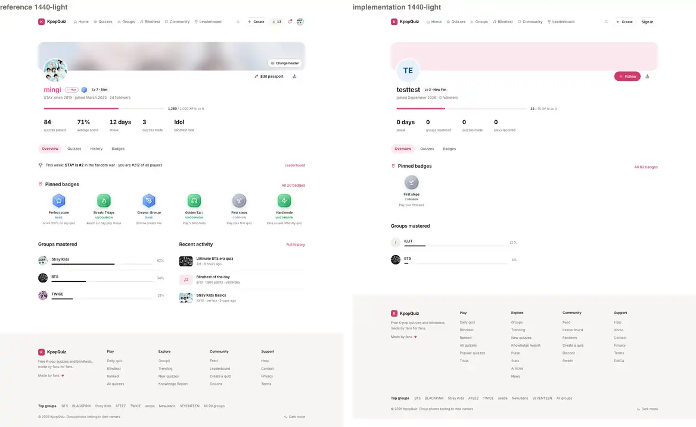

- After the audits: X1-004 the guest passport invitation on `/me` (PR #68, P10.md section 11); the visitor share
  sheet's Story image tile and this device's create draft in the Quizzes tab (X1-003 part, PR #75, section 12);
  the save bar above the tab bar up to 900px (PR #83, section 13).
- V: guest `/me` 200 with "Your K-pop passport", `/profile` 307 to `/me`; save bar 11px above the tab bar from 390
  to 900; p10.spec passes at both widths.
- NOT verified: signed-in `/me` and the History tab (they write on view: decisions 1 and 4); header storage and
  email switches until their migrations (decision 14).
- Loop 2: pixel passport, badges, settings, header sheet pass; wiring 12 PASS / 4 NOT VERIFIED; axe 0.

### Notifications, search, bell (P11): DONE

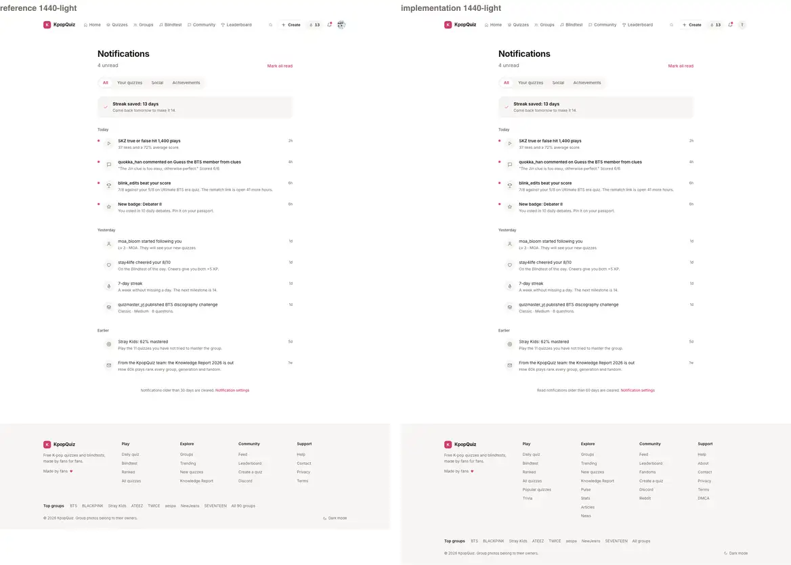

- After the audits: X2-010 the unread line under the H1 follows the active filter (PR #73, P11.md section 10).
- V: FIXED (Social shows "1 unread" as the reference); p11.spec passes at both widths.
- Loop 2: pixel 3 states pass; wiring 8 PASS / 1 NOT VERIFIED; axe 0; /search 0 links lost.
- Owner: real-rule copy and row menu (decision 24).

## Audit gaps, final verdicts (V on 2a6cbef)

| Id | Owner | Fix | V verdict |
|---|---|---|---|
| X1-001 | P6 (+ doors P3, P4, P11) | #67 | FIXED |
| X1-002 | P4 | #78 | DEFERRED: code done, waits for `v11-p4-comment-likes.sql` |
| X1-003 | A0 + P10 | #72, #75 | FIXED |
| X1-004 | P10 | #68 | FIXED |
| X1-005 | P3 | #69 | FIXED |
| X1-006 | P2 | #77 | FIXED |
| X1-007 | C3 | #79 | FIXED; V found the report stale: this refresh |
| X1-008 | X2 extension | AUDIT-X2 Extension (33 extra states) | FIXED |
| X1-009 | ORCH / owner | - | DEFERRED: parity.spec loads /profile signed in (decisions 1 and 4) |
| X1-010 | ORCH | - | FIXED; the leftover test-user session files V listed were deleted by ORCH (RUN-STATE log 2026-09-29: 0 left) |
| X2-001 | A0 | #72 | FIXED |
| X2-002 | P1 | #74 | FIXED |
| X2-003 | P3 | - | DEFERRED: owner decision (SEO-locked copy) |
| X2-004 | P3 | #69 | FIXED |
| X2-005 | P6 | #71 | FIXED |
| X2-006 | P6 | #71 | FIXED |
| X2-007 | P1 | #74 | FIXED |
| X2-008 | A0 (+ P4, P8, P10) | #72, #75 | FIXED |
| X2-009 | P5 | #70 | FIXED |
| X2-010 | P11 | #73 | FIXED |
| X2-011 | A0 + P2 | #72, #77 | FIXED |

Checker issues from the earlier loops, all fixed: C1-001 (P3), C1-002 (A0), C2-001 (A0), C2-002 / 004 / 005 (P1),
C2-003 / 008 (P4), C2-006 / 007 (P3), C3-001 / 002 (P3), C3-003 / 006 / 008 (P1), C3-004 (P4), C3-005 (P5),
C3-007 (P8), C3-009 (P6). C3-002, C3-003 and C3-009 are fixed in code with unit tests, not fault-injected. Full
lines in `v11/issues/<owner>.md`, loop 2 verdicts in `checks/qa/ISSUES-STATUS.md`.

## A0 fix 8: merged after the final verification (PR #86, merge be059cc)

V's two new A0 items (FINAL-VERIFY section 3 and 7), both fixed by A0 fix 8 (f4ff6d6 nav and tab bar glass,
a5b2ac7 kit test; A0.md section 15). The numbers are A0's, on a flag-on dev server; C3 did not re-run them.
1. Nav glass contrast. Found by V: at 1280 and 1440 light, when a pink primary button scrolled under the warm
   translucent nav (86%), axe blended the glass to #F4DDE2 and the muted pill text read 4.46:1 (needs 4.5) on
   /blindtest (scroll about 420) and /blindtest/ranked (about 360); qa-a11y "blindtest ... group-search" failed 3 / 3.
   Fix: the light nav glass and the white tab bar glass 94% opaque (deviation 4, pending the owner: RUN-STATE
   decision 37). Proofs: the qa-a11y blindtest
   case 3 / 3 light and 3 / 3 dark at 1440 (with 86% put back it fails on `a[data-nav="community"]`); the nav scan
   (axe color-contrast on `.ux-nav` every 60px of scroll, V's 11 pages, 1280 and 1440, light and dark) 0 of 18,283
   checks, and with 86% forced exactly V's 4 hits; the tab bar scan at 390 0 of 7,249; a unit block checks every
   text on each glass over 5,832 backdrops (black and white included) >= 4.5; whole qa-a11y.spec at 1440: 74 pass,
   14 fail (the known legacy pages), 1 flaky, no finding on the nav or tab bar.
2. kit.spec card heights (test only). Found by V: the test failed 3 / 3 because the kit row stretched one-line
   cards to the two-line height (329.78 vs 308.18), as the prototype's grid does. Fix: the test measures each
   card's own height against the reference and every card's painted height against its row's tallest; 6 / 6 at
   1440 and 390 (`--repeat-each 3`), and it now also catches a grid that stops stretching.

Checks (A0.md 15.3): kit + shell 57 pass at 1440 (1 skipped, 1 flaky), kit + shell + 32 qa-a11y cases 78 pass at
390 (12 skipped, 1 flaky; the flaky case is fix 7's legacy toast in create mode on the dev server, green on V's
production build), vitest 920 / 920, whole-app tsc 0, eslint 0, flag off identical (8 pages as whole documents,
`/` identical markup; `reports/A0/fix8-flag-off.txt`). ORCH's re-run on be059cc matches: whole-app tsc 0, vitest
920 / 920 (37 files). The flag-on production build of be059cc is being retried: the first attempt failed while
prerendering /u/roseeeyh on 129 Supabase connection timeouts (a network drop, not code).

## NOT verified, and why

- Anything that writes production data (finishing a quiz or blindtest for real, liking, commenting, replying,
  voting, posting, publishing, saving settings, header upload): owner decision 1. Every such request was answered
  locally and its payload asserted (e2e, C2).
- Signed-in `/me` and `/profile`, the passport History tab and the populated Quizzes tab: they write on view
  (decisions 1 and 4). The passport is checked through `/u/testtest` as a guest; parity.spec is not run (X1-009).
- Pending migrations (list below): comment hearts and replies, relaxed runs, the guest rank line, populated ranked
  states and btend-ranked, post-challenge / fan debates / community hearts, Notify me, header storage, email
  switches.
- /quizzes by C1 (pixel) and C2 (7 wiring rows): not re-run after P2's merge; covered by X2's re-check, V and
  p2.spec (Quizzes section).
- Lighthouse (perf >= 85, SEO 100, a11y >= 95): PENDING the owner's OK (a new dependency). Playwright
  measurements stand in.
- The runtime failure path of the P1, P3, P6 read fixes (throw so the last good ISR page stays): unit-proven, not
  fault-injected (needs a failing read on a production server).
- The quiz challenge game chip and relaxed chip, XP lines and "You beat N%" on results: need a signed battles row,
  a migration, or a real save (AUDIT-X2 Extension).
- A0 fix 8 on a production build and in the full owner spec run: A0's proofs ran on a flag-on dev server (A0.md
  15.4); V's owner spec counts above are from 2a6cbef, before the fix, and were not re-run.
- Devices: Chromium 1234 only (mouse and touch emulation), no real iPad or Safari; screen readers not run (roles,
  names and live region text checked in the DOM).
- Vercel preview: the owner set `NEXT_PUBLIC_UX_V1=1` for the `feat/ux-v1-v11` preview (RUN-STATE log 2026-09-27
  23:15; a flag-on preview of b90494e was READY on 2026-09-28), but it sits behind Vercel SSO with no bypass
  secret: every check ran on local production builds.

## Owner notes from C3

- Legacy pages rendered inside the v11 shell keep their existing axe color-contrast failures (present flag off too):
  /blackpink-trivia, /pt, /pt/blindtest, /pt/leaderboard, /articles and an article, /stats (14 cases per width in
  V's run). /quizzes and /blindtest/<mode> left this list (P2, X1-001). Nobody owns these pages in this run.
- Parked Verse links: the v11 home and hubs no longer link /verse/blackpink, /verse/seventeen, /verse/stray-kids,
  /verse/ateez (404 locally, 302 to /verse on live): dropped on purpose by C2-005 / C2-006; confirm (decision 31).
- A local `next start` does not serve `/_vercel/insights/script.js`; the middleware 301s it to `/` and the browser
  runs the home HTML as a script ("Unexpected token '<'", local only). Vercel is not affected. Option: let
  `/_vercel/` through the middleware.
- ISR pages outside v11 keep a failed read for their whole window, flag on and off alike (/most-liked, /data/pulse,
  /pt, /leaderboard seen in loop 1); same class as decision 28.
- `images.imageSizes` stops at 220 and `deviceSizes` starts at 640: a `fill` image with a small `sizes` jumps to
  640px on DPR 3 phones (the v11 case, C3-008, uses fixed-size images).
- The v11 stylesheet route (`/api/ux-v1/a0/styles`, 160 KB raw, 28 KB gzip) is not compressed by a local
  `next start`; Vercel compresses it. To confirm on the first reachable preview.
- The shared checker server ran with VERSE_PUBLIC on; production has it off. P8's own e2e covers both modes.

## Evidence index

- Final verification: `checks/qa/FINAL-VERIFY.md` (V, 2a6cbef; its images and probes stayed in V's scratchpad).
- Audits: `v11/AUDIT-X1.md` (scope), `v11/AUDIT-X2.md` (strict visual pass + 33 extra states).
- Fixes: `v11/reports/<id>.md` (A0 sections 11 to 15, P1 9, P2 7, P3 Fix 2 and 2b, P4 11 and 12, P5 11, P6 10 and
  11, P10 11 to 13, P11 10) and their images under `v11/reports/<id>/`.
- C3 loops 1 and 2: e2e `checks/qa/e2e-loop2.md`, `e2e-run3.md`, `e2e-qa2.md`; accessibility `QA-A11Y-loop2.md`,
  `QA-A11Y.md`, specs `apps/quiz/e2e/ux-v1/qa-a11y.spec.ts`, `qa-keyboard.spec.ts`; SEO `seo-loop2/`, `seo/`;
  performance `perf/`; issues `ISSUES-STATUS.md`, `evidence/`.
- C1 pixel: `checks/pixel/README.md` and `checks/pixel/<state>/`. C2 wiring: `checks/backend/README.md`.

## Pending migrations (copied from v11/RUN-STATE.md at d3e8c99)

- `docs/pending-migrations/v11-p4-relaxed-runs.sql` (P4): plays.relaxed (play without a timer), excluded from the hall of fame and quiz_time_stats.
- `docs/pending-migrations/v11-p4-rank-for-score.sql` (P4): get_quiz_rank_for_score (guest rank line on results).
- `docs/pending-migrations/v11-p10-header-storage.sql` (P10): the profile-headers storage bucket + policies; both header routes answer 503 before any write until it exists.
- `docs/pending-migrations/v11-p10-email-prefs.sql` (P10): email notification switches (disabled in the UI until applied).
- `docs/pending-migrations/v11-p3-group-quiz-alerts.sql` (P3): group quiz alerts table + RLS + publish trigger (the empty hub's Notify me fails soft until applied).
- `docs/pending-migrations/v11-p8-community.sql` (P8): community_likes, community_debates + community_debate_votes, community_challenges, community_replies (fan debates, challenge posts and hearts stay off until applied; they turn on without a deploy).
- `docs/pending-migrations/v11-p4-comment-likes.sql` (P4): quiz comment hearts and replies (the results comments show no heart or Reply until applied).
- `docs/pending-migrations/v11-p7-ranked.sql` (P7): ranked_seasons, ranked_runs (run tokens), ranked_song_stats, ranked_legends; ranked_plays.season + run_token (unique) + index (player_id, season, score desc); 7 service_role-only functions; RLS on, no policy; commented rollback; nightly cron documented, not enabled.

## Owner decisions needed (copied from v11/RUN-STATE.md at d3e8c99; decision 37 added from its later version)

SECURITY, LIVE SITE (found by C2, confirmed by ORCH in code): /auth/callback redirects to returnTo without checking it stays on the site (`NextResponse.redirect(new URL(returnTo, request.url))`): an open redirect after sign-in. Auth is out of this run's scope; handed to the owner as a separate task chip.

FAKE DATA, LIVE SITE (found by P9, confirmed by ORCH): /pt/leaderboard pads the weekly board with made-up accounts from lib/weekly-leaderboard-padding.ts (FAKE_USERS). Handed to the owner as a separate task chip.

DAILY DEBATE ROTATION (P8 + P9): the only caller of ensure_daily_debate is the legacy CommunityContent on /leaderboard (a write on view); no cron calls it. With the flag on, /leaderboard no longer mounts it and /verse/community 302s guests while the Verse is hidden, so the daily debate stops rotating. No write path was added. Owner call before turning the flag on (for example a Vercel cron).

PUBLISHED 2026-09-27 on the owner's explicit go ("do it, preview only"): ux11/p2-quizzes, ux11/c3-check, ux11/p4-fix3 pushed by ORCH and merged into feat/ux-v1-v11 (PRs #77, #78, #79). Never main.

SECURITY, LIVE SITE (found by P2, confirmed by ORCH in code): /quizzes puts user-written quiz titles into an ld+json script tag with a bare JSON.stringify (titles only length-checked), so a title containing </script> could break out: likely stored XSS. The Verse code already has the escaping sink jsonLdScript (lib/verse/jsonld.tsx). Handed to the owner as a separate task chip (fix on main).

BROKEN LINKS, LIVE SITE (found by P1, confirmed by ORCH): the live home links /quizzes/new and /quizzes/most-liked, both 404; /new and /most-liked are the real pages (the v11 home links those).

BUG IN PRODUCTION TODAY (found by P6, confirmed by ORCH in code): every /blindtest/<mode> page (97) fails on Play. The legacy BlindTestPlayer (components/blind-test/blind-test-player.tsx, YouTube) reads `data.songs[0]`, but /api/blind-test/generate was rewritten for Deezer and returns `questions`. Flag-off code, outside this run; flagged to the owner as a separate task.

1. Production writes as the test user. The local dev server and the preview both use the production Supabase, so every signed-in or guest action that saves something (play a quiz, like, comment, vote, save Your look, upload a header) writes production rows. The worker prompt lets agents act as the test user; the launch prompt says never write production data. Until the owner answers: no mutating request at all, e2e stubs POST/PUT/PATCH/DELETE and asserts the payload, C2 proves wiring by request shape plus read-only SQL. Asked 2026-09-25.
2. Ranked go-live (P7): apply v11-p7-ranked.sql, insert the season 1 row, enable the nightly Legend cron, decide whether ranked runs award blindtest XP (default no).
3. Security, existing (found by P7): the ranked_plays insert policy from migration 059 is open to the public, so anyone can insert forged rows today. Tightening it is an RLS change, out of this run's rules; owner call.
4. /me writes on view (found by A0): viewing /me (and /profile, which redirects there) signed in grants badge tiers and writes passport snapshots. No agent loads them signed in; parity.spec runs only with UX_V1_PARITY=1; P10 verifies the passport through /u/testtest and render tests. Folded into decision 1.
5. Logo (A0): the prototype's pink K tile + "KpopQuiz" (17.1) is shipped under the flag; the live site shows the rabbit mascot. One-line swap in components/ux-v1/brand.tsx.
6. Contrast (A0): name accents and badge rarity words are shown through per-theme AA-clamped tokens (same hue); stored values unchanged.
7. Live ticker online count (DESIGN-SPEC 17.11, already marked pending there): the live component floors the online count with a random 12 to 27. Kept as is unless the owner says otherwise (it is not real data).
8. Group hubs with few quizzes: the worker prompt asks for noindex until 3 quizzes; today's hubs have no robots rule, so it is an SEO diff outside 16.10. Not shipped; owner call.
9. New public URLs under the flag (/community and its posts, /blindtest/ranked): noindex and out of the sitemap until the owner decides.
10. P4: hall of fame shows guests as "someone" or signed-in players only.
11. Security, existing (found by P4): the `battles` table accepts public inserts; P4 only trusts signed challenge links. Tightening is an RLS change, owner call. Optional env UX_P4_CHALLENGE_SECRET for the link signature.
12. P6: should every blindtest (not only the dailies) count for the streak; should free hub plays be recorded and earn XP (XP-farming risk); wire bt_players rank titles; blindtest challenge creation is open to guests (require sign-in or rate limit?); "challenges waiting" needs an invitee column; the Recent hits, Legends and Speed round mixes need generate support.
13. P6: the Intro mode 301 (/blindtest/intro-challenge -> /blindtest) was not done in this run (SEO diff); owner go needed.
14. P10: header storage: create the profile-headers bucket or reuse the avatars bucket; an email sender for the email switches; a "flat theme colour" band mode needs a new column; a real delete-account flow (today the confirm sheet sends the fan to /contact). Signed-in /me is NOT verified live (render test only) until decision 1.
15. P1: QOTD rotation stopped because ensure_daily_quiz only publishes a bank row dated exactly today and nothing was scheduled after 2026-06-30 (the cron still answered ok). The fix ships behind the server env QOTD_ROTATION_FIX=1 (off by default, production cron unchanged); until it is set the home shows the real stored pick labelled "Picked on June 30".
16. Security, existing (found by P1): quiz_bank (migration 018) and quiz_time_stats (032) have write-all RLS policies, so anyone with the anon key could insert a bank row the cron would then publish. Not tested. Tightening is an RLS change, owner call.
17. P1 design changes made to keep every live home link: 6 cards per rail instead of 4 or 5, a "Most liked" link, Verse and Discord lines under the community rows; the 17 hub links sit in the scrolling groups rail in the live order (Cortis is 4th there).
18. P7: Season rewards are shown as designed but not built (build them or hide the section before go-live); no /pt mirror for /blindtest/ranked.
19. P2 deviations: the live H1, intro and breadcrumb (SEO lock) push the grid 64.7px lower than the reference; default sort shown as "Most played" (the live default); ?page=N shows pages 1..N; ?level= is noindex with canonical /quizzes (flag on only); no Language dropdown (?lang= still works); no Create banners; the popular-* subpages are not redesigned. P2 also found that lib/db/queries/popular.ts caches a failed plays read as an empty window for an hour (task chip spawned by P2).
20. P3: groups.quiz_count is stale because handle_new_quiz() only ever adds (it never subtracts on unpublish or delete). The v11 pages count published quizzes, but the SEO-locked texts still show the stale number (BLACKPINK 29 vs 24 published) and the locked blindtest counts come from the old table; the locked /groups intro does not match the 90 listed groups. Fixing the trigger is a DB change; changing the locked texts is an SEO change: owner call for both.
21. P3: /groups (flag on) lists all 90 visible groups and so links the 46 hubs that have no quiz yet (thin pages, shown muted); noindex for thin hubs was not shipped (decision 8). Also for review: hub breadcrumb vs BreadcrumbList, the kept Verse link, Notify me, the FAQ heading (P3 report section 9).
22. Cleanup items for the owner (from A0): give lib/streak.ts streakState an optional `now` so streakView never reads the clock (tests now freeze the clock instead); `turbopack.root` in next.config.ts (dev only, P1's note); once P2 is merged, P2 can drop its copy of the link-option rule now that Segmented and UxDropdown accept href options; the inert Phase 1 `.uxv1-*` CSS in globals.css.
23. P5: /create keeps the live H1 "What's your quiz about?" and intro (SEO lock) instead of the prototype's "Create a quiz" (one line to switch; the page is noindex); the paste format; the new Easy and Hard difficulty lines. Existing bug (found by P5): the legacy create-funnel autosave can re-save a draft it just cleared. Cleanup: like P4, make create-funnel.tsx and question-list-editor.tsx import lib/ux-v1/p5 so there is one copy (a flag-off change). The sign-in callback uses NEXT_PUBLIC_SITE_URL, which matters for OAuth round trips on preview deploys.
24. P11 copy states the real rules: read notifications are cleared after 60 days (not 30); the streak counts only the daily quiz and the daily blindtest. Dismiss and Mute of the live center are kept in a row menu (not drawn in the prototype); four filters; search ranks the closest name first; a song row opens /blindtest/<group mode>, which fails on Play today (the production bug P6 reported). /search itself stays the live page inside the shell (no prototype state).
25. P9: the H1 stays "Community" (SEO lock) instead of "Leaderboard"; "Around the community" is kept until /community is indexable; Players = all-time XP (no XP history exists); the weekly change is the real percent change, not rank moves; migration 097 (Rising) is not applied in prod; 19 groups have fandom_name 'fan'; the shared getFandomWarMap caches an empty board for 1h after an RPC error (P9 reads through its own throwing getWarMap).
26. Security, existing (found by P8): the existing /api/verse/* write routes (threads, essays, discussions, reactions, flags) do not check VERSE_PUBLIC or LIVE_SPACES themselves, so a hand-crafted request can write Verse rows for hidden or parked spaces today. The v11 /community never offers them for gated content. Owner call.
27. P8 remaining decisions: apply v11-p8-community.sql; blogs keep curator review and a space Join (no cover upload); the feed shows the last 3 closed daily debates; the daily debate reply is sent with the vote; /community stays noindex until the owner decides. The feed shows no Verse item unless VERSE_PUBLIC is 'true', and never a parked space (lib/ux-v1/p8/verse-gate.ts).
28. Cached failed reads on legacy (flag-off) code, found by P2, P1, P6 and C3: lib/db/queries/popular.ts, getFandomWarMap, getQuizOfTheDay (null for the day), lib/db/queries/blindtest.ts getBlindtestStats (`count ?? 0` inside unstable_cache), and ISR pages keeping a render whose reads failed. The v11 pages no longer do this (P1, P3, P6 fixes). Owner call for the legacy code (one task chip exists for popular.ts).
29. Shared hub reads (found by P3): 10 shared reads used by the group hubs (group-hub, community, freshness, related quizzes, trivia facts) return an empty value when Supabase fails and unstable_cache keeps it up to an hour, on the v11 hubs and the live ones alike (in this loop every flag-on hub lost its fandom war line until the dev cache was cleared). A ready fix is in docs/design/ux-dashboard-v1/v11/reports/P3/fail-closed-queries.patch (39 lines, applies cleanly, type-checks; callers to check are listed in v11/requests/P3.md request 2). It changes shared flag-off code, so it is the owner's call, not applied in this run.
30. P4: the v11 results keep the live Discord line and Brag button (70% and up, hidden while the Discord flex webhook is unset): one centred row that is not in the prototype; the link uses the v11 muted colour because the legacy blue fails AA on dark.
31. Parked Verse links (C3 owner note): the v11 home and hubs no longer link /verse/blackpink, /verse/seventeen, /verse/stray-kids, /verse/ateez (parked spaces: 404 with VERSE_PUBLIC=true as in dev, 302 to the /verse teaser on live). Dropped on purpose by C2-005/006; confirm.
32. P2 /quizzes deviations (P2.md 7.2 / 7.3): decision A: the visible live breadcrumb moves the grid down 20.8px at 1440 and 40.8px at 390 (not in the SEO lock list; kept until the owner decides); decision B: the live two-line intro adds 27.9px (SEO lock). Total +48.7px at 1440, +68.7px at 390 vs the prototype. Default sort Most played (live default; Trending would change page 1 and its ItemList JSON-LD).
33. P6 blindtest modes (X1-001 fix): under the flag, /blindtest/<mode> keeps its SEO content and plays the v11 game; 9 of the 18 static modes cannot be served as named because generate cannot apply their filter (clip point or length, year, generation plus gender): each plays the closest playlist and says so under Play; they need generate support and better data, or a 301 (owner call). generate's title-tracks pool is empty in the curated catalog: /blindtest/title-tracks plays the hits instead, and "Title tracks only" is removed from the flag-on hub menu. With the flag off the legacy player still fails on Play (task chip).
34. Owner requests 1 and 2 (A0 fix 5, merged): nav spacer never more than 8px: 8px for guests and signed-in fans without a streak pill at 1280/1440, shrinking to 5.5/3.7/1.8/0px with a 1/2/3/4-digit streak pill so the bar fits. For a full 8px with a streak pill (owner call): hide the link icons while a streak pill shows, or Create as an icon button, or a nav wider than the 1120 page column. Light page #FAF8F5 (live --bg), warm nav glass; cards, panels, sheets, fields, ticker, tab bar stay white; --ux-surface #F1EFEA, --ux-surface-2 #EAE7E1, --ux-pink-ink #C43565 (AA on the new surfaces); dark unchanged.
35. Tablets (A0 fix 6, merged): from 761 to 900px the site uses the phone chrome (top bar + bottom tab bar), the prototype's own narrow layout; from 901 to 959px Create shows as its round icon next to a streak pill. No sideways scroll at any width from 761 to 1279 (12 sweeps). Open, pre-existing: on touch screens at 1280+ with a 4-digit streak the right cluster ends 7.9px into the gutter (no scroll).
36. Data (P7): `songs` has no accuracy stats; the ranked 4/4/2 draw uses the curated songs.tier until ranked answers build up ranked_song_stats.
37. Nav glass (A0 fix 8, merged): the light nav and tab bar glass are 94% opaque instead of the prototype's 86%, so their text stays AA over a pink button or any photo scrolled under them; over the page ground the look is unchanged. One value each in design-tokens.ts and a0.css to go back.
