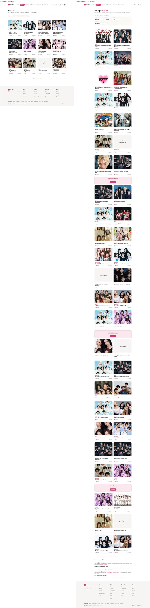

# UX v11.2 run report (C3, Phase 3, loop 1)

## Progress

- Status: C3's own checks DONE (e2e, accessibility, SEO, performance, whole-app tsc). REPORT.md is a DRAFT until
  C1 (pixel) and C2 (wiring) finish: their columns below are snapshots of their branches (C1 `ux11/c1-check`
  at fa89993, C2 `ux11/c2-check` at f85bbd3) and are refreshed when ORCH says both are done.
- Branch `ux11/c3-check`, local only: the session permission check refused the push (ORCH and the owner decide
  how it is published). Worktree `.claude/worktrees/agent-a0c9933401ee9710b`.
- Build under test: the shared flag-on production build of `feat/ux-v1-v11` at dcc3159 (P8 included) on
  http://localhost:3021. Flag off: a production build of the same head in the C3 worktree (`next start` :4203).
  Live: https://kpopquiz.org (= main).
- Pending by design: `/quizzes` (P2's branch waits for the owner; the server shows the pre-P2 page inside the
  shell). Populated ranked states: NOT verified until the ranked migration is applied.
- C3 issues filed: C3-001 to C3-009 (P1: C3-003, C3-006, C3-008; P3: C3-001, C3-002; P4: C3-004; P5: C3-005;
  P6: C3-009; P8: C3-007). Evidence under `v11/checks/qa/`.

## At a glance

| Check | Result | Evidence |
|---|---|---|
| e2e, every `e2e/ux-v1/*.spec.ts` except parity (551 tests: ux-1440 + ux-390, light + dark, guest + signed in) | **542 passed, 1 flaky, 0 failed, 8 skipped by design** (21 min). Flaky: p4 "like" at 390 (C3-004, a real race). Skips: 3 "desktop widths" + 1 "desktop nav" + 1 "phone only" (shell), 1 "phone only" (p4), 2 "VERSE_PUBLIC=true on this server" (p8 hidden-Verse case) | `checks/qa/e2e-run3.md` |
| axe, whole document, every v11 state x 1440 / 390 x light / dark, guest and signed in (read only) | **0 serious or critical on 190 of 190 v11 runs.** 36 runs with serious color-contrast on legacy content rendered inside the shell (/pt, /pt/blindtest, /pt/leaderboard, /articles, an article, /stats, /blackpink-trivia, /blindtest/classic, /quizzes pre-P2): every one exists with the flag off, and the flag-on counts are lower (the shell replaces the legacy nav and footer) | `checks/qa/QA-A11Y.md`, `checks/qa/evidence/a11y-legacy-pages-on-vs-off.txt` |
| Keyboard walk (Tab until focus cycles) of 14 v11 pages at 1440 and 390 | every visible control reached, focus never lost to <body>; one Tab stop without a visible focus indicator: the community feed tab panel (C3-007); pre-P2 /quizzes "All groups" dropdown does not return focus after Escape (pending P2) | `checks/qa/QA-A11Y.md` |
| Sheets and popovers (sign-in, search, share, quit confirm, editor, header, playlist, bell, account) | all pass: role, name, aria-modal, focus in, Tab trapped, X / Escape / backdrop close, focus returns (non-modal popovers: Escape returns focus; a click outside leaves focus where the pointer went) | `checks/qa/QA-A11Y.md` |
| Game semantics | quiz: timer "15 seconds left", question H1 focused, answers in a named group, live region "Not quite. The answer is Jin. 0 of 1 so far." then "Quiz finished. 3 out of 8."; blindtest: "Correct, plus 200 points. God's Menu by Stray Kids." then "Blindtest finished. 3 out of 10, 600 points."; one H1 on each results screen | `checks/qa/QA-A11Y.md` |
| SEO, 34 URLs, flag on vs flag off vs live (server HTML, no JS) | title, description, robots, canonical, hreflang, og, H1 identical on every existing URL; JSON-LD identical except live counters (/stats plays); robots.txt identical; sitemap 2998 URLs on and off, no new page in it; new pages (/community + posts, /blindtest/ranked) noindex, 301 or 404 with the flag off. Lost: 4 or 3 quiz links per hub as visible anchors (C3-001), the home's /quizzes/new and /quizzes/most-liked (live 404s, replaced by /new and /most-liked, owner-known), 2 sentences (C3-005 /create, C3-006 home with VERSE_PUBLIC on) | `checks/qa/seo/SUMMARY.md`, `seo-diff.json` |
| Cached failed reads | the build-time copies of / (C3-003) and /groups (C3-002) were served with empty sections for up to their ISR window; data caches of P1, P3, P4, P8, P9, P11 throw on a failed read; P6's today count does not (C3-009) | `checks/qa/evidence/` |
| Performance (390, DPR 3, 4x CPU; Playwright, not Lighthouse) | slow 4G LCP flag on / off: home 2.22 / 3.04 s, quiz 2.34 / 2.42 s, BLACKPINK hub 2.30 / 3.25 s, /blindtest 2.22 / 2.05 s; CLS at most 0.0003 flag on (flag-off home 0.05 to 0.07); JS +47 to +80 KB except /blindtest (-15 KB); home images 908 vs 185 KB (C3-008). Lighthouse scores PENDING the owner's OK | `checks/qa/perf/SUMMARY.md` |
| Whole-app tsc (e2e specs included, with the C3 QA specs) | 0 errors | this run |

## Per page

Status: DONE = every check passes or is NOT verified for a stated reason; OPEN = an open issue. Pixel = C1
(`v11/checks/pixel/<state>/`, cells "pass n/m" = landmarks within 2px and computed styles equal). Wiring = C2
(`v11/checks/backend/README.md`, WIRING-MAP rows). e2e = C3's full run (`checks/qa/e2e-run3.md`), per project.
Thumbnails: C1's side-by-side reference | implementation (1440 light), under `v11/checks/pixel/`.

### Shell, nav, tab bar, footer, sheets, tokens (A0): OPEN

- Pixel (C1 snapshot): shell landmarks pass inside every state; focus and hover extras in `checks/pixel/_extra/`.
  Open: C1-002 (header sheet drop zone opens in its hover look; A0 HeaderPictureSheet).
- Wiring (C2 snapshot): 17 PASS, 1 FAIL (C2-001: GET /api/quizzes/count answers 200 with the flag off), 2 N/A.
- e2e: kit.spec 21/21 at both widths; shell.spec 15 passed + 1 skipped (1440), 12 passed + 4 skipped (390), the
  skips are width-specific cases.
- a11y: sign-in sheet, search overlay, account menu: axe 0, every sheet check passes. Legacy content inside the
  shell (/pt pages, articles, /stats, trivia, blindtest mode pages) keeps its existing contrast failures (owner note).
- SEO: the shell adds about 15 links per page (nav, tab bar, footer); no page loses a shell link (/search is back).
- Issues: C1-002, C2-001.

### Home (P1): OPEN

 

- Pixel (C1 snapshot): home and home-guest pass at 1440 and 390, light and dark (17/17 and 19/19 landmarks).
- Wiring (C2 snapshot): 13 PASS, 3 FAIL (C2-002 signed-in header line, C2-004 Continue playing, C2-005 From the
  community), 1 N/A.
- e2e: p1.spec 18/18 at both widths.
- a11y: axe 0 (guest and signed in, 4 combos each); keyboard walk: 106 controls reached at 1440, 104 at 390.
- SEO: fields identical; link set 79 on / 70 off / 64 live; lost only /quizzes/new and /quizzes/most-liked (live
  404s, P1 links /new and /most-liked); lost sentence with VERSE_PUBLIC on (C3-006, low).
- Perf (slow 4G): LCP 2.22 s (off 3.04 s), CLS 0.0001, JS 367 KB (off 320); images 908 KB vs 185 KB (C3-008).
- Issues: C2-002, C2-004, C2-005, C3-003 (page cache kept a failed read), C3-006 (low), C3-008.

### Quizzes (P2): PENDING

- P2's branch `ux11/p2-quizzes` is not merged (the permission check refused its push; waits for the owner). The
  server shows the pre-P2 page inside the shell: pixel "not verified" (C1), rows pending (C2).
- What C3 checked on the pre-P2 page: SEO identical to flag off (89 / 79 / 78 links, 0 lost on /quizzes,
  ?page=2, ?group=bts); legacy contrast failures exist with the flag off too; its "All groups" dropdown does not
  return focus after Escape (pre-P2 markup, to re-check on P2).

### Groups and group hubs (P3): OPEN

 

- Pixel (C1 snapshot): hubs (BLACKPINK, ATEEZ, empty) pass 14/14 and 8/8; /groups fails 10/11 (C1-001: the group
  tile count line).
- Wiring (C2 snapshot): 16 PASS, 2 FAIL (C2-006 hub Verse links, C2-007 hub From the community), 1 NOT VERIFIED
  (Notify me: migration pending), 1 N/A.
- e2e: p3.spec 17/17 at both widths.
- a11y: axe 0 on /groups, three hubs, signed-in hub; keyboard: 173 controls on /groups, 96 on BLACKPINK, 54 on
  the empty hub, all reached; hub dropdowns open with Enter and close with Escape, focus back.
- SEO: fields identical on /groups, 3 hubs, /bts-trivia; /groups 119 links (off 66); hubs keep every link in the
  raw HTML but quizzes 7+ only inside <noscript> (C3-001); /groups served "0 groups" from a failed build read for
  the ISR hour (C3-002).
- Perf (slow 4G, BLACKPINK hub): LCP 2.30 s (off 3.25 s), images 97 KB (off 713), photos sized right.
- Issues: C1-001, C2-006, C2-007, C3-001, C3-002.

### Quiz page, game, results, share (P4): OPEN

 

- Pixel (C1 snapshot): quiz, play, play-answered, play-qotd, end, end-guest, share: all pass, 4 combos each.
- Wiring (C2 snapshot): 45 PASS, 1 FAIL (C2-003 results Discord line / Brag), 4 NOT VERIFIED (DB effects, owner
  decision 1, and the two P4 migrations), 6 N/A.
- e2e: p4.spec 21 passed + 1 skipped by design (1440), 21 passed + 1 flaky (390: the like count race, C3-004).
- a11y: axe 0 on quiz (3 types), play, play-answered, play-qotd, end-guest, share (4 combos) and signed in;
  keyboard: 68 controls reached; quit confirm (alertdialog) and share sheet pass every sheet check; game live
  region verified (see At a glance).
- SEO: fields and JSON-LD (BreadcrumbList, Quiz) identical on 3 quiz types; 47 links on vs 33 off, 0 lost.
- Perf (slow 4G): LCP 2.34 s (off 2.42 s), CLS 0.0003, JS 402 KB (off 322).
- Issues: C2-003, C3-004.

### Create (P5): OPEN (low)

- Pixel (C1 snapshot): create-1, create-2, create-3, signin pass, 4 combos each.
- Wiring (C2 snapshot): 19 PASS, 4 NOT VERIFIED (publish = a production write, owner decision 1), 2 N/A.
- e2e: p5.spec 22/22 at both widths.
- a11y: axe 0 on the three steps and the sign-in sheet (guest) and create-1 signed in; keyboard: all reached,
  the group combobox opens with ArrowDown and closes with Escape.
- SEO: /create is noindex, follow (as today); fields identical; the cover helper sentence is missing (C3-005, low).
- Issues: C3-005.

### Blindtest (P6): OPEN (low)

 

- Pixel (C1 snapshot): blindtest, playlist open, group search, btplay, btplay-answered pass, 4 combos each.
- Wiring (C2 snapshot): 21 PASS, 3 NOT VERIFIED, 13 N/A.
- e2e: p6.spec 29/29 at both widths.
- a11y: axe 0 on the hub, playlist menu, group search, game, answered, results; keyboard: 117 controls reached,
  the group search shows its pink border on focus; live region verified.
- SEO: /blindtest fields, FAQ and JSON-LD identical, 137 links (off 121), 0 lost; /blindtest/classic,
  /blindtest/girl-groups, /pt/blindtest unchanged inside the shell.
- Perf (slow 4G): LCP 2.22 s (off 2.05 s), JS 275 KB (off 290), images 261 KB (off 15: the popular photo tiles).
- Issues: C3-009 (low, found in code).

### Ranked (P7): DONE for the not-live state; populated states NOT verified

- Pixel (C1 snapshot): ranked and btend-ranked NOT verified until `v11-p7-ranked.sql` is applied; the not-live
  state is checked.
- Wiring (C2 snapshot): 15 NOT VERIFIED (the ranked tables do not exist).
- e2e: p7.spec 17/17 at both widths (the API answers 503 not_live before any write).
- a11y: axe 0 on /blindtest/ranked (4 combos); keyboard: 56 controls reached.
- SEO: /blindtest/ranked is new: 200 noindex, follow with the flag on, 404 flag off and live, not in the sitemap.

### Community (P8): OPEN

 

- Pixel (C1 snapshot): community, post-blog, post-debate, editor pass; post-challenge NOT verified (no challenge
  post can exist until `v11-p8-community.sql`).
- Wiring (C2 snapshot): 17 PASS, 1 NOT VERIFIED, 3 N/A.
- e2e: p8.spec 29 passed + 1 skipped at each width (the VERSE_PUBLIC=false case: this server runs with it on;
  P8 ran both modes).
- a11y: axe 0 on the feed (guest, signed in), 3 post types and the editor; editor sheet passes every check;
  keyboard: the feed tab panel is a Tab stop without a focus ring (C3-007).
- SEO: /community and posts are new: 200 noindex with the flag on, 301 to / with the flag off and live, not in
  the sitemap.
- Issues: C3-007.

### Leaderboard (P9): DONE (C3 checks); C1 / C2 snapshot clean

- Pixel (C1 snapshot): pass 8/8, 4 combos.
- Wiring (C2 snapshot): 5 PASS, 2 N/A (rows still being checked).
- e2e: p9.spec 20/20 at both widths.
- a11y: axe 0 guest and signed in; keyboard: 107 controls reached, tabs keep the ring.
- SEO: fields identical; 98 links on vs 78 off, 0 lost (after the ISR window; a first read during the loaded build
  lost 16, fixed by regeneration). /pt/leaderboard unchanged.

### Passport and settings (P10): OPEN (via A0)

- Pixel (C1 snapshot): passport, passport-badges, settings pass; header-sheet fails 3/4 (C1-002, drop zone, A0's
  component).
- Wiring (C2 snapshot): 12 PASS, 4 NOT VERIFIED (header storage and email switches: migrations; signed-in /me:
  owner decision 1).
- e2e: p10.spec 42/42 at both widths.
- a11y: axe 0 on /u/testtest (guest and as its owner), /settings, header sheet; header sheet passes every sheet check.
  Signed-in /me: NOT verified (owner decision 1).
- SEO: /u/testtest fields identical (noindex, follow as today), 38 links vs 22, 0 lost.

### Notifications, search, bell (P11): DONE (C3 checks); C1 / C2 snapshot clean

- Pixel (C1 snapshot): notifications, search, bell pass, 4 combos.
- Wiring (C2 snapshot): 8 PASS, 1 NOT VERIFIED.
- e2e: p11.spec 21/21 at both widths.
- a11y: axe 0 on /notifications and the bell (signed in), search overlay and /search (guest); the bell popover
  closes with Escape and returns focus.
- SEO: /search fields identical, 0 links lost.

## Open issues

Full lines (expected, actual, evidence) in `v11/issues/<owner>.md`. C1 and C2 lines are from their branches
(snapshots named above); they land in this folder when their branches are merged.

| Id | Owner | State / row | Summary | Severity |
|---|---|---|---|---|
| C3-001 | P3 | hubs with more than 6 quizzes | quizzes 7+ are visible anchors flag off, only inside <noscript> flag on (3 or 4 quiz links per hub) | SEO, medium |
| C3-002 | P3 | /groups | a failed build-time read served "0 groups" and no generation line for the ISR hour | SEO / data, medium |
| C3-003 | P1 | home | the page cache served a build copy with timed-out reads (no groups rail, no quiz of the day, 8 hub links) for 8 to 36 min | SEO / data, medium |
| C3-004 | P4 | end, end-guest | the Like pill count reverts when the mount read answers after the click (flaky e2e) | UI, low |
| C3-005 | P5 | /create (noindex) | the cover helper sentence of the flag-off HTML is gone | copy, low |
| C3-006 | P1 | home, VERSE_PUBLIC on | the Verse strip sentence is gone (links kept); no effect while the Verse is hidden in production | copy, low |
| C3-007 | P8 | community | the feed tab panel is a Tab stop with its focus ring removed (p8.css) | a11y, medium |
| C3-008 | P1 | home groups rail | 80 px photos load at 640 px on DPR 3 phones (908 KB of images vs 185 KB flag off) | perf, medium |
| C3-009 | P6 | /blindtest hero count | the today-players read caches a failed count as 0 for 1 h (code) | data, low |
| C1-001 | P3 | /groups | group tile count line (C1 snapshot) | pixel |
| C1-002 | A0 | header-sheet | drop zone opens in its hover look (C1 snapshot) | pixel |
| C2-001 | A0 | R024 | GET /api/quizzes/count answers 200 with the flag off (C2 snapshot) | flag off |
| C2-002 | P1 | home signed in | header line, R363 + R332 (C2 snapshot) | wiring |
| C2-003 | P4 | results | Discord line / Brag, R117 (C2 snapshot) | wiring |
| C2-004 | P1 | home | Continue playing, R338 / R334 (C2 snapshot) | wiring |
| C2-005 | P1 | home | From the community, R053 (C2 snapshot) | wiring |
| C2-006 | P3 | hubs | Verse links, R201 (C2 snapshot) | wiring |
| C2-007 | P3 | hub | From the community, R188 (C2 snapshot) | wiring |

## Owner notes from C3 (no owning agent)

- Legacy content rendered inside the v11 shell keeps its existing serious color-contrast failures (flag off has
  more): /pt/leaderboard (the "Ranking" label and the #4+ rank numbers: #9E998F on white, 2.8:1), /pt,
  /pt/blindtest, /articles and articles, /stats, the -trivia pages, the /blindtest/<mode> pages, and /quizzes
  until P2 lands. Nobody owns these pages in this run (`checks/qa/evidence/a11y-legacy-pages-on-vs-off.txt`).
- ISR pages keep a failed read for their whole window, flag on and flag off alike (safeFetch renders the empty
  state, the full-route cache serves it): seen on the dcc3159 build for /most-liked ("No quizzes yet.", 0 quiz
  links), /data/pulse (empty hasPart, both month links missing), /pt (no daily block) and /leaderboard (16 links)
  until they regenerated. Same class as P2's popular.ts note. A fix (keep the last good copy when a read fails)
  is a platform decision.
- next.config `images.imageSizes` stops at 220 and `deviceSizes` starts at 640: any `fill` image with a small
  `sizes` jumps to 640 px on DPR 3 phones (C3-008 is the v11 case). Adding 256 (and 384) is a global change.
- The v11 stylesheet route (`/api/ux-v1/a0/styles`, force-static, 160 KB raw, 28 KB gzip) is not compressed by
  a local `next start`; on Vercel the edge compresses it. With it compressed, no v11 page is slower than today
  (`checks/qa/perf/SUMMARY.md`). To confirm on the first Vercel preview (content-encoding of that route).
- The shared checker server runs with VERSE_PUBLIC on; production has it off. The Verse-dependent home and hub
  rows were checked in the "on" mode only by C3 (P8's own e2e covers both modes).

## NOT verified, and why

- Lighthouse (perf >= 85, SEO 100, a11y >= 95): not installed; adding it is a new dependency. PENDING the owner's OK.
  Playwright measurements stand in (`checks/qa/perf/SUMMARY.md`).
- Anything that writes production data (finishing a quiz or a blindtest for real, liking, commenting, voting,
  posting, saving settings, header upload): owner decision 1. Every such request was answered locally
  (guardWrites) and its payload checked (e2e, C2).
- Signed-in /me and /profile (they write on view): owner decision 1. Passport checked through /u/testtest.
- Populated ranked states (ranked board, btend-ranked): until `v11-p7-ranked.sql` is applied.
- post-challenge, fan debates, hearts on posts: until `v11-p8-community.sql` is applied.
- Notify me (empty hub), header storage, email switches, relaxed runs, guest rank line: until their migrations.
- /quizzes (P2): pending the owner (branch not published).
- Vercel previews: behind Vercel SSO with no bypass secret; everything was checked on local production builds.
- Screen readers were not run; their semantics were checked in the DOM (roles, names, live region text).

## Pending migrations (copied from v11/RUN-STATE.md)

- `docs/pending-migrations/v11-p4-relaxed-runs.sql` (P4): plays.relaxed (play without a timer), excluded from the hall of fame and quiz_time_stats.
- `docs/pending-migrations/v11-p4-rank-for-score.sql` (P4): get_quiz_rank_for_score (guest rank line on results).
- `docs/pending-migrations/v11-p10-header-storage.sql` (P10): the profile-headers storage bucket + policies; both header routes answer 503 before any write until it exists.
- `docs/pending-migrations/v11-p10-email-prefs.sql` (P10): email notification switches (disabled in the UI until applied).
- `docs/pending-migrations/v11-p3-group-quiz-alerts.sql` (P3): group quiz alerts table + RLS + publish trigger (the empty hub's Notify me fails soft until applied).
- `docs/pending-migrations/v11-p8-community.sql` (P8): community_likes, community_debates + community_debate_votes, community_challenges, community_replies (fan debates, challenge posts and hearts stay off until applied; they turn on without a deploy).
- `docs/pending-migrations/v11-p7-ranked.sql` (P7): ranked_seasons, ranked_runs (run tokens), ranked_song_stats, ranked_legends; ranked_plays.season + run_token (unique) + index (player_id, season, score desc); 7 service_role-only functions; RLS on, no policy; commented rollback; nightly cron documented, not enabled.

## Owner decisions needed (copied from v11/RUN-STATE.md)

FAKE DATA, LIVE SITE (found by P9, confirmed by ORCH): /pt/leaderboard pads the weekly board with made-up accounts from lib/weekly-leaderboard-padding.ts (FAKE_USERS). Handed to the owner as a separate task chip.

DAILY DEBATE ROTATION (P8 + P9): the only caller of ensure_daily_debate is the legacy CommunityContent on /leaderboard (a write on view); no cron calls it. With the flag on, /leaderboard no longer mounts it and /verse/community 302s guests while the Verse is hidden, so the daily debate stops rotating. No write path was added. Owner call before turning the flag on (for example a Vercel cron).

WAITING ON THE OWNER NOW (2 branches the permission check would not let agents push): C3's branch `ux11/c3-check` (4f3ef6c and later, worktree .claude/worktrees/agent-a0c9933401ee9710b; QA specs, SEO diff, REPORT.md) and P2's branch `ux11/p2-quizzes` (9 commits, adea732, local only, worktree .claude/worktrees/agent-a2b9cc4c27e8fa88a) could not be pushed: the permission check refused the agent's push. Either the owner pushes it (`git push -u origin ux11/p2-quizzes`, then a PR into feat/ux-v1-v11) or tells ORCH to push it.

SECURITY, LIVE SITE (found by P2, confirmed by ORCH in code): /quizzes puts user-written quiz titles into an ld+json script tag with a bare JSON.stringify (titles only length-checked), so a title containing </script> could break out: likely stored XSS. The Verse code already has the escaping sink jsonLdScript (lib/verse/jsonld.tsx). Handed to the owner as a separate task chip (fix on main).

BROKEN LINKS, LIVE SITE (found by P1, confirmed by ORCH): the live home links /quizzes/new and /quizzes/most-liked, both 404; /new and /most-liked are the real pages (the v11 home links those).

BUG IN PRODUCTION TODAY (found by P6, confirmed by ORCH in code): every /blindtest/<mode> page (97) fails on Play. The legacy BlindTestPlayer (components/blind-test/blind-test-player.tsx, YouTube) reads `data.songs[0]`, but /api/blind-test/generate was rewritten for Deezer and returns `questions`. Flag-off code, outside this run; flagged to the owner as a separate task.

1. Production writes as the test user. The local dev server and the preview both use the production Supabase, so every signed-in or guest action that saves something (play a quiz, like, comment, vote, save Your look, upload a header) writes production rows. The worker prompt lets agents act as the test user; the launch prompt says never write production data. Until the owner answers: no mutating request at all, e2e stubs POST/PUT/PATCH/DELETE and asserts the payload, C2 proves wiring by request shape plus read-only SQL. Asked 2026-09-25.
2. Ranked go-live (P7): apply v11-p7-ranked.sql, insert the season 1 row, enable the nightly Legend cron, decide whether ranked runs award blindtest XP (default no).
3. Security, existing (found by P7): the ranked_plays insert policy from migration 059 is open to the public, so anyone can insert forged rows today. Tightening it is an RLS change, out of this run's rules; owner call.
4. /me writes on view (found by A0): viewing /me (and /profile, which redirects there) signed in grants badge tiers and writes passport snapshots. No agent loads them signed in; parity.spec runs only with UX_V1_PARITY=1; P10 verifies the passport through /u/testtest and render tests. Folded into decision 1.
5. Logo (A0): the prototype's pink K tile + "KpopQuiz" (17.1) is shipped under the flag; the live site shows the rabbit mascot. One-line swap in components/ux-v1/brand.tsx.
6. Contrast (A0): name accents and badge rarity words are shown through per-theme AA-clamped tokens (same hue); stored values unchanged.
7. Live ticker online count (DESIGN-SPEC 17.11, already marked pending there): the live component floors the online count with a random 12 to 27. Kept as is unless the owner says otherwise (it is not real data).
8. Group hubs with few quizzes: the worker prompt asks for noindex until 3 quizzes; today's hubs have no robots rule, so it is an SEO diff outside 16.10. Not shipped; owner call.
9. New public URLs under the flag (/community and its posts, /blindtest/ranked): noindex and out of the sitemap until the owner decides.
10. P4: hall of fame shows guests as "someone" or signed-in players only.
11. Security, existing (found by P4): the `battles` table accepts public inserts; P4 only trusts signed challenge links. Tightening is an RLS change, owner call. Optional env UX_P4_CHALLENGE_SECRET for the link signature.
12. P6: should every blindtest (not only the dailies) count for the streak; should free hub plays be recorded and earn XP (XP-farming risk); wire bt_players rank titles; blindtest challenge creation is open to guests (require sign-in or rate limit?); "challenges waiting" needs an invitee column; the Recent hits, Legends and Speed round mixes need generate support.
13. P6: the Intro mode 301 (/blindtest/intro-challenge -> /blindtest) was not done in this run (SEO diff); owner go needed.
14. P10: header storage: create the profile-headers bucket or reuse the avatars bucket; an email sender for the email switches; a "flat theme colour" band mode needs a new column; a real delete-account flow (today the confirm sheet sends the fan to /contact). Signed-in /me is NOT verified live (render test only) until decision 1.
15. P1: QOTD rotation stopped because ensure_daily_quiz only publishes a bank row dated exactly today and nothing was scheduled after 2026-06-30 (the cron still answered ok). The fix ships behind the server env QOTD_ROTATION_FIX=1 (off by default, production cron unchanged); until it is set the home shows the real stored pick labelled "Picked on June 30".
16. Security, existing (found by P1): quiz_bank (migration 018) and quiz_time_stats (032) have write-all RLS policies, so anyone with the anon key could insert a bank row the cron would then publish. Not tested. Tightening is an RLS change, owner call.
17. P1 design changes made to keep every live home link: 6 cards per rail instead of 4 or 5, a "Most liked" link, Verse and Discord lines under the community rows; the 17 hub links sit in the scrolling groups rail in the live order (Cortis is 4th there).
18. P7: Season rewards are shown as designed but not built (build them or hide the section before go-live); no /pt mirror for /blindtest/ranked.
19. P2 deviations: the live H1, intro and breadcrumb (SEO lock) push the grid 64.7px lower than the reference; default sort shown as "Most played" (the live default); ?page=N shows pages 1..N; ?level= is noindex with canonical /quizzes (flag on only); no Language dropdown (?lang= still works); no Create banners; the popular-* subpages are not redesigned. P2 also found that lib/db/queries/popular.ts caches a failed plays read as an empty window for an hour (task chip spawned by P2).
20. P3: groups.quiz_count is stale because handle_new_quiz() only ever adds (it never subtracts on unpublish or delete). The v11 pages count published quizzes, but the SEO-locked texts still show the stale number (BLACKPINK 29 vs 24 published) and the locked blindtest counts come from the old table; the locked /groups intro does not match the 90 listed groups. Fixing the trigger is a DB change; changing the locked texts is an SEO change: owner call for both.
21. P3: /groups (flag on) lists all 90 visible groups and so links the 46 hubs that have no quiz yet (thin pages, shown muted); noindex for thin hubs was not shipped (decision 8). Also for review: hub breadcrumb vs BreadcrumbList, the kept Verse link, Notify me, the FAQ heading (P3 report section 9).
22. Cleanup items for the owner (from A0): give lib/streak.ts streakState an optional `now` so streakView never reads the clock (tests now freeze the clock instead); `turbopack.root` in next.config.ts (dev only, P1's note); once P2 is merged, P2 can drop its copy of the link-option rule now that Segmented and UxDropdown accept href options; the inert Phase 1 `.uxv1-*` CSS in globals.css.
23. P5: /create keeps the live H1 "What's your quiz about?" and intro (SEO lock) instead of the prototype's "Create a quiz" (one line to switch; the page is noindex); the paste format; the new Easy and Hard difficulty lines. Existing bug (found by P5): the legacy create-funnel autosave can re-save a draft it just cleared. Cleanup: like P4, make create-funnel.tsx and question-list-editor.tsx import lib/ux-v1/p5 so there is one copy (a flag-off change). The sign-in callback uses NEXT_PUBLIC_SITE_URL, which matters for OAuth round trips on preview deploys.
24. P11 copy states the real rules: read notifications are cleared after 60 days (not 30); the streak counts only the daily quiz and the daily blindtest. Dismiss and Mute of the live center are kept in a row menu (not drawn in the prototype); four filters; search ranks the closest name first; a song row opens /blindtest/<group mode>, which fails on Play today (the production bug P6 reported). /search itself stays the live page inside the shell (no prototype state).
25. P9: the H1 stays "Community" (SEO lock) instead of "Leaderboard"; "Around the community" is kept until /community is indexable; Players = all-time XP (no XP history exists); the weekly change is the real percent change, not rank moves; migration 097 (Rising) is not applied in prod; 19 groups have fandom_name 'fan'; the shared getFandomWarMap caches an empty board for 1h after an RPC error (P9 reads through its own throwing getWarMap).
26. Security, existing (found by P8): the existing /api/verse/* write routes (threads, essays, discussions, reactions, flags) do not check VERSE_PUBLIC or LIVE_SPACES themselves, so a hand-crafted request can write Verse rows for hidden or parked spaces today. The v11 /community never offers them for gated content. Owner call.
27. P8 remaining decisions: apply v11-p8-community.sql; blogs keep curator review and a space Join (no cover upload); the feed shows the last 3 closed daily debates; the daily debate reply is sent with the vote; /community stays noindex until the owner decides. The feed shows no Verse item unless VERSE_PUBLIC is 'true', and never a parked space (lib/ux-v1/p8/verse-gate.ts).
28. Data (P7): `songs` has no accuracy stats; the ranked 4/4/2 draw uses the curated songs.tier until ranked answers build up ranked_song_stats.

## Evidence index (v11/checks/qa/)

- `e2e-run3.md` / `.json`: the full owner e2e run; `e2e-qa2.md` / `.json`: the QA specs run.
- `QA-A11Y.md`, `results/qa-a11y.jsonl`, `results/qa-keyboard.jsonl`: axe, keyboard walk, sheets, game semantics
  (specs `apps/quiz/e2e/ux-v1/qa-a11y.spec.ts`, `qa-keyboard.spec.ts`; summary `qa-summary.mjs`).
- `seo/SUMMARY.md`, `seo/seo-diff.json`: SEO diff (script `seo-diff.mjs`, summary `seo-summary.mjs`, link placement
  `link-detail.mjs`).
- `perf/SUMMARY.md`, `perf/perf-on-gzip.json`, `perf-on.json`, `perf-off.json`: performance (`perf.mjs`,
  `gzip-proxy.mjs`, `perf-summary.mjs`).
- `evidence/`: one file per issue; `axe-urls.mjs`, `probe-like-race.mjs`: probes.
