# A0 Foundation report (UX v11.2)

## Progress

- 2026-09-26, request queue: done on `ux11/a0-foundation` (PR #50 into `feat/ux-v1-v11`, section 8).
  P4 3 `useUxMe()` null until mounted 7e01137; P10 1 the selected tab keeps its ink on hover e99892f; P4 5 share
  sheet on phones (label wraps, Copy link focused) e37acd7; P1 1 focus the new page H1 on client navigation
  f11ec96 + f068e25; streak test time bomb 5bfe147. Second batch (section 8.3): `/search` stays a real link in
  the shell (link-set blocker; P1 3, P2 1, P7 1) 543a991 + 86448c6; quiz card body line heights (P2 2) b82e573 +
  5de7fe3; link options for Segmented and UxDropdown (P2 3) be317bb. Replies with the shas in
  `v11/requests/A0.md` (the guard keeps A0 out of `requests/P1.md`, `P2.md`, `P4.md`, `P7.md`, `P10.md`).
- Foundation: merged (PR #45, 2cad6a7). Guard + hook, v11.2 tokens, shell, shared components, kit, specs and
  the flag-off proof are sections 1 to 7 below (the allowlist line of section 6.1 landed with ORCH's a20e709).
- Next: ORCH copies the replies into the request files and merges PR #50; P2 can swap its link controls to
  `Segmented` / `UxDropdown` link options and drop its repeated `.p2-sort > a` rule.
- Blockers: none.

## 1. What I built

| Area | Where |
|---|---|
| Tokens (16.1, 17.1, 17.10, 17.11) as `--ux-*` on `html.ux-v1` (class dark + system dark, and `.ux-theme-light/-dark` panes) | `src/styles/ux-v1/a0.css`, `src/lib/design-tokens.ts` (`UX_TOKENS`), sync test `src/lib/ux-v1/a0/a0.test.ts` |
| Flag-on-only stylesheet: every file of `src/styles/ux-v1/` served by a force-static route, linked by the root layout only when the flag is on | `src/app/api/ux-v1/a0/styles/route.ts`, `src/app/layout.tsx` |
| Shell: server `UxShell` -> tiny `UxShellLoader` (next/dynamic) -> `UxClientShell` (skip link, sticky nav, main, footer, tab bar, providers) | `src/components/layout/ux-v1/*` |
| Nav: pink pill active link (aria-current), icons (hidden under 1280), Leaderboard hidden under 1100, search icon + "/" key, + Create, streak pill + week popover, bell + panel frame, account menu, guest Sign in | `ux-nav-links.tsx`, `ux-nav-actions.tsx`, `ux-search.tsx`, `slots.tsx` |
| Phone tab bar (Home, Quizzes, Blindtest, Community, You; pink-soft pill; guest "You" opens sign-in) | `ux-tab-bar.tsx` |
| Footer (prototype columns + every live footer link, top groups, language, theme) | `ux-footer.tsx`, `ux-footer-controls.tsx` |
| Verse and builder routes keep their legacy chrome under the flag | `ux-chrome-gate.tsx` |
| Shared components | `src/components/ux-v1/*` (API in section 5) |
| Kit route (flag-on only, 404 flag-off, noindex, not in sitemap) | `src/app/(site)/ux-v1/kit/*` |
| Guard + hook | `scripts/ux11-owner-guard.mjs`, `scripts/ux11-hooks/{pre-commit,install.sh}` |
| Signed-in setup + projects | `e2e/ux-v1/auth.setup.ts`, `playwright.config.ts` |
| Specs + helpers | `e2e/ux-v1/{shell,kit}.spec.ts`, `e2e/ux-v1/helpers/*` |

## 2. Screenshots (prototype | implementation)

Element shots made by `e2e/ux-v1/helpers/compare-shots.mjs` (prototype state from `capture-prototype.mjs` on the
left, implementation on the right; the kit renders real quizzes, so text and photos differ by design).

| | |
|---|---|
| Nav 1440 light | 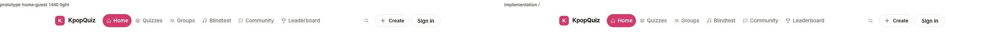 |
| Nav 1440 dark | 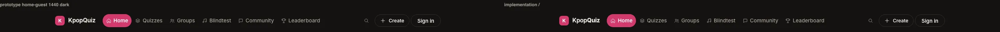 |
| Nav 390 light | 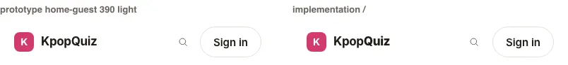 |
| Tab bar 390 light / dark | 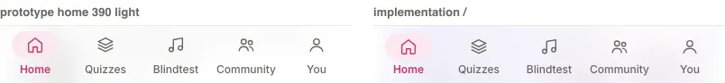 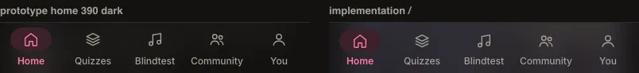 |
| Quiz cards 1440 light / dark | 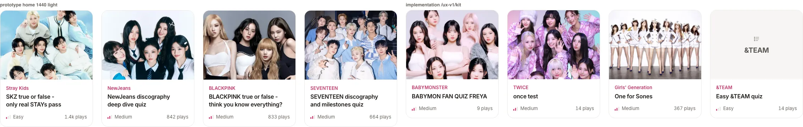 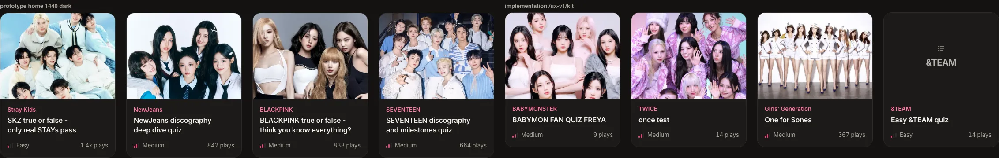 |
| Section header | 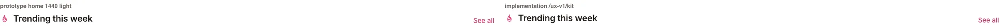 |
| Post card 1440 light / 390 dark | 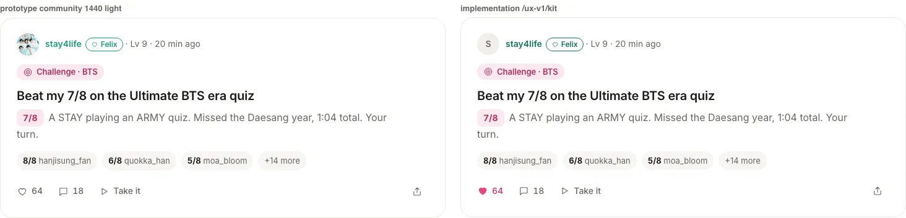 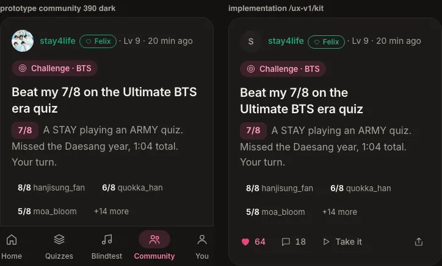 |
| Tabs | 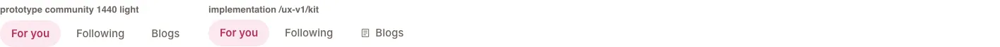 |
| Badge medallions light / dark | 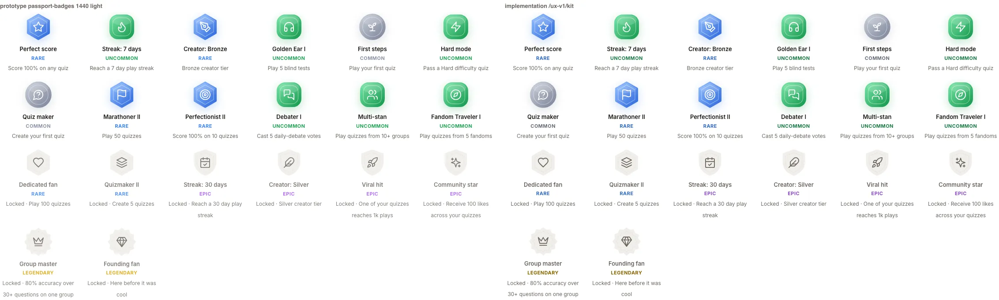 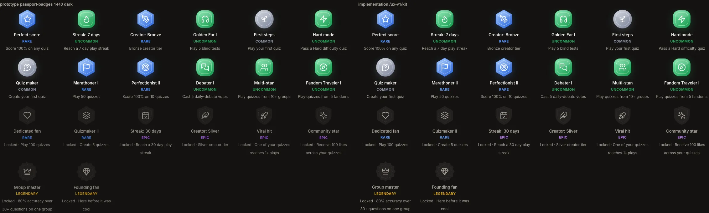 |
| Sign-in sheet 1440 light / 390 dark | 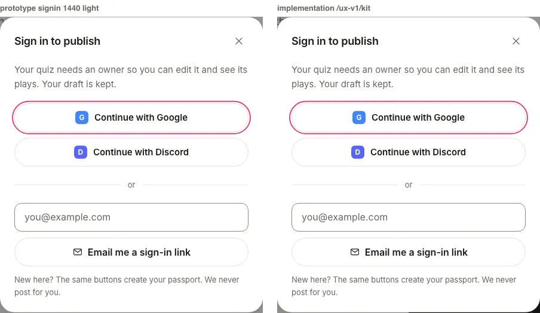 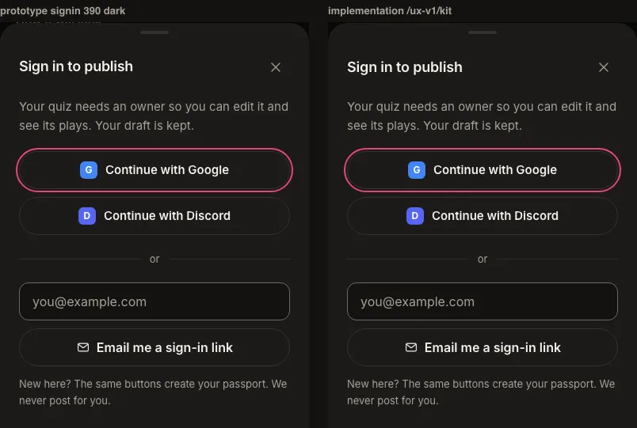 |
| Share sheet | 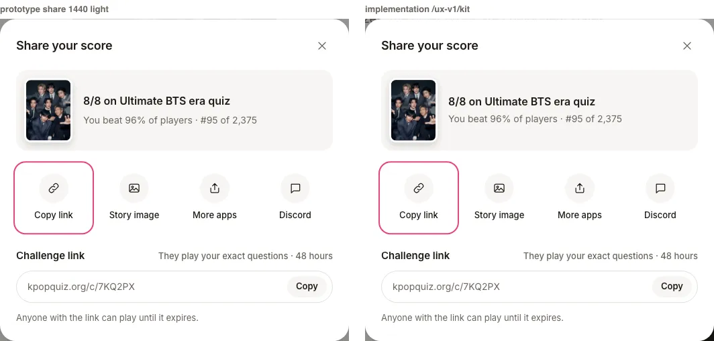 |
| Header picture sheet | 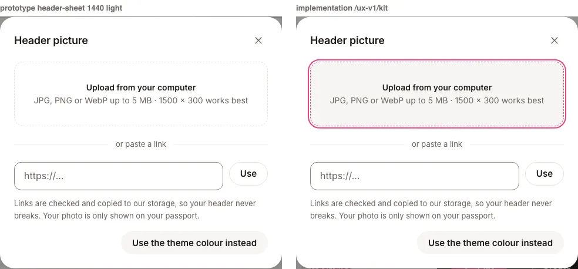 |
| Footer 1440 / 390 | 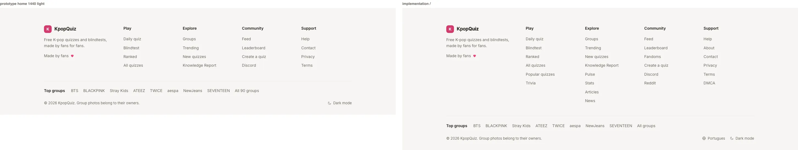 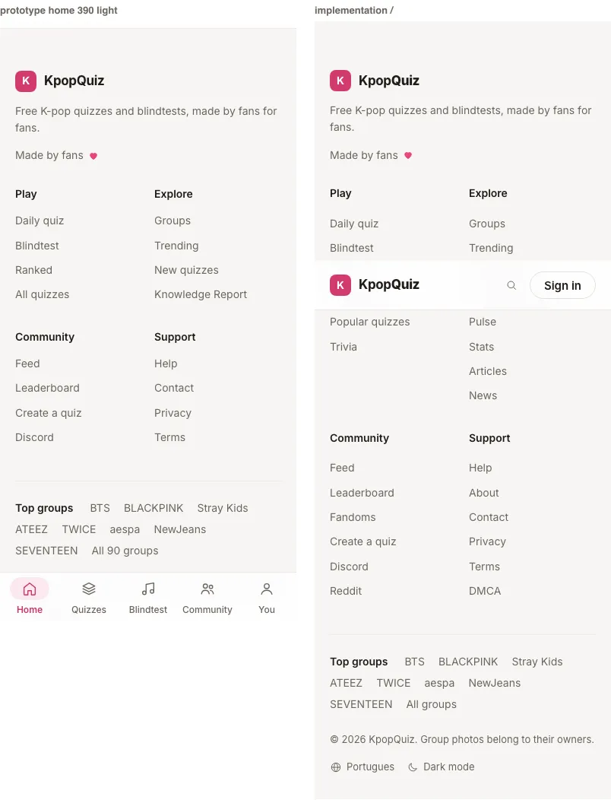 |
| Before / after / prototype, home 1440 light | 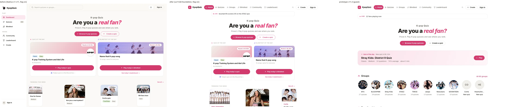 |
| Before / after / prototype, home 1440 dark | 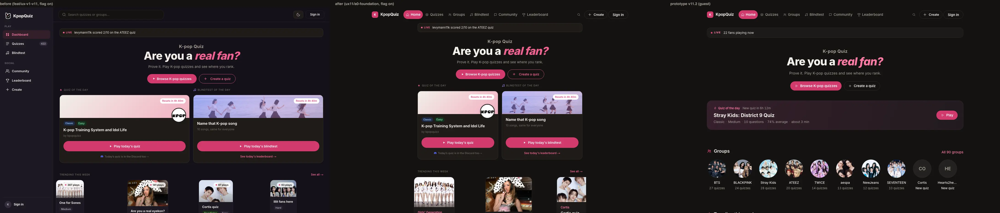 |
| Before / after / prototype, home 390 light | 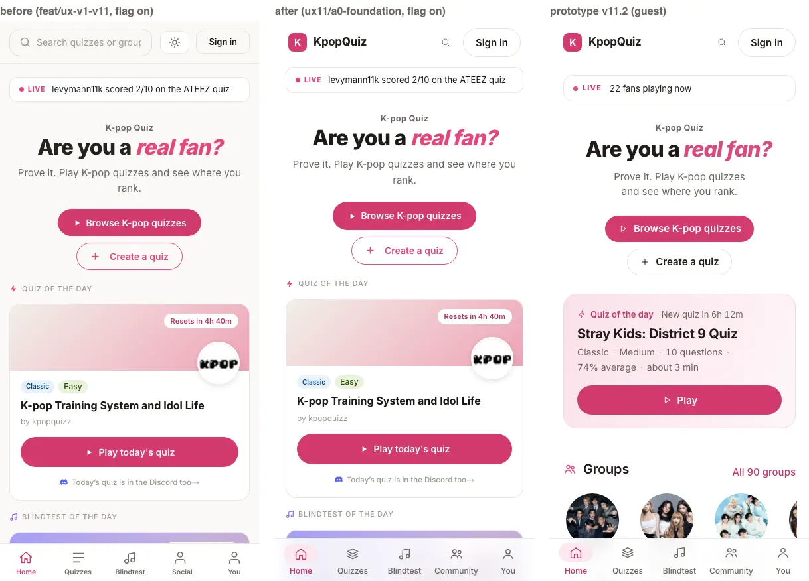 |

Same-size pairs, pixels differing by more than 16 per channel on average: nav 1440 3.1%, nav 390 1.2%,
section header 3.7%, sign-in 1440 0.7%, sign-in 390 dark 0.7%, share 1.5%, header sheet 2.8% (text
anti-aliasing and the focus ring); tab bar dark 73% because the translucent bar blurs different page content
behind it. Heights match to the pixel for nav (65), tab bar (65), section header, post (325), sign-in, share
and header sheets. The home body in "after" is still the legacy page inside the shell (P1's scope).

## 3. Proofs

### 3.1 Reference styles (C1 criterion)

`kit.spec` + `shell.spec` compare computed styles with `v11/checks/reference/styles.json` for `.nav`,
`.links a.on`, `.qcard`, `.sec-h h2`, `.btn-primary`, `.utabs button.on`, `.tcard`, `.post`,
`.rail>section` (Panel), `.personprev`, `.aboutbox` (UxBox), `.stats3` (UxStatsRow), `.pin` (PinnedRow),
`.medal2` (MedalTile): paddings, border width and colour, radius, background, colour, font size / weight /
line height / letter spacing, shadow, gap, plus width or height where the box is fixed. 0 mismatches at
1440 and 390, light and dark (`e2e/ux-v1/helpers/landmarks.ts`).

### 3.2 Specs (flag on, dev :3030, Chromium 1234 via UX11_CHROMIUM)

```
UX11_CHROMIUM=... PLAYWRIGHT_BASE_URL=http://localhost:3030 npx playwright test e2e/ux-v1/
Running 45 tests using 1 worker
  4 skipped   (phone-only case at 1440, desktop-only nav-fits cases at 390)
  41 passed
```
Covered: frame and nav state per width, footer keeps every live link, no horizontal scroll at 390, nav fits
on one line at 1440 / 1280 / 1100 (icons hide under 1280, Leaderboard under 1100), 44px touch targets at 390,
skip link, focus ring 2px pink on nav and tab bar, keyboard reaches nav / tab bar, search overlay ("/" key,
Escape, backdrop, focus return), sign-in sheet (focus trap, Escape / X / backdrop, focus return, magic link
payload and Google authorize URL asserted on STUBBED requests), all four sheets from the kit (same three
closings + focus return), tabs arrow keys, segmented aria-pressed, dropdown menu + removable chips, toast and
live region, axe (serious / critical = 0 on the shell and the kit), signed-in nav (read only).
Every mutating request is stubbed by `helpers/guard.ts`; the signed-in case asserts zero write attempts.

### 3.3 Flag off = today's site

Both branches built with the flag off (`pnpm --filter quiz build`, 802 / 801 static pages) back to back,
served with `next start` (:4001 = `origin/feat/ux-v1-v11` 4a7e1f1, :4002 = this branch), fetched together.

Document level (everything a user or a crawler reads: DOM, head, meta, canonical, JSON-LD, text, links,
stylesheets; only client JS chunk tags and the inline RSC payload removed):
```
IDENTICAL (structure)  /                                               js chunks 15/13
IDENTICAL (structure)  /quizzes                                        js chunks 15/13
IDENTICAL (structure)  /q/ultimate-bts-era-quiz-only-real-armys-survive js chunks 17/15
IDENTICAL (structure)  /bts-quiz                                       js chunks 15/13
IDENTICAL (structure)  /blindtest                                      js chunks 15/13
all 5 pages identical after normalising build ids and hashed asset names
```
Stylesheets: byte-identical (406,170 B both, 2 files; next/font class names normalised for the build folder).
Byte level: the served HTML differs only in which client JS chunks are listed (the shell code changed, so the
bundler splits differently) and in the RSC payload's client module references. Weight per page, flag off:
```
base /                js 15 files 721,051 B    a0 /                js 13 files 708,864 B
base /quizzes         js 15 files 721,278 B    a0 /quizzes         js 13 files 712,135 B
base /q/<slug>        js 17 files 1,010,436 B  a0 /q/<slug>        js 15 files   999,816 B
base /bts-quiz        js 15 files 721,142 B    a0 /bts-quiz        js 13 files 712,680 B
base /blindtest       js 15 files 730,434 B    a0 /blindtest       js 13 files 715,853 B
```
Visual (verse-laws 18, 720 probe + screenshots): `/`, `/q/<slug>`, `/blindtest` at 720 and 1440: same
scrollWidth / scrollHeight, 0.000% pixels differing. Flag off: `/ux-v1/kit` 404, `/api/ux-v1/a0/styles` 404,
no link to it in any page.

What the proof caught and fixed on the way: an `@import` of the new stylesheet added a 42 KB `<link>` to every
flag-off page (Turbopack emits each imported CSS file separately), and the statically imported shell put
~80 KB of shell code plus the ~220 KB Supabase browser client in every flag-off page's bundle. Both are gone
(flag-gated stylesheet route; shell behind next/dynamic; Supabase imported on click).

tsc: `npx tsc --noEmit` 0 errors. Unit: `vitest run src/lib/ux-v1` 35 passed (token sync, AA contrast of every
text token pair, nav model, medallion glyphs, group photos exist, streak view). Lint: `pnpm --filter quiz lint`
cannot run on Next 16 (`next lint` was removed; the repo has no eslint config; same on the base branch). A0
files linted with `eslint-config-next` core-web-vitals + typescript: 0 problems. Em / en dash check on all A0
paths: none.

### 3.4 Guard

```
# guard proof, branch head 4f7783f; hook = HEAD guard + HEAD OWNERSHIP.json
## 1) UX11_AGENT=A0, staged NON-owned apps/quiz/src/app/(site)/page.tsx     -> exit=1 (path listed)
## 2) tamper: working-tree OWNERSHIP.json gives A0 '**' (unstaged)          -> exit=1 (HEAD ownership used)
## 3) UX11_AGENT unset, same staged non-owned path                          -> exit=0 (no-op)
## 4) UX11_AGENT=A0, staged OWNED apps/quiz/src/lib/ux-v1.ts                -> exit=0
## 5) UX11_AGENT=P4 deletes ux-quiz-card.tsx (P4's "!" exclusion)           -> exit=1
## 6) --agent A0 --range origin/feat/ux-v1-v11..HEAD (has the unset commit) -> exit=1 (page.tsx listed)
## hooksPath: worktree=scripts/ux11-hooks repo-wide=unset
```
(run on a throwaway branch, deleted). Every A0 commit on this branch went through the hook
(`ux11-owner-guard: A0 ok`). Install in any worktree: `sh scripts/ux11-hooks/install.sh`.
ORCH merge check: `node scripts/ux11-owner-guard.mjs --agent <id> --ownership-ref origin/feat/ux-v1-v11 --range origin/feat/ux-v1-v11..<branch>`.
Glob dialect: `**` any depth, `*` no slash, `{a,b}`, `[` `]` `(` `)` literal, `!` exclusions.

### 3.5 Signed-in setup

`auth.setup.ts` minted the parity test user's session (service role OTP, verified through `@supabase/ssr`),
wrote `apps/quiz/e2e/.auth/test-user.json` (gitignored, mode 600, never printed) for host `localhost`, and the
signed-in case passed at 1440 and 390: `GET /api/auth/me` with the storage state returns the test user's
profile, the account menu shows the same username, the bell panel opens, zero write attempts. Deleted at the
end of this task.

Not read-only (important for C2 / C3): `GET /profile` redirects to `/me`, and `/me` calls `grantEarnedTiers()`
and `snapshotIfStale()` for the viewer (can insert `user_badges`, update `profiles.passport_snapshot_at`,
upsert `passport_group_snapshots`). So the "signed-in GET of /profile" in the brief was replaced by the
read-only `/api/auth/me` proof, and `parity.spec` (which visits `/profile`) now runs only with
`UX_V1_PARITY=1`. Before that change it ran twice in one of my runs; a read-only check of the test user's rows
afterwards showed no write (`profiles.updated_at` 2026-09-22, `passport_snapshot_at` 2026-09-21,
0 `passport_group_snapshots`, `user_badges` = `first_steps` of 2026-09-21 only). The snapshot gate is 7 days,
so a visit from 2026-09-28 WOULD write. Minting the session itself writes auth bookkeeping (session row,
last sign-in) for the test user, inherent to worker prompt 3b.

Data guard (read only), 2026-09-25T19:17Z: profiles 256, quizzes 434, plays 67,645, quiz_comments 17,
quiz_reactions 14, likes 2,833, follows 58, user_badges 1,398, creator_notifications 1,214,
notification_prefs 3, daily_blindtest_scores 84, daily_challenge_plays 0, blind_test_plays 140,
activity_events 7,383, debate_votes 42.

## 4. Decisions and deviations (for ORCH / owner)

1. Page stylesheets: put `src/styles/ux-v1/<id>.css` in the folder and do NOT import it. The route serves the
   whole folder (a0.css first) to flag-on pages only. An import from a route adds a `<link>` to that route's
   flag-off HTML (measured). This replaces "imported by its route" in the worker prompt.
2. Guard implicit paths include `v11/reports/<id>/**` (report screenshots, which the report and PR must show),
   besides `reports/<id>.md` and `requests/<id>.md`. ORCH to confirm.
3. Logo: the pink K tile + "KpopQuiz" of 17.1 / the prototype (the live Play nav shows the rabbit mascot).
   One-line swap in `components/ux-v1/brand.tsx` if the owner wants the mascot.
4. Contrast (16.9 "AA on every text pair"): the name accents of `lib/passport-flair.ts` and the rarity words of
   `lib/badges.ts` are shown through per-theme AA-clamped tokens (`--ux-acc-*`, `--ux-rar-*`, same hue). The raw
   presets were 2.9 to 3.9:1 on the v11 grounds. Locked medal tiles are not dimmed to 0.85 (the prototype's
   opacity took the muted text under AA). Stored values are untouched.
5. Footer: the prototype's four columns plus every link of the live footer (SEO internal links; WIRING-MAP
   "Footer links"), the /pt language link, "All groups" without a hard-coded count.
6. Quiz card: "New" under 7 plays (the live card's rule), otherwise "842 plays". Titles are `h3` by default
   (`titleAs` prop).
7. Verse routes and the builder canvas keep their legacy chrome under the flag (the v11 nav hides there).
8. Legacy pages not yet redesigned render inside the shell in the old 720 frame (`.ux-main:not(:has(> .ux-page))`).
9. `globals.css` is byte-identical to the base branch (flag-off parity); it still carries the inert Phase 1
   `.uxv1-*` rules: remove in the final cleanup. `/api/quizzes/count` has no consumer now (kept for P2).
10. Nav "Community" and footer "Feed" point at `/community` (P8), footer "Ranked" at `/blindtest/ranked` (P7).
11. The sign-in sheet uses the exact `/login` calls (OAuth `redirectTo` and magic link `emailRedirectTo` =
    `/auth/callback?returnTo=<this page>`); the pending action is kept in localStorage for 30 min
    (`takePendingAction(id)` resumes it).

## 5. Component API for page agents

Import paths are from `apps/quiz/src`. Everything is server-safe unless marked (client).

Page frame
- `@/components/ux-v1/page`: `UxPage({ width?: 'wide'|'text'|'stage'|'full', padded?, shell?: 'focus'|'create', className?, id? })`. Wrap every v11 page in it (opts out of the legacy frame; `shell` hides chrome server side).
- `@/components/ux-v1/use-shell-mode` (client): `useShellMode('focus'|'create'|null)` for client-side mode changes (quiz page -> game).
- Classes: `.ux-wrap` 1120, `.ux-col` 720, `.ux-stage` 600, `.ux-pg`, `.ux-sec` (64) / `.ux-sec.ux-sec-lg` (80), `.ux-ph` page header, `.ux-crumb`, `.ux-empty`, `.ux-rows`, `.ux-num`, `.ux-muted`, `.ux-sr`.

Primitives
- `@/components/ux-v1/icon`: `Icon({ name, size?: 'sm'|'md'|'lg'|number, label?, className? })`, names = prototype symbol ids (`lib/ux-v1/a0/icons.ts`, also `QUIZ_TYPE_ICON`, `QUIZ_TYPE_LABEL`).
- `@/components/ux-v1/button`: `UxButton({ variant?: 'primary'|'ghost'|'quiet', size?: 'sm'|'md'|'lg', block?, icon?, iconEnd?, href?, ...attrs })` (link when `href`), `UxLink({ href, icon? })`, `UxIconButton({ icon, label, bordered? })`.
- `@/components/ux-v1/brand`: `UxBrand({ href? })`. `@/components/ux-v1/avatar`: `UxAvatar({ name, src?, size?, bg?, fg? })`.
- `@/components/ux-v1/section-header`: `SectionHeader({ title, icon?, action?: { href, label }, aside?, sub?, as?: 'h2'|'h3', id? })`.
- `@/components/ux-v1/tabs` (client): `UxTabs({ items: { id, label, icon?, href? }[], value, onChange?, label, idPrefix? })` (all `href` = link tabs with aria-current); `@/components/ux-v1/tab-panel`: `tabPanelProps(idPrefix, id)`.
- `@/components/ux-v1/segmented` (client): `Segmented({ options: { value, label, href? }[], value, onChange?, onNavigate?, label })`. When every option has an `href`: a `<nav aria-label>` of real links (`aria-current="page"` on the pick, same pill), soft navigation on a plain click (no prefetch, no scroll jump), or `onNavigate(href, value)` for a page router.
- `@/components/ux-v1/chip`: `Chip({ children, filter?, pressed?, onRemove?, onClick?, href?, icon? })`, `Chips({ label? })`.
- `@/components/ux-v1/dropdown` (client): `UxDropdown({ label, value, options: { value, label, href?, count? }[], onChange?, onNavigate? })`. An option with an `href` is an `<a role="menuitemradio" aria-checked>` (Space and Enter pick, soft navigation or `onNavigate`); `count` shows right-aligned.
- `@/components/ux-v1/popover` (client): `UxPopover({ trigger: (props, open) => <button {...props}>, children: (close) => ..., menu?, label, className?, wrap? })`.
- `@/components/ux-v1/form` (client): `UxSwitch({ checked, onChange, label })`, `UxCheckbox({ checked, onChange, children })`, `UxField({ label, hint?, htmlFor, help?, error?, children })`; inputs use `className="ux-inp"`.

Cards and rows
- `@/components/ux-v1/quiz-card`: `UxQuizCard({ quiz, titleAs?, priority?, sizes? })` (quiz = `QuizCardData` or its subset `slug, title, group_name, group_slug, quiz_type, difficulty, play_count, cover_image_url`), `UxQuizGrid({ stack?, columns?: 3|4 })`, `LevelBars({ level: 1|2|3 })`, `levelOf(difficulty)`.
- `@/components/ux-v1/text-card`: `TextCard({ href, title, quizType, difficulty, plays, averagePct?, titleAs? })`, `TextCardGrid`.
- `@/components/ux-v1/post-card`: `PostCard({ kind: 'thread'|'blog'|'debate'|'challenge', chipDetail?, title, href, author: { name, accent?, font?, bias?, avatarUrl? }, meta?, excerpt?, children?, actions?, titleAs? })`, `PostAction({ icon, pressed?, end?, ...button })`, `ScoreChip`, `ReplyScores({ items: { score, name }[], more? })`.
- `@/components/ux-v1/panel`: `Panel({ title?, icon?, aside?, sub?, as?, titleAs?, label? })`, `UxBox`, `UxRow({ href?, lead?, title, sub?, end? })` (inside `<div className="ux-rows">`), `UxStatsRow({ items: { value, label }[] })`, `PinnedRow({ rank?, lead?, children, end?, you? })`.

Identity and badges
- `@/components/ux-v1/person-name`: `PersonName({ name, accent?, font?, bias?, href?, showBias? })` (raw `profiles.name_accent / name_font / bias`), `BiasTag({ bias, accent })`.
- `@/components/ux-v1/badge-medal`: `BadgeMedal({ id, rarity?, earned, size?, label? })` (rarity defaults to `badgeRarity(id)`), `MedalTile({ id, name, description, earned, rarity? })` in `<div className="ux-medals">`, `RarityFrame({ rarity, size? })`, `RarityKey`.

Sheets and feedback (client)
- `@/components/ux-v1/sheet`: `Sheet({ open, onClose, title, children, width?, role?, hideClose?, initialFocus?, describedBy? })` (X / Escape / backdrop close, focus trap and return).
- `@/components/ux-v1/sign-in-sheet`: `useSignIn()({ title?, sub?, action?: { id, payload? }, returnTo? })`; resume with `takePendingAction(id)` from `@/lib/ux-v1/a0/pending-action`.
- `@/components/ux-v1/share-sheet`: `ShareSheet({ open, onClose, title?, preview?: { image?, line1, line2? }, url, text?, onStoryImage?, storyFile?, challenge?: { url, note?, help? } })` (opens on "Copy link").
- `@/components/ux-v1/header-picture-sheet`: `HeaderPictureSheet({ open, onClose, onFile, onLink, onThemeColour, error?, busy? })` (client checks JPG / PNG / WebP, 5 MB, https; P10's routes do the rest).
- `@/components/ux-v1/confirm-sheet`: `ConfirmSheet({ open, title, body, confirmLabel, cancelLabel, onConfirm, onCancel })`.
- `@/components/ux-v1/toast`: `useUxToast()(message)`, `useAnnounce()(message)` (polite live region).
- `@/components/layout/ux-v1/ux-search`: `useUxSearch()()` opens the search overlay.
- `@/components/ux-v1/use-ux-me`: `useUxMe()` (null on the server and during hydration, so a server-rendered island never hydrates with viewer-dependent markup), `refreshUxMe()` (after a quiz / blindtest: streak pill and popover switch to "saved").

Slots for P11: `src/components/layout/ux-v1/slots.tsx` defines `SearchResults({ query, onNavigate })` and
`BellPanel({ unread, onClose })` with A0's minimal real defaults. P11 exports components with these props from
`components/search/ux-v1/search-results.tsx` and `components/notifications/ux-v1/bell-panel.tsx` and files a
request; A0 swaps the two exports.

Lib: `@/lib/ux-v1/a0/group-photos` (`groupPhotoUrl(slug)`, `photoFocal(seed)`, 33 groups), `badge-art`
(`badgeGlyph`, `RARITY_ART`), `nav` (`activeNav`, `activeTab`, `NAV_ITEMS`, `TAB_ITEMS`), `streak`
(`streakView`), `theme` (`applyTheme`, `storedTheme`, `useEffectiveTheme`), `type-glyphs`.

E2E helpers (`e2e/ux-v1/helpers/`): `setup-page` (`preparePage(page, theme)`, `widthOf`, `hasShell`,
`waitHydrated`, `horizontalOverflow`, `THEMES`), `guard` (`guardWrites(page)` stubs and records every
mutating request), `auth` (`signedInTest`, `skipUnlessSignedIn`), `a11y` (`runAxe`, `basicA11y`,
`focusRing`), `landmarks` (`compareLandmarks`, `A0_LANDMARKS`), `compare-shots.mjs`, `flag-off-diff.mjs`.
Projects: `ux-1440` (1440 x 900) and `ux-390` (390 x 844 touch) run `e2e/ux-v1/*.spec.ts` after `setup`.

## 6. Requests to ORCH

1. `apps/quiz/src/lib/route-allowlist.ts`, KNOWN_ROUTES (unowned): add `'/ux-v1/',` (kit, flag-on only) and
   `'/community',` (P8's page). Needed before or with this merge: without it `check:routes` fails the build.
   My proof builds had the first line applied locally (never committed).
2. Tell page agents: stylesheets go in `src/styles/ux-v1/<id>.css` without an import (section 4.1); use
   `UxPage`, `guardWrites`, and never visit `/profile` or `/me` signed in (section 3.5).

## 7. Open items

- P11 content for the search overlay and the bell panel (slots ready).
- Phase 1 `.uxv1-*` CSS still in `globals.css` (inert): remove in the final cleanup PR.
- Owner: logo choice (K tile vs mascot), the AA-clamped accent colours.
- No pending migration from A0.

## 8. Request queue (2026-09-26, PR #50)

Base: `feat/ux-v1-v11` f054cd3, merged into the branch (13cdcfa). One commit per item, each with its proof.
Replies with the shas: `v11/requests/A0.md` (the guard gives `requests/<id>.md` to its agent only).

| Item | Change | Sha | Proof |
|---|---|---|---|
| ORCH: streak test time bomb | `a0.test.ts` "streak view" freezes `Date` on the pinned instant (`vi.useFakeTimers({ toFake: ['Date'] })` + `vi.setSystemTime(now)`, real timers back after each case). `lib/streak.ts` unchanged. | 5bfe147 | 35/35 on 2026-09-26, also under TZ Pacific/Kiritimati and America/Los_Angeles |
| P4 3: `useUxMe()` differs between SSR and the first client render | `useUxMe()` returns null on the server and during hydration (`useIsClient()`); an island mounted after hydration still gets the cached value on its first render | 7e01137 | kit section "viewer": a probe that renders `useUxMe()` text on the server and hydrates late on purpose (own Suspense boundary, its code fetched once the `/api/auth/me` cache is filled). kit.spec: no hydration error as a guest and as the test user (read only), 1440 and 390. The old hook fails all 4 runs: "Hydration failed because the server rendered text didn't match the client" ("Browsing as a guest" / "Signed in as ..." against "Checking your account"). |
| P10 1: the selected tab turns ink on hover | hover colour for unselected tabs only (`:not([aria-selected="true"])`, `:not([aria-current="page"])`) | e99892f | kit.spec: the selected tab stays pink-soft-ink hovered and right after a click, an unselected one hovers to ink. The old rule fails at 1440 and 390 (rgb(31, 27, 23) for rgb(179, 48, 92)). |
| P4 5: share sheet at 390 | `.ux-flabel, .ux-field > label { flex-wrap: wrap; row-gap: 2px }` at 760 and below; `ShareSheet` passes `initialFocus` on Copy link | e37acd7 | kit.spec: Copy link focused on open; at 390 the note sits under "Challenge link", one line at 1440, no horizontal scroll. The old CSS fails at 390 (`nowrap`). The focus already landed on Copy link (the sheet focuses the first control of its body); it is now explicit. |
| P1 1: focus the page H1 on client navigation | `UxRouteFocus` (`ux-chrome-gate.tsx`, mounted by the shell after `<main>`): its single 60 ms timer missed the H1 of `loading.tsx` routes; it now watches `#main` for the new H1 (MutationObserver, up to 30 s), adds `tabindex="-1"` when missing, `focus({ preventScroll: true })`, ring-free by the existing a0.css rule. Not on the first load, not on query-only changes, never after the fan moved focus, and never away from a control the new page focused itself on mount. | f11ec96, f068e25 | shell.spec "client navigation": first load leaves focus alone; nav links (1440) and tab bar (390) land on `#main h1`, outline none, new title; `/quizzes` to a quiz (`loading.tsx`); Enter on a nav link. Kit fixture `/ux-v1/kit/focus` (flag-on only, noindex) focuses its own field once on mount: it keeps the focus; with the f11ec96 logic the H1 took it (probe: `h1 "Route focus fixture"` focused). |
| P1 2 (observation, dev only) | no change; details and the root-inference evidence in `requests/A0.md` | - | - |

Also in 7e01137: the kit's static streak popovers show a countdown to UTC midnight; they now render after mount,
so a minute ticking over between the server render and hydration cannot differ (it failed kit.spec once).

### 8.1 streakView and the clock (ORCH's question)

`streakView(days, lastActive, now)` takes `now`, but its state comes from `lib/streak.ts` `streakState()`,
which reads the wall clock. Within one render the two instants are microseconds apart, so the product is right,
but the function is not a function of its inputs: any `now` other than the current instant (the tests, a
server-computed `now`) can pair a state from today with a week and a countdown from another day. That is the
time bomb. Recommended owner cleanup (shared flag-off code, not changed here): `streakState(current,
lastActive, now = new Date())` in `lib/streak.ts`, and `streakView` passes its `now`; every flag-off caller
keeps its behaviour. Re-deriving the state inside `streakView` would fork the streak rule, so it stays a call.

### 8.2 Checks

- tsc 0 errors. eslint (eslint-config-next core-web-vitals + typescript) on every changed file: 0 problems.
  Unit: `vitest run` 363/363. Em / en dash: none in the changed files.
- Specs on a flag-on production build of this branch (`next build` + `next start`; the dev server on this
  machine took 15 to 45 s per page under load, which timed navigations out):
  kit.spec + shell.spec on the final code (f068e25), 1440 and 390, light and dark: 54 passed, 5 skipped
  (width-specific cases), 0 failed. (On f11ec96: 51 passed, 5 skipped, 1 transient where `/api/auth/me`
  fell back to signed out after its 2.5 s auth timeout on the loaded machine; it passed on rerun.)
- Consumers (the P4, P6 and P10 specs, whole files, flag-on build of f11ec96): 186 passed, 1 skipped (P4's
  phone-only case at 1440), 0 failed (`e2e/ux-v1/p4.spec.ts`, `p6.spec.ts`, `p10.spec.ts`, 187 tests, 25 min).
  f068e25 only makes the H1 focus back off in one more case (focus already inside the new page).
- No production write: every spec runs with `guardWrites`; `/me` and `/profile` never loaded signed in; the
  signed-in reads are `GET /api/auth/me`, `/u/<test user>` (cookie-free server reads) and `/settings` (P10's
  checked GET path).

### 8.3 Second batch (after P1 and P7 merged; base fd99234, merged in b14be3b)

| Item | Change | Sha | Proof |
|---|---|---|---|
| P1 3, P2 1, P7 1 (ORCH: blocker for every page): the shell dropped `<a href="/search">` | The nav search control is `<a href="/search" class="ux-sbtn" aria-label="Search" aria-keyshortcuts="/">` in the server HTML (next/link, prefetch off), same look; hydrated, a plain click opens the overlay, modified clicks and no-JS visitors reach `/search`. `isPlainClick()` in `lib/ux-v1/a0/nav.ts`. | 543a991, 86448c6 | shell.spec "search link" (server HTML, ctrl / meta / shift / alt / middle clicks left to the browser, plain click opens the overlay on the same URL) and "search link without JavaScript" (the link opens `/search`); unit test for `isPlainClick`; link sets below |
| P2 2: quiz card body line heights | Checked in the prototype source first: `body{font:16px/1.6}` so `.qcard .qg` / `.qf` (13px) inherit 20.8px, and `@media (max-width:760px){ .qgrid.stack h3{margin-top:0} }`. `.ux-qg` / `.ux-qf` `line-height: 1.6`; stacked title `margin-top: 0`. | b82e573, 5de7fe3 | kit.spec vs styles.json: eyebrow and footer 20.8px; every grid / rail card at the reference width (1440: 262, 390: 252) has the reference height (329.781 / 322.281) less 21.6px per missing title line; a two-line stacked row = 118.781; stacked titles margin-top 0. Before: 327.19 / 120.19 (P2's measure). |
| P2 3: `Segmented` / `UxDropdown` link options | `Segmented`: every option with `href` = `<nav aria-label>` of real links, `aria-current="page"`, same pill (a0.css `.ux-seg > a`). `UxDropdown`: `href` options = `<a role="menuitemradio" aria-checked class="ux-mi">`, Space and Enter pick, optional count. Both: soft navigation on a plain click, or `onNavigate(href, value)` for a page router; modified clicks left to the browser; current pick is a no-op. | be317bb | kit.spec "link options" on the kit's link versions (`?kitsort`, `?kittype`): server HTML nav of 4 links with one `aria-current`; link pills compute the same styles as the pressed / other buttons; modified clicks not taken over; plain click moves `aria-current` with no reload; dropdown items are links with counts, Space picks, `onNavigate` gets the href |

Link sets, server HTML, flag off (base fd99234, `next start` :4001) vs flag on (this branch, :3030), 18 public
URLs: `/search` is present flag on on all 18 (it was missing on every one). The only other flag-off hrefs
missing flag on are `/quizzes/new` and `/quizzes/most-liked` on `/`: P1's documented swap to `/new` and
`/most-liked` (P1 report, link parity), outside A0's files.
```
/                                                off 200   70  on 200   80  lost 2  /quizzes/new /quizzes/most-liked
/quizzes  /quizzes/popular-today  /groups  /bts-quiz  /blindtest  /blindtest/classic
/q/ultimate-bts-era-quiz-only-real-armys-survive  /trending  /new  /easy-kpop-quizzes  /faq  /about
/leaderboard  /pt/blindtest  /pt/faq  /pt/easy-kpop-quizzes                            lost 0 each
/blindtest/ranked                                off 404       on 200   38  (P7's flag-on page)
```

### 8.4 Flag off

Pending (both trees built with the flag off and diffed like section 3.3).
