# A0 Foundation report (UX v11.2)

## Progress

- 2026-09-28, fix 6 (branch `ux11/a0-fix6`, section 13): no sideways scroll on tablets. Up to 900px the chrome is
  the prototype's phone chrome (top bar + tab bar); from 901 to 959px a streak pill turns Create into its round icon
  (67f6a1e). New shell.spec sweep: every width from 761 to 1279px in 1px steps, guest and signed in (no streak, a
  4-digit streak), light and dark, mouse and touch: 0 problems (bda5548). Shots 0e54565, flag-off proof 3c37f0e
  (10 pages identical). Merged the integration heads b01149e (9e71f0f) and dc4f654 (03acb8e); tsc 0. PR #81.
  Requests for ORCH to route: section 13.6 (P10 save bar, legacy toast). Blockers: none.
- 2026-09-27, fix 5 (branch `ux11/a0-fix5`, section 12): the owner's two requests, both owner-approved deviations
  (section 4 items 12 and 13). 1: 8px between the nav pills, shrinking evenly to what fits when a streak pill takes
  the room (47f4e9a). 2: light page ground = the live warm #FAF8F5, warm nav glass, cards / panels / sheets /
  fields / tab bar stay white, surface fills re-tuned, pink-ink and flair words re-clamped to AA; dark unchanged
  (47f4e9a). Proofs 91d5352 + e708b95; merged the integration head df3ce45 (cf6dcf4). Page stylesheets that paint
  with the page token or the nav glass are listed for ORCH in section 12.3 (not edited).
- 2026-09-27, fix round 3 (branch `ux11/a0-fix3`, section 11): X1-003 avatar menu "My quizzes" -> passport
  Quizzes tab + device draft count 4b21895 / f778f7d; P2 4 `UxDropdown showValue={false}` 0c98d50 / d267395;
  X2-001 64px under the phone footer 41532c4; X2-008 default story image on every share sheet 4c6e279; P10 3
  tab bar "You" follows its href for guests f712ef2; kit / spec fix 311fed8. Merged the integration head c8a5222.
  Replies in `v11/requests/A0.md`. Open for P10: flip `p10.spec` line 467 (visitor sheet now has Story image)
  and, optionally, show the device draft row in the Quizzes tab.
- 2026-09-26, round 3 (P5 and P11 merged; section 9): P11 1 slots render P11's SearchResults and BellPanel
  03ac6b6; P11 2 Mark all read in the bell header a091d1c; P11 4 streak popover states the real rule 3c85a64;
  P11 5 search field without the ring box and the native clear button 8cb7491 + 0ae0e19; P5 2 sheet title
  18/1.6 5065b55; P5 3 UxQuizCard preview mode 53f1230. Replies in `v11/requests/A0.md` (de2700c).
- Rounds 1 and 2 (PR #50, merged 7b95070): section 8. Foundation (PR #45, 2cad6a7): sections 1 to 7.
- Next: ORCH merges PR #56 (round 3) and copies the replies; P5 can drop `DraftCard` and its sheet-title skip.
- Note for ORCH: b41bbcc is ORCH's f9e47e3 with only its message replaced (same tree, same parent): the round
  3 merge of the integration branch was a fast-forward, and A0's usual "amend the merge message" step then
  amended ORCH's commit. It changes nothing (RUN-STATE.md equals the integration branch, net diff 0), but the
  guard's per-commit range check lists RUN-STATE.md because of it. Left as is (no force push).
- Blockers: none.

## 1. What I built

| Area | Where |
|---|---|
| Tokens (16.1, 17.1, 17.10, 17.11) as `--ux-*` on `html.ux-v1` (class dark + system dark, and `.ux-theme-light/-dark` panes) | `src/styles/ux-v1/a0.css`, `src/lib/design-tokens.ts` (`UX_TOKENS`), sync test `src/lib/ux-v1/a0/a0.test.ts` |
| Flag-on-only stylesheet: every file of `src/styles/ux-v1/` served by a force-static route, linked by the root layout only when the flag is on | `src/app/api/ux-v1/a0/styles/route.ts`, `src/app/layout.tsx` |
| Shell: server `UxShell` -> tiny `UxShellLoader` (next/dynamic) -> `UxClientShell` (skip link, sticky nav, main, footer, tab bar, providers) | `src/components/layout/ux-v1/*` |
| Nav: pink pill active link (aria-current), icons (hidden under 1280), Leaderboard hidden under 1100, search icon + "/" key, + Create, streak pill + week popover, bell + panel frame, account menu, guest Sign in | `ux-nav-links.tsx`, `ux-nav-actions.tsx`, `ux-search.tsx`, `slots.tsx` |
| Phone tab bar (Home, Quizzes, Blindtest, Community, You; pink-soft pill; guest "You" opens sign-in) | `ux-tab-bar.tsx` |
| Footer (prototype columns + every live footer link, top groups, language, theme) | `ux-footer.tsx`, `ux-footer-controls.tsx` |
| Verse and builder routes keep their legacy chrome under the flag | `ux-chrome-gate.tsx` |
| Shared components | `src/components/ux-v1/*` (API in section 5) |
| Kit route (flag-on only, 404 flag-off, noindex, not in sitemap) | `src/app/(site)/ux-v1/kit/*` |
| Guard + hook | `scripts/ux11-owner-guard.mjs`, `scripts/ux11-hooks/{pre-commit,install.sh}` |
| Signed-in setup + projects | `e2e/ux-v1/auth.setup.ts`, `playwright.config.ts` |
| Specs + helpers | `e2e/ux-v1/{shell,kit}.spec.ts`, `e2e/ux-v1/helpers/*` |

## 2. Screenshots (prototype | implementation)

Element shots made by `e2e/ux-v1/helpers/compare-shots.mjs` (prototype state from `capture-prototype.mjs` on the
left, implementation on the right; the kit renders real quizzes, so text and photos differ by design).

| | |
|---|---|
| Nav 1440 light | 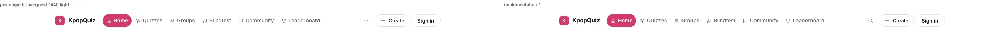 |
| Nav 1440 dark | 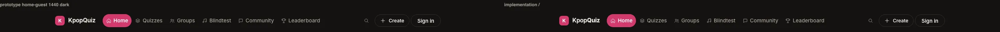 |
| Nav 390 light | 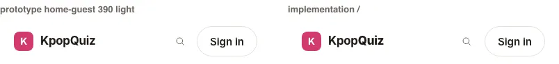 |
| Tab bar 390 light / dark | 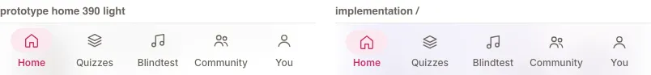 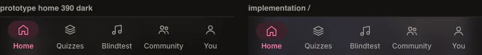 |
| Quiz cards 1440 light / dark | 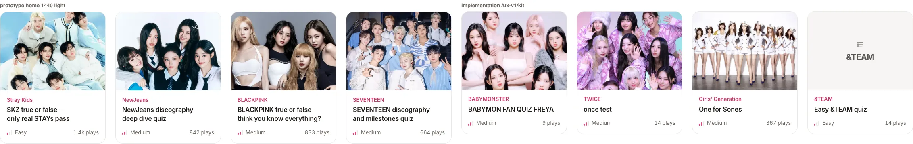 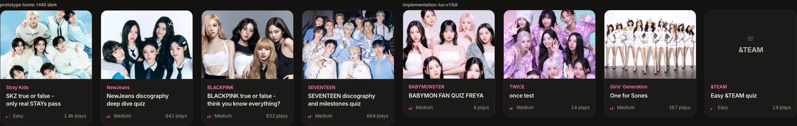 |
| Section header | 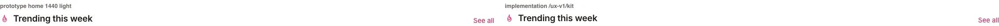 |
| Post card 1440 light / 390 dark | 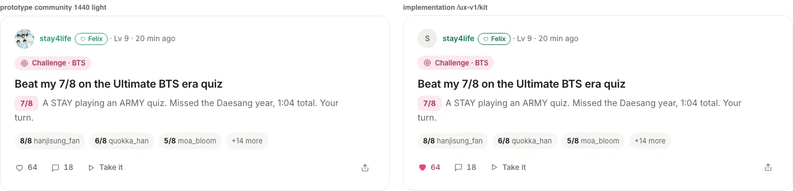 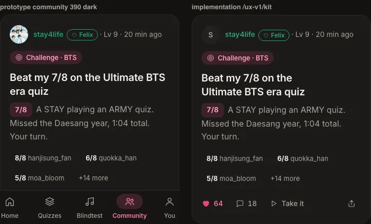 |
| Tabs | 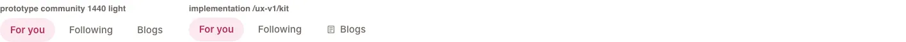 |
| Badge medallions light / dark | 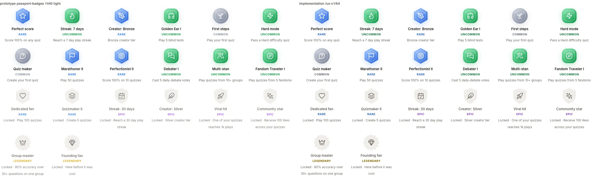 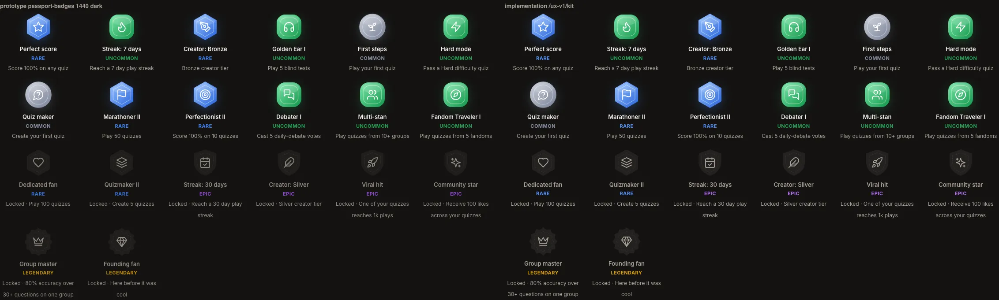 |
| Sign-in sheet 1440 light / 390 dark | 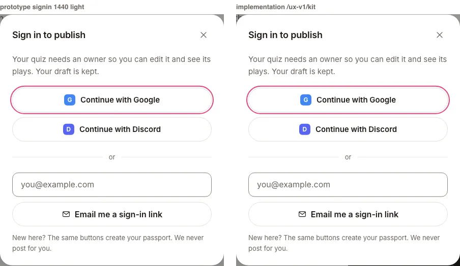 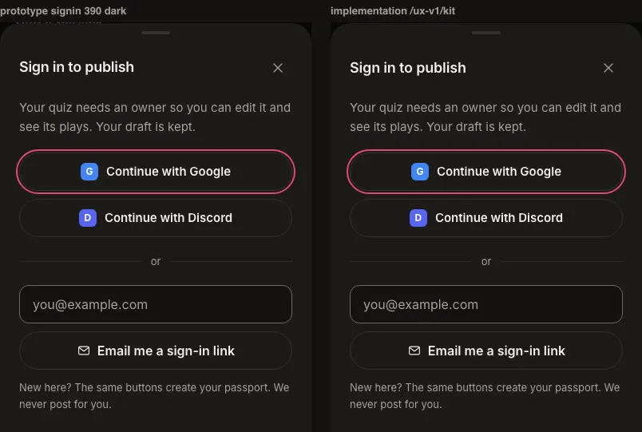 |
| Share sheet | 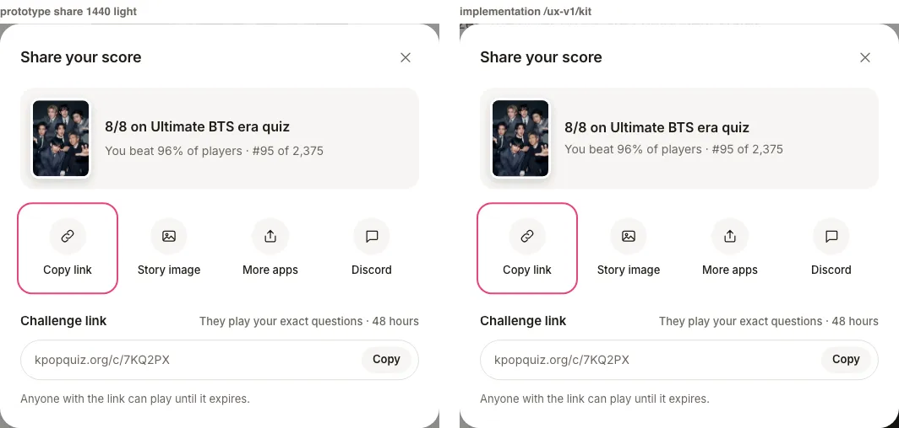 |
| Header picture sheet | 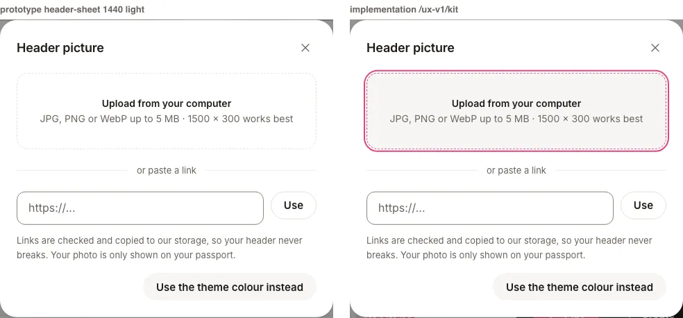 |
| Footer 1440 / 390 | 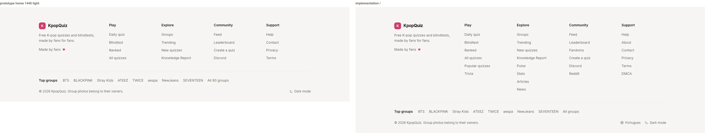 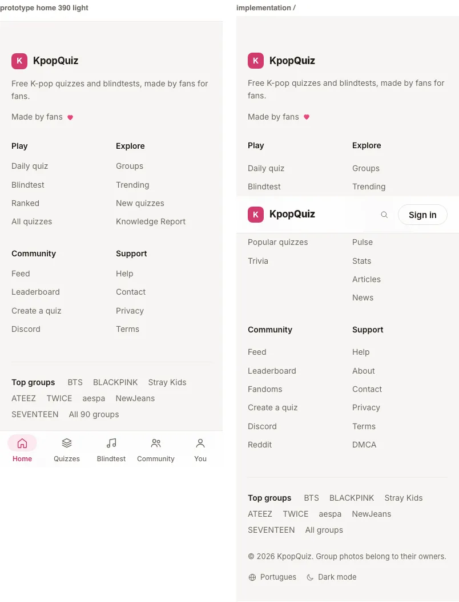 |
| Before / after / prototype, home 1440 light | 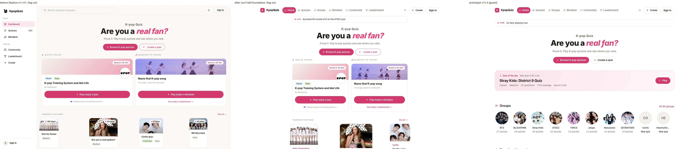 |
| Before / after / prototype, home 1440 dark | 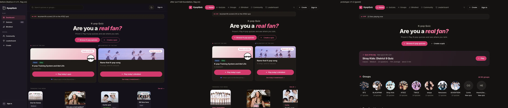 |
| Before / after / prototype, home 390 light | 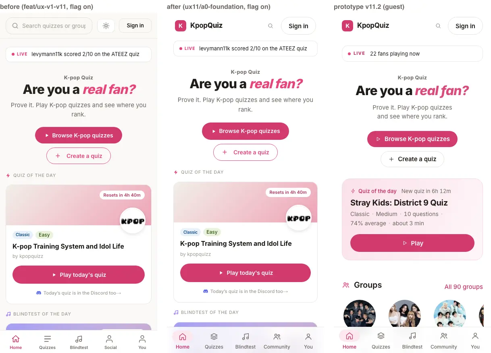 |

Same-size pairs, pixels differing by more than 16 per channel on average: nav 1440 3.1%, nav 390 1.2%,
section header 3.7%, sign-in 1440 0.7%, sign-in 390 dark 0.7%, share 1.5%, header sheet 2.8% (text
anti-aliasing and the focus ring); tab bar dark 73% because the translucent bar blurs different page content
behind it. Heights match to the pixel for nav (65), tab bar (65), section header, post (325), sign-in, share
and header sheets. The home body in "after" is still the legacy page inside the shell (P1's scope).

## 3. Proofs

### 3.1 Reference styles (C1 criterion)

`kit.spec` + `shell.spec` compare computed styles with `v11/checks/reference/styles.json` for `.nav`,
`.links a.on`, `.qcard`, `.sec-h h2`, `.btn-primary`, `.utabs button.on`, `.tcard`, `.post`,
`.rail>section` (Panel), `.personprev`, `.aboutbox` (UxBox), `.stats3` (UxStatsRow), `.pin` (PinnedRow),
`.medal2` (MedalTile): paddings, border width and colour, radius, background, colour, font size / weight /
line height / letter spacing, shadow, gap, plus width or height where the box is fixed. 0 mismatches at
1440 and 390, light and dark (`e2e/ux-v1/helpers/landmarks.ts`).

### 3.2 Specs (flag on, dev :3030, Chromium 1234 via UX11_CHROMIUM)

```
UX11_CHROMIUM=... PLAYWRIGHT_BASE_URL=http://localhost:3030 npx playwright test e2e/ux-v1/
Running 45 tests using 1 worker
  4 skipped   (phone-only case at 1440, desktop-only nav-fits cases at 390)
  41 passed
```
Covered: frame and nav state per width, footer keeps every live link, no horizontal scroll at 390, nav fits
on one line at 1440 / 1280 / 1100 (icons hide under 1280, Leaderboard under 1100), 44px touch targets at 390,
skip link, focus ring 2px pink on nav and tab bar, keyboard reaches nav / tab bar, search overlay ("/" key,
Escape, backdrop, focus return), sign-in sheet (focus trap, Escape / X / backdrop, focus return, magic link
payload and Google authorize URL asserted on STUBBED requests), all four sheets from the kit (same three
closings + focus return), tabs arrow keys, segmented aria-pressed, dropdown menu + removable chips, toast and
live region, axe (serious / critical = 0 on the shell and the kit), signed-in nav (read only).
Every mutating request is stubbed by `helpers/guard.ts`; the signed-in case asserts zero write attempts.

### 3.3 Flag off = today's site

Both branches built with the flag off (`pnpm --filter quiz build`, 802 / 801 static pages) back to back,
served with `next start` (:4001 = `origin/feat/ux-v1-v11` 4a7e1f1, :4002 = this branch), fetched together.

Document level (everything a user or a crawler reads: DOM, head, meta, canonical, JSON-LD, text, links,
stylesheets; only client JS chunk tags and the inline RSC payload removed):
```
IDENTICAL (structure)  /                                               js chunks 15/13
IDENTICAL (structure)  /quizzes                                        js chunks 15/13
IDENTICAL (structure)  /q/ultimate-bts-era-quiz-only-real-armys-survive js chunks 17/15
IDENTICAL (structure)  /bts-quiz                                       js chunks 15/13
IDENTICAL (structure)  /blindtest                                      js chunks 15/13
all 5 pages identical after normalising build ids and hashed asset names
```
Stylesheets: byte-identical (406,170 B both, 2 files; next/font class names normalised for the build folder).
Byte level: the served HTML differs only in which client JS chunks are listed (the shell code changed, so the
bundler splits differently) and in the RSC payload's client module references. Weight per page, flag off:
```
base /                js 15 files 721,051 B    a0 /                js 13 files 708,864 B
base /quizzes         js 15 files 721,278 B    a0 /quizzes         js 13 files 712,135 B
base /q/<slug>        js 17 files 1,010,436 B  a0 /q/<slug>        js 15 files   999,816 B
base /bts-quiz        js 15 files 721,142 B    a0 /bts-quiz        js 13 files 712,680 B
base /blindtest       js 15 files 730,434 B    a0 /blindtest       js 13 files 715,853 B
```
Visual (verse-laws 18, 720 probe + screenshots): `/`, `/q/<slug>`, `/blindtest` at 720 and 1440: same
scrollWidth / scrollHeight, 0.000% pixels differing. Flag off: `/ux-v1/kit` 404, `/api/ux-v1/a0/styles` 404,
no link to it in any page.

What the proof caught and fixed on the way: an `@import` of the new stylesheet added a 42 KB `<link>` to every
flag-off page (Turbopack emits each imported CSS file separately), and the statically imported shell put
~80 KB of shell code plus the ~220 KB Supabase browser client in every flag-off page's bundle. Both are gone
(flag-gated stylesheet route; shell behind next/dynamic; Supabase imported on click).

tsc: `npx tsc --noEmit` 0 errors. Unit: `vitest run src/lib/ux-v1` 35 passed (token sync, AA contrast of every
text token pair, nav model, medallion glyphs, group photos exist, streak view). Lint: `pnpm --filter quiz lint`
cannot run on Next 16 (`next lint` was removed; the repo has no eslint config; same on the base branch). A0
files linted with `eslint-config-next` core-web-vitals + typescript: 0 problems. Em / en dash check on all A0
paths: none.

### 3.4 Guard

```
# guard proof, branch head 4f7783f; hook = HEAD guard + HEAD OWNERSHIP.json
## 1) UX11_AGENT=A0, staged NON-owned apps/quiz/src/app/(site)/page.tsx     -> exit=1 (path listed)
## 2) tamper: working-tree OWNERSHIP.json gives A0 '**' (unstaged)          -> exit=1 (HEAD ownership used)
## 3) UX11_AGENT unset, same staged non-owned path                          -> exit=0 (no-op)
## 4) UX11_AGENT=A0, staged OWNED apps/quiz/src/lib/ux-v1.ts                -> exit=0
## 5) UX11_AGENT=P4 deletes ux-quiz-card.tsx (P4's "!" exclusion)           -> exit=1
## 6) --agent A0 --range origin/feat/ux-v1-v11..HEAD (has the unset commit) -> exit=1 (page.tsx listed)
## hooksPath: worktree=scripts/ux11-hooks repo-wide=unset
```
(run on a throwaway branch, deleted). Every A0 commit on this branch went through the hook
(`ux11-owner-guard: A0 ok`). Install in any worktree: `sh scripts/ux11-hooks/install.sh`.
ORCH merge check: `node scripts/ux11-owner-guard.mjs --agent <id> --ownership-ref origin/feat/ux-v1-v11 --range origin/feat/ux-v1-v11..<branch>`.
Glob dialect: `**` any depth, `*` no slash, `{a,b}`, `[` `]` `(` `)` literal, `!` exclusions.

### 3.5 Signed-in setup

`auth.setup.ts` minted the parity test user's session (service role OTP, verified through `@supabase/ssr`),
wrote `apps/quiz/e2e/.auth/test-user.json` (gitignored, mode 600, never printed) for host `localhost`, and the
signed-in case passed at 1440 and 390: `GET /api/auth/me` with the storage state returns the test user's
profile, the account menu shows the same username, the bell panel opens, zero write attempts. Deleted at the
end of this task.

Not read-only (important for C2 / C3): `GET /profile` redirects to `/me`, and `/me` calls `grantEarnedTiers()`
and `snapshotIfStale()` for the viewer (can insert `user_badges`, update `profiles.passport_snapshot_at`,
upsert `passport_group_snapshots`). So the "signed-in GET of /profile" in the brief was replaced by the
read-only `/api/auth/me` proof, and `parity.spec` (which visits `/profile`) now runs only with
`UX_V1_PARITY=1`. Before that change it ran twice in one of my runs; a read-only check of the test user's rows
afterwards showed no write (`profiles.updated_at` 2026-09-22, `passport_snapshot_at` 2026-09-21,
0 `passport_group_snapshots`, `user_badges` = `first_steps` of 2026-09-21 only). The snapshot gate is 7 days,
so a visit from 2026-09-28 WOULD write. Minting the session itself writes auth bookkeeping (session row,
last sign-in) for the test user, inherent to worker prompt 3b.

Data guard (read only), 2026-09-25T19:17Z: profiles 256, quizzes 434, plays 67,645, quiz_comments 17,
quiz_reactions 14, likes 2,833, follows 58, user_badges 1,398, creator_notifications 1,214,
notification_prefs 3, daily_blindtest_scores 84, daily_challenge_plays 0, blind_test_plays 140,
activity_events 7,383, debate_votes 42.

## 4. Decisions and deviations (for ORCH / owner)

1. Page stylesheets: put `src/styles/ux-v1/<id>.css` in the folder and do NOT import it. The route serves the
   whole folder (a0.css first) to flag-on pages only. An import from a route adds a `<link>` to that route's
   flag-off HTML (measured). This replaces "imported by its route" in the worker prompt.
2. Guard implicit paths include `v11/reports/<id>/**` (report screenshots, which the report and PR must show),
   besides `reports/<id>.md` and `requests/<id>.md`. ORCH to confirm.
3. Logo: the pink K tile + "KpopQuiz" of 17.1 / the prototype (the live Play nav shows the rabbit mascot).
   One-line swap in `components/ux-v1/brand.tsx` if the owner wants the mascot.
4. Contrast (16.9 "AA on every text pair"): the name accents of `lib/passport-flair.ts` and the rarity words of
   `lib/badges.ts` are shown through per-theme AA-clamped tokens (`--ux-acc-*`, `--ux-rar-*`, same hue). The raw
   presets were 2.9 to 3.9:1 on the v11 grounds. Locked medal tiles are not dimmed to 0.85 (the prototype's
   opacity took the muted text under AA). Stored values are untouched.
5. Footer: the prototype's four columns plus every link of the live footer (SEO internal links; WIRING-MAP
   "Footer links"), the /pt language link, "All groups" without a hard-coded count.
6. Quiz card: "New" under 7 plays (the live card's rule), otherwise "842 plays". Titles are `h3` by default
   (`titleAs` prop).
7. Verse routes and the builder canvas keep their legacy chrome under the flag (the v11 nav hides there).
8. Legacy pages not yet redesigned render inside the shell in the old 720 frame (`.ux-main:not(:has(> .ux-page))`).
9. `globals.css` is byte-identical to the base branch (flag-off parity); it still carries the inert Phase 1
   `.uxv1-*` rules: remove in the final cleanup. `/api/quizzes/count` has no consumer now (kept for P2).
10. Nav "Community" and footer "Feed" point at `/community` (P8), footer "Ranked" at `/blindtest/ranked` (P7).
11. The sign-in sheet uses the exact `/login` calls (OAuth `redirectTo` and magic link `emailRedirectTo` =
    `/auth/callback?returnTo=<this page>`); the pending action is kept in localStorage for 30 min
    (`takePendingAction(id)` resumes it).
12. Owner-approved deviation (owner request in chat, 2026-09-27, "give a bit more space to the navbar between
    buttons"): the prototype's `.links{gap:0}` becomes up to 8px between the nav pills (aria-hidden `.ux-lsp`
    spacers, `flex: 0 1 8px`), shrinking evenly when the right cluster needs the room. Pill padding (10px),
    height (38px) and the pink active pill are unchanged. Values in section 12.1.
13. Owner-approved deviation (owner request in chat, 2026-09-27, "put the same background color (not white
    anymore) as the old version, it makes the website look warmer"), light theme only: `--ux-page` #FFFFFF ->
    #FAF8F5 (the live `--bg`), warm nav glass; cards, panels, sheets, fields, the live ticker and the tab bar stay
    white; `--ux-surface` / `--ux-surface-2` re-tuned to keep their step from the ground; `--ux-pink-ink` and the
    flair words re-clamped to AA on the new grounds. Dark: every value as before. Values in section 12.2. The
    shared reference comparisons expect the new values through `OWNER_DEVIATIONS` in `e2e/ux-v1/helpers/landmarks.ts`.
14. Deviation (fix 6, ORCH's pick between two options): the phone chrome (16.5 Mobile: top bar = logo, search,
    streak, bell or Sign in; bottom tabs) runs up to 900px instead of 760px, because the desktop bar needs about
    860px (950px with a streak pill) and the prototype has no tablet layout (its own bar scrolls up to 128px at 761).
    From 901 to 959px, with a streak pill only, Create shows as its round icon (name kept). 1280 and up and 390
    are unchanged. Values and the rejected option in section 13.

## 5. Component API for page agents

Import paths are from `apps/quiz/src`. Everything is server-safe unless marked (client).

Grounds and fills (fix 5, section 12.2): `--ux-page` is the page ground only (warm in light). A fill that must stay
white on it uses `--ux-raised` (cards, panels, sheets; dark #1C1B19), `--ux-paper` (fields, keycaps, knobs, text or
rings on ink; dark = the dark page) or `--ux-card-fill` (a bordered card that is bare in dark; dark transparent).
Sticky glass: `--ux-nav-bg` (warm, top bars) or `--ux-tabbar-bg` (white, the phone tab bar). A page capture compared
through `compareLandmarks(page, w, theme, lms, yourCapture)` gets the owner deviations applied; direct comparisons
can use `withOwnerDeviations(capture)` from `e2e/ux-v1/helpers/landmarks`.

Page frame
- `@/components/ux-v1/page`: `UxPage({ width?: 'wide'|'text'|'stage'|'full', padded?, shell?: 'focus'|'create', className?, id? })`. Wrap every v11 page in it (opts out of the legacy frame; `shell` hides chrome server side).
- `@/components/ux-v1/use-shell-mode` (client): `useShellMode('focus'|'create'|null)` for client-side mode changes (quiz page -> game).
- Classes: `.ux-wrap` 1120, `.ux-col` 720, `.ux-stage` 600, `.ux-pg`, `.ux-sec` (64) / `.ux-sec.ux-sec-lg` (80), `.ux-ph` page header, `.ux-crumb`, `.ux-empty`, `.ux-rows`, `.ux-num`, `.ux-muted`, `.ux-sr`.

Primitives
- `@/components/ux-v1/icon`: `Icon({ name, size?: 'sm'|'md'|'lg'|number, label?, className? })`, names = prototype symbol ids (`lib/ux-v1/a0/icons.ts`, also `QUIZ_TYPE_ICON`, `QUIZ_TYPE_LABEL`).
- `@/components/ux-v1/button`: `UxButton({ variant?: 'primary'|'ghost'|'quiet', size?: 'sm'|'md'|'lg', block?, icon?, iconEnd?, href?, ...attrs })` (link when `href`), `UxLink({ href, icon? })`, `UxIconButton({ icon, label, bordered? })`.
- `@/components/ux-v1/brand`: `UxBrand({ href? })`. `@/components/ux-v1/avatar`: `UxAvatar({ name, src?, size?, bg?, fg? })`.
- `@/components/ux-v1/section-header`: `SectionHeader({ title, icon?, action?: { href, label }, aside?, sub?, as?: 'h2'|'h3', id? })`.
- `@/components/ux-v1/tabs` (client): `UxTabs({ items: { id, label, icon?, href? }[], value, onChange?, label, idPrefix? })` (all `href` = link tabs with aria-current); `@/components/ux-v1/tab-panel`: `tabPanelProps(idPrefix, id)`.
- `@/components/ux-v1/segmented` (client): `Segmented({ options: { value, label, href? }[], value, onChange?, onNavigate?, label })`. When every option has an `href`: a `<nav aria-label>` of real links (`aria-current="page"` on the pick, same pill), soft navigation on a plain click (no prefetch, no scroll jump), or `onNavigate(href, value)` for a page router.
- `@/components/ux-v1/chip`: `Chip({ children, filter?, pressed?, onRemove?, onClick?, href?, icon? })`, `Chips({ label? })`.
- `@/components/ux-v1/dropdown` (client): `UxDropdown({ label, value, options: { value, label, href?, count? }[], onChange?, onNavigate? })`. An option with an `href` is an `<a role="menuitemradio" aria-checked>` (Space and Enter pick, soft navigation or `onNavigate`); `count` shows right-aligned.
- `@/components/ux-v1/popover` (client): `UxPopover({ trigger: (props, open) => <button {...props}>, children: (close) => ..., menu?, label, className?, wrap? })`.
- `@/components/ux-v1/form` (client): `UxSwitch({ checked, onChange, label })`, `UxCheckbox({ checked, onChange, children })`, `UxField({ label, hint?, htmlFor, help?, error?, children })`; inputs use `className="ux-inp"`.

Cards and rows
- `@/components/ux-v1/quiz-card`: `UxQuizCard({ quiz, titleAs?, priority?, sizes? })` (quiz = `QuizCardData` or its subset `slug, title, group_name, group_slug, quiz_type, difficulty, play_count, cover_image_url`), `UxQuizGrid({ stack?, columns?: 3|4 })`, `LevelBars({ level: 1|2|3 })`, `levelOf(difficulty)`.
- `@/components/ux-v1/text-card`: `TextCard({ href, title, quizType, difficulty, plays, averagePct?, titleAs? })`, `TextCardGrid`.
- `@/components/ux-v1/post-card`: `PostCard({ kind: 'thread'|'blog'|'debate'|'challenge', chipDetail?, title, href, author: { name, accent?, font?, bias?, avatarUrl? }, meta?, excerpt?, children?, actions?, titleAs? })`, `PostAction({ icon, pressed?, end?, ...button })`, `ScoreChip`, `ReplyScores({ items: { score, name }[], more? })`.
- `@/components/ux-v1/panel`: `Panel({ title?, icon?, aside?, sub?, as?, titleAs?, label? })`, `UxBox`, `UxRow({ href?, lead?, title, sub?, end? })` (inside `<div className="ux-rows">`), `UxStatsRow({ items: { value, label }[] })`, `PinnedRow({ rank?, lead?, children, end?, you? })`.

Identity and badges
- `@/components/ux-v1/person-name`: `PersonName({ name, accent?, font?, bias?, href?, showBias? })` (raw `profiles.name_accent / name_font / bias`), `BiasTag({ bias, accent })`.
- `@/components/ux-v1/badge-medal`: `BadgeMedal({ id, rarity?, earned, size?, label? })` (rarity defaults to `badgeRarity(id)`), `MedalTile({ id, name, description, earned, rarity? })` in `<div className="ux-medals">`, `RarityFrame({ rarity, size? })`, `RarityKey`.

Sheets and feedback (client)
- `@/components/ux-v1/sheet`: `Sheet({ open, onClose, title, children, width?, role?, hideClose?, initialFocus?, describedBy? })` (X / Escape / backdrop close, focus trap and return).
- `@/components/ux-v1/sign-in-sheet`: `useSignIn()({ title?, sub?, action?: { id, payload? }, returnTo? })`; resume with `takePendingAction(id)` from `@/lib/ux-v1/a0/pending-action`.
- `@/components/ux-v1/share-sheet`: `ShareSheet({ open, onClose, title?, preview?: { image?, line1, line2? }, url, text?, onStoryImage?, storyFile?, challenge?: { url, note?, help? } })` (opens on "Copy link").
- `@/components/ux-v1/header-picture-sheet`: `HeaderPictureSheet({ open, onClose, onFile, onLink, onThemeColour, error?, busy? })` (client checks JPG / PNG / WebP, 5 MB, https; P10's routes do the rest).
- `@/components/ux-v1/confirm-sheet`: `ConfirmSheet({ open, title, body, confirmLabel, cancelLabel, onConfirm, onCancel })`.
- `@/components/ux-v1/toast`: `useUxToast()(message)`, `useAnnounce()(message)` (polite live region).
- `@/components/layout/ux-v1/ux-search`: `useUxSearch()()` opens the search overlay.
- `@/components/ux-v1/use-ux-me`: `useUxMe()` (null on the server and during hydration, so a server-rendered island never hydrates with viewer-dependent markup), `refreshUxMe()` (after a quiz / blindtest: streak pill and popover switch to "saved").

Slots for P11: `src/components/layout/ux-v1/slots.tsx` defines `SearchResults({ query, onNavigate })` and
`BellPanel({ unread, onClose })` with A0's minimal real defaults. P11 exports components with these props from
`components/search/ux-v1/search-results.tsx` and `components/notifications/ux-v1/bell-panel.tsx` and files a
request; A0 swaps the two exports.

Lib: `@/lib/ux-v1/a0/group-photos` (`groupPhotoUrl(slug)`, `photoFocal(seed)`, 33 groups), `badge-art`
(`badgeGlyph`, `RARITY_ART`), `nav` (`activeNav`, `activeTab`, `NAV_ITEMS`, `TAB_ITEMS`), `streak`
(`streakView`), `theme` (`applyTheme`, `storedTheme`, `useEffectiveTheme`), `type-glyphs`.

E2E helpers (`e2e/ux-v1/helpers/`): `setup-page` (`preparePage(page, theme)`, `widthOf`, `hasShell`,
`waitHydrated`, `horizontalOverflow`, `THEMES`), `guard` (`guardWrites(page)` stubs and records every
mutating request), `auth` (`signedInTest`, `skipUnlessSignedIn`), `a11y` (`runAxe`, `basicA11y`,
`focusRing`), `landmarks` (`compareLandmarks`, `A0_LANDMARKS`), `compare-shots.mjs`, `flag-off-diff.mjs`.
Projects: `ux-1440` (1440 x 900) and `ux-390` (390 x 844 touch) run `e2e/ux-v1/*.spec.ts` after `setup`.

## 6. Requests to ORCH

1. `apps/quiz/src/lib/route-allowlist.ts`, KNOWN_ROUTES (unowned): add `'/ux-v1/',` (kit, flag-on only) and
   `'/community',` (P8's page). Needed before or with this merge: without it `check:routes` fails the build.
   My proof builds had the first line applied locally (never committed).
2. Tell page agents: stylesheets go in `src/styles/ux-v1/<id>.css` without an import (section 4.1); use
   `UxPage`, `guardWrites`, and never visit `/profile` or `/me` signed in (section 3.5).

## 7. Open items

- P11 content for the search overlay and the bell panel (slots ready).
- Phase 1 `.uxv1-*` CSS still in `globals.css` (inert): remove in the final cleanup PR.
- Owner: logo choice (K tile vs mascot), the AA-clamped accent colours.
- No pending migration from A0.

## 8. Request queue (2026-09-26, PR #50)

Base: `feat/ux-v1-v11` f054cd3, merged into the branch (13cdcfa). One commit per item, each with its proof.
Replies with the shas: `v11/requests/A0.md` (the guard gives `requests/<id>.md` to its agent only).

| Item | Change | Sha | Proof |
|---|---|---|---|
| ORCH: streak test time bomb | `a0.test.ts` "streak view" freezes `Date` on the pinned instant (`vi.useFakeTimers({ toFake: ['Date'] })` + `vi.setSystemTime(now)`, real timers back after each case). `lib/streak.ts` unchanged. | 5bfe147 | 35/35 on 2026-09-26, also under TZ Pacific/Kiritimati and America/Los_Angeles |
| P4 3: `useUxMe()` differs between SSR and the first client render | `useUxMe()` returns null on the server and during hydration (`useIsClient()`); an island mounted after hydration still gets the cached value on its first render | 7e01137 | kit section "viewer": a probe that renders `useUxMe()` text on the server and hydrates late on purpose (own Suspense boundary, its code fetched once the `/api/auth/me` cache is filled). kit.spec: no hydration error as a guest and as the test user (read only), 1440 and 390. The old hook fails all 4 runs: "Hydration failed because the server rendered text didn't match the client" ("Browsing as a guest" / "Signed in as ..." against "Checking your account"). |
| P10 1: the selected tab turns ink on hover | hover colour for unselected tabs only (`:not([aria-selected="true"])`, `:not([aria-current="page"])`) | e99892f | kit.spec: the selected tab stays pink-soft-ink hovered and right after a click, an unselected one hovers to ink. The old rule fails at 1440 and 390 (rgb(31, 27, 23) for rgb(179, 48, 92)). |
| P4 5: share sheet at 390 | `.ux-flabel, .ux-field > label { flex-wrap: wrap; row-gap: 2px }` at 760 and below; `ShareSheet` passes `initialFocus` on Copy link | e37acd7 | kit.spec: Copy link focused on open; at 390 the note sits under "Challenge link", one line at 1440, no horizontal scroll. The old CSS fails at 390 (`nowrap`). The focus already landed on Copy link (the sheet focuses the first control of its body); it is now explicit. |
| P1 1: focus the page H1 on client navigation | `UxRouteFocus` (`ux-chrome-gate.tsx`, mounted by the shell after `<main>`): its single 60 ms timer missed the H1 of `loading.tsx` routes; it now watches `#main` for the new H1 (MutationObserver, up to 30 s), adds `tabindex="-1"` when missing, `focus({ preventScroll: true })`, ring-free by the existing a0.css rule. Not on the first load, not on query-only changes, never after the fan moved focus, and never away from a control the new page focused itself on mount. | f11ec96, f068e25 | shell.spec "client navigation": first load leaves focus alone; nav links (1440) and tab bar (390) land on `#main h1`, outline none, new title; `/quizzes` to a quiz (`loading.tsx`); Enter on a nav link. Kit fixture `/ux-v1/kit/focus` (flag-on only, noindex) focuses its own field once on mount: it keeps the focus; with the f11ec96 logic the H1 took it (probe: `h1 "Route focus fixture"` focused). |
| P1 2 (observation, dev only) | no change; details and the root-inference evidence in `requests/A0.md` | - | - |

Also in 7e01137: the kit's static streak popovers show a countdown to UTC midnight; they now render after mount,
so a minute ticking over between the server render and hydration cannot differ (it failed kit.spec once).

### 8.1 streakView and the clock (ORCH's question)

`streakView(days, lastActive, now)` takes `now`, but its state comes from `lib/streak.ts` `streakState()`,
which reads the wall clock. Within one render the two instants are microseconds apart, so the product is right,
but the function is not a function of its inputs: any `now` other than the current instant (the tests, a
server-computed `now`) can pair a state from today with a week and a countdown from another day. That is the
time bomb. Recommended owner cleanup (shared flag-off code, not changed here): `streakState(current,
lastActive, now = new Date())` in `lib/streak.ts`, and `streakView` passes its `now`; every flag-off caller
keeps its behaviour. Re-deriving the state inside `streakView` would fork the streak rule, so it stays a call.

### 8.2 Checks

- tsc 0 errors. eslint (eslint-config-next core-web-vitals + typescript) on every changed file: 0 problems.
  Unit: `vitest run` 633/633 on the final code (363/363 before P1 and P7 merged). Em / en dash: none in the
  changed files.
- Specs on a flag-on production build of this branch (`next build` + `next start`; the dev server on this
  machine took 15 to 45 s per page under load, which timed navigations out):
  kit.spec + shell.spec on the final code (both batches, 5de7fe3), 1440 and 390, light and dark: 62 passed,
  5 skipped (width-specific cases), 0 failed; the kit's two-line stacked row measures 350 x 118.781, the
  reference exactly. (Earlier: f068e25 54 passed; f11ec96 51 passed + 1 transient where `/api/auth/me` fell
  back to signed out after its 2.5 s auth timeout on the loaded machine, green on rerun.)
- Consumers (whole spec files, flag-on production builds):
  - P4 + P6 + P10 on f11ec96: 186 passed, 1 skipped (P4's phone-only case at 1440), 0 failed (187 tests).
  - P1 + P4 + P6 + P7 + P10 on 348fdca (every item of both batches, P1 and P7 merged): 256 passed, 1 skipped
    (the same P4 phone-only case), 0 failed (257 tests, 7.4 min).
  - P3 (merged after the batches; its hub uses `Segmented` and `UxDropdown`) + kit + shell on 897fe8f: 96 passed,
    5 skipped, 0 failed.
  - A run on f068e25 in between failed 39 tests while production Supabase timed out (the middleware logged
    "timeout after 2500 ms - failing open" 178 times; P6's hub islands never went live; one P4 like count
    moved under the test): environment, not code; the 348fdca run above is green on the same specs.
- No production write: every spec runs with `guardWrites`; `/me` and `/profile` never loaded signed in; the
  signed-in reads are `GET /api/auth/me`, `/u/<test user>` (cookie-free server reads) and `/settings` (P10's
  checked GET path).

### 8.3 Second batch (after P1 and P7 merged; base fd99234, merged in b14be3b)

| Item | Change | Sha | Proof |
|---|---|---|---|
| P1 3, P2 1, P7 1 (ORCH: blocker for every page): the shell dropped `<a href="/search">` | The nav search control is `<a href="/search" class="ux-sbtn" aria-label="Search" aria-keyshortcuts="/">` in the server HTML (next/link, prefetch off), same look; hydrated, a plain click opens the overlay, modified clicks and no-JS visitors reach `/search`. `isPlainClick()` in `lib/ux-v1/a0/nav.ts`. | 543a991, 86448c6 | shell.spec "search link" (server HTML, ctrl / meta / shift / alt / middle clicks left to the browser, plain click opens the overlay on the same URL) and "search link without JavaScript" (the link opens `/search`); unit test for `isPlainClick`; link sets below |
| P2 2: quiz card body line heights | Checked in the prototype source first: `body{font:16px/1.6}` so `.qcard .qg` / `.qf` (13px) inherit 20.8px, and `@media (max-width:760px){ .qgrid.stack h3{margin-top:0} }`. `.ux-qg` / `.ux-qf` `line-height: 1.6`; stacked title `margin-top: 0`. | b82e573, 5de7fe3 | kit.spec vs styles.json: eyebrow and footer 20.8px; every grid / rail card at the reference width (1440: 262, 390: 252) has the reference height (329.781 / 322.281) less 21.6px per missing title line; a two-line stacked row = 118.781; stacked titles margin-top 0. Before: 327.19 / 120.19 (P2's measure). |
| P2 3: `Segmented` / `UxDropdown` link options | `Segmented`: every option with `href` = `<nav aria-label>` of real links, `aria-current="page"`, same pill (a0.css `.ux-seg > a`). `UxDropdown`: `href` options = `<a role="menuitemradio" aria-checked class="ux-mi">`, Space and Enter pick, optional count. Both: soft navigation on a plain click, or `onNavigate(href, value)` for a page router; modified clicks left to the browser; current pick is a no-op. | be317bb | kit.spec "link options" on the kit's link versions (`?kitsort`, `?kittype`): server HTML nav of 4 links with one `aria-current`; link pills compute the same styles as the pressed / other buttons; modified clicks not taken over; plain click moves `aria-current` with no reload; dropdown items are links with counts, Space picks, `onNavigate` gets the href |

Link sets, server HTML, flag off (base fd99234, `next start` :4001) vs flag on (this branch, :3030), 18 public
URLs: `/search` is present flag on on all 18 (it was missing on every one). The only other flag-off hrefs
missing flag on are `/quizzes/new` and `/quizzes/most-liked` on `/`: P1's documented swap to `/new` and
`/most-liked` (P1 report, link parity), outside A0's files.
```
/                                                off 200   70  on 200   80  lost 2  /quizzes/new /quizzes/most-liked
/quizzes  /quizzes/popular-today  /groups  /bts-quiz  /blindtest  /blindtest/classic
/q/ultimate-bts-era-quiz-only-real-armys-survive  /trending  /new  /easy-kpop-quizzes  /faq  /about
/leaderboard  /pt/blindtest  /pt/faq  /pt/easy-kpop-quizzes                            lost 0 each
/blindtest/ranked                                off 404       on 200   38  (P7's flag-on page)
```
After P3 merged (3d8b56a, merged in ba07548), same check on its URLs: `/groups` 85 -> 144, `/bts-quiz`,
`/blackpink-quiz`, `/twice-quiz`, `/blackpink-trivia`, `/bts-trivia` lost 0, `/search` present on all. (A
build made while production Supabase timed out prerendered `/groups` and the home with their fallbacks and
showed 55 and 7 lost links; the rebuild with one timeout above is the one measured. Build-time data, not code.)

### 8.4 Flag off

Both trees built with the flag off back to back (`next build`, 804 / 805 static pages: the extra one is the
flag-on-only `/ux-v1/kit/focus`), served with `next start` (:4001 = `origin/feat/ux-v1-v11` fd99234, :4002 = this
branch at 348fdca), diffed with `e2e/ux-v1/helpers/flag-off-diff.mjs --structure` as in section 3.3:
```
IDENTICAL (structure)  /  /quizzes  /bts-quiz  /blindtest  /groups  /pt/blindtest
IDENTICAL (structure)  /q/skz-true-or-false-only-real-stays-pass  /q/blackpink-true-or-false
                       /q/stray-kids-basics  /q/one-for-sones
DIFFERENT              /q/ultimate-bts-era-quiz-only-real-armys-survive: the stats line and list only
```
The one difference is data, not code: the branch build's prerender of that quiz logged `getQuizExtraStats
failed ... fetch failed` (3 times, production Supabase), so it printed the no-stats variant of the copy ("have
taken it, averaging 52%") where the base printed the perfect-score variant; the page code is unchanged and the
four other quiz pages are identical.
Stylesheets byte-identical (2 files, 396,253 + 8,737 B). JS per page, flag off: `/` 709,905 / 709,906 B,
`/quizzes` 712,278 / 712,237, `/q/<slug>` 1,001,745 / 1,001,747, `/bts-quiz` 713,551 / 712,809, `/blindtest`
717,348 / 717,347, `/groups` 686,551 / 685,848 (base / branch, same file counts). Flag-on-only routes answer
the same flag off on both: `/ux-v1/kit` and `/ux-v1/kit/focus` 301 to `/`, `/api/ux-v1/a0/styles` 404,
`/blindtest/ranked` 404; `/search` 200.

## 9. Round 3 (2026-09-26; P5 and P11 merged, base 8934db9)

| Item | Change | Sha | Proof |
|---|---|---|---|
| P11 1: swap the slots | `slots.tsx` re-exports P11's `SearchResults` / `BellPanel` (+ prop types); A0 keeps triggers, frames, focus, closing | 03ac6b6 | `p11.spec` overlay and bell cases run (0 skipped); shell.spec's overlay case checks the host (slot body under the field, query kept) |
| P11 2: Mark all read | bell header `button.ux-lnk` while `unread > 0`: `markAllRead()` (live POST `/api/notifications/mark-read` `{}`, unread store 0, P11 read event) + toast "All marked as read"; `.ux-pop-h .ux-lnk` 14px / 1.6, flex (prototype `#bellpop .pop-h .lnk`) | a091d1c | `p11.spec` "bell: Mark all read in the header (A0 request 2)": one stubbed POST `{}`, every row read, the bell label drops the count; the bell landmarks include the link |
| P11 4: streak rule | at risk: "Play the daily quiz or the daily blindtest in the next {left} to keep it." (the backend counts only those two; same rule as P11's streak row) | 3c85a64 | kit.spec "streak popover: the real rule" |
| P11 5: search field | `#ux-sq`: no outline box, no `::-webkit-search-cancel-button` / decoration (`type="search"` kept); 16.9 focus: while the field has focus the row's hairline becomes a 2px pink line (1px border + 1px inset shadow, same geometry), back to the hairline when focus moves to the rows | 8cb7491, 0ae0e19 | kit.spec: outline none; the focused filled field paints exactly as the same field as `type="text"` (no button) while a forced native button makes the paint differ (control); pink 2px line on focus, gone after Tab |
| P5 2: sheet title | checked in the prototype source: `.sh-h h3{font-size:18px;font-weight:600}` inherits body 16px/1.6 and h1-h3 get -0.015em; `.ux-sh-h h2/h3` now 18px / 1.6 / -0.015em (were 1.4 / -0.01em) | 5065b55 | kit.spec: 18px, 28.8px, -0.27px, 600, box 29px |
| P5 3: UxQuizCard preview | `preview` (+ `previewLabel`): `<div role="img" aria-label="Preview: title, group, level">`, no link; a `data:image/` or `blob:` cover as a plain `` (preview only); `.ux-qcard.is-preview` has no hover lift | 53f1230 | kit preview card (data: SVG cover) + kit.spec: DIV, role img, named, no link, data: img, "New", same border / radius / background / padding / width as a linked card, no hover change |

Checks (flag-on production build of 53f1230; spec files at 0ae0e19):
- tsc: only P5's known p5.spec(783) error before 8934db9, 0 after merging it. eslint 0 on the changed files;
  unit 738/738; no em / en dash.
- kit + shell + p11: 112 passed, 5 skipped (width-specific A0 cases; p11 skipped nothing). The 2 search-field
  cases first failed on a check that cannot work (getComputedStyle does not read the cancel-button pseudo);
  with the paint proof (0ae0e19) they pass, and the whole kit passes again in the next run.
- p1, p3, p4, p5, p6, p7, p10 + kit: 375 passed, 1 skipped (P4's phone-only case at 1440); 1 failed and green
  on rerun (P4 results at 390: `GET /api/quiz/[id]/questions` did not answer within 90 s, live DB).
- Server HTML link sets are not touched by this round (slot bodies, bell header and sheets render on the
  client only; the nav search link is unchanged).

Flag off (base 8934db9 on :4001, this branch on :4002, both `next build` with the flag off, 808 static pages
each): with `flag-off-diff.mjs --structure --out` and digit runs masked (live play counts moved between the
builds), 12 of 13 pages are identical (`/`, `/q/<4 slugs>`, `/bts-quiz`, `/blindtest`, `/groups`, `/create`,
`/trending`, `/faq`, `/pt/blindtest`); `/quizzes` differs only in the order of two quiz cards (sorted by live
plays). Unmasked, the differences are counts only (plays, "420+" vs "380+" quizzes from a count read); the
branch's first flag-off build had 23 Supabase fetch failures and prerendered two quiz pages with their
fallback, so it was rebuilt (2 failures, on a page not compared). Stylesheets byte-identical (396,253 +
8,737 B). JS +32 to +441 B per page (the UxQuizCard preview branch is in the shared card chunk). Flag-on-only
routes answer the same on both: `/ux-v1/kit` and `/ux-v1/kit/focus` 301, `/api/ux-v1/a0/styles` and
`/api/ux-v1/p11/search` 404; `/notifications` 307 to `/login`; `/search` 200.

## 10. Fix loop 1 (2026-09-26; base e546718)

| Issue | Fix | Sha | Proof |
|---|---|---|---|
| C2-001: `GET /api/quizzes/count` answered 200 with the flag off | returns 404 `{"error":"not_found"}` unless `NEXT_PUBLIC_UX_V1` is on (same pattern as `/api/ux-v1/p11/search`); flag on unchanged. No caller on any ux11 branch (P2's local branch included): the owner may delete it in the cleanup | 441c418 | flag-off `next build` + `next start`: `/api/quizzes/count` 404 `{"error":"not_found"}` (with `/api/ux-v1/p11/search` 404, `/api/ux-v1/a0/styles` 404, `/ux-v1/kit` 301, `/` 200); flag-on build: 200 `{"count":425}` |
| C1-002: the header picture sheet opened with the drop zone in its hover look | the sheet moves focus into the zone's file input; `.ux-drop:focus-within` painted the hover look. The hover look is now `:hover` only (prototype `.drop:hover`); keyboard focus keeps the 16.9 ring through `.ux-drop:has(input:focus-visible)` (2px pink); the focus move stays | d07e6c2 | kit.spec "header picture sheet: the drop zone opens at rest": opened by pointer and measured without blurring, dashed `--edge` border, no fill, no ring, focus inside the zone; opened by keyboard, 2px solid ring and no fill; hover still shows the hover look. p10.spec (incl. its header-sheet state vs P10's prototype capture) green |

Checks: whole-app `pnpm exec tsc --noEmit -p .` 0 errors; eslint 0 on the changed files; kit.spec + p10.spec on a
flag-on production build: 129 passed, 0 failed (1440 and 390, light and dark). P10's spec still blurs before
measuring; with this fix it no longer needs to (P10 may drop that workaround).

## 11. Fix round 3 (2026-09-27; base c557630, integration c8a5222 merged in 4904caa)

| Item | Change | Sha | Proof |
|---|---|---|---|
| X1-003 (nit): avatar menu "My quizzes" | Link `/me#p10-panel-quizzes` (P10's tab deep link; prototype `go('you');ptab('quizzes')`), `prefetch={false}`. `/me` directly: `/profile` is a redirect and a soft navigation through it drops the hash. On /me itself the tab switches in place (replaceState + a dispatched `hashchange`: a same-path hash navigation fires none). `<small>1 draft</small>` from the create funnel's device-local draft (`lib/ux-v1/a0/my-quizzes.ts`: `isStartedDraft`, reusing P5's `questionHasContent`), read after mount. | 4b21895, f778f7d | unit 45/45 (`samePageHash`, `isStartedDraft` for the 5 quiz types); kit.spec (href, blank / started / expired drafts, 13px muted right-aligned, no hydration mismatch); shell.spec signed in: a real soft navigation from /quizzes lands on the Quizzes tab (one RSC fetch, same document), then in place from Overview (no request, tab focused); /me never loaded: its RSC and document are answered with /u/<test user>'s, and opening the menu requests nothing from /me (the Passport link's /profile prefetch included) |
| X1-003: why the count is local | No server read exists for it: the create funnel keeps one draft in localStorage (`kq_create_draft_v1`, 7 days); `quizzes.status = 'draft'` is in the schema but /api/quiz/create never writes it; /api/auth/me has no count, and adding one would be a query on every page view. A blank autosave (every /create visit) and a `?group=` preset do not count. Open for P10: its Quizzes tab lists published quizzes only (the prototype's tab has the draft row with Continue). | - | - |
| P2 request 4: trigger keeps its label | `UxDropdown showValue` (default `true`): with `false` the trigger text stays the label, the width does not move, the pick stays in the accessible name (`aria-label="Type: True/false"`), the page's chip shows it (prototype #quizzes; `ddPick` renames the trigger everywhere else). Callers: P3 hub-quizzes and the kit keep `true` (unchanged markup); P2 passes `false`. | 0c98d50, d267395, 311fed8 | kit.spec: triggers read Type / Level / Group, width = prototype #quizzes `.dd` 91.58 / 93.94 / 100.09 px (before and after `ddPick`, measured) within 0.5, one line at 390, same width with and without a pick, menu pick checks the item and adds the chip; default still "Type: <b>True/false</b>" with no aria-label. p3.spec group hub Type / Level case: 4/4 |
| X2-001 (should): 136px under the phone footer | a0.css only: `@media (max-width: 767px) { html.ux-v1 body:has(.ux-tabbar) { padding-bottom: 0 } }` (the legacy globals.css rule stays for flag off), and `.ux-app:not(:has(.ux-tabbar)) { padding-bottom: 0 }` at 760 so Verse and builder routes (legacy tab bar) keep the legacy 72px body room with nothing added | 41532c4, 311fed8 | shell.spec both themes: 390 body 0, `.ux-app` 64, 64px from the footer to the page end; 1440 0 / 0 / 0; /verse at 390 body 72, `.ux-app` 0. Shot: `A0/fix3-footer-bottom-390-impl.png` |
| X2-008 (nit): Story image on every sheet | `ShareSheet` without `onStoryImage` and with a preview draws a 1080 x 1920 PNG (`components/ux-v1/story-image.ts`: square or portrait photo full bleed, a landscape picture as a card up top; line 1 up to 4 lines, line 2 up to 3, KPOPQUIZ, kpopquiz.org), started when the sheet opens; Story image shares it with `navigator.share({ files })` where the browser can, else downloads it (local); More apps attaches it. Own stories (P4 result, P10 owner) unchanged. | 4c6e279 | kit.spec: tiles Copy link / Story image / More apps / Discord; download `kpopquiz-story.png`, PNG 1080 x 1920; with file sharing, Story image and More apps share the same 1080 x 1920 file with the photo drawn, no download; the kit's own-story sheet keeps its action; no non-GET request. Consumers: p4 share this quiz, results share, challenge link 6/6; p6 results share 4/4; p8 post share 4/4; p10 share sheet 0/4, only on line 467 (`Story image` toHaveCount(0), "owner only"): with that one line flipped in an unstaged copy the case passes 4/4. Shots: `A0/fix3-share-sheet-impl.png`, `A0/fix3-story-default.jpg` |
| P10 request 3: "You" for a guest | The tab follows its href for everyone (no guest interception): /profile -> /me, P10's invitation | f712ef2 | shell.spec at 390: href `/profile`, lands on /me with H1 "Your K-pop passport" and the tab current, no sheet; the sign-in bottom-sheet check (docked, full width) now opens it from the nav "Sign in" |

Shots (`v11/reports/A0/`): `fix3-keep-label-390-proto.png` (prototype #quizzes after three `ddPick`) next to
`fix3-keep-label-390-impl.png` (kit, `showValue={false}`); `fix3-account-menu-impl.png` (kit menu with a started
device draft); `fix3-share-sheet-impl.png` + `fix3-story-default.jpg` (default story card, downscaled);
`fix3-footer-bottom-390-impl.png` (/quizzes at 390: 64px under the footer).

Checks (flag-on production build of 311fed8, `next start` :3030, Chromium 1234):
- kit.spec + shell.spec, 1440 and 390, light and dark: 82 passed, 6 skipped (width-specific cases), 1 flaky
  (kit "late island, signed in": /api/auth/me fell back to signed out after its 2.5 s auth timeout, green on
  retry; known, section 8.2). Before 311fed8 the same run had 6 failures, all fixed there: the new kit row was
  inside `[data-kit="controls"]` (the old tabs case found two "Level" buttons) and the room was measured with
  the whole-pixel scrollHeight (64.73 / 0.94).
- Consumers (whole cases, same build): p3 group hub quizzes 4/4, p4 share / results share / challenge 6/6, p6
  results share 4/4, p8 rail share 4/4, p10 share sheet 0/4 (line 467 only, see above).
- Whole-app `pnpm exec tsc --noEmit -p .` 0 errors (after the merge of c8a5222). eslint (next core-web-vitals +
  typescript) 0 on every changed file. No em / en dash in the diff.
- No production write: every spec with `guardWrites`; /me and /profile never loaded signed in (/me stubbed in
  shell.spec, /profile only prefetched: a prerendered redirect, no page code per request).
- One flag-on build failed on a production Supabase timeout while prerendering `/u/drunken_spillz`
  (`readGroupStats ... connection timeout`): data, not code; the retry built. `lib/passport.ts` throws there on
  purpose (its "ISR bake law" comment: never bake a passport without its data), so a busy database can fail a
  build; FYI for ORCH, nothing to change in A0's files.

Flag off: both trees built with the flag off back to back (base = export of `origin/feat/ux-v1-v11` c8a5222 on
:4001, this branch at 311fed8 on :4002; 0 fetch failures in either build), `flag-off-diff.mjs --structure`:
```
IDENTICAL (structure)  /  /quizzes  /q/ultimate-bts-era-quiz-only-real-armys-survive  /bts-quiz  /blindtest
                       /groups  /create  /faq  /pt/blindtest  /trending          all 10 pages identical
```
Byte level with the bundler's client module ids also normalised: 9 of 10 byte-identical; `/` differs only inside
the inline RSC payload (its streamed rows come in another order and chunking: the home's async sections resolved
in another order during the two prerenders), the HTML outside the payload is identical. None of the changed
modules is reachable flag off (shell, kit and share sheet sit behind the flag and next/dynamic; a0.css is served
to flag-on pages only; globals.css untouched). Flag-on-only routes answer the same on both: `/ux-v1/kit` 301,
`/api/ux-v1/a0/styles` 404, `/me` and `/profile` 307, `/verse` 200.

## 12. Fix 5: the owner's two requests (2026-09-27; base efeea42 / f1408ac, integration df3ce45 merged in cf6dcf4)

Both are owner-approved deviations from the prototype (section 4 items 12 and 13), asked by the owner in chat with
screenshots. Code: 47f4e9a (a0.css, `ux-nav-links.tsx`, `design-tokens.ts`, `lib/ux-v1/a0/theme.ts`, unit tests);
proofs 91d5352 and e708b95 (`helpers/landmarks.ts`, shell.spec, kit.spec).

### 12.1 Request 1: room between the nav buttons

The bar is 1120 wide at every width from 1248px (the `.ux-wrap` maximum), so 1280 and 1440 have exactly the same
room: one value serves both. Measured free room between the links and the right cluster before the change (light,
flag-on build; the flex gap of 20px excluded): guest 83.7px, signed in without a streak pill 86.4px, with a streak
pill of 1 / 2 / 3 / 4 digits 27.9 / 19.4 / 10.9 / 0.2px. Five gaps of 8px (40px) therefore fit for guests and for
accounts without a streak, and cannot fit with a streak pill at 1280 or 1440.

So the gap is flexible, never more than 8px: an empty `<span class="ux-lsp" aria-hidden="true">` between two links
(`flex: 0 1 8px; width: 0; min-width: 0`), the list grows into the free width (`flex: 1 1 auto`), the links do not
shrink. The spacers shrink evenly when the right cluster needs the room, and add nothing to the list's min-content
width, so a bar that is too narrow behaves exactly as before. At 1100 and under the spacer before Leaderboard hides
with it. The pills keep their 10px padding, 38px height and the pink active pill (asserted).

| State (1440 and 1280, light and dark, identical) | Gap between pills |
|---|---|
| Guest (Create, Sign in); 1100 and 900 too | 8px |
| Signed in, no streak pill (Create, bell, avatar); 1100 and 900 too | 8px |
| Signed in, streak pill "7" / "42" / "365" / "1000" | 5.5 / 3.7 / 1.8 / 0px |
| 761 to about 830px | 0px (as before; see 12.5) |

For a full 8px with a streak pill, 12px to 40px more room is needed in the bar: an owner decision (12.5).

### 12.2 Request 2: the warm page ground (light only)

| Token (light) | Before | After | Why |
|---|---|---|---|
| `--ux-page` | #FFFFFF | #FAF8F5 | the live `--bg` (globals.css line 40, unchanged) |
| `--ux-nav-bg` | rgba(255,255,255,.86) | rgba(250,248,245,.86) | warm nav glass (live nav: the warm --bg at 92%) |
| `--ux-tabbar-bg` (new) | (nav-bg) | rgba(255,255,255,.86) | the phone tab bar stays white |
| `--ux-raised` | #FFFFFF | #FFFFFF | cards, panels, sheets, popovers, ticker: unchanged |
| `--ux-paper` (new) | (page) | #FFFFFF | white fills that sat on the page: fields, keycap, switch knob, text on ink |
| `--ux-card-fill` (new) | (transparent) | #FFFFFF | the bordered text card (bare on the white page before) |
| `--ux-surface` | #F7F6F4 | #F1EFEA | CIE76 dE from the ground 3.27 -> 3.35 (the live alt is #F3F1ED, dE 2.51) |
| `--ux-surface-2` | #F0EEEA | #EAE7E1 | dE from the ground 6.24 -> 6.15; step from surface 2.97 -> 2.83 |
| `--ux-pink-ink` | #C93868 | #C43565 | 4.52:1 on the new surface (the old value: 4.30); dE 1.5 |
| `--ux-acc-*`, `--ux-rar-*` | (6 + 5 values) | re-clamped | >= 4.51:1 on page, surface, surface-2, raised, paper and pink-soft; dE <= 1.5 each |

Dark: `--ux-paper` = the dark page #141312, `--ux-card-fill` transparent, `--ux-tabbar-bg` = the nav glass, every
other value unchanged. Browser chrome: `applyTheme()` sets `meta[name=theme-color]` from `THEME_COLOR` (light
#FAF8F5, the value the root layout already sends; it wrote #FFFFFF before).

a0.css fills moved off the page token: `.ux-skip` text, `.ux-kbd`, the pressed `.ux-chip` text, `.ux-inp`, the
`.ux-switch` knob, `.ux-toast` text -> `--ux-paper`; `.ux-tcard` transparent -> `--ux-card-fill`; `.ux-tabbar`
-> `--ux-tabbar-bg`. Still on the page token: the ground (`body`, `.ux-app`, the kit panes) and the bell dot's ring
(cut against the warm nav). The ux-v1 components (`components/ux-v1`, `components/layout/ux-v1`) use no page token
inline (`badge-medal.tsx` paints locked medals with `--ux-surface-2`, intended). The live ticker (p1.css) is already
`--ux-raised`.

Contrast (unit test, every text pair the components use): muted on page / surface / surface-2 / raised / paper
>= 4.66, pink-ink on page / surface / raised / paper >= 4.52, pink-soft-ink on pink-soft 5.13, every accent and rarity
word >= 4.51 on every light ground. A new unit block pins the owner values: page = the live `--bg` read from
globals.css, raised / paper / card-fill white, the tab bar white glass, dark paper = dark page, surface steps within
10% of the prototype's, and a0.css paints with `var(--ux-page)` only in the ground rules and the bell ring.

### 12.3 Page stylesheets for ORCH to route (not edited; A0 owns none of them)

Fills with the page token that should now be `--ux-paper` (white field on the warm ground):
- `p3.css:18` `.p3-filter` (group filter field fill)
- `p8.css:17` `.p8-composer-in` (composer field fill)
- `p8.css:177` `.p8-gbox` (group picker field fill)

Rings drawn in the page colour to cut an element out of what is behind it (keep `--ux-page` on the ground,
`--ux-paper` or `--ux-raised` on a white card):
- `p5.css:48` `.p5-opt.is-on .p5-rd` and `p8.css:200` `.p8-opt:has(input:checked) .p8-rd` (radio dot inner ring;
  their option boxes are unfilled, see below)
- `p9.css:19-20` `.p9-pav` (podium avatar 4px ring + outer hair / pink ring)
- `p10.css:23` `.p10-pav` (passport avatar 4px ring)

Text and mixes on ink (now #FAF8F5 instead of white; `--ux-paper` gives the exact white): `p10.css:129` `.p10-savebar`
text, `p10.css:131-132` its ghost button text, border and hover mixes.

Sticky glass with `--ux-nav-bg` (now warm): `p4.css:110` `.p4-gbar` and `p6.css:127` `.p6-gbar` (game top bars, warm
like the nav: probably right); `p4.css:268` `.p4-sstart` (phone Start bar right above the white tab bar) and
`p5.css:203` `.p5-bar` (create funnel bottom bar): `--ux-tabbar-bg` if they should stay white.

Bordered boxes with no fill (white on the prototype's white page, now the warm ground; `--ux-card-fill` or
`--ux-raised` if they are cards): `p4.css:100` `.p4-reason`, `p4.css:233` `.p4-nextq`, `p5.css:41` `.p5-opt`,
`p5.css:87` `.p5-gcreate`, `p5.css:112` `.p5-qitem`, `p6.css:57` `.p6-mcard`, `p8.css:131` `.p8-nextq`, `p8.css:194`
`.p8-opt`, `p8.css:217` `.p8-mrail`.

Page specs with their own prototype capture compared outside `compareLandmarks` (the token map is not applied):
`p8.spec.ts:95` (P8_STYLES), `p10.spec.ts:188` (protoStyles, compareP10), `p11.spec.ts:41` (PROTO): use
`withOwnerDeviations(capture)` from `helpers/landmarks` or expect the new light values. `compareLandmarks` callers,
p5's own capture included, get the map automatically.

### 12.4 Screenshots and numbers (1440 light; before = flag-on build of df3ce45, after = flag-on build of this branch, served back to back)

| | |
|---|---|
| Nav, guest: before (top) / after | 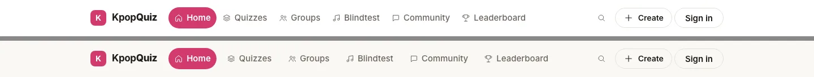 |
| Nav, signed in (test user, no streak): before / after | 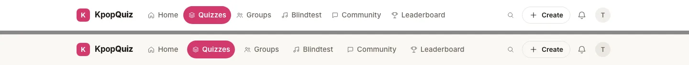 |
| Nav after, streak pill 7 / 42 / 365 (read stub) | 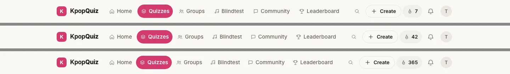 |
| Home: before / after | 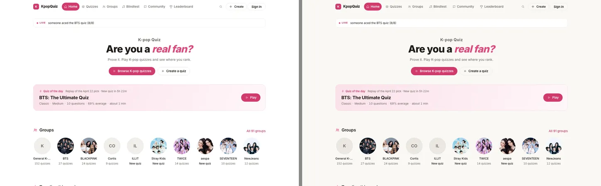 |
| /quizzes: before / after | 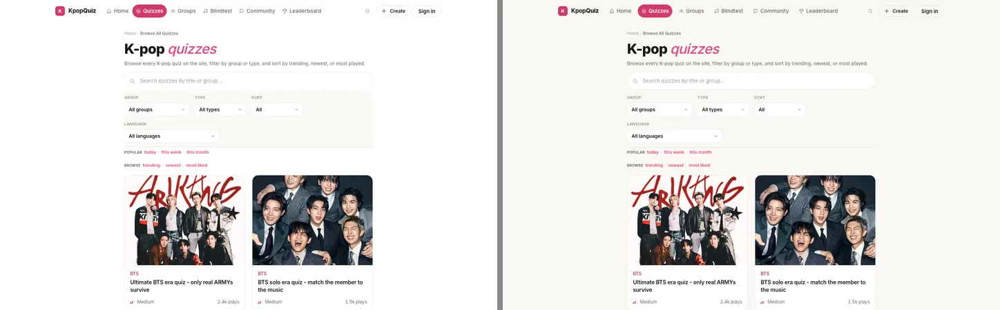 |

Colour census of the 1440 x 900 viewport: home white 81.9% -> 3.5%, warm ground 0% -> 71.8%; /quizzes white 76.5% ->
11.1% (quiz cards, fields), warm ground 0% -> 65.5%. Ground pixel rgb(255, 255, 255) -> rgb(250, 248, 245), nav
glass over it rgb(250, 248, 244). Computed: body and `.ux-app` rgb(250, 248, 245), nav rgba(250, 248, 245, 0.86),
`.ux-qcard` and the live ticker rgb(255, 255, 255), footer rgb(241, 239, 234). Pixels moving by more than 16 per
channel: nav 3.9% (guest) / 4.6% (signed in), the links shifted by the gaps; home 0.28%, /quizzes 0.33% (the
ground moves by 5 to 10 per channel, under that threshold).

### 12.5 Open items and owner decisions

- Owner: a full 8px between the pills while a streak pill shows needs 12px (1 digit) to 30px (3 digits) more room in
  the 1120 bar. Options, none taken: hide the link icons while a streak pill shows (frees 132px), show Create as an
  icon button while a streak pill shows (about 60px), or let the bar run wider than the 1120 page column from 1440
  (the brand no longer lines up with the page edge). Today the gaps shrink to what fits (12.1).
- FIXED in fix 6 (section 13). Found on the way, not changed (same before and after, not part of the request): from 761 to about 830px wide
  (tablets in portrait, e.g. 768 and 820) the desktop nav is wider than the window and the page scrolls sideways by
  22 to 24px (measured at 800: guest 24px, signed in 22px). The nav-fit cases cover 1440 / 1280 / 1100 only. A0 can
  fix it in a0.css (e.g. the phone bar up to 900, or a compact Create under 900) once ORCH or the owner picks one.
- One `--ux-surface` serves fills on the ground and fills inside white boxes (menu row hover, sheet tiles, quiz card
  cover placeholder): inside white boxes those fills are a little deeper than the prototype's (dE 6.2 from white
  instead of 3.3), close to the live site's alt #F3F1ED on white.

## 13. Fix 6: no sideways scroll on tablets (2026-09-28; base edf474e, integration b01149e merged in 9e71f0f)

The bug (12.5): from 761 to about 830px the desktop bar was wider than the window and the page scrolled sideways.
Code 67f6a1e (a0.css, `ux-nav-actions.tsx`, a comment in `ux-tab-bar.tsx`), spec bda5548 (shell.spec), shots 0e54565.

### 13.1 Measured before (flag-on build of b01149e)

The bar needs brand 118 + five pills 398 + the right cluster (guest: search, Create 101, Sign in = 236; signed in:
search, Create, bell, avatar = 233; a streak pill adds 60 to 86) + two 20px gaps + the two 32px gutters: about 856px
(guest, mouse) to 948px (4-digit streak, touch, 44px targets).

| Sideways scroll (px) | 761 | 768 | 800 | 820 | 900 | 901 |
|---|---|---|---|---|---|---|
| Guest, mouse | 63 | 56 | 24 | 4 | 0 | 0 |
| Guest, touch | - | 60 | 28 | 8 | 0 | 0 |
| Signed in, no streak, mouse / touch | 61 / - | 54 / 62 | 22 / 30 | 2 / 10 | 0 | 0 |
| Signed in, streak 1000, mouse / touch | 147 / - | 140 / 148 | 108 / 116 | 88 / 96 | 8 / - | 7 / - |

Where it did not scroll, the right cluster still ran into the right gutter up to 856px (guest) and 939px (4-digit
streak). The prototype does the same, worse: 128px of scroll at 761, into its gutter up to 920px (guest). It has no
tablet layout; its narrow layout is the phone chrome at 760 and under.

### 13.2 The pick: the phone chrome up to 900px

ORCH's two options were measured on the same build:
- Compact Create (Create as its round icon, the bar's gaps 20 -> 12; the link icons already hide under 1280): guests
  and accounts without a streak fit, but any streak pill still scrolls. Streak 7: 32px at 768 (mouse), 48 / 16px at
  768 / 800 (touch). Streak 1000: 59 / 27 / 7px at 768 / 800 / 820 (mouse), 75 / 43 / 23px (touch). Making those fit
  too would need more invented states (hide the "KpopQuiz" wordmark, tighter pills, or a scrolling link row).
- The phone chrome up to 900px (taken): the prototype's own narrow layout (16.5 Mobile), no new state, room to spare
  in every state (the top bar holds logo, search, streak, bell or Sign in), 44px targets and the tab bar on touch
  tablets. The page below keeps its tablet layout (it has its own 900 / 760 steps).

a0.css: the chrome rules of the 760px block (`.ux-links, .ux-nav-create, .ux-avabtn` hidden, bar gap 12, tab bar
shown, `.ux-app` 64px + safe area and its focus / create / Verse exceptions, the toast 84px up) moved unchanged into
a `(max-width: 900px)` block; everything else in the 760px block stays (page spacing, grids, sheets, the fixed
popovers). At 390 the same rules apply as before.

From 901 to 959px a streak pill (with Create 101px) still needs up to 948px: `(max-width: 959px)` +
`.ux-nav-r:has(.ux-streak)` shows Create as its round icon (`aspect-ratio: 1`, 36px, 44px on touch); its label is
now a span (`.ux-nav-create-t`), visually hidden there, so the link is still named "Create". Guests and accounts
without a streak keep "+ Create" from 901px. The owner's 8px between the pills (12.1): full for guests and accounts
without a streak from 901px, shrinking to what fits next to a streak pill (as at 1280).

What moves for tablets (761 to 900px), as on phones: the links go to the tab bar (Home, Quizzes, Blindtest,
Community, You; Groups is reached from the home and Quizzes pages and the footer, Leaderboard from Community / You
as under 1100 already); Create is the home header's "Create a quiz" and the footer link; the account menu is the You
tab (passport, "Edit passport" -> /settings with Sign out).

### 13.3 Proofs (flag-on production build of 9e71f0f, `next start` :3030, Chromium 1234)

Sweep (shell.spec, new): one page load per state, then the viewport from 761 to 1279px in 1px steps (519 widths);
at each width: no horizontal scroll, the right cluster ends inside the gutter, and the chrome of the band (up to
900: tab bar, no links / Create / avatar in the top bar; from 901: no tab bar, 5 links (6 from 1101) on one line
ending before the cluster, Create shown, its label hidden only next to a streak pill up to 959, the avatar when
signed in). ux-1440 sweeps with a mouse, ux-390 with touch. Guest on `/`; signed in on `/quizzes` with the test
user's own read (no streak) and a 4-digit streak through a read stub. Light and dark.

| Least room left (px) | Phone chrome 761-900 (cluster to gutter) | 901-959 | 960-1100 | 1101-1279 (links to cluster) |
|---|---|---|---|---|
| Guest, mouse / touch | 0 (flush with the gutter) | 32.5 / 28.5 | 91.5 / 87.5 | 112.7 / 108.7 |
| Signed in, no streak, mouse / touch | 0 | 35.3 / 27.3 | 94.3 / 86.3 | 115.4 / 107.4 |
| Signed in, streak 1000, mouse / touch | 0 | 20 / 20 | 20 / 20 | 29.1 / 21.1 |

(20 = the bar's own gap between the links and the cluster: the pills' spacers took the rest; no overlap anywhere.)
Result: 12 sweeps (3 states x 2 themes x 2 pointers) of 519 widths each, 0 problems. The same spec against
the base build fails from the first width ("761px: scrolls sideways by 63px", "right cluster ends 95.5px into the
gutter"; touch 67 / 99.5), so it catches the bug.

Tablet case (shell.spec, new, both projects): at 800px the tab bar is docked at the bottom, `.ux-app` keeps 64px
under the page (body 0: the legacy 72px stops at 767), a toast sits 84px up; at 901px none of it (0 / 0 / 32px);
/verse at 800 adds no room (legacy chrome, no v11 tab bar).

Whole shell.spec + kit.spec, both projects, light and dark (run after the base build finished): 100 passed, 13
skipped (width-specific), 3 flaky, 1 failed. Unchanged cases: nav fits at 1440 / 1280 / 1100 (guest, 8px gaps, pill
10px / 38px / pink), nav fits signed in at 1440 / 1280 with streak pills up to 4 digits, the 390 frame (tab bar 64,
44px targets, reference landmarks and styles), room under the footer (390: 64px, Verse 72px; 1440: 0), axe. Every
flaky or failed case in every run was the signed-in island not appearing (`.ux-avabtn` not found; the server log
shows `[middleware] auth.getUser timed out after 1500 ms - anonymous`: the production auth round trip from this
network, the drop ORCH reported); none failed on geometry ("width(s) with a problem": 0 in all runs). Each
signed-in case passed in at least one run: sweep ux-1440 light / dark, ux-390 light / dark; nav fits 1440 / 1280
light / dark. kit "search field" failed once in the run that shared the CPU with a build; 10 / 10 alone at 1440 and
390 (`--repeat-each 5`) and green in the next full run.

Also: whole-app `tsc --noEmit -p .` 0 errors after merging b01149e; eslint (next core-web-vitals + typescript) 0 on
the changed files; no em / en dash in the diff; no write (every spec with `guardWrites`; the probes abort every
non-GET; /me and /profile never loaded signed in).

Shots (`v11/reports/A0/`; strips at the document's full width, the pink line = the window's right edge, before on
top, after below):

| | |
|---|---|
| 800px guest (before: 24px of scroll) | 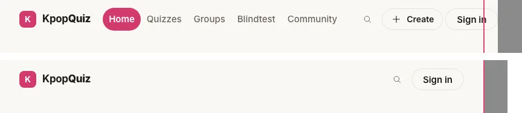 |
| 768px guest, touch (before: 60px) | 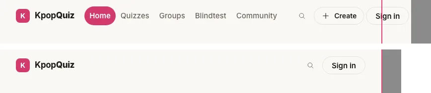 |
| 800px signed in, streak 1000 (before: 108px) | 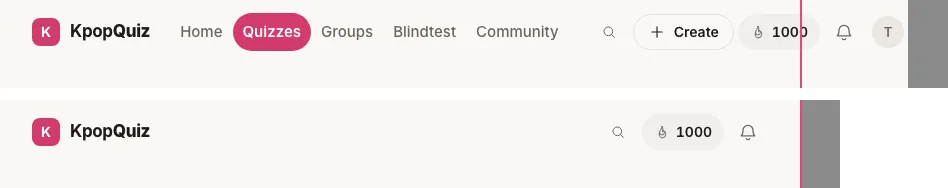 |
| 930px signed in, streak 1000 (before: into the gutter; after: Create as its icon) | 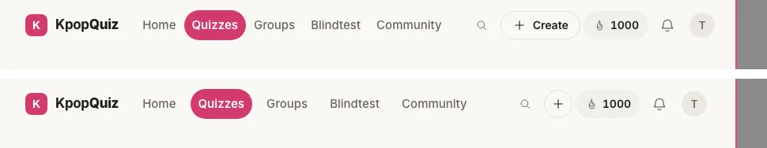 |
| 820px touch, /quizzes, guest, light (after) | 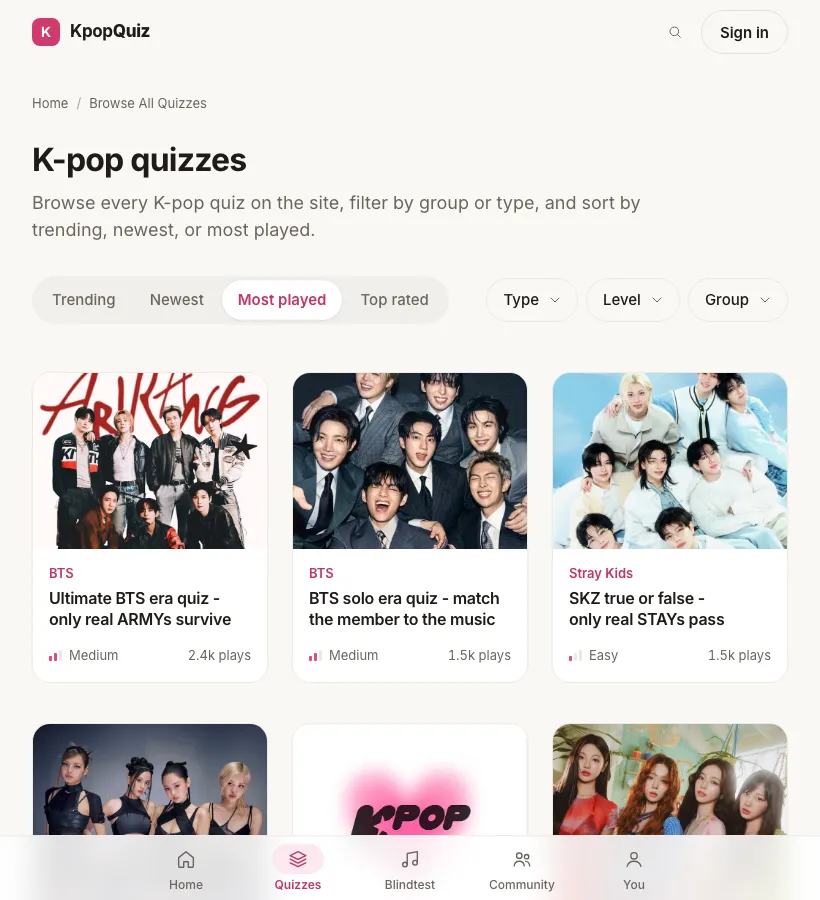 |
| 820px touch, /quizzes, streak 42, dark (after) | 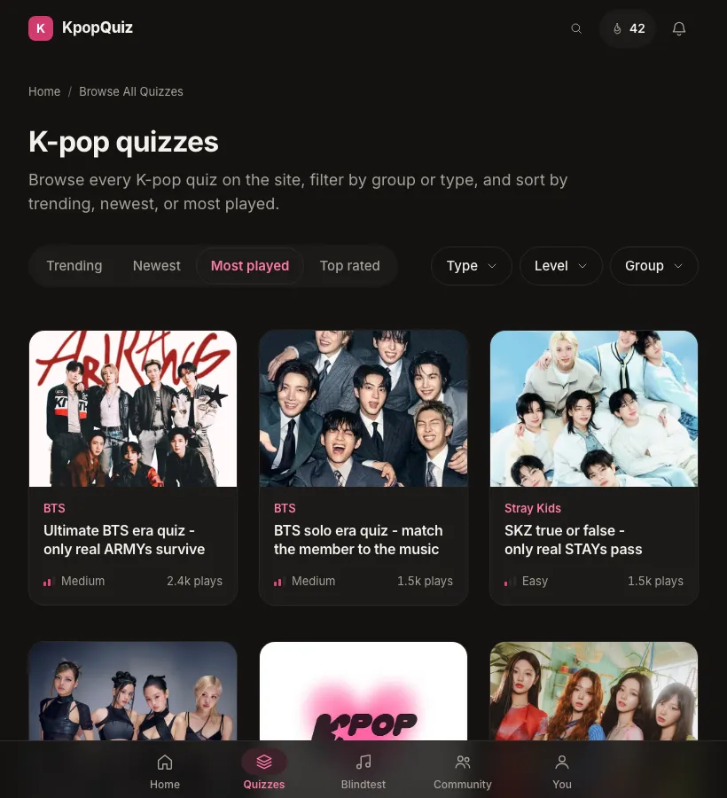 |

### 13.4 Flag off

Both trees built with the flag off, back to back (base = export of b01149e on :4001, this branch on :4002),
`flag-off-diff.mjs --structure`: all 10 pages identical (`/`, `/quizzes`, `/q/ultimate-bts-era-quiz-only-real-armys-survive`,
`/bts-quiz`, `/blindtest`, `/groups`, `/create`, `/faq`, `/pt/blindtest`, `/trending`); flag-on-only routes answer the
same on both (`/ux-v1/kit` 301, `/api/ux-v1/a0/styles` 404, `/me` and `/profile` 307, `/verse` 200). Output in
`A0/fix6-flag-off.txt`. By construction too: a0.css is served to flag-on pages only, and the Create span sits in the
flag-on shell (next/dynamic behind the flag).

### 13.5 Not verified, and why

- Real iPads and Safari: Chromium 1234 only (mouse and touch emulation). Safari text can be a pixel or two wider;
  the least room left is 20px (13.3), so it cannot bring the scroll back.
- Touch screens at 1280px and wider with a 4-digit streak pill: the right cluster ends 7.9px into the gutter
  (measured at 1280, 1366, 1440: 44px touch targets; no scroll: the bar is 1184 wide inside a wider window). Same
  before this fix, outside 761 to 1279, and not in the mouse references (the 1280 / 1440 nav-fit cases pass).

### 13.6 Requests for ORCH to route, open items, owner decisions

- P10 (`p10.css:160`, phones block): `.p10-savebar { bottom: calc(76px + env(safe-area-inset-bottom, 0px)) }` lifts
  the sticky save bar above the tab bar only up to 760px. The tab bar now shows up to 900px, so from 761 to 900 the
  bar sticks 16px from the bottom, under the tab bar (z 60), while the form is taller than the window; at the end of
  the form it shows above the 64px room. Fix: the same rule in a `(max-width: 900px)` block.
- Legacy toast (`components/ui/toast-provider.tsx`, fixed 24px from the bottom, z 50; no v11 owner): it sits under
  the v11 tab bar on phones already, now also from 761 to 900. Callers under the flag: `result-loop`, `claim-run`,
  `cheer-button`, the legacy /settings page (`quiz-player` runs in focus mode: no tab bar). The v11 toast
  (`useUxToast`) is lifted 84px.
- Owner decision (section 4 item 14): tablets from 761 to 900px get the phone chrome. The measured alternative
  (compact Create) keeps the desktop bar but still scrolls for every account with a streak pill (13.2).
- FYI: a `git archive` export of `apps/quiz` alone does not build: `/data/knowledge-report-2026/dataset` reads
  `docs/data/w5-dataset.md` from the repo root at build time.
- No pending migration.
