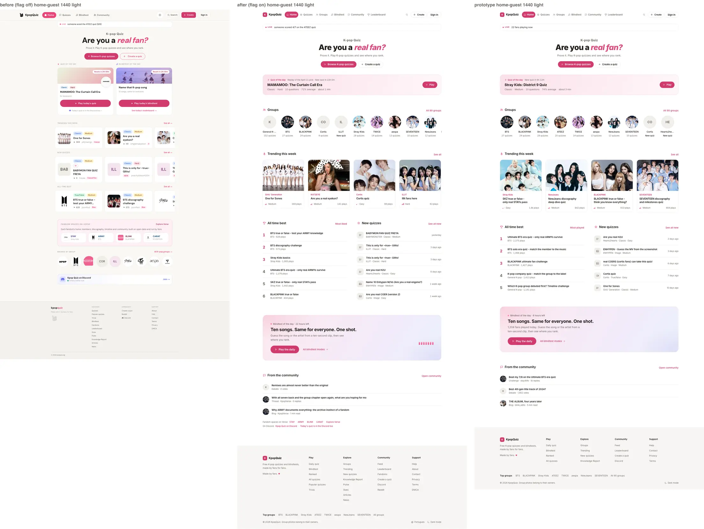
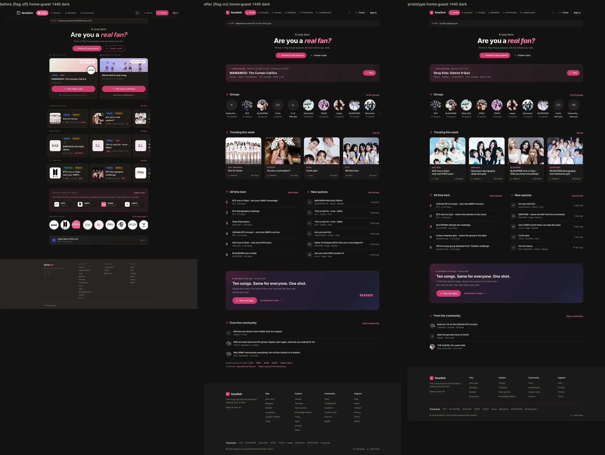
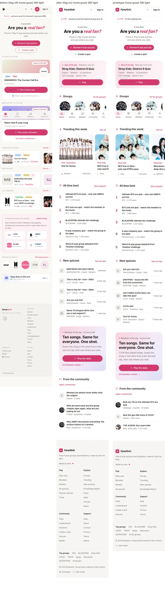
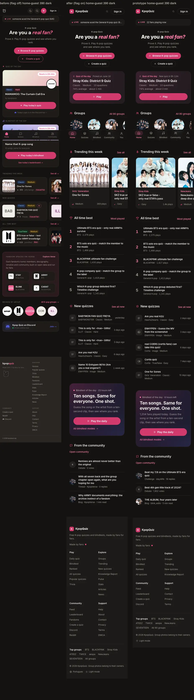
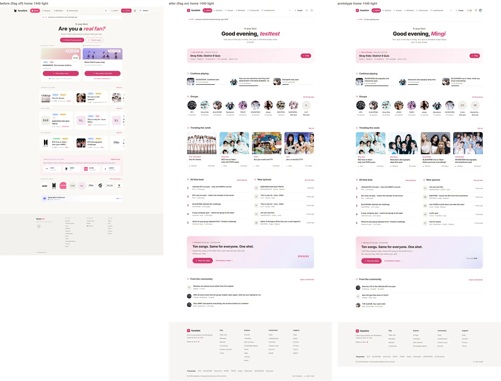
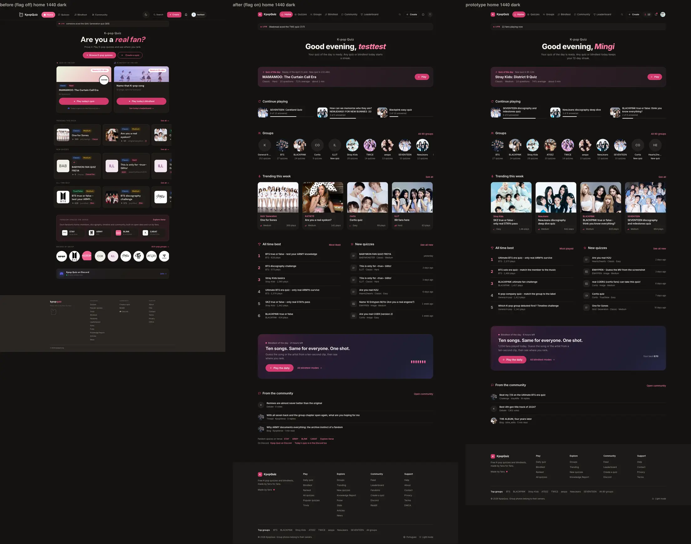
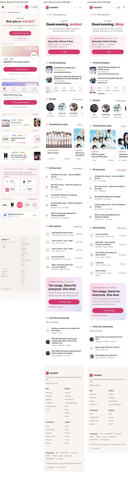
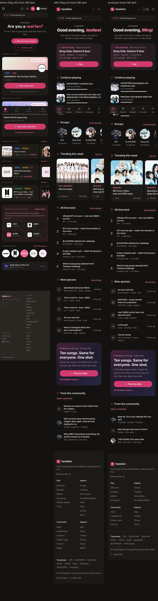

# P1 Home report (UX v11.2)

## Progress

- Done: QOTD root cause found (code + read-only queries) and fixed in code behind the server env
  switch `QOTD_ROTATION_FIX` (default OFF: production unchanged); v11.2 home behind
  `NEXT_PUBLIC_UX_V1` (ticker, centred header, quiz of the day, continue, groups, trending, all time
  best | new, blindtest band, community), real cached fail-soft reads, static/ISR kept; Continue reads
  P4's store (merged feat/ux-v1-v11 08ed654); `p1.spec.ts` 37/37 on a flag-on production build (1440 +
  390, light + dark, guest + signed in read only); axe 0 serious/critical; flag-off parity and SEO diff
  of `/` and `/pt` clean; screenshots; PR #49 into feat/ux-v1-v11
  (https://github.com/P-Mingi/KpopQuizzV2/pull/49); local servers, builds, symlinks and the test-user
  session file removed.
- Next: C1 / C2 / C3 findings, if any. Owner go for the QOTD switch (2.4) and the decisions in 6.
- Blockers: none.

## 1. What I built

| Area | Where |
|---|---|
| Flag branch on `/` (legacy JSX untouched; the WebSite JSON-LD is one shared object for both homes) | `src/app/(site)/page.tsx` |
| Home body (server, static/ISR, every read fail-soft + min-gate) | `src/components/home/ux-v1/ux-home.tsx` |
| Live ticker: the live `ActivityTicker` imported as is (its two endpoints), restyled from a wrapper to 17.11 (44/40px, radius 14, `--line`, LIVE 11/800 pink-ink, line 14/13); the slot keeps its height, so nothing jumps when it fills in | `ux-home.tsx`, `src/styles/ux-v1/p1.css` |
| Centred header: the guest markup is always the server HTML, with production's H1 / H2 / CTAs (SEO lock); signed-in fans get "Good evening, <name>" + one streak line and no CTAs (client island) | `home-header.tsx` |
| Quiz of the day row (17.2 / 17.10 / 17.11): label + truthful note, the real title, one meta line (type, level, questions, real average, real time), one Play (`/q/{slug}?daily=quiz`, as today); no group tag, no preview | `qotd-row.tsx`, `qotd-note.tsx` |
| Continue playing (signed in, device runs, min-gate) read through P4's `lib/ux-v1/p4/continue.ts` (read only), resumes at the saved question (`/q/{slug}?resume=1`) | `continue-playing.tsx` |
| Groups rail: the 8 most played groups + 2 with a quiz published in the last 14 days ("New quiz"), published-quiz counts, `/{slug}-quiz`, "All 90 groups" | `groups-rail.tsx` |
| Trending this week (real plays of the last 7 days, one card per group photo), All time best (play_count, numbered, top 3 pink-ink), New quizzes (type glyph, age); no quiz twice, Continue included | `quiz-rows.tsx`, `ux-home.tsx` |
| Blindtest of the day band (day mode): real "N fans played today", time left, played state (score, rank, See today's board), "Your best N/10" | `blindtest-band.tsx`, `src/app/api/ux-v1/p1/daily-band/route.ts` (GET, read only, 404 flag off) |
| From the community: today's debate (votes), the latest thread (replies), the latest featured essay (read time), opted-in spaces only | `community-rows.tsx` |
| Reads (public, cookie-free, cached; a failed read throws so it is never cached) and pure helpers | `src/lib/ux-v1/p1/home-data.ts`, `format.ts` |
| Client islands behind next/dynamic (the flag-off home carries only a 1 KB loader) | `islands.tsx`, `use-client-values.ts` |
| QOTD rotation fix (section 2) | `src/lib/quiz-bank-scheduling.ts`, `src/lib/ux-v1/p1/qotd-rotation.ts`, `src/app/api/cron/ensure-daily-quiz/route.ts`, `src/app/api/qotd/publish/route.ts` |
| Tests | `src/lib/ux-v1/p1/p1.test.ts` (19 unit), `e2e/ux-v1/p1.spec.ts` (18 cases x 2 widths + setup) |

`src/styles/ux-v1/p1.css` is not imported (A0's route serves it to flag-on pages only).

## 2. Quiz of the day: why the rotation stopped, and the fix

### 2.1 Evidence (read-only queries on 2026-09-25: anon key, and service role SELECT only)

- `qotd_log`: 82 rows, 2026-04-06 to 2026-06-30, all `selection_method = 'bank'`, two gap days
  (06-18, 06-27). Nothing after 2026-06-30.
- `quiz_bank`: 100 rows. 82 `published` (one per logged day), 18 `scheduled`, 0 `verified`, 0 `draft`.
  The 18 scheduled rows: 2 on missed dates (2026-04-03, 2026-04-05) and 16 between 2026-12-15 and
  2030-01-28, all dated by one auto-schedule run (`updated_at` 2026-04-01 / 04-02).
- `quizzes.is_quiz_of_the_day = true`: 84 rows (the flag is never cleared); newest date 2026-06-30
  (Stray Kids: District 9 Quiz).

### 2.2 Root cause (code)

1. The cron (`vercel.json`, `5 0 * * *`, `/api/cron/ensure-daily-quiz`) calls `ensure_daily_quiz(today)`,
   which publishes a `quiz_bank` row only if its `scheduled_date` is EXACTLY today.
2. The bank was dated once by `autoSchedule` (`lib/quiz-bank-scheduling.ts`). Its walk compares a
   candidate with the closest scheduled entry at ANY distance and may jump up to 365 days per quiz, so
   the last rows land years ahead with empty days in between (the unit test reproduces it: of 6
   same-category quizzes only 1 is placed). From 2026-07-01 no row matches "today".
3. The RPC then returns NULL; the cron ignores the result and answers `{ ok: true }`: a silent stop.
4. The catalog fallback `/api/admin/auto-select-qotd` exists but is not in `vercel.json` (and is
   POST-only while Vercel Cron sends GET), so nothing fills an empty day.
5. The live home hides it: `getQuizOfTheDay` falls back to an unlogged replay of past picks (on
   2026-09-25 "K-pop Training System and Idol Life", the pick of 2026-04-20; `/daily` uses it too),
   while the Discord bot reads the latest stored pick (2026-06-30).

### 2.3 Fix (code, behind `QOTD_ROTATION_FIX`, default OFF)

- `rotateQotd` (`lib/ux-v1/p1/qotd-rotation.ts`), run by the cron and the manual `/api/qotd/publish`
  only when the switch is on: keep today's pick if there is one; else the existing RPC (a bank row dated
  today); else pull the next open bank row to today (missed dates first, then undated, then the earliest
  future date, avoiding yesterday's group and category) and run the RPC again; else a deterministic
  catalog pick (5+ questions, fewer than 3 reports, played at least once, not featured in the last 90
  days of `qotd_log`, another group than the last 3 days, ranked like the admin auto-select). The catalog
  pick makes the same three writes as the admin routes `set-qotd` / `auto-select-qotd` (flag + date on
  `quizzes`, upsert `qotd_log` with `selection_method = 'auto'`). A day that stays empty answers 500, so
  the cron shows as failed instead of silently "ok".
- `autoSchedule` uses a compact scheduler when the switch is on (consecutive days, never a gap).
- Switch OFF: the cron, the publish route and `autoSchedule` run exactly today's code path and return
  today's responses.
- Unit tests (19 in total): the 18 real open bank rows, the legacy drift, a gap-free compact schedule,
  pick order, 90-day no-repeat, group diversity, and a 30-day simulation on an in-memory store (18 bank
  days, then catalog days, one pick a day, nothing repeated).
- No pending migration: no DDL, no backfill. The job writes through the same RPC and tables as today's
  cron and the admin routes, and only once the owner turns the switch on.

### 2.4 Owner go (to resume the rotation)

Set `QOTD_ROTATION_FIX=1` (server env, Production) and redeploy. The next 00:05 UTC run publishes the
2026-04-03 bank row, then one bank row a day for 18 days, then catalog picks. Manual run: `GET
/api/qotd/publish` as an admin, or the cron URL with `Bearer CRON_SECRET`.

### 2.5 What the v11 home shows while the rotation is stopped

The latest STORED pick (`qotd_log` / `quizzes` flag, on or before today): "Stray Kids: District 9
Quiz", note "Picked on June 30", no countdown. A pick dated today shows "New quiz in 6h 12m" only when
tomorrow's is on its way (switch on, or a bank row dated tomorrow), else "Today's pick". The legacy home
keeps its replay pick (flag off unchanged); both agree again once the switch is on.

## 3. Screenshots (before = flag off, after = flag on, prototype)

Full pages, production builds (`next build` + `next start`), real data (text and photos differ from the
prototype's samples by design). Signed-in panels: the parity test user, with three Continue runs seeded
in the browser's localStorage in P4's format (device data, nothing written anywhere).

| | |
|---|---|
| Guest 1440 light |  |
| Guest 1440 dark |  |
| Guest 390 light |  |
| Guest 390 dark |  |
| Signed in 1440 light |  |
| Signed in 1440 dark |  |
| Signed in 390 light |  |
| Signed in 390 dark |  |

Element pairs (prototype | implementation) in `P1/`: `header-*`, `ticker-*`, `qotd-*`, `continue-*`,
`groups-*`, `trending-*`, `best-new-*`, `band-*`, `community-*` for `home-guest-1440-light`,
`home-1440-dark` and `home-guest-390-light`.

## 4. Wiring proof

| Row (WIRING-MAP) | Source | Proof (`e2e/ux-v1/p1.spec.ts`) |
|---|---|---|
| Home: Quiz of the day card (v11.1 minimal) | `qotd_log` + `quizzes` flag (latest on or before today), `quiz_time_stats` | title = the stored pick read from the DB; meta has the real question count and average (`total_score_sum / total_completions / question_count`); the note never calls an old pick today's; Play = `/q/{slug}?daily=quiz` (click and Enter) |
| Home: Header (v11.2) | server HTML (guest); `/api/auth/me` (display_name, daily_streak, last_daily_date) | guest H1 / H2 / CTA text and hrefs; signed in "Good <time>, <name>", one streak line, no CTAs, zero writes |
| Home: Live ticker | `components/home/activity-ticker.tsx`, `/api/activity/recent`, `/api/stats/live` | the line shown is one of the endpoint's lines (or the online count); bar 44/40px; LIVE 11/800 |
| Home: Continue playing | P4 `lib/ux-v1/p4/continue.ts` (device runs written by the quiz game) | guest: hidden; signed in: the unlisted run shows "3 of 8 answered" and `/q/{slug}?resume=1`; the quiz of the day run is left out |
| Groups rail (NEW badge) | published quizzes per group (paginated), groups (90 visible) | counts equal a head count of published quizzes; "All 90 groups" = rows minus the quarantine row; hub hrefs |
| Trending this week | real plays of the last 7 days (`getPopularQuizzes('week')`), browse trending as fallback | at most 4; never the same photo twice in the row |
| All time best | `play_count` desc | numbered 1..5, top 3 pink-ink, plays descending, `/quizzes?sort=most_played` |
| New quizzes | `created_at` desc, published | type glyph, age label, `/quizzes?sort=newest` |
| Daily band played state | `daily_blindtest_scores` (count today; the fan's score, rank and best via `/api/ux-v1/p1/daily-band`), the daily game's `kq_daily_blindtest_played` flag | count = head count for today; Play the daily / All blindtest modes; played state with See today's board; signed-in response shape |
| From the community | `daily_debates` + `debate_questions` + `debate_votes`, `verse_threads` + comments, `verse_essays` (featured), opted-in spaces | at most 3 rows, typed sub line, real hrefs, Open community = `/community` |
| No quiz twice (16.7) | all lists above + Continue | every `/q/` slug on the page is unique |

No write: every case wraps the page in `guardWrites` and asserts zero mutating requests (guest and
signed in); navigations are stubbed. The spec's own data checks read the same tables with the anon key.

## 5. Checks

- e2e `p1.spec.ts`: 37/37 on a flag-on production build of 83607f9 (after merging feat/ux-v1-v11
  08ed654), also 37/37 earlier on the flag-on dev server (`P1/proofs/e2e.txt`).
- Landmarks: tops of the ticker, header, CTAs, quiz of the day and the first section within 2px of the
  guest reference at 1440 and 390; computed styles equal to `styles.json` for `.qotd`, `.qlab`,
  `.qline`, `.btn-primary`, `.hhead h1`, `.sec-h h2`, `.qcard`, `.nav` (0 mismatches, both themes).
- axe (axe-core 4.11 via eslint-config-next): 0 serious / critical on `.p1-home`, guest and signed in.
- Keyboard: Tab reaches every link of the home in DOM order with the 2px pink ring; Enter operates Play.
- Flag off (`P1/proofs/flag-off.txt`, both sides `next build` + `next start`): `/` and `/pt` structure
  IDENTICAL to feat/ux-v1-v11 (DOM, head, meta, canonical, JSON-LD, text, links, stylesheets). Home JS
  709,913 B vs 708,864 B on the base (+1,049 B: the island loader, export names only, no island code);
  `/pt` +3 B.
- SEO flag on vs flag off (`P1/proofs/seo-diff.txt`): title, meta, canonical, hreflang, H1, intro,
  JSON-LD identical on `/` and `/pt`; server-rendered (15 quiz links and 11 hub links in the HTML).
- Static/ISR: `/` stays `○` (revalidate 10m) in the flag-on build; no cookie read on the server.
- tsc 0 errors; eslint-config-next core-web-vitals + typescript on the P1 files: 0 problems; vitest 19/19;
  em / en dash check on the P1 files: none.
- Data guard (read only): `P1/proofs/data-guard-before.txt`, `P1/proofs/data-guard-after.txt`.

Environment notes (local only, not the product): on a local `next start` a cold page load fires about
15 AVIF encodes at once and an image key that hangs stays hung for every later request (Vercel's image
service is not affected); the checks warm the images one at a time first. A slow network also made the
5 s `safeFetch` timeouts fire during a build; a failed home read now throws inside `unstable_cache` so
it is never cached for the TTL.

## 6. Open items and owner decisions

1. QOTD switch: set `QOTD_ROTATION_FIX=1` to resume the rotation (2.4).
2. Security (existing, read in the migrations, not tested): `quiz_bank` has `quizbank_admin_all ... FOR
   ALL USING (true) WITH CHECK (true)` (migration 018) and `quiz_time_stats` a write-all policy (032).
   With the anon key anyone could add a bank row dated tomorrow, which today's cron would publish as the
   quiz of the day under the system account. Tightening RLS is outside this run's rules: owner call.
3. Internal links from `/` (SEO, not in the 16.10 list): the v11 home links 11 group hubs vs 18 on the
   live home. Hubs that lose their home link include `/cortis-quiz` (the #1 hub per `next.config.ts`),
   `/exo-quiz`, `/itzy-quiz`, `/ive-quiz`, `/le-sserafim-quiz`, `/txt-quiz` (all still linked from
   `/groups` and the footer's "All groups"). The rail follows the design (8 most played + 2 new); the
   owner may want pinned hubs.
4. The ticker's random 12 to 27 floor on "fans playing now" is kept (owner decision pending, 17.11).
5. Streak copy "Any quiz or blindtest today keeps your N-day streak" is the prototype's; it is true once
   every run counts toward the streak (today only the daily quiz / daily blindtest do).
6. P2: the home links `/quizzes?sort=most_played` and `/quizzes?sort=newest` (today's sort keys).
7. While the rotation is stopped the legacy home (replay pick) and the v11 home (stored pick) show
   different quizzes; both agree once the switch is on.

## 7. Requests to A0

`v11/requests/P1.md`: focus the page H1 on client navigation (16.5); a dev-only chunk 404 note.
