# P10 Passport + settings report (UX v11.2)

## Progress

- Done (branch `ux11/p10-passport`, on `feat/ux-v1-v11`): header routes (upload + link, SSRF-safe, fail soft
  until the bucket exists), v11 passport for `/me` and `/u/[username]`, v11 settings, read-only data export,
  `p10.css`, pending migrations (bucket, email opt-ins), 158 unit + render tests, `e2e/ux-v1/p10.spec.ts`,
  prototype style reference for the passport / settings / header-sheet landmarks, lint + tsc clean, flag-off
  builds of base and P10 (`next build` both green), flag-off diff (structure IDENTICAL) and SEO diff (no
  change), final e2e pass on the current head (84 passed, 0 flaky, 0 skipped at 1440 / 390, light / dark),
  report images regenerated from the final code (before | after | prototype).
- Next: cleanup (scratch builds, symlinks, .next, servers), PR into `feat/ux-v1-v11`, final answer to ORCH.
- Blockers: none for the code. Owner decisions listed in section 8 (bucket, production writes, email sender).

## 1. What I built

| Area | Where |
|---|---|
| Passport render (server component, flag on only) | `components/profile/ux-v1/passport.tsx`, `rows.tsx` |
| Band + Change header (client), owner check on `/u` through the shared `/api/auth/me` read | `passport-band.tsx`, `header-picker.tsx`, `header-actions.ts` |
| Edit passport / Follow / Share (client) | `passport-actions.tsx` (Follow = the existing `GET`/`POST /api/follow`; guest = A0 sign-in sheet, resumes after sign-in) |
| Tabs Overview / Quizzes / History / Badges, every panel in the served HTML | `passport-tabs.tsx` (A0 `UxTabs`, `#p10-panel-<id>` deep links) |
| Show more quizzes | `more-quizzes.tsx` (existing `GET /api/quizzes/user`) |
| View model (pure) + builder | `lib/ux-v1/p10/passport-model.ts`, `build-passport.ts` |
| Flag-on read-only extras | `lib/ux-v1/p10/passport-data.ts` (fandom name, fandom war rank, average score, history) |
| `/me` | `app/(site)/me/page.tsx`: every legacy call and write unchanged and in order; flag on appends the extras and renders `UxPassport` |
| `/u/[username]` | `app/(site)/u/[username]/page.tsx`: same cookie-free ISR reads; flag on adds 2 reads and renders `UxPassport` with a copy of the same JSON-LD |
| Settings (client, lazy chunk, flag on only) | `components/profile/ux-v1/settings.tsx`, `lib/ux-v1/p10/settings-model.ts`; `app/(site)/settings/page.tsx` picks it when the flag is on |
| Header upload route | `app/api/profile/header/upload/route.ts` |
| Header link route | `app/api/profile/header/link/route.ts` |
| SSRF guard, file checks, storage | `lib/ux-v1/p10/ssrf.ts`, `header-image.ts`, `header-store.ts` |
| Download your data (read only) | `app/api/ux-v1/p10/export/route.ts` |
| Styles (not imported; served by A0's route) | `styles/ux-v1/p10.css` |

### Passport (prototype view `you`, DESIGN-SPEC 16.7 + 17.8)

- Band 120 (radius 24, 20 on phones): `header_url` image, else the main group (`ult_groups[0]`) photo from
  `public/idols` blurred over the theme tint, else the flat tint. Tints = the prototype's THEMES table, keyed by
  `profile_theme`; the tint is the light one in both themes, as in the dark reference.
- 96 avatar (80 on phones) overlapping the band with the 4px page ring; custom / preset / photo / initials.
- H1 = the display name in `name_accent` (A0's AA-clamped `ux-acc-*`) and `name_font`, then A0's `BiasTag`, the
  pinned badge as a 28px `BadgeMedal` (only when earned), the level chip `Lv 7 · Stan` (`getLevelInfo` +
  `getTitleForLevel`).
- Meta: `<fandom> since <stan_since> · joined <Month Year> · N followers`, then the bio when set.
- XP bar in the theme colour, `1,280 / 2,000 XP to Lv 8` (same numbers as the live passport).
- Stats: owner = quizzes played, average score (all plays, paginated), streak, quizzes made, blindtests played;
  public = streak, groups mastered, quizzes made, plays received (exactly what the public page exposed before).
  The row scrolls on phones and is a focusable region (axe `scrollable-region-focusable`).
- Overview: fandom war strip (`getGroupWarRank` of the main group, links to /leaderboard), Pinned badges (the pinned
  one first, then earned, max 6, "All N badges" opens the Badges tab), Groups mastered (progress to 30 plays at
  80%, top 3), Recent activity (owner only, 3 latest plays, "Full history").
- Quizzes: published quizzes of the fan (`getQuizzesByCreator`), `Published · 1.4k plays · 37 likes · 72% average`,
  real `/q/<slug>` links, Show more; owner gets Create.
- History (owner only): latest 20 quiz plays and blindtests, `2/8 · 6 hours ago`, `10/10 · perfect · 2 days ago`.
- Badges: A0 `RarityKey`, `N of M earned · colour and shape show rarity`, every `badge_definitions` row as a
  `MedalTile` (rarity from `badgeRarity()`, names and descriptions from `badge_definitions`), earned first.

### Settings (prototype view `settings`, 16.7 + 17.8 "Your look")

- Reads exactly what the legacy page reads (browser client: `profiles`, `groups`, `user_badges`;
  `GET /api/notifications/prefs`) plus the public `idols` roster of the main group for the bias chips.
- Profile: photo (sheet: https link or a preset colour; the legacy URL field + presets), display name, username with
  the live availability check (`GET /api/auth/check-username`), bio `n / 160`.
- Fandom: up to 3 groups (the first is the main group), Add a group (searchable sheet), remove, Stan since.
- Your look (open, not folded): live preview "how you appear in Community" (A0 `PersonName`), name colour (7), name
  font (3), bias tag (members of the main group + custom text + No bias tag), passport theme (6), header picture
  (Change header picture = the same sheet; Use the theme colour), pinned badge (earned badges, 22px medals).
- Notifications: the 5 live categories through `/api/notifications/prefs`; the 2 email rows are shown disabled
  ("Not available yet: KpopQuiz does not send emails yet") until the pending migration and a sender exist.
- Appearance: System / Light / Dark (A0 `applyTheme`, the existing class + localStorage system), Sounds in games
  (`lib/sounds`); device settings, applied at once, no server write.
- Account: sign-in method (from the session), Download your data (JSON file, read only), Sign out (the same
  `supabase.auth.signOut()` as today), Delete (confirm sheet, then the contact page: there is no delete endpoint).
- Save bar (sticky, bottom 16 / above the tab bar on phones): Discard, Save changes. Save posts ONLY the changed
  fields to `/api/auth/update-profile` with the legacy payload shape, then the changed categories to
  `/api/notifications/prefs`. Changing a value and back hides the bar and sends nothing.

### Header routes

`POST /api/profile/header/upload` (multipart `file`) and `POST /api/profile/header/link` (JSON `{ url }`):

1. flag off: 404; link route: static URL checks first (400, no auth, no network);
2. signed out: 401;
3. `storage.getBucket('profile-headers')` (a read): missing = 503 `bucket_missing`
   ("Header pictures are not switched on yet. You can use the theme colour for now.") BEFORE any write;
4. per-user throttle (10 changes / 10 min / instance): 429;
5. upload: declared type + 5 MB + magic bytes; link: SSRF-safe fetch (below);
6. sharp: pixel cap 50 MP, EXIF orientation applied, cover crop 1500 x 300 (attention), WebP q82 (metadata dropped);
7. upload with the service role to `<uid>/<time>-<hash>.webp`, save `header_url` on the user's own row through
   their own session (same client + RLS as update-profile), revalidate `/u/<username>`, delete the previous header
   object of ours. "Use the theme colour" clears `header_url` through the existing `/api/auth/update-profile`.

SSRF guard (`lib/ux-v1/p10/ssrf.ts`): https only, default port only, no user:password@, no single-label /
`localhost` / `.local` / `.internal`-style hosts; every DNS answer must be public unicast (one private,
loopback, link-local, CGNAT, benchmarking, documentation, multicast, reserved, NAT64, 6to4, Teredo, ULA or
IPv4-mapped-private address refuses the host); the TCP connection is pinned to the vetted address (custom
`lookup`, TLS still verifies the host name), the socket's remote address is checked again; redirects followed by
hand (max 3), every hop re-checked; 4 s connect, 10 s total, 5 MB streaming cap (Content-Length not trusted),
Content-Type must be JPEG / PNG / WebP, then the bytes are sniffed and decoded.

## 2. Screenshots (implementation vs prototype)

Made by `v11/reports/P10/make-shots.mjs` (read only: every mutating request answered locally; the script fails
on a write attempt). "before" = flag off (base build :4101), "after" = flag on (this branch, dev :3040), then the
pinned prototype reference of the same state. The implementation shows the parity test user's REAL data (level
2, one badge, two played groups, no header, no bias): text, photos and the number of rows differ from the
prototype's sample fan by design; the layout, sizes and styles are what C1 compares (section 4).

| State | Images |
|---|---|
| passport 1440 light (before / after / prototype) | 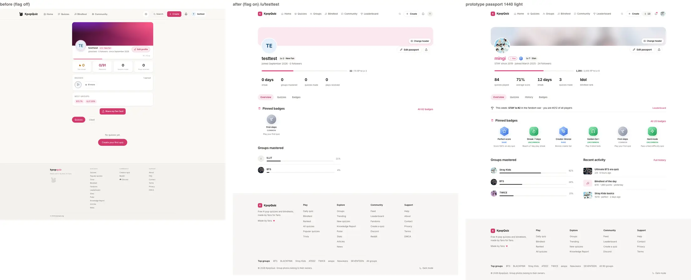 |
| passport 1440 dark | 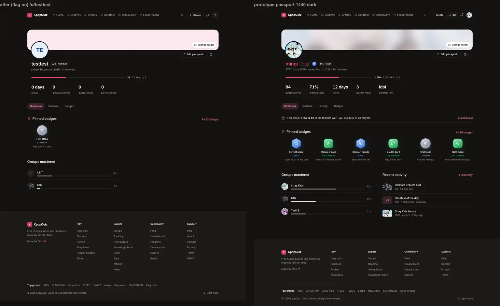 |
| passport 390 light (before / after / prototype) | 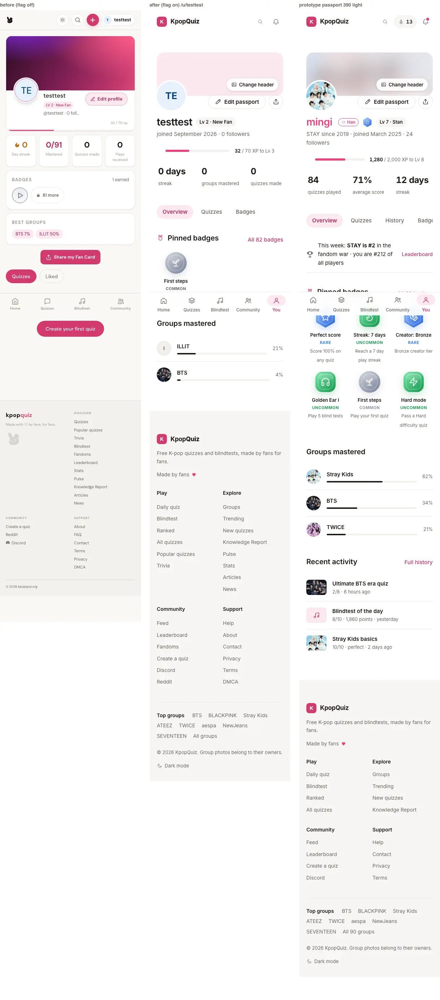 |
| passport 390 dark | 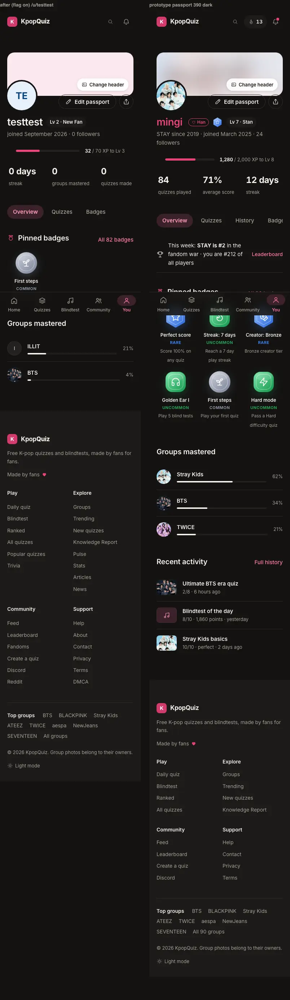 |
| passport-badges 1440 light | 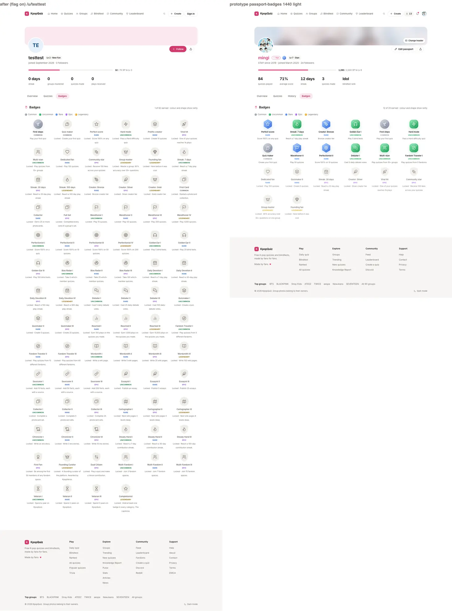 |
| passport-badges 390 dark | 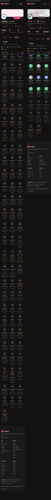 |
| settings 1440 light (before / after / prototype) | 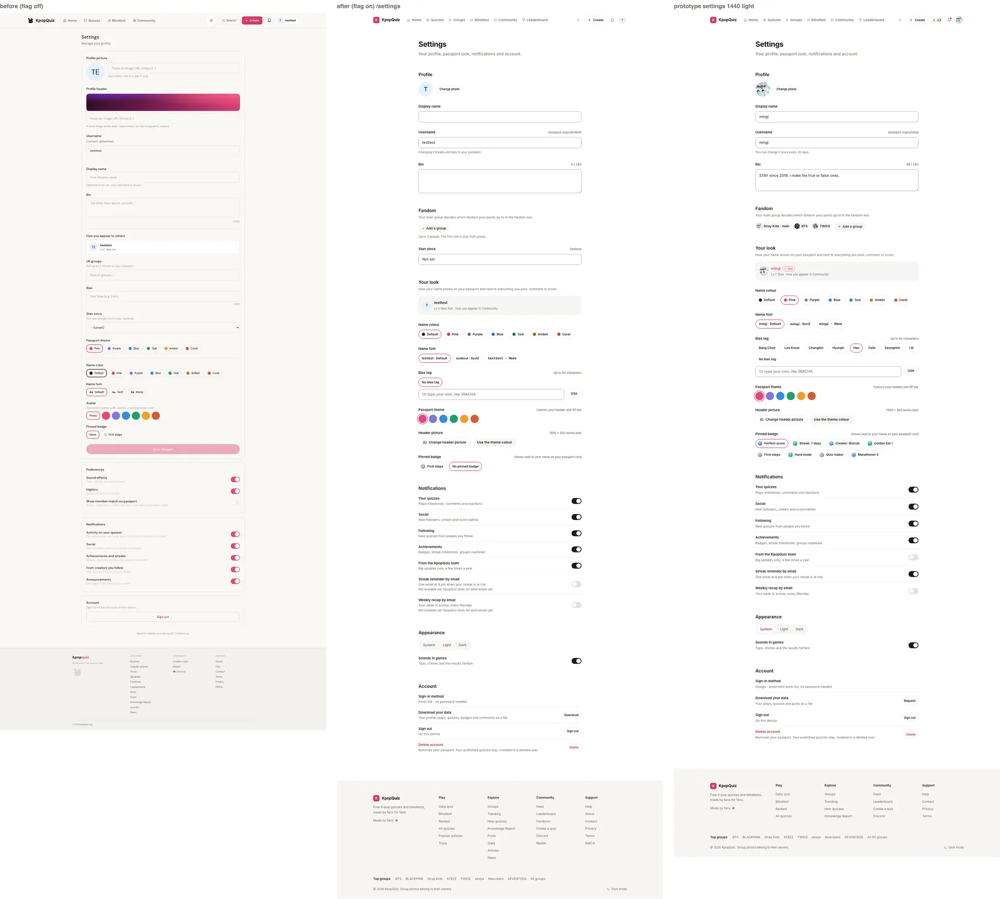 |
| settings 1440 dark | 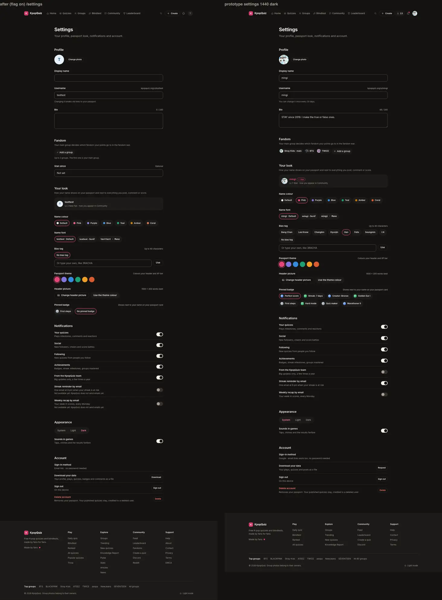 |
| settings 390 light (before / after / prototype) | 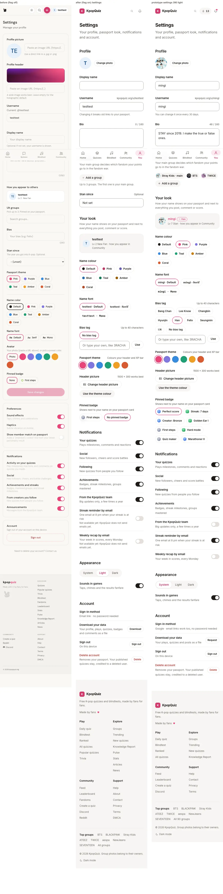 |
| settings 390 dark | 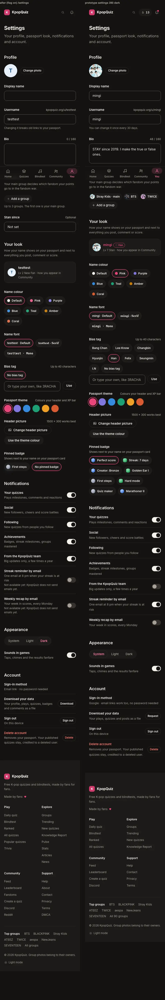 |
| header-sheet 1440 light | 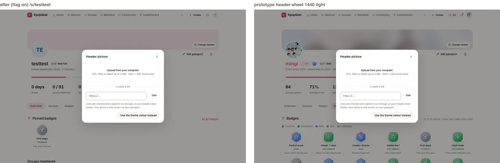 |
| header-sheet 390 dark | 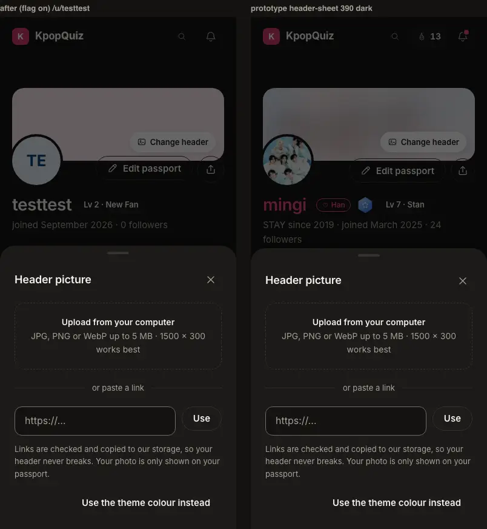 |

The data-dependent parts the test user does not have (bias chip, pinned medallion, war strip, main group band,
three group rows) were checked on a public passport that has them, as a guest, read only: 17 landmarks x 4
(1440 / 390, light / dark) against `proto-styles.json`: 0 mismatches, 0 writes (images not committed: another
fan's page).

## 3. Wiring proof

Every row of WIRING-MAP section 9 (Passport and Settings), the v10 rows (Passport band default, Settings sign
out) and the v11 rows (Change header upload / link, Your look, Badge medallions, Pinned badge, Sheets close).
"e2e" = `e2e/ux-v1/p10.spec.ts` (flag on, dev :3040, guardWrites on every page, payloads asserted on the
stubbed requests); "render" = `passport-render.test.ts`; "unit" = the other vitest files of `lib/ux-v1/p10`.

| Row | Wired to (real) | Proof | Status |
|---|---|---|---|
| Header: theme, avatar, name colour + font, level title, meta | `profiles.profile_theme` (band tint, XP colour), avatar fields, `name_accent` / `name_font` (A0 `ux-acc-*`), `getLevelInfo` + `getTitleForLevel`, `stan_since`, `ult_groups` (fandom name + hub links), `follower_count`, `created_at` | e2e (test user: level chip, meta, XP line regexes, owner and guest), render (flair classes, `<a href="/stray-kids-quiz">STAY</a>`), guest check of a public passport with flair (see 2) | done |
| XP bar | `profiles.xp` through `getLevelInfo` (same numbers as the live passport) | e2e `^[\d,]+ / [\d,]+ XP to Lv \d+$`, unit | done |
| Stats | owner: `quizzes_played`, average of every `plays` row (paginated), `streak_current`, `total_quizzes_created`, `blindtests_played`; public: streak, groups mastered, quizzes made, plays received | e2e (public labels), render (owner labels, values), unit | done (owner live: NOT verified, section 8) |
| Tabs | Overview / Quizzes / History (owner) / Badges, all panels in the HTML | e2e (click, arrows, Home / End, "All N badges" deep link), render (4 tabs owner, 3 public) | done |
| Badge shelf + tiers | `badge_definitions` (names, descriptions, order) + `user_badges` + `badgeRarity()` + A0 `BadgeMedal` | e2e (tile count = definitions, earned count = "N of M", rarity key, dashed locked ring), render, unit | done |
| Recent activity / History | `plays` (published quizzes) + `blind_test_plays`, owner only | render (3 recent, 4 history rows, lines), unit (time ago, lines) | done (live: NOT verified, `/me` only) |
| Settings form (all fields) | `POST /api/auth/update-profile`, changed fields only, legacy shapes | e2e: Your look payload `{ name_accent, name_font, bias, profile_theme }`, photo + groups payload `{ avatar_url, ult_groups }`, pinned badge payload `{ pinned_badge_id }`, zero-diff round trip sends nothing, Discard sends nothing, username check blocks Save; unit (`settings-model`) | done (DB effect: NOT verified, no production write) |
| Notifications | `GET` / `POST /api/notifications/prefs`, changed categories only | e2e payload `{ categories: { social: <toggled> } }`, no update-profile call | done |
| Email on replies / streak / recap | none in the database | 2 switches shown disabled + pending migration | pending (owner) |
| Appearance System / Light / Dark, Sounds | A0 `applyTheme` (html class + localStorage), `lib/sounds` | e2e (html.dark toggles, switch toggles, zero server write) | done |
| Public passport `/u/[username]` | same cookie-free ISR reads + 2 reads flag on | e2e guest + owner, SEO diff, flag-off diff | done |
| Passport band default (v10) | `header_url` https, else main group photo (`public/idols`) blurred over the theme tint, else flat tint | e2e `data-band`, render (3 modes, tints), guest check (group band) | done |
| Settings sign out (v10) | `supabase.auth.signOut()` then `/` (as the live page) | e2e: the `/auth/v1/logout` call is made (stubbed), lands on `/` | done |
| Change header, upload (v11) | `POST /api/profile/header/upload` -> sharp 1500 x 300 WebP -> storage `profile-headers` -> `header_url` | e2e (multipart `file` payload, band switches, toast), unit (file checks, re-encode, EXIF drop, bomb), real route: 503 `bucket_missing` before any write | done in code; real upload NOT verified (bucket) |
| Change header, link (v11) | `POST /api/profile/header/link` -> SSRF-safe fetch -> same pipeline | e2e (`{ url }` payload), unit (SSRF, 70+ cases), real route: 400 `private_address`, 503 `bucket_missing`, 401 signed out | done in code; real fetch NOT verified (bucket) |
| Use the theme colour | `POST /api/auth/update-profile { header_url: null }` | e2e payload | done |
| Your look (v11) | name colour, font, bias (main group members from the public `idols` roster + custom), theme, header, pinned badge | e2e (preview live, payload), render | done |
| Badge medallions (v11.1) | A0 `BadgeMedal` / `MedalTile`, live counts | e2e, render | done |
| Pinned badge next to the name (v11) | `profiles.pinned_badge_id` (only when earned) as a 28px medallion | render (aria-label "Pinned badge: Perfect score"), guest check of a public passport with a pinned badge | done |
| Sheets close X / Escape / backdrop (v11) | A0 `Sheet` | e2e: header sheet, share sheet (three ways + focus return), photo sheet and delete confirm (Escape / buttons, focus return) | done |
| Follow (visitor) | existing `GET` / `POST /api/follow`; guest = A0 sign-in sheet, resumes after sign-in | e2e (guest: sign-in sheet, no write) | done (write: NOT verified) |
| Download your data | `GET /api/ux-v1/p10/export` (own rows, RLS, paginated) | e2e: a real read, the file has the test user's username | done |
| Delete account | no endpoint: confirm sheet, then /contact | e2e (focus, cancel, confirm navigates) | owner decision |

## 4. Tests

Unit + render (vitest, `src/lib/ux-v1/p10`): **158 passed** in 5 files.

- `ssrf.test.ts`: IPv4 special ranges (22 blocked, 9 public), IPv6 (21 blocked incl. mapped / NAT64 / 6to4 /
  Teredo / ULA / link-local / zoned, 3 public), 26 refused link shapes (http, file, javascript, data,
  credentials, ports, localhost / .local / .internal / single label, private IP literals incl. decimal and hex
  forms), the pinned connection, a DNS answer mixing public and private, the socket address re-check, redirects
  (public hop re-checked; to a private IP, the metadata address, a private host, localhost: refused), redirect
  loops, missing Location, Content-Type allow list, declared and streamed size caps, DNS / network errors,
  timeout.
- `header-image.test.ts`: magic bytes, declared type, 0 / 5 MB / over 5 MB, SVG and HTML disguised as PNG, re-encode
  to a 1500 x 300 WebP from JPEG / PNG / WebP, EXIF dropped, GIF and garbage refused, decompression bomb refused.
- `settings-model.test.ts`: zero-diff round trip, change and change back, legacy payload shapes, prefs diff,
  validation mirrors the server.
- `passport-model.test.ts`: tints, band modes, meta segments and links, XP line, owner / public stats, average,
  mastery progress (catch-all groups skipped), badge order, pinned first, earned line, history lines, cssUrl.
- `passport-render.test.ts`: the `/me` and `/u` props rendered server-free (section 8.1 says what it proves).

e2e `e2e/ux-v1/p10.spec.ts` (flag on, dev :3040, Chromium 1234, projects ux-1440 and ux-390, both themes; every
page under `guardWrites`): **84 passed, 0 failed, 0 flaky, 0 skipped** on the final run (42 tests per width,
21 light + 21 dark: ux-1440 in 3.2 min, ux-390 in 3.1 min, plus the setup project).

- Passport, guest (7 x 4): SEO head + no write, `styles.json` and P10 landmarks, tabs (click, arrows, Home / End,
  "All N badges" link, badges tab styles and the 20px key-to-grid gap), quizzes tab, share sheet (three ways
  to close, focus return, copy writes nothing), Follow opens the sign-in sheet, axe + keyboard.
- Passport, owner on `/u/<test user>` (6 x 4): owner controls after hydration only (no hydration error), header
  sheet (styles at rest, focus trap, Escape / backdrop / X, focus return), upload and link payloads on stubs,
  client refusals before any request, the real header routes (400 / 401 / 503, never a write).
- Settings (8 x 4): every section with prototype styles and no save bar at rest, Your look payload
  (changed fields only, legacy shapes), zero-diff round trip and Discard send nothing, radio groups with arrow
  keys, notification prefs payload, profile fields (username check, photo link, groups), appearance and sounds
  stay on the device, account (download is a real read; sign out and delete never write), axe.
- Earlier runs on the busy shared database had retried tests (a click that landed before a lazy island
  hydrated, touch emulation keeping `:hover` on the clicked tab, the sheet moving focus after its transition, a
  read timing out). The spec now waits for React to hydrate the islands, measures at rest with a
  settle-and-retry, and reloads a page whose read timed out; no assertion was relaxed.

Lint: `eslint-config-next` core-web-vitals + typescript on every P10 file: 0 problems. `tsc --noEmit`: 0 errors.
Em / en dash grep on the whole diff: none.

Data guard (read only, `apps/quiz/scripts/data-guard.ts`), 2026-09-26T00:10Z, after every P10 run: profiles 257,
quizzes 434, plays 67,694, quiz_comments 17, quiz_reactions 14, likes 2,833, follows 58, user_badges 1,401,
creator_notifications 1,217, notification_prefs 3, daily_blindtest_scores 84, daily_challenge_plays 0,
blind_test_plays 140, activity_events 7,432, debate_votes 42: every count equal to or above A0's baseline of
2026-09-25T19:17Z (the growth is real players). The test user's own rows, read the same way: `profiles.updated_at`
2026-09-22, `passport_snapshot_at` 2026-09-21, `header_url` null, `pinned_badge_id` null, `user_badges` =
`first_steps` of 2026-09-21 only, 0 `passport_group_snapshots`, no `notification_prefs` row. Unchanged since
before P10 started: no P10 run wrote for the test user.

## 5. Flag off = today's site

Two production builds with the flag OFF (`next build`, no `NEXT_PUBLIC_UX_V1`), from `git archive` exports of
`origin/feat/ux-v1-v11` (dc863a8 + docs) and of this branch's final source (the `src` of ff3e042, byte-equal to
the PR head), served with `next start` on :4101 (base) and :4102 (P10), fetched back to back with A0's
`e2e/ux-v1/helpers/flag-off-diff.mjs --structure` (GET only, as a guest). Exit 0, "all 8 pages identical":

```
IDENTICAL (structure)  /u/testtest       status 200/200  normalised 32612/32612    js chunks 13/13
IDENTICAL (structure)  /u/arianna        status 200/200  normalised 43288/43288    js chunks 13/13
IDENTICAL (structure)  /u/light_a_matz   status 200/200  normalised 100150/100150  js chunks 13/13
IDENTICAL (structure)  /settings         status 307/307  normalised 27/27          js chunks 0/0
IDENTICAL (structure)  /me               status 307/307  normalised 2773/2773      js chunks 10/10
IDENTICAL (structure)  /profile          status 307/307  normalised 2772/2772      js chunks 10/10
IDENTICAL (structure)  /                 status 200/200  normalised 142663/142663  js chunks 13/13
IDENTICAL (structure)  /quizzes          status 200/200  normalised 268532/268532  js chunks 13/13
```

- Byte level: the served HTML differs only in the client module ids and chunk lists of the RSC payload (the
  bundler numbers modules per build), as in A0's proof.
- JS weight flag off (every chunk the HTML references, final build): `/u/<name>` base 750,570 B, P10 751,661 B
  (+1,091 B: the tiny next/dynamic loader of the islands); `/` +14 B. A first build without the loaders showed
  +30,709 B on `/u`: the flag-gated `await import()` of the passport still put its client islands (and the A0
  sheets they use) into the route's chunk graph; `components/profile/ux-v1/islands.tsx` fixed it (A0's shell
  pattern).
- An intermediate P10 build rendered some `/u` entries while Supabase answered slowly
  (`getProfileByUsername timed out after 5000ms - using fallback`): the generic fallback head, on that build
  only (the base build showed the same for an uncached profile at the same time). The final build was served
  warm and every page above matched.
- Flag off (final build): the header routes and the export route answer 404 (checked: `GET` export, guest `POST`
  link and upload); `/api/ux-v1/a0/styles` (and so `p10.css`) is not linked; `/settings` renders the legacy
  page (the v11 settings is a lazy chunk created only when the flag is on).

## 6. SEO

`docs/design/ux-dashboard-v1/v11/reports/P10/seo-diff.mjs` (served HTML, Googlebot user agent, GET only):
flag OFF (base build :4101) vs flag ON (this branch, dev :3040). Output: `v11/reports/P10/seo-diff.txt`
(re-run on the final code: exit 0, output unchanged).

| Page | title | description | robots | canonical | og / twitter | JSON-LD | H1 | page content links |
|---|---|---|---|---|---|---|---|---|
| /u/testtest (noindex, the test user) | same | same | same | same | same | same | same | 0 removed, +2 (group hubs) |
| /u/arianna (noindex, 2 quizzes) | same | same | same | same | same | same | same | 0 removed, +2 |
| /u/light_a_matz (indexable, 37 quizzes) | same | same | same | same | same | same | same | 0 removed, +3 |

- Content links: the served HTML parsed with scripts off, links inside the passport (v11 `.p10-passport`, legacy
  passport column). Every legacy link is kept (quiz pages, the fan's group hubs); the additions are group hubs of
  Groups mastered and /leaderboard (war strip). Shell links (nav, tab bar, footer) are A0's scope; the only
  shell link missing flag on is the legacy nav's `/search` (A0's search is a button).
- Server rendering: the passport, every tab panel and every link are in the served HTML (the inactive panels are
  `hidden`, not fetched on click); the page stays cookie-free ISR (`revalidate = 3600`, same
  `generateStaticParams`).
- No `/pt` mirror exists for `/u`, `/me` or `/settings`.

## 7. Pending migrations (owner-run, not applied)

- `docs/pending-migrations/v11-p10-header-storage.sql`: public `profile-headers` bucket, WebP only, 1 MB, and NO
  policy on `storage.objects` (public URLs need none; uploads and deletes use the service role; no listing of user
  ids). Until it runs, both header routes answer 503 before any write and the sheet shows the message.
  Alternative without DDL: point `HEADER_BUCKET` at the existing public `avatars` bucket (migration 103).
- `docs/pending-migrations/v11-p10-email-prefs.sql`: `notification_prefs.email_streak_reminder` and
  `email_weekly_recap`, opt-in (default false). The switches stay disabled until this runs AND
  `/api/notifications/prefs` accepts the keys AND a sender exists (owner decision: provider, domain, unsubscribe).

## 8. Owner decisions and what is NOT verified

Owner decisions:

1. Production writes (the ORCH question). Until answered: signed-in `/me` and `/profile` were NEVER loaded (they
   grant badge tiers and write passport snapshots). **`/me` flag on is NOT verified live (owner decision
   pending)**: it is covered by the server-free render test (`passport-render.test.ts`: the same shapes the page
   builds, both modes) and by the unchanged legacy call sequence; hydration and CSS of the personal-only parts
   (History tab, Recent activity, average score, the owner stats row) are only seen through that test and
   through `/u/<test user>` for the shared parts.
2. Header storage: run `v11-p10-header-storage.sql` (or pick the `avatars` bucket). **Real uploads / links are NOT
   verified** (routes answer 503 before any write; payloads verified on stubs; the SSRF guard and the file checks
   are unit-tested).
3. Email switches: a sender, a provider and `v11-p10-email-prefs.sql` (switches disabled until then).
4. "Use the theme colour": today it clears `header_url`, so the band falls back to the default (main group photo
   over the tint, flat tint when there is no main group photo). A permanent "flat" choice needs a column
   (e.g. `profiles.header_mode`); not added.
5. Delete account: there is no delete endpoint; the confirm sheet sends the fan to /contact (the live page says
   "Contact us"). A real deletion flow is a product and legal decision.

Also NOT verified: Settings saves against the database (the payloads are asserted, the effect in `profiles` is
not, no production write); the Follow write (stubbed); Sign out (the `logout` call is stubbed, so the real
session is untouched); the pinned medallion, bias chip, war strip and Recent activity on a live page (the test
user has none of them; render test + a guest look at a public passport that has them).

## 9. Open items and deviations

- Stats: "blindtest rank" of the prototype has no live source (`bt_players` is never written, WIRING-MAP), so
  the owner row shows "blindtests played" (real counter). Public row = streak, groups mastered, quizzes made, plays
  received (the public page's former set; no play counts or average in public: privacy fail-closed).
- War strip: "you are #212 of all players" is omitted (no cheap real source); the fandom part is real.
- History / Recent activity are owner only (privacy fail-closed), built from `plays` + `blind_test_plays`.
- Groups mastered: progress = min(1, plays / 30) x min(1, accuracy / 0.8), 100 only when mastered (lib/passport
  MASTERY); the live page shows accuracy per group.
- The bio is shown under the meta line (the prototype does not show it on the passport; kept for the public page's
  text and SEO). The Liked tab and the Verse cards of the legacy passport are not in the v11 passport (the
  prototype has Overview / Quizzes / History / Badges); flag off keeps them.
- Settings: "You can change it once every 30 days" is not a real rule, so the username help says "Changing it
  breaks old links to your passport." "Download your data" downloads the JSON at once (label Download, not
  Request). Stan since is kept in Fandom (it feeds the meta line). Haptics and the member-match flair switches of
  the legacy page are not in the v11 settings (not in the prototype; flag off keeps them).
- The prototype's locked medal tiles are dimmed (opacity .85); A0 keeps them at 1 for AA contrast (A0 decision 4).
- Dev-only noise: A0's lazily imported Supabase chunk answers 404 on the dev server (every page, not P10).

## 10. Requests to A0

- `v11/requests/P10.md` #1: the selected tab turns ink on hover (`.ux-utabs > button:hover` outranks
  `[aria-selected="true"]`); the prototype keeps pink-soft-ink. The spec measures with the pointer moved away.
