# P11 Notifications + search + bell report (UX v11.2)

## Progress

- Done (branch `ux11/p11-notifications`, merged with `origin/feat/ux-v1-v11` 89e1e94 = A0's queue PR #50):
  /notifications v11 page (flag on) on the live center's own calls; `BellPanel` and `SearchResults` with exactly
  the slot props; new read-only `GET /api/ux-v1/p11/search`; `p11.css`; prototype style + box capture
  (`P11/proto-styles.json`); 31 unit tests; `e2e/ux-v1/p11.spec.ts` (21 cases per width) green at 1440 and 390,
  light and dark, on the flag-on dev server with the A0 slot swap applied LOCALLY (never committed); lint + tsc
  clean; report images; request file `v11/requests/P11.md`.
- Next: see the Progress lines at the end of section 4 (flag-off diff and SEO diff runs), then the PR.
- Blockers: none. The bell and overlay content go live when A0 swaps the two slot exports (request 1, after this
  PR merges) and adds Mark all read to the bell header (request 2).

## 1. What I built

| Area | Where |
|---|---|
| /notifications route: flag off = the live center, unchanged; flag on = `UxPage` 720 + the v11 page in a lazily loaded chunk | `app/(site)/notifications/page.tsx` |
| Notifications page (client): header (H1, "4 unread", Mark all read), filters, pinned streak row, Today / Yesterday / Earlier rows, row menu, Load more, retention line | `components/notifications/ux-v1/notifications-page.tsx` |
| Bell panel slot `BellPanel({ unread, onClose })`: the latest 6 | `components/notifications/ux-v1/bell-panel.tsx` |
| Search overlay slot `SearchResults({ query, onNavigate })`: popular lists, groups / quizzes / songs, no-results, keyboard | `components/search/ux-v1/search-results.tsx` |
| The live center's calls, shared by page and panel (same endpoints, methods and bodies) + page / bell sync | `lib/ux-v1/p11/actions.ts` |
| Pure view model: categories, icons, targets (safe sink), day groups, ages, streak row | `lib/ux-v1/p11/notifications.ts` |
| Pure search model: query normalisation, LIKE safety, relevance, merges, labels | `lib/ux-v1/p11/search-model.ts` |
| Search reads (cookie-free public reads, P3's cached group index, `songs`) | `lib/ux-v1/p11/search.ts` |
| NEW endpoint `GET /api/ux-v1/p11/search?q=` (404 flag off, read only, no user field) | `app/api/ux-v1/p11/search/route.ts` |
| Styles (not imported; served by A0's route to flag-on pages only) | `styles/ux-v1/p11.css` |
| Unit tests (31) | `lib/ux-v1/p11/p11.test.ts` |
| e2e (21 cases x 2 widths, light + dark inside) | `e2e/ux-v1/p11.spec.ts` |
| Prototype capture, report images, SEO + link-set diff | `v11/reports/P11/{capture-proto-styles,make-shots,seo-diff}.mjs`, `proto-styles.json` |

### Notifications page (prototype view `#notifs`, state `notifications`; DESIGN-SPEC 15.2, 16.7, 17.1)

- Reads exactly what the live center reads: `GET /api/notifications?limit=50` (then `&offset=N` for Load more);
  writes exactly what it writes: `POST /api/notifications/mark-read` `{}` (Mark all read) or `{ ids: [id] }`
  (opening a row, or Mark as read), `DELETE /api/notifications` `{ id }` (Dismiss), `POST /api/notifications/prefs`
  `{ muteQuiz }` (Mute this quiz); the unread count lives in the same shared store the nav bell reads
  (`lib/notifications-store.ts`), so the bell dot, the panel and the page agree at once.
- Header: H1 "Notifications", "N unread" / "All caught up" (the server's unread count), "Mark all read" (only
  while something is unread; toast "All marked as read").
- Filters: A0 `Segmented` (aria-pressed) All / Your quizzes / Social / Achievements, client side on the live
  categories of `lib/notification-types.ts` (Following and Announcements rows are listed under All).
- Pinned streak row (A0 `streakView` of `/api/auth/me`): at risk = flame + "Your 12-day streak ends in 5h 12m" +
  "Play the daily quiz or the daily blindtest to keep it." + "Play today's daily" (`/daily`); saved = check +
  "Streak saved: 13 days" + "Come back tomorrow to make it 14."; no live streak = no row.
- Rows (prototype `.nrow`): unread dot, neutral 40px icon disc (icon per type), title (bold when unread), body,
  age ("2h", "1d", "1w"; spoken "2 hours ago"), grouped Today / Yesterday / Earlier by the viewer's day. The whole
  row is the link to its target (the live card's rule: `link_url`, else `/q/<slug>`; only a same-site path or an
  http(s) URL becomes a link; external targets open a new tab) and opening it marks it read. A row without a
  target is a button that marks it read while unread.
- Row menu (not in the prototype; the live center's Dismiss and Mute kept): a dots button under the age, shown
  on hover / focus with a mouse and always (quiet) on touch; A0 `UxPopover` menu (Mark as read, Mute this quiz,
  Dismiss); focus moves to the next row after a row leaves.
- Load more (the live center's control), empty state "Nothing here yet / New activity shows up here.", read error
  state with Try again, footer "Read notifications older than 60 days are cleared. Notification settings"
  (`/settings`).

### Bell panel (prototype `#bellpop`, state `bell`; 16.5)

- `GET /api/notifications?limit=6` when the panel opens (the last answer shows at once on reopen), again when
  the unread count grows while it is open; rows = unread dot + title (bold when unread) + "2h ago"; opening a row
  marks it read and closes the panel (focus back on the bell); a row without a target opens /notifications.
  Empty: "Nothing here yet. New activity shows up here." A0 keeps the frame, the header and "See all notifications".

### Search overlay results (prototype `searchFilter()`, state `search`; 16.5, 17.1)

- Before typing: "Popular groups" (4 visible groups with the most PUBLISHED quizzes, the catch-all excluded) and
  "Most played quizzes" (3), cached 10 minutes (today: Stray Kids 28, BTS 27, BLACKPINK 24, ATEEZ 20, as the
  prototype sample).
- Typing (debounced 140 ms, aborts older requests, session cache): "Groups" (up to 4, "28 quizzes" / "No quiz
  yet", link `/<slug>-quiz`), "Quizzes" (up to 5: title matches and the quizzes of the matched groups, "BTS ·
  2.4k plays" / "New", link `/q/<slug>`), "Songs in the blindtest" (up to 3 active songs of the `songs` table the
  game plays, title or artist, link `/blindtest/group-<slug>` when that playlist exists, else `/blindtest`), or
  `No results for "zzzz"` / "Try a group name, like Stray Kids, or a song title."
- Relevance (beyond the prototype's count / plays sort): the same name first (ignoring case, spaces, punctuation:
  "gidle" = (G)I-DLE, "straykids" = Stray Kids), then a word that starts with the query, then contains; songs by
  the artist typed come before a title that mentions it ("bts" = BTS songs before "feat. Jimin of BTS").
- Keyboard: the first row is highlighted; Enter opens the highlighted row (WIRING-MAP v10 "Enter opens first");
  ArrowDown moves into the rows, arrows / Home / End move between rows, ArrowUp from the first row goes back to
  the field; with no row, Enter is left to A0's host (full `/search?q=` page). A polite status says
  "1 group, 5 quizzes and 3 songs". Thumbs: group photo (`public/idols`, next/image 36px) or initials; a quiz
  cover when its host is configured, else the group photo; songs = the pink-soft music tile.

## 2. Screenshots (implementation | prototype reference)

The notifications page and the bell are shot with the prototype's ten sample rows served by a STUB of
`GET /api/notifications` inside the test browser only (the test user has no notification, see 4.6) and the clock
fixed; the search overlay shows the real catalog. `make-shots.mjs` answers every mutating request locally and
fails on any.

| State | 1440 light | 1440 dark | 390 light | 390 dark |
|---|---|---|---|---|
| notifications | 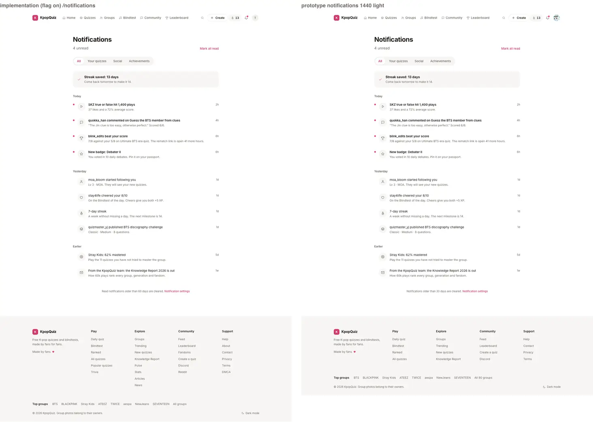 | 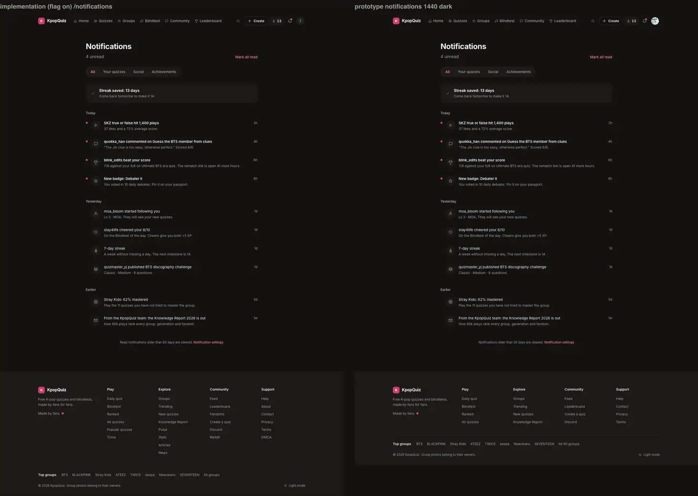 | 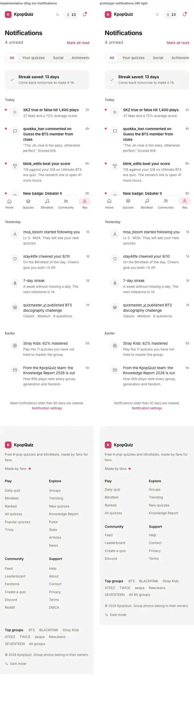 | 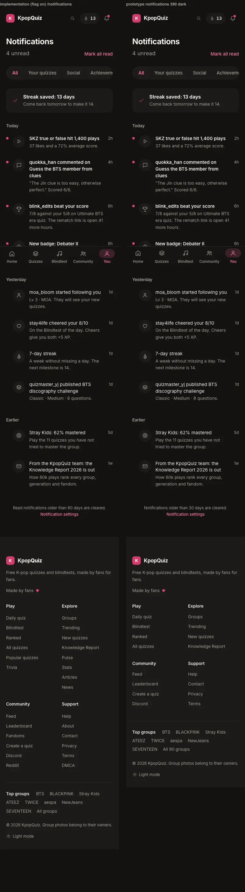 |
| bell | 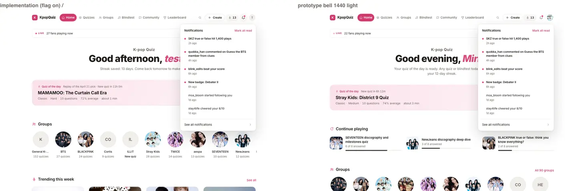 | 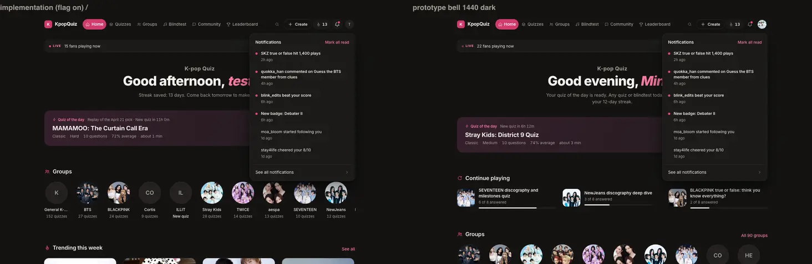 | 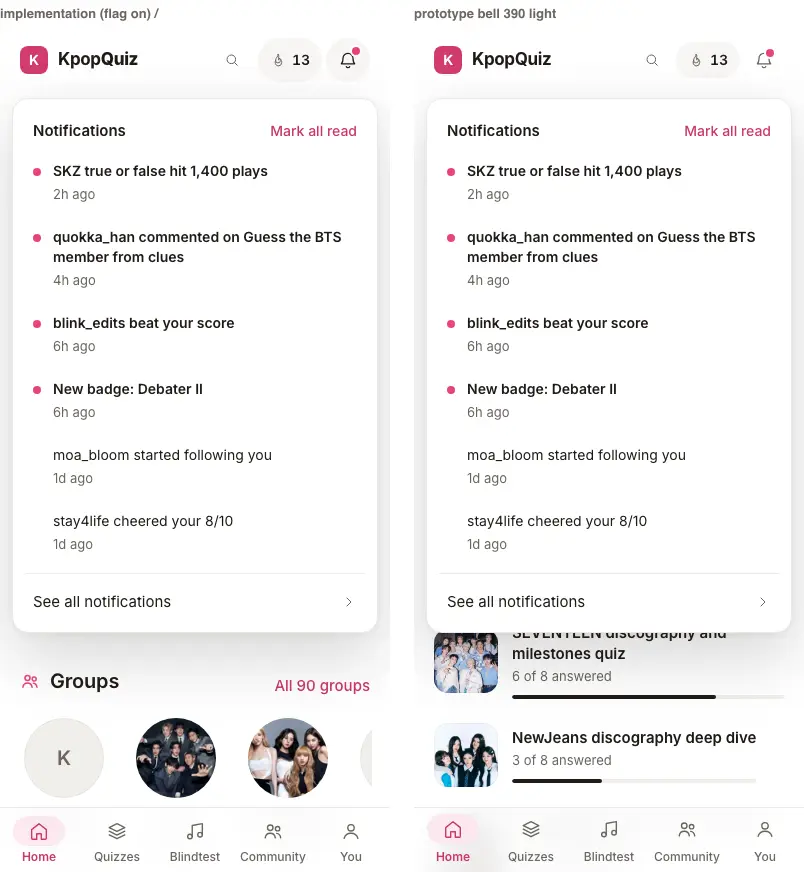 | 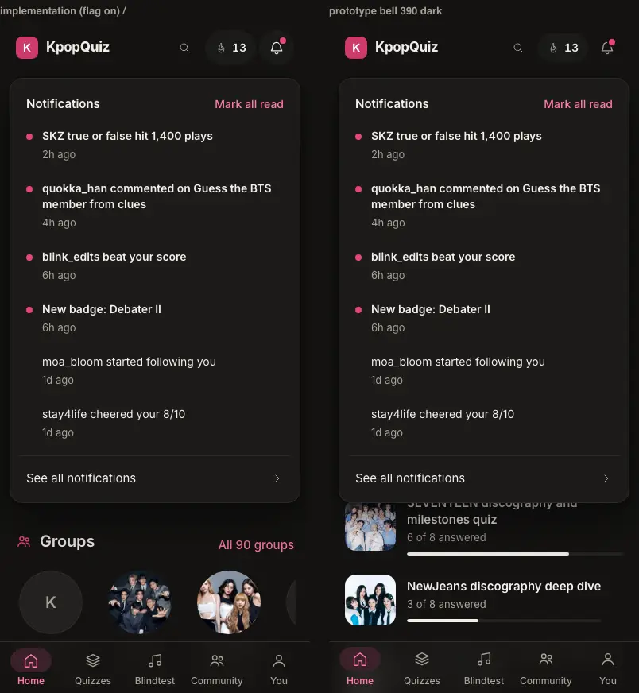 |
| search | 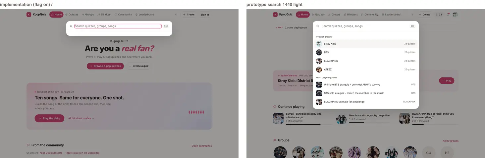 | 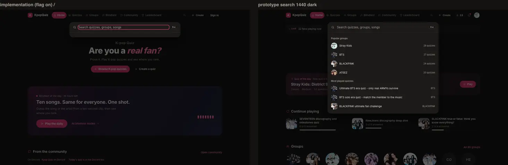 | 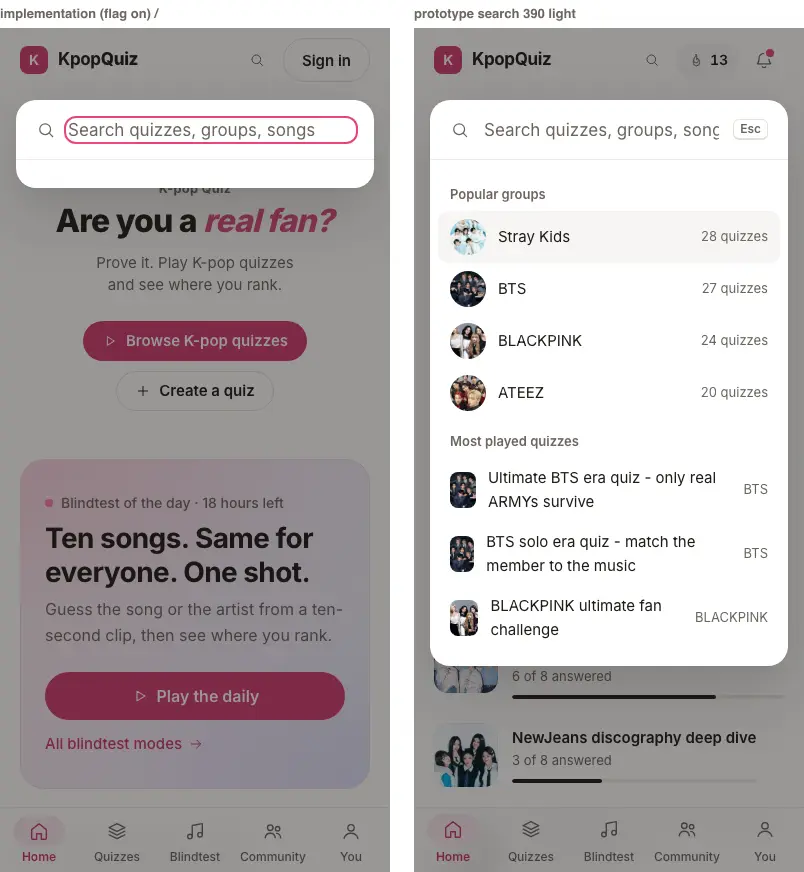 | 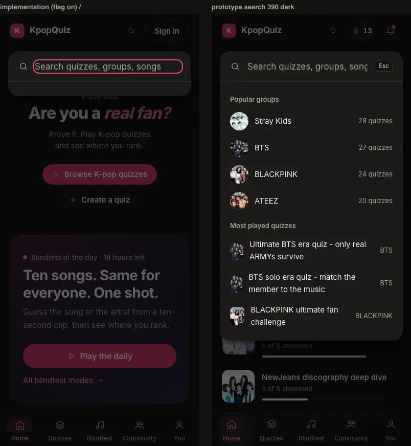 |

## 3. Prototype match (C1 criteria)

`capture-prototype.mjs`'s `styles.json` only holds `.nav` for `notifications` and the home landmarks under the
two overlays, so P11 measured the prototype itself: `P11/capture-proto-styles.mjs` writes `P11/proto-styles.json`
(computed styles + box of every notification row part, the bell rows, the search rows and the empty state; states
`notifications` = streak saved as in the reference PNG, `notifications-risk`, `bell`, `search`, `search-bts`,
`search-none`; 1440 / 390, light / dark). `p11.spec.ts` compares, per state, width and theme:

- computed styles (paddings, margins, border, radius, background, colour, font size / weight / line height /
  letter spacing, shadow, gap, text-align, white-space, display): exact (0.6px rounding);
- boxes (x, y, width, height): within 2px (C1 criterion), page and overlay coordinates.

Result: 0 mismatches on 26 landmarks of the page (+2 in the at-risk variant), 12 (+1 once A0's Mark all read is in
the header) of the bell, 6 + 4 + 2 of the overlay, at 1440 and 390, light and dark. Documented skips: the
retention line is longer (it states the real rule, section 9.1) so its margin and width are not compared; the
search sub line is `white-space: nowrap` (keeps "BTS · 2.4k plays" on one line; the prototype's short subs render
the same); A0's bell header has `gap: 12px` (no effect with space-between). The prototype squeezes a quiz thumb to
26px wide when a title wraps at 390 (no `flex: none` on `.th`); A0's `.ux-srow-th` keeps it 36px, so rows whose
text differs from the sample are not box-compared.

## 4. Proofs

### 4.1 e2e (`e2e/ux-v1/p11.spec.ts`, 21 cases per width, light and dark inside)

Run against the flag-on dev server :3041 with A0's slot swap and bell header applied LOCALLY (request items 1-2,
never committed), Chromium 1234 (UX11_CHROMIUM), after the merge of `origin/feat/ux-v1-v11` 89e1e94:

```
final full run: 42 passed, 1 flaky (43 = setup + 21 cases x 2 widths; light and dark run inside each case)
  the flaky case: a DEGRADED search answer on the first attempt (one read timed out under load; the overlay
  showed its "Some results could not be loaded." note above the rows); the note now goes below the rows
overlay cases re-run with --retries=0 after that change: 17 passed (setup + 8 x 2 widths)
```
Full list: `P11/proofs/e2e.txt`.

Guest: /notifications still redirects to /login; the search endpoint (flag gated: 404 off; payload keys, hrefs,
no user field); overlay popular lists + styles + axe; typing "bts" (groups, quizzes of the group, songs, status
line), arrows, Enter opens the highlighted row; no results + Enter to /search; click closes, Escape returns focus.
Signed in (read only): the test user's real notifications; stubbed rows: layout + styles + axe + overflow (streak
saved), at risk, no streak; one walk through every control with the payloads asserted on stubs (filters, open =
`{ ids: [id] }`, row menu keyboard + Escape, Mark as read, Mute `{ muteQuiz }`, Dismiss `{ id }` + focus to the next
row, Mark all read `{}` + toast, Load more `offset`); bell latest 6 + styles + axe, open a row = `{ ids: [id] }` +
panel closes + focus back + count drops, reopen, Escape; bell Mark all read `{}` (A0 request 2).
Without the swap (integration branch as it is), the bell and overlay cases skip with the request as the reason.

### 4.2 Flag off = today's site (`P11/proofs/flag-off.txt`)

`origin/feat/ux-v1-v11` 89e1e94 vs this branch's code, both `next build` flag OFF, `next start`, A0's
`flag-off-diff.mjs --structure`: `/`, `/notifications` (guest 307 -> /login), `/search`, `/search?q=bts`,
`/search?q=zzzzqx`, `/login`, `/quizzes`, `/bts-quiz`: IDENTICAL (structure), same JS chunk counts, same raw sizes
(except `/` 228,435 / 228,504 B: client module ids); signed in, `/notifications` with the test user's cookies:
IDENTICAL (structure), status 200 both. The v11 notifications page is a lazily loaded chunk behind the build-time
flag (`UX_V1 ? dynamic(...) : null`, the P10 pattern), so flag-off pages carry none of it.

### 4.3 SEO + link set (`P11/proofs/seo-diff.txt`, `P11/seo-diff.mjs`)

Same commit, flag OFF (:4112) vs flag ON (:4113), served HTML: `/search`, `/search?q=bts`, `/search?q=zzzzqx`,
`/notifications` as a guest and signed in. Title, meta description, robots (`/search` "noindex, follow",
`/notifications` "noindex, nofollow"), canonical, hreflang, og / twitter, JSON-LD, H1: all the same. Link set: 0
lost on every URL; added = A0's shell links (+ `/settings` on /notifications, the retention line):

| URL | flag off links | flag on links | lost |
|---|---:|---:|---:|
| /search | 20 | 35 | 0 |
| /search?q=bts | 36 | 51 | 0 |
| /search?q=zzzzqx | 26 | 41 | 0 |
| /notifications (guest, 307) | 0 | 0 | 0 |
| /notifications (signed in) | 20 | 36 | 0 |

### 4.4 Unit, types, lint

- `vitest run src/lib/ux-v1/p11`: 31 passed (categories, icons for every live type, targets incl. javascript: /
  data: / protocol-relative rejected, day groups, ages, streak row, sync reducers, query normalisation, LIKE
  safety, relevance, merges, labels). `vitest run src/lib/ux-v1` after the merge: 11 files, 310 passed.
- `tsc --noEmit`: 0 errors. eslint-config-next (core-web-vitals + typescript) on every P11 file: 0 problems.
- No em / en dash in P11 paths. No new dependency. No pending migration.

### 4.5 Search endpoint (dev server, real catalog)

`GET /api/ux-v1/p11/search`: popular = Stray Kids 28, BTS 27, BLACKPINK 24, ATEEZ 20 (published counts) + the 3
most played quizzes; `?q=bts` = BTS, 5 BTS quizzes by plays, 3 BTS songs to `/blindtest/group-bts`; `?q=ive` = IVE
and its quizzes before titles that only contain "ive"; `?q=nct` = NCT, NCT 127, NCT DREAM (No quiz yet); `?q=zzzz`
= nothing; Korean, quotes, `%`, `*`, `\`, `,()` handled (no error, no wildcard). 100-400 ms warm on the dev
server; a good answer is `Cache-Control: public, s-maxage=120, stale-while-revalidate=600`, a degraded one
`no-store`. Flag off: 404.

### 4.6 Data safety (`P11/proofs/data-safety.txt`)

The test user's notification rows, prefs and profile are unchanged before / after every run (0 notifications, no
prefs row, profile updated 2026-09-22); every write of the specs and scripts was answered locally. Data guard run
attached (two counts went down since A0's snapshot because of the live site's own 03:30 / 04:00 UTC prune crons,
explained in the file).

## 5. Wiring proof (WIRING-MAP section 11 + v10 Shell rows, corrected by WIRING-MAP.verified)

| Row | Implementation | Evidence |
|---|---|---|
| List grouped by day, unread state | `GET /api/notifications?limit=50` (the live center's call), Today / Yesterday / Earlier by the viewer's day | e2e real data (GET recorded) + stubbed layout |
| Tabs = categories | All / Your quizzes / Social / Achievements on `NOTIFICATION_CATEGORIES` | e2e filters, unit categories |
| Row icon per type | `iconOf()` for the 12 live types | unit |
| Row link (`quiz_slug`, `link_url`) | `targetOf()`, the live card's rule, safe at the sink | unit + e2e hrefs |
| Mark all read | `POST /api/notifications/mark-read` `{}` | e2e payload (page and bell) |
| Per-row read on click | same endpoint `{ ids: [id] }` | e2e payload (page and bell) |
| Dismiss / Mute (live center) | `DELETE /api/notifications` `{ id }`, `POST /api/notifications/prefs` `{ muteQuiz }` | e2e payloads |
| Load more (live center) | `GET ...&offset=N` | e2e |
| Category toggles | on /settings (P10) as the v11 prototype has them; "Notification settings" links there | e2e href |
| Streak at risk card | A0 `streakView()` of `/api/auth/me` (saved / at risk / none) | e2e three states |
| Weekly recap email toggle | P10's settings (disabled until its migration); not on the v11 notifications page | n/a |
| Unread badge in topbar | shared store: page and panel update A0's bell at once | e2e ("Notifications, 4 unread" -> 3) |
| `battle_beaten` type | trophy row (the type only arrives once pending migration 154 is applied) | unit |
| Bell: latest 6, Mark all read, See all | `GET ...?limit=6`; Mark all read in A0's header (request 2); See all = A0's link | e2e |
| Search overlay: groups, quizzes incl. matched groups, songs, no results, Enter opens first | `GET /api/ux-v1/p11/search` | e2e + 4.5 |

Privacy: the search endpoint returns catalog data only (no user field, no cookie read); the notifications endpoints
are the live ones, unchanged (the caller's own rows only, RLS + `.eq('user_id', user.id)`).

## 6. Not verified, and why

- The bell and overlay content in the real shell: they need A0's swap (request 1), which can only land after this
  PR (the files must exist). Verified with the swap applied locally; on the integration branch those e2e cases
  skip with that reason until A0's commit.
- Populated notification states with REAL rows: the test user has none (section 4.6), and nothing may write a
  notification for it. Rendering was verified on the prototype's sample rows served by a stub in the test browser.
- Real mark-read / dismiss / mute effects in the database: never performed (ORCH rule until the owner answers
  decision 1); proven by request shape (payloads identical to the live center's) on stubs.
- Signed-in e2e on a production build or a Vercel preview: run on the flag-on dev server (the flag-on production
  build has no swap, so it would only exercise the page); C3 re-runs on the preview.

## 7. Open items

- `/search` (P11 path) stays the live page inside the v11 shell (no prototype state). A v11 skin can follow; its
  server HTML must keep every live link (`/q/...`, `/verse/<slug>`, `/quizzes?group=<slug>`, `/u/<user>`).
- A0 FYI (request 5): the overlay field shows the global focus ring and Chromium's native clear button.
- Dev server only: Turbopack 404s a lazily loaded chunk of `lib/supabase/client.ts` from this worktree
  (`0ev4_worktrees_agent-..._client_ts_...js`, workspace-root inference over the worktree); not seen on
  `next build` / `next start`.

## 8. Requests to A0 (`v11/requests/P11.md`)

1. Swap the two slot exports to P11's components (merge after this PR).
2. "Mark all read" in the bell header, calling P11's `markAllRead()` (+ toast "All marked as read").
3. FYI: P11's results take Enter while a row is highlighted; the host's submit still runs otherwise.
4. Copy: the streak popover says any quiz counts; the backend counts the daily quiz / daily blindtest only.
5. FYI: overlay field focus ring and native search clear button (not in the prototype).

## 9. Owner decisions

1. Retention line: the prototype says "Notifications older than 30 days are cleared"; the live rule
   (`/api/cron/notification-prune`) deletes READ notifications older than 60 days (unread never), so the page says
   "Read notifications older than 60 days are cleared."
2. Streak row copy: "Play the daily quiz or the daily blindtest to keep it." (the real rule) instead of the
   prototype's "Play one quiz or the daily blindtest" (ties to RUN-STATE decision 12).
3. Dismiss and Mute this quiz (live center features, not drawn in the prototype) are kept in a row menu that
   only shows on hover / focus with a mouse (always, quietly, on touch). Say if they should go.
4. Four filters as the prototype and 16.7 (15.2 had five category tabs): Following and Announcements rows are in
   All only.
5. Search ranking goes beyond the prototype's count / plays sort: closest name first (exact, word start,
   contains), artist before title for songs.
6. A song row opens `/blindtest/group-<slug>` (the live playlist page, today's hub links) when the group has a
   playlist, else `/blindtest`. Those mode pages currently fail on Play (the production bug P6 reported); when it
   is fixed or the hub gets a `?playlist=` deep link, the href can move.
7. General K-pop (the catch-all) is listed in query results, not in Popular groups (prototype rule).

Pending migrations: none.
