# P2 Quizzes report (UX v11.2)

## Progress

- Done (round 2, 2026-09-27, P2 respawned fresh on the local branch): A0's `Segmented` / `UxDropdown` href
  options replace P2's copy of the link-option rule (74ad851; P2SortNav, P2Menu and the `.p2-sort > a` CSS are
  gone); pixel pass on state `quizzes` vs the live prototype at 1440 and 390, light and dark, one commit per fix
  (4af10de breadcrumb spacing, a76e57c menu item gap, d667f43 FAQ in the prototype's accordion, cb4a7a3 menu
  placement); the grid shift of the SEO-locked header measured and written as owner decisions A and B (section
  7.3); A0 request 4 (bfbbdc4); p2.spec 27/27 at both widths and themes, SEO + link-set diff on 11 URLs with
  0 links lost (b5fdf0a); measure scripts, per-state diffs and new screenshots (b4c44b4); this report.
- Done (round 1): flag-on /quizzes (sort, Type / Level / Group menus with real counts, removable chips, A0's
  grid, empty states, real `?page=N` pagination with an in-place Load more), load-more endpoint (404 flag off),
  flag-off /quizzes identical and shipping no P2 code, 20 unit tests, e2e spec, screenshots, requests 1 to 3.
- Next: the owner publishes `ux11/p2-quizzes` (push + PR into `feat/ux-v1-v11`); owner decisions A and B
  (7.3); A0: requests/P2.md item 4 (the only filtered-state deviation). The integration branch moved on by
  docs only (f366cb4, ORCH run state and the X1 audit); the branch merges with it cleanly (`git merge-tree`).
- Blockers: `git push` and therefore the PR are NOT done. The branch is LOCAL: the permission check refused
  P2's push and ORCH's push. Every commit is on `ux11/p2-quizzes` in this worktree; the owner publishes it
  (`gh pr create --base feat/ux-v1-v11`).

## 1. What I built

| Area | Where |
|---|---|
| Flag branch: `page.tsx` imports the v11 render behind the env test written out, so the bundler drops it flag off (no P2 byte in flag-off /quizzes); `generateMetadata` unchanged except `?level=` counts as a facet flag on only | `app/(site)/quizzes/page.tsx` |
| One source for the FAQ (visible answers + FAQPage JSON-LD text), used by both renders | `app/(site)/quizzes/faq.tsx` |
| v11 render (server): reads, parsing, counts, chips, empty states, the three JSON-LD objects exactly as the live page builds them | `app/(site)/quizzes/ux-page.tsx` |
| Page markup (server): breadcrumb, header (H1 + intro, "Create a quiz" on phones), controls, chips row, grid, browse links, FAQ | `components/quizzes/ux-v1/quizzes-page.tsx` |
| Client islands, code-split (`next/dynamic`): navigation context (soft navigation in a transition, busy grid, live-region summary, focus by selector), the controls row `P2Controls` (A0 `Segmented` + three A0 `UxDropdown` with href options and counts, the page router passed as `onNavigate`, menus placed as the prototype's `ddOpen`), chips, Clear filters, result grid + Load more + pager | `components/quizzes/ux-v1/{islands,nav-context,controls,results}.tsx` |
| URL contract, facet counts, Level ordering, cumulative pages (pure, unit tested) | `lib/ux-v1/p2/filters.ts`, `filters.test.ts` |
| Reads: the live browse query for every view the live page can show, cached facet rows of all published quizzes (same inner joins, `fetchAllRows`), Level pages by id | `lib/ux-v1/p2/queries.ts` |
| `GET /api/ux-v1/p2/quizzes?<page params>`: one page, card fields only, read only, 404 flag off | `app/api/ux-v1/p2/quizzes/route.ts` |
| Stylesheet (never imported; A0's flag-on route serves it) | `styles/ux-v1/p2.css` |
| e2e + proof scripts | `e2e/ux-v1/p2.spec.ts`, `v11/reports/P2/{seo-diff,flagoff-capture,dev-norm}.mjs` |

No new dependency, no migration, no new page route (the endpoint is under the allowlisted `/api/`).

### How it behaves

- Every sort, filter, chip and page control is a real `<a href>` (works before hydration and without JS, opens
  in a new tab, crawlable). Once hydrated, a plain click is a soft navigation in a transition: the server renders
  the filtered page (real server filtering and counts), the grid stays and is `aria-busy`, the polite live region
  says "65 quizzes", focus stays on the control (menus return it to their trigger; removing a chip moves it to
  that filter's trigger; Clear filters to Type).
- Menus list only options that give results with the other filters applied, each with its real count
  (published quizzes; never the stale `groups.quiz_count`, 16.10). Group: most quizzes first, the catch-all
  "General K-pop" last; the menu is right-aligned so it stays inside a 390 screen.
- `/quizzes?page=N` shows pages 1..N: the state "Load more quizzes" reaches after N-1 clicks. Load more is the
  real `?page=N+1` link (rel=next); hydrated, it appends the next 48 in place from the endpoint, updates the
  address to `?page=N+1` (a reload renders the same list), focuses the first new card and announces it. From
  page 2 on, "Page 2 of 9" + "Previous page" (rel=prev). A page past the end shows page 1 and says so.
- Empty states: "No quizzes match these filters / Try another level or group." + Clear filters (prototype);
  a group without any quiz: "No {Group} quizzes yet" + Make the first quiz (/create) + Clear filters; a read that
  fails or times out: "Quizzes did not load" + Try again (never presented as an empty result).

### Decisions and deviations (for ORCH / owner)

1. SEO lock over prototype copy: the H1 stays "K-pop quizzes" (prototype "Quizzes"), the intro stays the live
   sentence (prototype "422 fan-made quizzes on 90 groups. All free, no account needed." is not shown), and the
   breadcrumb "Home / Browse All Quizzes" stays visible because its BreadcrumbList JSON-LD is kept. Cost after
   the pixel pass: the page below the header sits 48.7px lower than the reference at 1440 and 68.7px at 390
   (owner decisions A and B, 7.3); every box below keeps the prototype's size and spacing (7.1).
2. Default order shown as "Most played": the live default (no `?sort`, legacy "All") is all-time most played,
   and the ItemList JSON-LD and crawl links list exactly that order, so the prototype's sample default
   "Trending" is not the default. Trending keeps the live rule (created in the last 30 days, most played first:
   24 quizzes today). `?sort=all` and `?sort=most_played` show Most played; its link is plain `/quizzes`.
3. `?page=N` = pages 1..N (link-set rule): the live `?page=N` serves page 1 in its grid and page N in its
   `<noscript>` list; showing pages 1..N keeps every one of those links and matches Load more. The ItemList
   JSON-LD still lists page N alone (same objects as today). Weight grows with N (page 9 = all 422 cards,
   images lazy).
4. `?level=` (new facet, flag on only) follows the page's facet rule: canonical `/quizzes`, `noindex, follow`.
   Flag off it is ignored exactly as today.
5. Live features not in the prototype: the in-page search box becomes a `/search` link in the browse links
   (the top bar's search overlay is A0's); the Language filter dropdown is not shown (3 of 422 quizzes are not
   English), `?lang=` still filters and shows a removable chip; the "Create a quiz" banner every 14 cards is
   gone (phones get the prototype's header button, desktop has the top-bar Create).
6. "Top rated" keeps the live meaning: the most played slice of the page re-ranked by average score, not a
   global ranking by rating. Owner call if a global order is wanted.
7. The popular-today / this-week / this-month subpages are NOT redesigned: a ranked list with per-window play
   counts is not a pure re-skin with A0's grid (UxQuizCard shows all-time plays). Their content, SEO and code are
   unchanged; under the flag they render in the legacy frame of A0's shell (their cards are A0's v11 card through
   the delegator).
8. Popular windows and /pt/quizzes lose `/search` flag on: the live top bar links it, A0's shell does not
   (requests/P2.md item 1). P2 cannot fix it from its files without adding content to pages it does not own or
   redesign; /quizzes itself keeps it (browse links).

## 2. Screenshots (prototype | implementation)

Implementation = flag-on dev server, signed in as the parity test user (the Playwright setup project's
storage state, every non-GET request blocked; only /quizzes loaded; the reference is a signed-in state), real
data. 1440 images are halved. State images: guest.

| | 1440 | 390 |
|---|---|---|
| light | 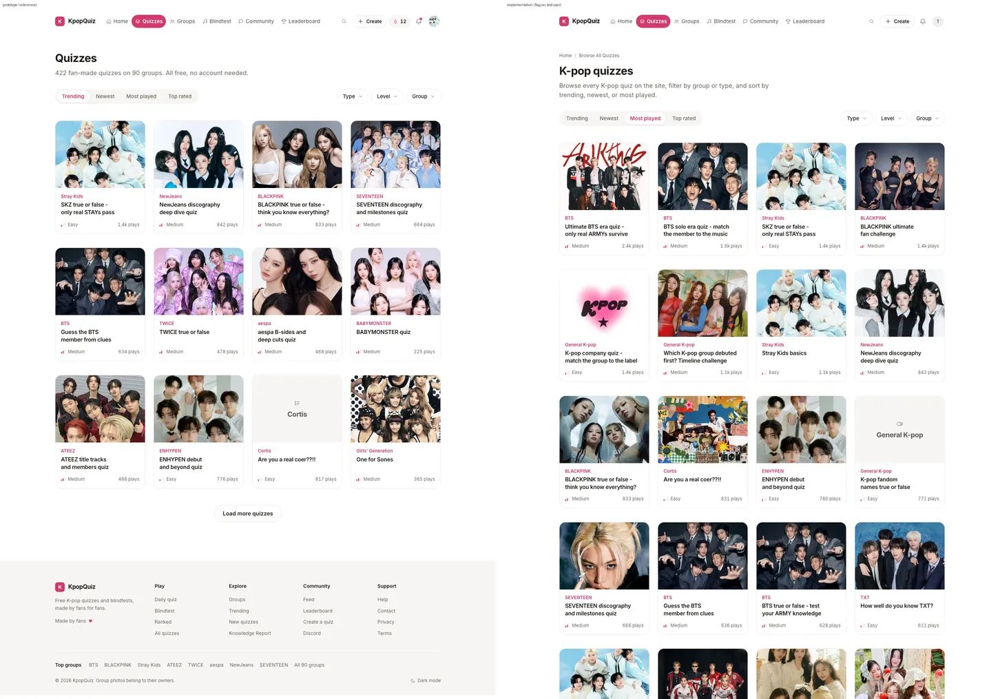 | 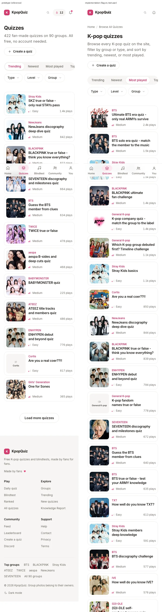 |
| dark | 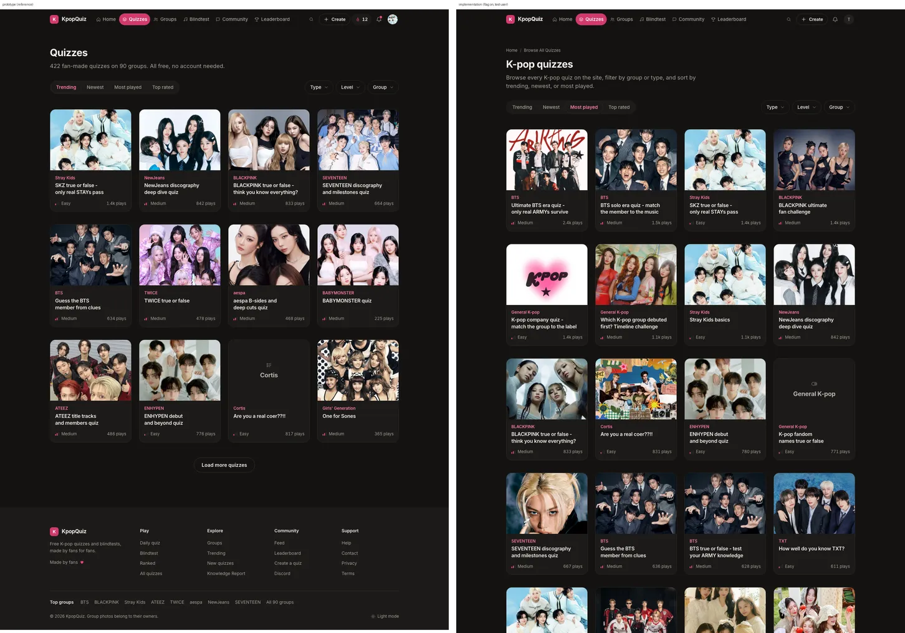 | 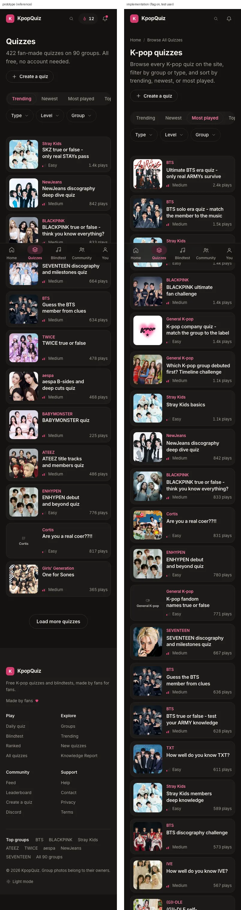 |

Before (flag off, the live site) | after (flag on) | prototype:

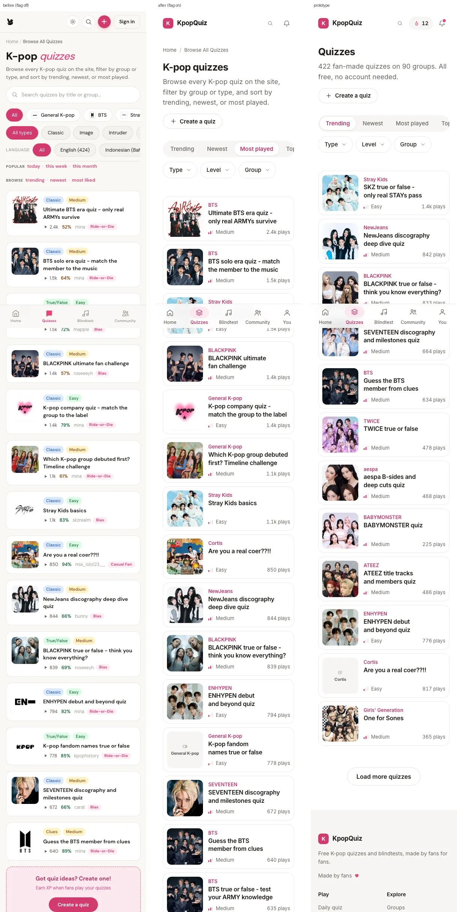

States (implementation, guest): Type menu with counts, two chips (True/false + Hard), Group menu (right
aligned), empty state.

| | 1440 light | 1440 dark | 390 light |
|---|---|---|---|
| Type menu | 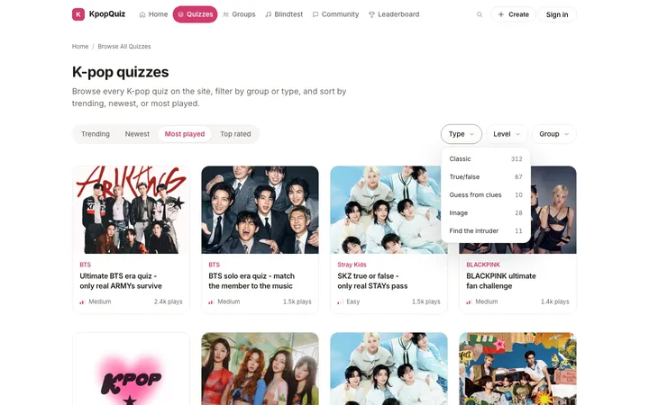 | 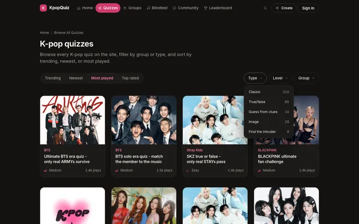 | 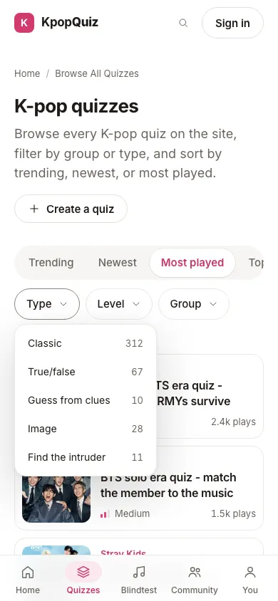 |
| chips | 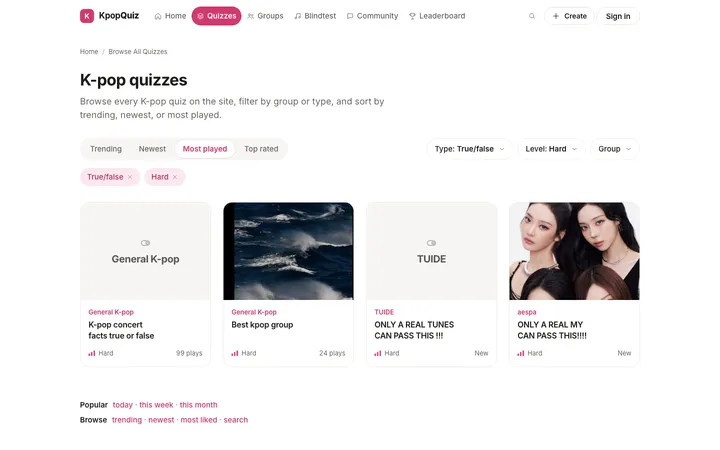 | 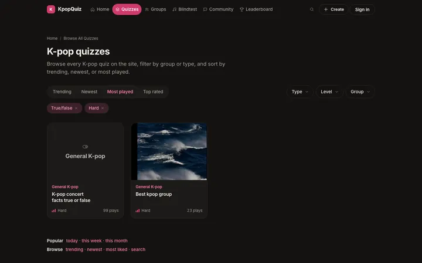 | 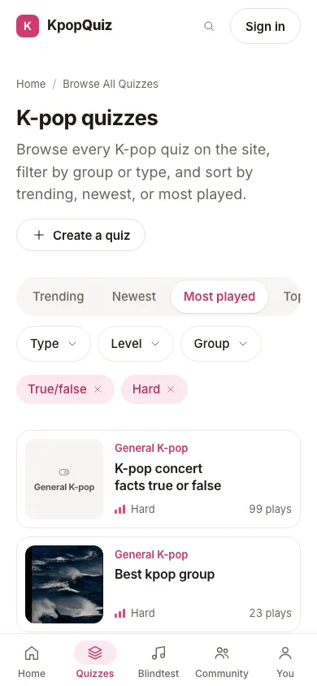 |
| Group menu | 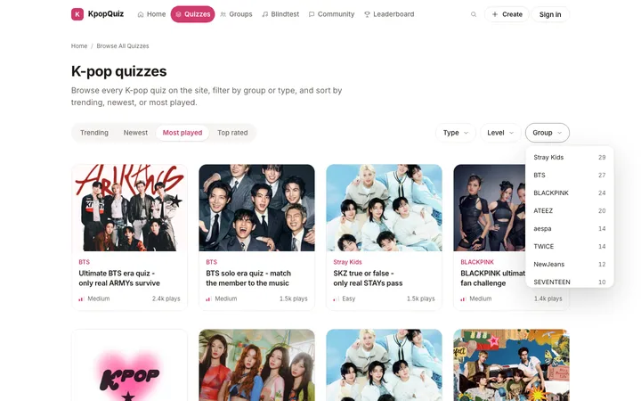 | 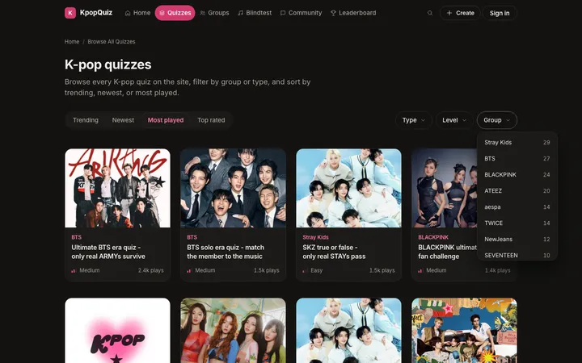 | 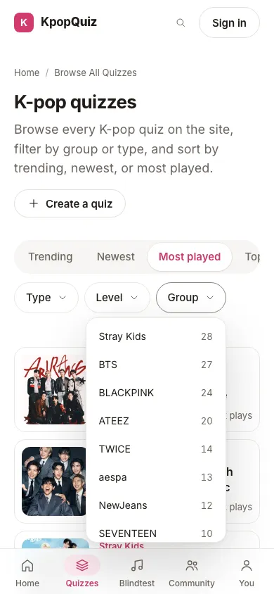 |
| empty | 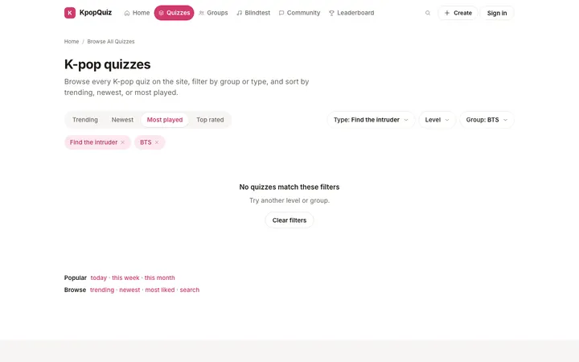 | 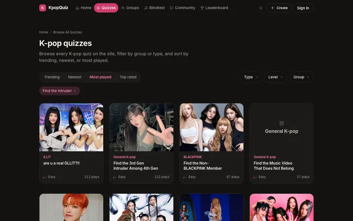 | 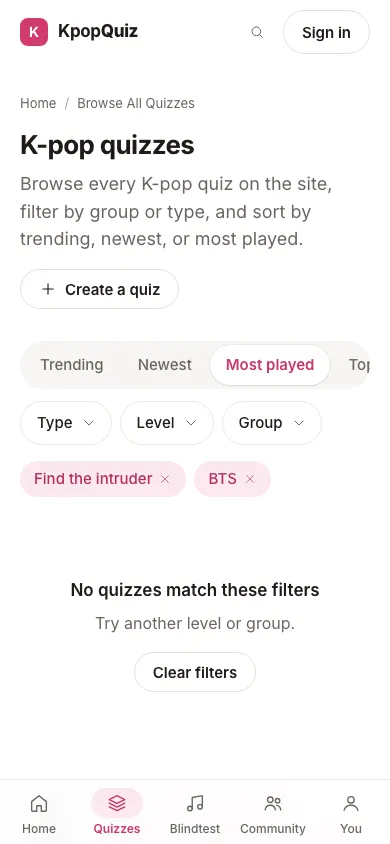 |

What differs from the reference, and why: header copy and the breadcrumb (SEO lock, decision 1), "Most played"
active (decision 2), real quizzes and photos (the same group photo can repeat down a column: A0's card picks one
of four crops per title, 16.8), 48 cards per page instead of the sample's 12, the browse links and FAQ under the
grid (live SEO content, the FAQ in the prototype's accordion). Images regenerated after the round 2 pixel
pass (b4c44b4); the measured record is section 7.

## 3. Proofs

### 3.1 Checks (branch head)

Round 2 (branch head, after the pixel pass):
```
pnpm exec tsc --noEmit -p . (apps/quiz, whole app, e2e specs included)   0 errors (after 74ad851 and after cb4a7a3)
eslint (eslint-config-next core-web-vitals + typescript) on every changed .ts / .tsx: 0 errors, 0 warnings
vitest run src/lib/ux-v1/p2                                20 passed (incl. no em / en dash in any P2 source)
ux11-owner-guard --agent P2 --range origin/feat/ux-v1-v11..HEAD   P2 ok (83 paths; every commit through the hook)
```
Round 1 also ran `check:routes` (flag off and on: 319 reachable); no route changed since.

### 3.2 e2e (`e2e/ux-v1/p2.spec.ts`, flag on, dev :3032, Chromium 1234 via UX11_CHROMIUM)

```
PLAYWRIGHT_BASE_URL=http://localhost:3032 UX11_CHROMIUM=... playwright test e2e/ux-v1/p2.spec.ts --project=ux-1440 --project=ux-390
Running 27 tests (setup + 13 x 2 widths; the SEO / controls tests run light and dark)
  27 passed (1.3 min)        <- round 2, after the pixel pass (reports/P2/e2e-run.txt), no retry, no flaky
  27 passed (4.2 min)        <- round 1
```
Round 2 spec changes: the controls are A0's (`.p2-ctl[data-ready]`, triggers `.p2-dd-type|level|group`), the FAQ
is the accordion (first answer open, every answer in the HTML), the Group menu sits where the prototype puts it
(x = min(trigger x, width - 216), 6px under the trigger).
Two earlier runs had one flaky test each, both fixed: the signed-in check looked for the account button before
A0's account island had answered (now waits for it), and a render on this machine (load average 25 to 60, the
production database shared with other agents) lost its facet read to the page's 5 s `safeFetch` budget, so the
menus had no counts. That fail-soft state is real product behaviour; the controls row now says whether its
counts were read (`data-counts`), and the spec re-requests such a render (never skips) before asserting counts.

Covered, all with `guardWrites` (and every test asserts zero write attempts): per theme and width: SEO lock (title,
description, canonical, hreflang, no robots, one H1 and its text, intro, breadcrumb, FAQ = FAQPage JSON-LD,
BreadcrumbList), 48 unique `/q/` cards and ItemList = the grid, card eyebrow / level / plays, the sort links
(hrefs, current), the three menu triggers (aria-haspopup / aria-expanded), Load more href, the browse links,
phone header button and row layout, no horizontal scroll, reference styles, basicA11y, axe on the page and with a
menu open; Type menu counts, keyboard (first item focused, arrows, Escape returns focus), a pick (URL, chip and its
label, grid size = the count, live region, noindex, canonical), Level inside the type (counts sum to the type's),
chip removal by click and by Enter with focus moving to the trigger; sort links (URL, current, focus stays, live
region), Tab + 2px pink focus ring, Group menu (counts ordered, catch-all last, inside the viewport, href), a group
pick (every eyebrow is the group) and the `?group=` canonical to `/bts-quiz`. Once: Load more (endpoint call,
96 cards, address `?page=2`, focus on card 49, announcement, next href, reload renders the same list),
`?page=2` (96 cards, ItemList = page 2, canonical, no FAQ, Previous page, "Page 2 of N"), a page past the end,
both empty states (Clear filters, focus, Make the first quiz, `/chungha-quiz` canonical), the Level facet rule,
the endpoint (same page as the page, card fields only, bad params -> page 1), signed in read only.

### 3.3 Reference styles and boxes (C1)

`compareLandmarks` against `styles.json`, 0 mismatches at 1440 and 390, light and dark: `.nav` (width + height),
`.links a.on` (the Quizzes nav item, height, 1440), `.qcard` -> `.p2-grid .ux-qcard` (width; see below).

Boxes measured against the prototype's `#quizzes` (same browser, 1440 / 390):

| | prototype 1440 | P2 1440 | prototype 390 | P2 390 |
|---|---|---|---|---|
| sort control | 416.6 x 44 | 416.7 x 44 | 350 x 48 | 350 x 48 |
| Type / Level / Group | x 978.4 / 1078 / 1179.9, w 91.6 / 93.9 / 100.1, h 44 | same | x 20 / 119.6 / 221.5 (2nd line) | same |
| sort -> chips -> grid | 16 + 32 | 16 + 32 | 16 + 32 | 16 + 32 |
| card (two-line title) | 262 x 329.78 | 262 x 329.78 | 350 x 118.78 | 350 x 118.78 |
| Load more | 195.8 x 48, 48 under the grid | same | same | same |
| grid top | 319.7 | 368.4 (+48.7) | 428.7 | 497.4 (+68.7) |

Round 1 measured the grid 64.7px lower and the card 2.6px short (A0's line heights, fixed by A0 in b82e573).
Round 2 numbers above; the full per-state record is section 7.

### 3.4 SEO diff, flag off vs flag on, with the LINK SET (done-when 5)

`reports/P2/seo-diff.txt` (script `seo-diff.mjs`): flag off = a webpack dev server of this branch with the flag
off (:3042), flag on = :3032, fetched back to back. Checks: status, title, description, robots, og / twitter,
canonical, hreflang, H1, every JSON-LD block parsed, the intro and FAQ questions verbatim, server rendering, and
every `<a href>` of the flag-off served HTML (nav, page, `<noscript>`, footer). Both link sets per URL are in
`reports/P2/links/<url>.A.txt` / `.B.txt` (+ `.added.txt`).

Round 2 (2026-09-27, after the pixel pass; `seo-diff.txt` and `links/` rewritten; the script now also checks
that the flag-off page's visible FAQ answers are in the flag-on HTML):

| URL | links flag off | links flag on | lost | added | metadata, H1, intro, FAQ, JSON-LD |
|---|---:|---:|---:|---:|---|
| /quizzes | 80 | 94 | 0 | 14 | same (FAQ questions and answers in B) |
| /quizzes?page=2 | 125 | 142 | 0 | 17 | same |
| /quizzes?page=3 | 126 | 191 | 0 | 65 | same |
| /quizzes?group=bts | 55 | 73 | 0 | 18 | same (canonical /bts-quiz) |
| /quizzes?tab=trending | 80 | 94 | 0 | 14 | same (`tab` is not read by either render) |
| /quizzes?sort=trending | 60 | 74 | 0 | 14 | same except the ItemList order (4) |
| /quizzes?type=tf | 80 | 95 | 0 | 15 | same (noindex, follow) |
| /quizzes/popular-today | 48 | 64 | 0 | 16 | same |
| /quizzes/popular-this-week | 48 | 64 | 0 | 16 | same |
| /quizzes/popular-this-month | 48 | 64 | 0 | 16 | same |
| /pt/quizzes (unowned, unchanged) | 76 | 90 | 0 | 14 | same |

(4) Same 29 quizzes in both ItemLists; the tail order differs between the two servers' cache fills (ties at
6, 3 and 2 plays, and a quiz that gained a play in between): `seo-diff-sort-trending.txt`. Same query in both
renders; the same effect as note (1) of round 1. `/search` is no longer lost anywhere (A0 543a991).

Round 1 table (for the record):

| URL | links flag off | links flag on | lost | added | metadata, H1, intro, FAQ, JSON-LD |
|---|---:|---:|---:|---:|---|
| /quizzes | 80 | 94 | 0 | 14 | same |
| /quizzes?page=2 | 125 | 142 | 0 | 17 | same (1) |
| /quizzes?page=3 | 126 | 191 | 0 | 65 | same |
| /quizzes?group=bts | 55 | 73 | 0 | 18 | same (canonical /bts-quiz) |
| /quizzes?tab=trending | 80 | 94 | 0 | 14 | same (`tab` is not read by either render) |
| /quizzes?sort=trending | 55 | 69 | 0 | 14 | same (noindex, follow) |
| /quizzes?type=tf | 80 | 95 | 0 | 15 | same (noindex, follow) |
| /quizzes/popular-this-week | 48 | 63 | 1: /search | 16 | same (2) |
| /quizzes/popular-this-month | 48 | 63 | 1: /search | 16 | same (2) |
| /quizzes/popular-today | 48 | 39 or 63 | (3) | | same metadata and H1 |
| /pt/quizzes (unowned, unchanged) | 76 | 89 | 1: /search | 14 | same |

Added links (flag on) are the sort links (`?sort=trending|newest|top_rated`), the skip link, A0's shell
additions (/groups, /community, /daily, /profile, /blindtest/ranked, top group hubs) and, on `?page=N`, the
quizzes of pages 2..N-1.
(1) One run showed the ItemList of `?page=2` different; re-fetched, both list the same 48 in the same order:
the two servers' caches were filled at different moments while a play moved a quiz. (2) `seo-diff-rerun.txt`
(the first run's flag-on reads of these two windows had timed out: 0 quiz links, the page's own fallback).
(3) popular-today on the flag-on server shows its "Not enough plays today yet. Here are the all-time
favorites instead." state for the hour, the flag-off server the day's list, both generated the same minute.
Cause, existing and outside P2: `lib/db/queries/popular.ts` swallows a failed `plays` read and caches the empty
window for an hour (spawned as a separate task). The code of the three windows is untouched by this branch
(no diff against the integration branch) and the flag-off capture of 3.5 shows them identical. The only link
lost by a structural cause is `/search`, on pages whose content P2 does not render (decision 8).

### 3.5 Flag off = today's site

Round 2 changed flag-on files only (`git diff 4409a10..HEAD`: the P2 islands, `ux-page.tsx`,
`quizzes-page.tsx`, `lib/ux-v1/p2/filters.ts`, `p2.css`, the spec, docs); `quizzes/page.tsx` and every
flag-off path are untouched, so the round 1 proof below still holds.

`reports/P2/flag-off.txt`: base and branch `quizzes/page.tsx` served by the same flag-off dev server, captured
at structure level: `/quizzes`, `?page=2`, `?page=999`, `?group=bts`, `?tab=trending`, `?sort=trending`,
`?level=hard`, `/pt/quizzes` IDENTICAL; the three popular windows IDENTICAL whenever both captures' live read
succeeded. JS: with the import behind the inlined env test, no chunk of flag-off `/quizzes` contains P2 code
(webpack dev and Turbopack dev both checked); before that change the flag-off page chunk carried the islands
loader and the next/dynamic runtime. Not verified: production (`next build`) byte counts, see 5.

### 3.6 Data safety

- Browsing writes nothing: every e2e test records zero mutating requests (guest and signed in); the page and the
  endpoint only select (public anon client, cached).
- Signed in, only /quizzes was loaded (its GET path reads no session and writes nothing; A0's shell reads
  `/api/auth/me`); never /profile or /me.
- Test user rows (read only, 2026-09-26 02:30 UTC): profiles.updated_at 2026-09-22, passport_snapshot_at
  2026-09-21 (unchanged since before this run).
- Data guard (read only, 2026-09-26T02:30Z): profiles 258, quizzes 434, plays 67,714, quiz_comments 17,
  quiz_reactions 14, likes 2,833, follows 58, user_badges 1,404, creator_notifications 1,220,
  notification_prefs 3, daily_blindtest_scores 84, daily_challenge_plays 0, blind_test_plays 140,
  activity_events 7,452, debate_votes 42. Every count equal to or above A0's baseline of 2026-09-25T19:17Z
  (site traffic).

## 4. Wiring (WIRING-MAP section 2 + v10 row, corrected by WIRING-MAP.verified items 2 and 3)

| Row | Wired to | Proof |
|---|---|---|
| Sort Trending / Newest / Most played / Top rated | page `?sort=` (the live keys; the API's `?tab=` is not used): the live query `getBrowseQuizzes` with the live sort mapping | unit (mapping), e2e (links, soft nav), SEO diff |
| Type (5) | `?type=` live keys -> `quiz_type`; counts from published quizzes | e2e (count = grid) |
| Level (verified: PARTIAL / NEW) | `?level=` -> `difficulty` on cached facet rows + `getQuizCardsByIds`; `/api/quizzes` untouched | unit (ordering), e2e (every card's level) |
| Group rail -> Group menu | `?group=<slug>` -> `group_id` (live query); counts from published quizzes, not `groups.quiz_count` | e2e (eyebrows, canonical) |
| Infinite grid -> Load more | real `?page=N+1` + `GET /api/ux-v1/p2/quizzes` (same parsing and reads as the page) | e2e (append, reload), endpoint test |
| Empty state + Clear filters (v10) | server `total === 0`; links without the facets | e2e |
| SEO landing pages | kept as links (popular windows, /trending, /new, /most-liked) + /search | SEO diff (link set) |
| Language (Q-B2, live) | `?lang=` still filters (validated like the live page) + chip | unit (parse) |
| Result count | server total (live region, pager) | e2e |

## 5. Not verified, and why

- Push, PR, Vercel preview: the push was denied in this session (Progress, Blockers).
- Production build byte counts (flag on / off): verified on dev builds of both bundlers only; a `next build`
  of 800 static pages on this machine (load 30 to 60, three dev servers) was not run.
- Reference pixels as a percentage: compared by boxes and computed styles against the live prototype (section 7,
  every landmark of every state) and by side-by-side images, not by a pixel-difference score; real data differs
  from the samples everywhere in the grid.
- Flag-on production build: round 2 ran on the flag-on dev server (Turbopack); ORCH's local preview build of the
  branch is the production-build check.
- Owner's real account and a production traffic check: not in scope (read only).

## 6. Open items, requests, owner decisions

- Requests to A0 (`v11/requests/P2.md`): 1. the shell's search control as a real `<a href="/search">`: DONE
  (A0 543a991); 2. quiz card body line heights: DONE (A0 b82e573, cards now equal to the reference); 3. link
  options for `Segmented` and `UxDropdown`: DONE (A0 be317bb), adopted by P2 in 74ad851; 4. NEW: a `UxDropdown`
  option that keeps the trigger label once a value is picked (the prototype's `#quizzes` behaviour; 7.2 item 4).
- Owner decisions: A and B (7.3: the breadcrumb and the live intro, and what they cost in px), SEO copy over the
  prototype header (decision 1), Most played as the shown default
  (decision 2), cumulative `?page=N` weight (decision 3), Level facet noindex (decision 4), no Language dropdown
  and no Create banners (decision 5), Top rated meaning (decision 6), popular windows not redesigned
  (decision 7).
- Existing risks seen on the way (flag-off code, not changed): (a) the live ItemList and FAQPage JSON-LD of
  /quizzes are written with a bare `JSON.stringify` (quiz titles are user text; `</script>` in a title would
  break out); the flag-on render emits the same objects through `jsonLdScript` (escaped at the sink).
  (b) `lib/db/queries/popular.ts` caches a failed `plays` read as an empty window for an hour (the popular
  windows then show the all-time fallback); spawned as a separate task for the owner.
- Pending migrations: none.

## 7. Pixel pass (round 2, 2026-09-27)

Method: `reports/P2/px/px-measure.mjs` opens `prototype.html` (`go('quizzes')` + the state's JS) and the flag-on
/quizzes (dev :3032, guest, writes blocked) in the same Chromium 1234 at 1440 x 900 and 390 x 844 (touch), light
and dark, and reads 43 landmark pairs: the box and 34 computed properties each. `px-diff.py` prints the deltas:
x, w, h absolute; y relative to the H1 for the header parts and to the controls row for everything below it
(so the header shift of 7.3 is counted once). States: default (the prototype's Trending pick =
`/quizzes?sort=trending`), mostplayed (`/quizzes`, the live default), chips (True/false + Hard), empty (BTS + Find
the intruder), short (the prototype's first four titles set to one line, like the live first row), menu (Type
open). Also `menu-cmp.mjs` (menu placement, all three menus) and `px-faq.mjs` (the FAQ vs the prototype's `#hub`
FAQ). Records: `px/px-final.txt` (every state, width and theme), `px/menu-cmp.txt`, `px/faq-cmp.txt`.

### 7.1 Fixed in this pass (one commit each)

| What | Before | After | Commit |
|---|---|---|---|
| Sort + Type / Level / Group | P2's copy of the link-option rule (P2SortNav, P2Menu, `.p2-sort > a`) | A0's `Segmented` / `UxDropdown` href options; boxes and styles equal | 74ad851 |
| Breadcrumb spacing | 56px top padding, crumb, 16px | the prototype's crumb on a wide page (`#hub`): 28px top, crumb, 28px below (20px on phones), as P3's hub | 4af10de |
| Menu items | gap 16px (P2 override) | 12px, the prototype's `.mi` | a76e57c |
| FAQ | a `<dl>`, 16/1.4 questions, full width | the prototype's `.acc` accordion: h2 + 8px, hairline rows, 56px summary 16/600 + chevron, answer 15/1.65 muted 62ch, first one open, 720px column; computed styles equal (`faq-cmp.txt`) | d667f43 |
| Menu placement | Group menu right-aligned to its trigger (100px left of the prototype at 1440, 52px at 390) | the prototype's `ddOpen`: 6px under the trigger, x = min(trigger x, width - 216); x, y and width equal for Type, Level and Group at both widths (`menu-cmp.txt`) | cb4a7a3 |

Equal within 2px at 1440 and 390, light and dark, computed styles equal (except the non-visual lines listed at
the top of `px-final.txt`): the sort control and its four pills (Trending picked, as in the prototype: 416.6 x 44
and 350 x 48; pills 96.6 / 86.1 / 119.7 / 100.2 wide, 36 or 40 high), the Type / Level / Group triggers (91.6 /
93.9 / 100.1 x 44, same x) and their chevron, the gaps controls -> chips 16 -> grid 32, the chips (120.8 / 82.5
x 36, X 14px), the grid columns and gaps, the cards (262 x 329.78 with a two-line title, 262 x 308.19 with one;
phone rows 350 x 118.78 / 118.0; cover 260 x 195 / 96 x 96.8, eyebrow 20.8, title 21.6 per line, footer 34.8 /
28.8), the Type menu (200 x 214, items 186 x 40), the empty state (1120 x 210.8, title 27.2, Clear filters 122.5
x 40), Load more (195.8 x 48, 48 under the grid), the header gaps (H1 -> intro 10, header -> controls 32) and the
phone "Create a quiz" (159.4 x 40). Dark: every colour equal (sort pill, triggers, chips, cards, menu, empty).

### 7.2 Remaining deviations, and why

1. Header (SEO lock): the visible breadcrumb and the live intro. H1 at y 141.8 (prototype 121) at 1440 and 133.8
   (93) at 390; the intro takes 2 lines (prototype 1) at 1440 and 3 (2) at 390; everything below moves down by
   48.7px at 1440 and 68.7px at 390. Owner decisions A and B (7.3). The H1 text "K-pop quizzes" is wider than
   "Quizzes" (681.3 vs 561.1 at 1440), same type.
2. Default sort: `/quizzes` shows Most played as the current pill (the live default, decision 2); with
   `?sort=trending` the row is the prototype's picture, box for box.
3. Real data: a card's height follows its title's line count (21.6px per line; a grid row takes its tallest
   card), the level and play labels have their own widths; with the same line count the cards are equal (state
   short: every card delta 0.0). 48 cards per page instead of the 12 samples, so the page is longer.
4. Filtered states only: A0's `UxDropdown` writes the pick into its trigger ("Type: True/false") where the
   prototype's `#quizzes` keeps "Type" (the chip carries the pick): at 1440 the triggers are 174.1 / 137.3 wide
   instead of 91.6 / 93.9 and the row starts 126px further left; at 390 Group wraps to a second line, so the
   chips and the grid sit 52px lower. A0 request 4; P2 passes `value` so the picked item keeps `aria-checked`.
5. Menus: A0's menu scrolls past 320px (the Group menu lists 90+ real groups, the prototype 8 samples) and shows
   each option's real count on the right (the prototype has no counts).
6. Content the prototype's `#quizzes` does not have: under the grid, the live browse links (popular today /
   this week / this month, trending, newest, most liked, search) and the FAQ (live text, now in the prototype's
   FAQ pattern); from `?page=2`, the pager line "Page N of M" + Previous page; the "There is no page N" notice.
7. Not visual (same boxes measured): the lines listed at the top of `px-final.txt` (font fallbacks, a prototype
   `<button>` vs A0's link `<a>` as flex items, where the 32px margin sits).

### 7.3 Owner decisions: what the SEO-locked header costs (measured, not changed)

Grid top, flag-on dev server, guest; light and dark identical:

| Width | prototype | P2 | total shift | A: visible breadcrumb | B: live intro |
|---|---:|---:|---:|---:|---:|
| 1440 | 319.7 | 368.4 | +48.7 | +20.8 | +27.9 (2 lines vs 1) |
| 390 | 428.7 | 497.4 | +68.7 | +40.8 | +27.9 (3 lines vs 2) |

- A. Visible breadcrumb "Home / Browse All Quizzes": the crumb line (13px, 20.8 high) with the prototype's crumb
  spacing (`#hub`: top padding 28 instead of 56 at 1440, crumb, 28 below; phones already have 28 on top, 20
  below). Options: keep it (the BreadcrumbList JSON-LD describes a visible breadcrumb; recommended), or drop
  both the visible crumb and the BreadcrumbList (an SEO change, owner only). Hiding it visually while keeping the
  JSON-LD is not recommended.
- B. Live intro "Browse every K-pop quiz on the site, filter by group or type, and sort by trending, newest, or
  most played." (113 characters, SEO lock) instead of the prototype's "422 fan-made quizzes on 90 groups. All
  free, no account needed.". Options: keep it, or approve new intro copy (indexed text, owner only): a sentence
  that fits one line at 1440 (about 60 characters at 18px, `max-width: 60ch`) and two at 390 removes the 27.9px
  at both widths.

Round 1 measured +64.7 at both widths (crumb 36.8 with 56 + 16 spacing, intro 27.9).
