# P3 Groups + group hub report (UX v11.2)

## Progress

- Done (branch `ux11/p3-groups`, from `feat/ux-v1-v11` f054cd3): v11 `/groups` and v11 `/<slug>-quiz` hub behind
  `NEXT_PUBLIC_UX_V1` (flag off = today's pages; the only flag-off edits are the flag branch in two route files and
  `export` on two builders), the `-trivia` pages kept as they are inside the shell, "Notify me" route (fail soft) +
  pending migration, `p3.css`, 15 unit tests, `e2e/ux-v1/p3.spec.ts` (17 tests per width), report images, SEO +
  link-set diff (only loss: `/search`, A0's shell, request filed), flag-off diff (dev servers, structure identical),
  lint + tsc clean, data guard green, no production write.
- PR #51 into `feat/ux-v1-v11`: https://github.com/P-Mingi/KpopQuizzV2/pull/51
- Next: ORCH merge; A0 request 1 (`/search` link in the shell); owner decisions (section 9); a production-build
  flag-off diff when the machine allows (section 7).
- Blockers: the link-set rule's only lost link is `/search`, which lives in A0's shell (v11/requests/P3.md), not in
  P3's paths. Production builds were not run to completion on this machine (section 7).

## 1. What I built

| Area | Where |
|---|---|
| Flag branch (flag off returns today's page byte for byte) | `app/(site)/groups/page.tsx` (`if (UX_V1) return <GroupsIndexV11/>` after today's read), `app/(site)/[slug]/page.tsx` (`UX_V1 ? GroupHubV11 : GroupQuizPage` for `-quiz`; `-trivia` unchanged) |
| Today's SEO builders reused, not copied | `app/(site)/[slug]/group-quiz-page.tsx`: `export` added to `generateDefaultIntro` and `buildGroupFaqs` (no other change) |
| `/groups` (server) | `components/group/ux-v1/groups-index.tsx` |
| Filter, Most played, A to Z (client island, server-rendered) | `components/group/ux-v1/groups-browser.tsx` |
| Hub (server) | `components/group/ux-v1/hub.tsx` |
| Hub quizzes: sort, Type / Level, Show all (client island) | `components/group/ux-v1/hub-quizzes.tsx` |
| Notify me (client island) | `components/group/ux-v1/hub-notify.tsx` |
| Loaders (next/dynamic: flag-off pages never download the islands) | `components/group/ux-v1/loader.tsx` |
| Group avatar (photo via next/image or initials) | `components/group/ux-v1/group-avatar.tsx` |
| View model (pure, tested) | `lib/ux-v1/p3/model.ts`, `lib/ux-v1/p3/faq.ts` |
| Reads (cookie-free, `unstable_cache`, never cache an empty read) | `lib/ux-v1/p3/data.ts` |
| Notify me route + helpers | `app/api/ux-v1/p3/notify/route.ts`, `lib/ux-v1/p3/alerts.ts` |
| Pending migration | `docs/pending-migrations/v11-p3-group-quiz-alerts.sql` |
| Styles (not imported; A0's flag-gated route serves them) | `styles/ux-v1/p3.css` |
| Tests | `lib/ux-v1/p3/p3.test.ts`, `e2e/ux-v1/p3.spec.ts` |
| Report tools | `v11/reports/P3/seo-diff.mjs`, `v11/reports/P3/make-shots.mjs` |

### /groups (prototype `#groups`, DESIGN-SPEC 16.7 + 17.3)

- SEO lock: metadata (shared export), H1 "All K-pop groups", intro and generation line word for word (built from
  today's `getDirectoryGroups()` rows, so the numbers are the flag-off numbers), today's BreadcrumbList JSON-LD.
- Filter field ("Filter 90 groups", 48px, pink focus ring): live, case-insensitive; hides "Most played"; the
  A to Z count reads "12 of 90 groups" (polite live region); empty state "No group matches ..." as the prototype.
- Most played: the 10 groups with the most plays of their PUBLISHED quizzes (sum of `quizzes.play_count`,
  `status='published'`), catch-all `general-kpop` excluded, "N quizzes" under each (published count), 80px photo
  (the site's own `public/idols/<Group>.jpg` through next/image at the rendered size) or initials.
- A to Z: the 90 visible groups (the 91st row, `zzz-quarantine-hidden`, is never listed), "#" first, 3 / 2 / 1
  columns, pink-ink letters, 32px avatar, name, published count; groups without a quiz (46 today) are listed muted
  with "No quiz yet" and open their empty hub (16.7). Letter headings keep today's anchors (`#letter-A` ...
  `#letter-other`) as self-links, so every jump link of today's page still resolves.

### Group hub `/<slug>-quiz` (prototype `#hub`, 16.7 group hub + 17.3, 15.1 where they point)

- Crumb "Groups / BLACKPINK" (prototype). Today's BreadcrumbList JSON-LD (Home > Quizzes > BLACKPINK Quiz) is kept
  as is (owner decision 5).
- Split hero: eyebrow "BLINK · 3rd gen · YG Entertainment" (real fandom, generation in sentence case, record label;
  a placeholder fandom falls back to "9 fan-made quizzes" / "No quiz yet"); the H1 is today's H1 WORD FOR WORD
  ("BLACKPINK Quiz - Test How Well You Know BLACKPINK"): the first half is the 48px display title, the rest its
  second line (20px muted; the " - " separator is visually hidden, the H1 text is unchanged); the lead is today's
  intro (curated `seo_intro` or the generated one); actions "Play the top quiz" (today's top quiz by plays) and
  "Blindtest" (`/blindtest/group-<slug>`, today's link) or, with no quiz, "Make the first quiz" (`/create?group=`)
  + "Notify me"; facts line (members from the name-all roster, debut year, PUBLISHED quizzes, playable blindtest
  songs from `songs` = the one playlist rule of `lib/blind-test-playlists.ts`), each fact only when known; the
  group photo on the right (16:10, radius 24, next/image `sizes`, `priority`), one column when there is none.
- Quizzes: "BLACKPINK quizzes / 24 quizzes", sort Popular / Newest / Most liked / Hardest with the live feed's four
  orders (`getQuizzesByGroup` semantics: plays; newest; liked only, likes then plays; 10+ finished plays, lowest
  average first), Type and Level dropdowns offering only what the group has ("All types" / "All levels" clear), 6 A0
  text cards (type · level, title, plays · average from `total_score_sum / total_completions / question_count`),
  empty states, "Show all 24" = a real `/<slug>-quiz?page=2` link that expands in place (focus moves to card 7).
  Every quiz of the group keeps today's crawlable link in today's `<noscript>` list.
- About: today's W8 answer-first paragraph (+ the curated intro when there is one), the members (today's roster
  photos, today's alt texts "Jisoo of BLACKPINK"), "Updated September 2026" (today's line and date), links:
  "Learn before you play: BLACKPINK trivia" (when the trivia page exists), "Explore the BLINK space on Verse"
  (today's link, kept for the link-set rule), "Make your own BLACKPINK quiz".
- Questions fans ask: today's fact-gated FAQ and today's W8 questions as ONE list in `<details>` (answers in the
  HTML, first open), word for word; when both blocks ask the same question the FAQ answer is shown (it is the
  FAQPage JSON-LD); prototype order (members, debut, fandom, generation, origin, label, quizzes, songs, blind test,
  free). Today's FAQPage JSON-LD unchanged.
- Side column: From the community (the latest comments on the group's published quizzes, WIRING-MAP 8 "until then,
  getCommunityComments for the group"; author flair via A0 PersonName; empty state "No posts about ATEEZ yet. Start
  the first thread", All posts -> `/community`), Fans also play (today's related groups with their published count
  and today's top quiz of each), the fandom war line (`getGroupWarRank`, "See the war" -> `/leaderboard#fandom-war`,
  today's link), Newest BLACKPINK quizzes (today's 5 newest with dates, the SEO-3 U7 freshness block), Read more
  (today's article links), Fan knowledge (today's mastered / accuracy / top fans with flair, `/u/` links), MV
  pulse. Blocks without data do not render. The comeback banner (today's, first 14 days) links `#ghub-play`.
- JSON-LD: BreadcrumbList, FAQPage, CollectionPage, ItemList exactly as today (parsed-equal; escaped at the sink).
- Empty group (46 today): eyebrow, H1, today's intro, "Make the first quiz" + "Notify me", then only today's SEO
  text and links (answer-first, questions, articles).

### Notify me

`GET /api/ux-v1/p3/notify?group=<id>` (state) and `POST { groupId, on }` (toggle), flag off 404, signed out 401,
the fan is always `auth.uid()`. The store `group_quiz_alerts` is a pending migration: until it runs, GET answers
`{ live: false }` and POST 503 `not_live` BEFORE any write, and the button says "Group alerts are not switched on
yet. Make the first quiz instead." Guests get A0's sign-in sheet ("Sign in to get notified"), the action resumes
after sign-in. Delivery (when applied): a trigger on quiz publish sends one in-app notification per waiting fan
(existing type `followed_new_quiz`, no CHECK change) and marks the alert sent; it can never block a publish.

## 2. Screenshots (before | after | prototype)

Made by `v11/reports/P3/make-shots.mjs` (read only: every mutating request answered locally, the script fails on
a write attempt). before = flag off (dev :4332, same code as the base; ATEEZ: kpopquiz.org, same code on main),
after = flag on (dev :3033), then the pinned prototype reference of the same state. Real data: text, counts,
photos and the number of rows differ from the prototype's sample data by design.

| State | Images |
|---|---|
| groups 1440 light (before / after / prototype) | 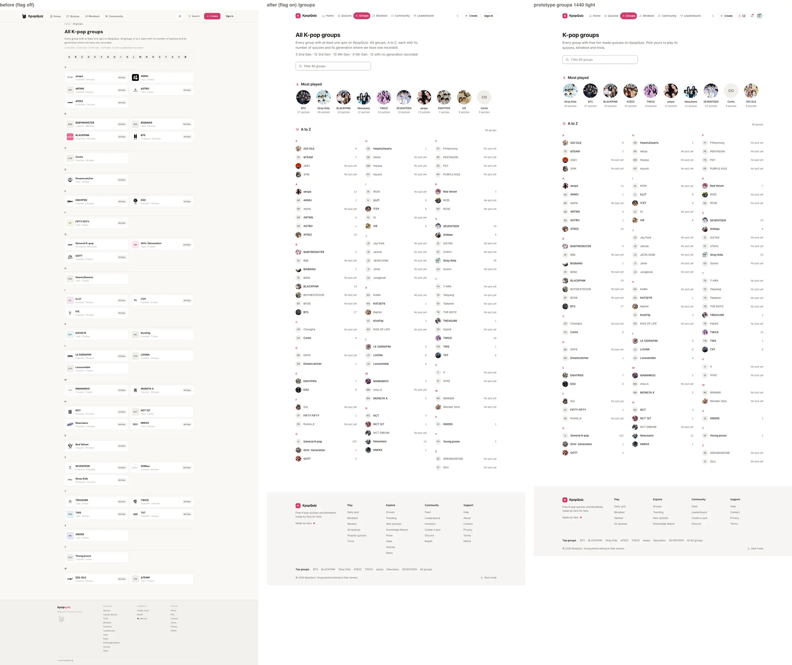 |
| groups 1440 dark | 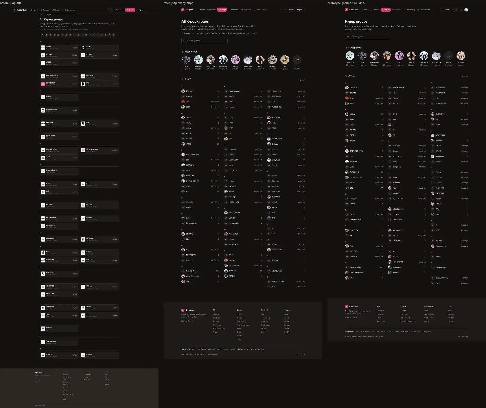 |
| groups 390 light | 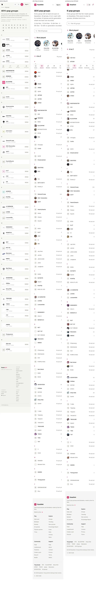 |
| groups 390 dark | 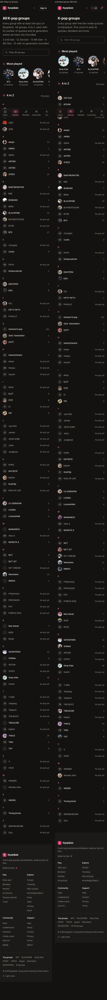 |
| hub-blackpink 1440 light | 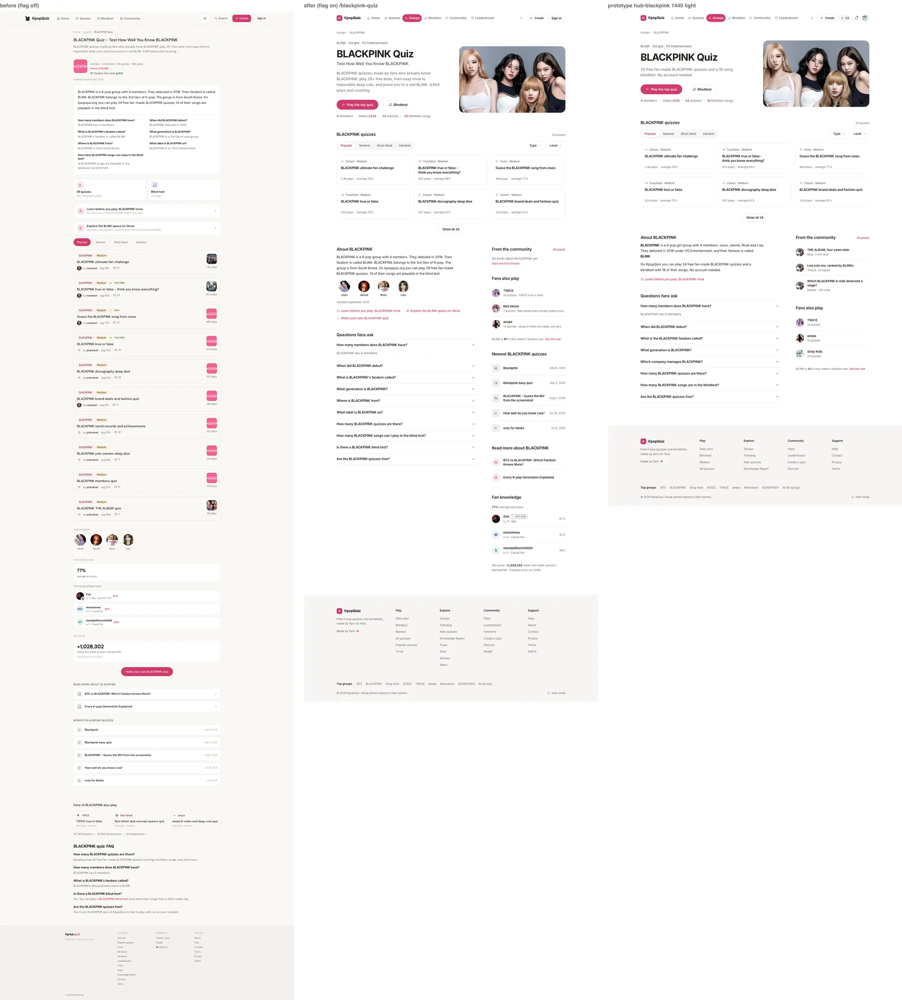 |
| hub-blackpink 1440 dark | 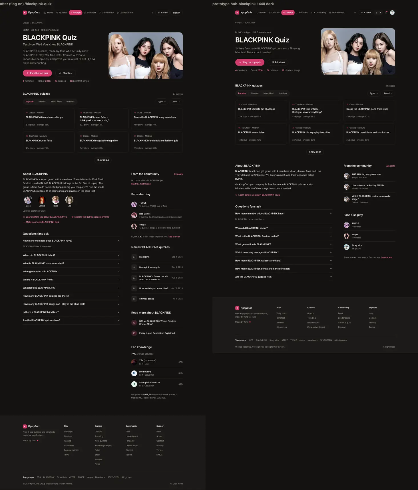 |
| hub-blackpink 390 light | 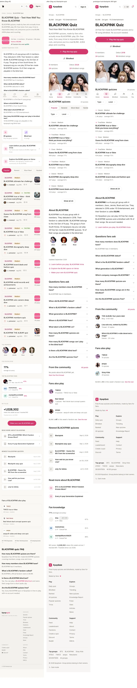 |
| hub-blackpink 390 dark | 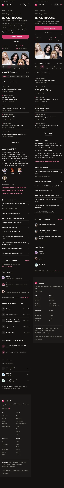 |
| hub-ateez 1440 light | 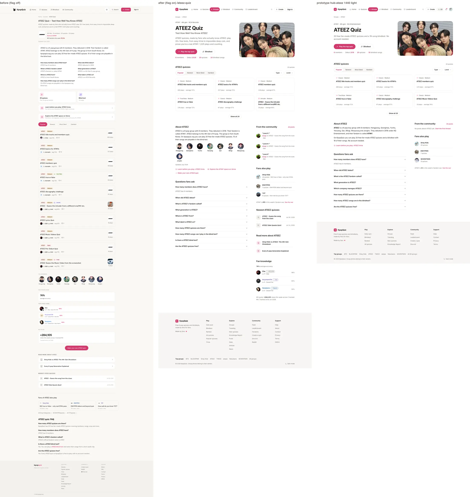 |
| hub-ateez 390 dark | 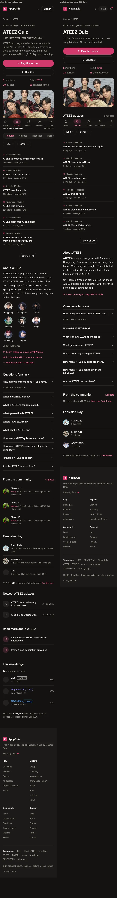 |
| hub-empty (Chungha) 1440 light | 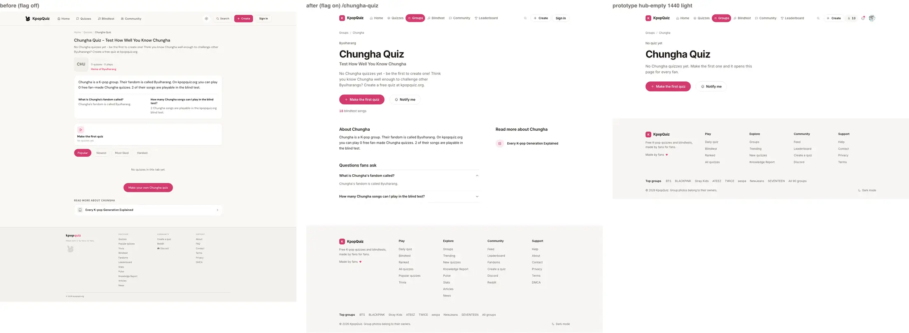 |
| hub-empty 1440 dark | 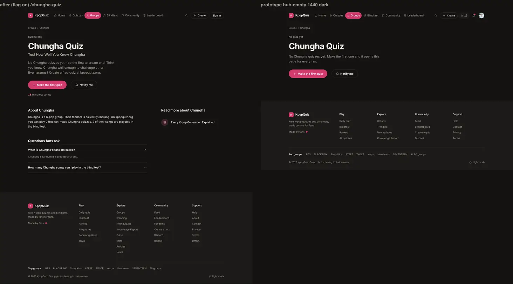 |
| hub-empty 390 light | 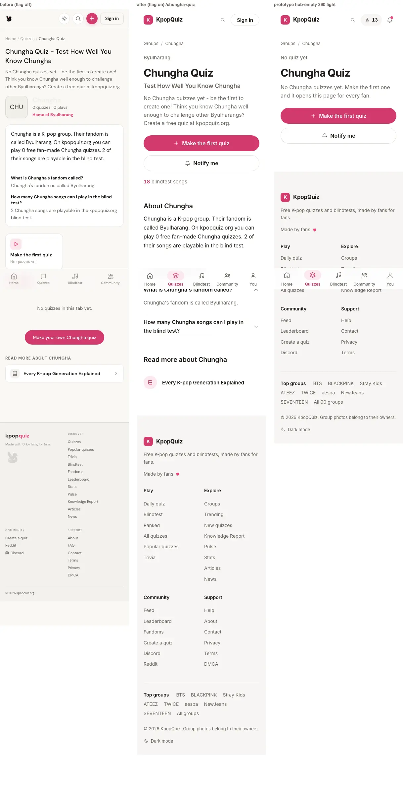 |
| hub-empty 390 dark | 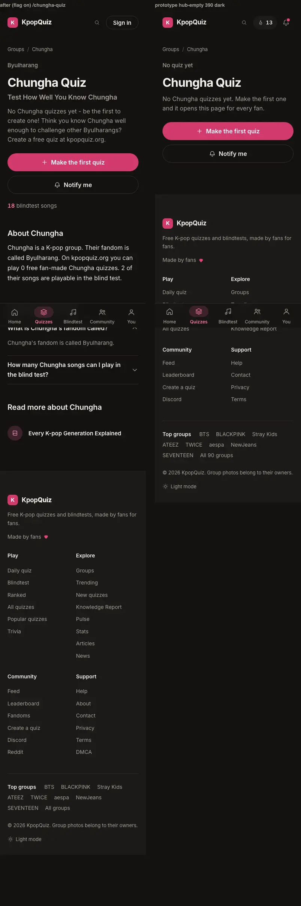 |

Computed styles vs `v11/checks/reference/styles.json` (C1 criterion), in `p3.spec.ts` at 1440 and 390, light and
dark: `.nav`, `.links a.on` (the Groups pill is active on `/groups`, the hubs and the trivia pages), `.sec-h h2`
(groups, hub-blackpink, hub-ateez), `.btn-primary` (Play the top quiz / Make the first quiz, 48px), `.tcard`
(width at 1440): see section 5 for the result.

Deliberate differences from the prototype, all forced by the SEO lock or real data: the H1 second line and the
longer intro (today's SEO texts), the /groups H1 "All K-pop groups" + intro + generation line (today's), the
visible crumb vs the kept BreadcrumbList, the About block's members / links, the FAQ has today's 5 to 10 questions
(the prototype's 8 are samples), and the side column's extra blocks (today's content and links that the link-set
rule keeps: newest quizzes, read more, fan knowledge with profile links, MV pulse).

## 3. Wiring proof

| Row (WIRING-MAP) | Wired to (real) | Proof | Status |
|---|---|---|---|
| 8 Breadcrumb, H1, intro | today's H1 text, today's `seo_intro` / `generateDefaultIntro`, today's BreadcrumbList | SEO diff SAME (h1, intro, JSON-LD); e2e H1 textContent + CollectionPage description = visible intro | done |
| 8 Photo hero | `public/idols/<Group>.jpg` (A0 `groupPhotoUrl`, 33 groups), next/image `sizes`; one column without a photo | e2e (img alt), screenshots (Chungha solo) | done |
| 8 Play the top quiz | `getQuizzesByGroup(id,'popular')[0]` (today's top quiz) | e2e href `/q/...` | done |
| 8 Blindtest N songs | `/blindtest/group-<slug>` (today's link); count from `songs` via `getAdvertisablePlaylists` (79 playable groups) | e2e href; facts line; SEO diff shows the link kept | done |
| 8 From the community | latest `quiz_comments` of the group's published quizzes (public, as on `/q`), flair via PersonName; All posts -> `/community` | e2e (rows link `/q/...` or the empty state), screenshots (ATEEZ rows) | done (posts feed = P8) |
| 8 Facts strip | roster count, `inception_date`, published count, playable songs; each hidden when unknown | unit `hubFacts`, e2e | done |
| 8 Updated month | `getGroupContentDate` (today's line and `<time>`) | SEO diff SAME (updated + dated content) | done |
| 8 Sort tabs | the live feed's 4 orders on the full published list | unit `sortHubQuizzes`, e2e (plays non-increasing, averages non-decreasing, aria-pressed) | done |
| 8 Type + level | types / levels present in the group | unit, e2e (every card of the picked type / level, "All" clears, keyboard) | done |
| 8 Quiz grid (avg %) | `total_score_sum / total_completions / question_count` | unit `averagePct`, e2e | done |
| 8 Show all N | `/<slug>-quiz?page=2` link, expands in place; `<noscript>` list of every quiz | e2e (N cards, focus, URL unchanged, noscript link count = published count) | done |
| 8 FAQ (fact-gated) | today's `buildGroupFaqs` + W8 `buildAnswerChunks`, one list, FAQPage unchanged | SEO diff (FAQ pairs kept, W8 kept), e2e (FAQPage = visible text) | done |
| 8 Learn before you play | `/<slug>-trivia` when `hasTriviaPage` | e2e link, SEO link set | done |
| 8 Fandom war line | `getGroupWarRank`, `/leaderboard#fandom-war` | e2e | done |
| 8 Make a group quiz | `/create?group=<slug>` (About link; hero on empty hubs) | e2e | done (prefill = P5) |
| 8 Live room panel | rooms not shipped (16.7: removed until rooms ship) | - | not built |
| 8 Verse links | 15.1 says drop; the link-set rule keeps `/verse/<slug>` | SEO link set | kept (owner decision 6) |
| v10 Split hero, 8 FAQ, trivia href, Show all N | server-rendered, counts from published quizzes | e2e, SEO diff | done |
| v10 Empty group | Make the first quiz + Notify me (pending migration); noindex NOT added | e2e (real route not live + stubbed toggle payloads `{ groupId, on }`, sign-in sheet X / Escape / backdrop + focus return) | done in code; store pending; noindex = owner decision 1 |
| 16.7 Groups index | filter, Most played hidden while filtering, A to Z, zero-quiz groups muted | e2e | done |

## 4. SEO diff and link set (flag off vs flag on)

`v11/reports/P3/seo-diff.mjs` (GET, Googlebot UA, scripts off). A = my branch, flag off; B = my branch, flag on.
Full output: `v11/reports/P3/seo/seo-diff.txt`; both link sets per URL: `v11/reports/P3/seo/links-*.txt`.

| URL | title, description, robots, canonical, hreflang, og/twitter, JSON-LD, H1 | intro / genline / updated / dated | FAQ pairs (off -> on) | W8 answer-first | link set: off / on unique hrefs | lost | added |
|---|---|---|---|---|---|---|---|
| `/groups` | SAME | SAME | - | - | 85 / 143 | `/search` | 59 (the 46 empty hubs, letters, shell) |
| `/blackpink-quiz` | SAME | SAME | 5 kept (10 shown) | lead + 7 kept | 62 / 76 | `/search` | 15 (`?page=2`, shell) |
| `/bts-quiz` | SAME | SAME | 5 kept (10 shown) | lead + 7 kept | 65 / 80 | `/search` | 16 |
| `/cortis-quiz` (thin: placeholder fandom, no roster) | SAME | SAME | 2 kept | none today | 44 / 61 | `/search` | 18 (`/blindtest/group-cortis`: playable in `songs`) |
| `/chungha-quiz` (no quiz) | SAME | SAME | - | lead + 2 kept | 24 / 39 | `/search` | 16 |
| `/blackpink-trivia` (today's page in the shell) | SAME | SAME | - | lead + 7 kept | 37 / 51 | `/search` | 15 |
| `/ateez-quiz` (A = kpopquiz.org, same code on main) | SAME except live numbers | SAME except "1,222" vs "1,224 plays" | 5 kept | lead + 7 kept | 57 / 73 | `/search` | 17 |

The only lost link on every URL is `/search` (A0's shell; request 1). Everything else in "added" is the shell's new
links (`/community`, `/daily`, `/groups`, top groups, `#main`) and P3 additions allowed by 16.10 (real hrefs for
every group, `?page=2`). ATEEZ: the flag-off dev render of `/ateez-quiz` is a 500 on the base branch too (a legacy
card's `next/image` with an unconfigured host, a dev-only check), so its diff used production as A: the only
differences are the play count that moved between the two reads and `/search`.

## 5. Tests

Unit (vitest, `src/lib/ux-v1/p3/p3.test.ts`): **15 passed**: initials, hidden rows, A to Z order and anchor ids,
most played (published plays, no catch-all, no empty group), filter + count label, eyebrow (placeholder fandoms),
facts, average, the four sorts on a fixture (the live feed's rules), filters and present options, comment lines and
ages, the merged "Questions fans ask" (dedupe, FAQ answer wins, order, unknown questions last), the fail-soft
helpers of the Notify me route.

e2e `e2e/ux-v1/p3.spec.ts` (flag on, dev :3033 on the shared production database, Chromium 1234, projects ux-1440
and ux-390, light and dark, every page under `guardWrites`): **35 passed, 0 failed, 0 flaky, 0 skipped** on the final
run (17 tests per width + the setup project, 2.8 min). Covered:
- `/groups`: SEO lock (title, description, canonical, H1, intro text pattern, BreadcrumbList), every visible group a
  `/<slug>-quiz` link (the count read from the page), no quarantine row, zero-quiz rows muted, letter anchors, 10 most
  played without the catch-all, active nav (Groups pill / Quizzes tab), no horizontal scroll, `styles.json`
  landmarks, `basicA11y`, axe, zero writes; the filter by keyboard (narrowing, count, Most played hidden, empty state,
  "/" typed stays text, clearing restores all).
- Hub (BLACKPINK): SEO lock (title, canonical, H1 textContent word for word, CollectionPage description = the visible
  intro, BreadcrumbList items, every FAQPage question visible with the same answer text, answers in the HTML, first
  open), hero (eyebrow, Play the top quiz `/q/...`, Blindtest `/blindtest/group-blackpink`, facts, photo alt), today's
  links (trivia, Verse, create, war, blind test, the three related hubs), the `<noscript>` list has one link per
  published quiz (= the facts count), landmarks, a11y, axe, zero writes; quizzes: 6 cards, Show all label + `?page=2`
  href, Popular order (plays), Newest / Hardest (averages non-decreasing) / Most liked (aria-pressed, live region),
  Type dropdown (menu, first item focused, every card of the picked type, "All types" clears), Level by keyboard
  (Enter opens, arrows, Escape closes and returns focus), Show all (N cards, URL unchanged, focus on card 7).
- Hub (ATEEZ): a question opens with Enter, community rows link `/q/...` (or the empty state), 3 fans also play with
  hub + top quiz links, war link, article link, landmarks.
- Empty hub (Chungha): SEO lock, Make the first quiz href, no quiz section, no community block, solo hero; the REAL
  notify route says not live and the click writes nothing; with the route stubbed live: the guest gets the sign-in
  sheet (Escape, X, backdrop close it, focus returns to the button), a fan toggles on then off (Enter) with the exact
  payloads `{ groupId, on: true }` / `{ groupId, on: false }` answered by the stub, zero writes reach the server.
- `/blackpink-trivia`: today's content inside the v11 shell, one H1, Groups pill, no horizontal scroll.
- Signed in (test user, read only, ux-1440 and ux-390): the account replaces Sign in, the real notify route says not
  live, the click opens no sheet and writes nothing, the hub renders; zero writes.

Earlier runs on the loaded machine (load average 33 to 48) had failures that were all timeouts or a hub render that
lost a read (the dev server shares the production database; `safeFetch` falls back after 5 s). The spec now waits
for a COMPLETE hub (every data block of today's hub) and reloads otherwise; no assertion was relaxed.

Lint: `eslint-config-next` core-web-vitals + typescript on every P3 file: 0 problems (the only finding is an existing
`` warning in today's `group-quiz-page.tsx`, not changed). `tsc --noEmit`: 0 errors. Em / en dash grep on every
P3 file: none.

Data guard (read only, `apps/quiz/scripts/data-guard.ts`, 2026-09-26T02:35Z): profiles 258, quizzes 434, plays
67,715, quiz_comments 17, quiz_reactions 14, likes 2,833, follows 58, user_badges 1,404, creator_notifications 1,220,
notification_prefs 3, daily_blindtest_scores 84, daily_challenge_plays 0, blind_test_plays 140, activity_events
7,453, debate_votes 42: every count at or above P10's run (real players). The test user's own rows (read only):
`profiles.updated_at` 2026-09-22, `passport_snapshot_at` 2026-09-21, xp 32, 3 plays, 1 badge, 0 comments, following
2, 0 notifications; `group_quiz_alerts` does not exist (nothing stored).

## 6. Flag off = today's site

The flag-off code change is: an `if (UX_V1)` branch after today's read in `groups/page.tsx`, a `UX_V1 ?` choice in
`[slug]/page.tsx` (`-quiz` only), `export` on two builders of `group-quiz-page.tsx`, and imports of the P3 modules
(server components; the islands sit behind `next/dynamic` loaders so a flag-off page does not download them).

Proof: A0's `flag-off-diff.mjs --structure`, A = the base branch `feat/ux-v1-v11` f054cd3 flag off, B = this branch
flag off, both served by `next dev` from clean copies (production builds could not finish on this machine, section
7), fetched back to back:

```
/groups           status 200/200  normalised 124,882 = 124,882
/blackpink-quiz   status 200/200  normalised  83,050 =  83,050
/chungha-quiz     status 200/200  normalised  30,062 =  30,062
/blackpink-trivia status 200/200  normalised  75,693 =  75,693
/ateez-quiz       status 500/500  (the base fails the same way in dev: a legacy card's next/image host check)
```

The only differing node on each page is the dev server's per-request id `self.__next_r="<random>"` (dev only, differs
between any two requests); the ATEEZ 500 pages differ only in that id and the source path inside the error text.
`js chunks 24/25`: in dev, the branch lists one more client chunk (the P3 loader module), which a production build
folds into the page's existing chunks (P6's identical loader pattern measured 13/13 on production builds).

## 7. Not verified, and why

- Production builds (flag off base / branch, flag on): `next build` of the base did not finish: it prerenders the
  1,000 most played quiz pages against the shared production database, and on this machine (load average 33 to 48,
  several agents building and testing) every read timed out at 5 s, then the build stopped on a data file outside
  the app. The flag-off proof therefore uses two dev servers (section 6) and e2e ran on the flag-on dev server. A
  production-build flag-off diff (A0's helper, bytes and structure) is the first thing C3 / ORCH should re-run.
- `/ateez-quiz` flag-off in dev answers 500 on the base branch too (dev-only `next/image` host check on a legacy
  quiz card); its SEO diff used kpopquiz.org (the same flag-off code on main) as A.
- Notify me writes (real `group_quiz_alerts` rows) and the delivery trigger: the table is a pending migration; the
  route's "not live" path is verified for real, the "live" path only with stubbed responses (payload shapes).
- Signed-in hub for a fan who already asked to be notified: needs the table.
- The ISR cache risk the legacy hub already has: a read that fails during a render can bake a thin section into
  the hour-long ISR page (today's `unstable_cache` reads that return `[]` on error are cached too). P3's own reads
  throw on an empty read so they are never cached; today's reads are unchanged.

## 8. Open items and requests

- A0 request 1 (`v11/requests/P3.md`): the v11 shell has no `<a href="/search">`; it is the only link the P3 URLs
  lose (every page of the run loses it). Blocker by the link-set rule, outside P3's paths.
- `/community` (All posts, Start the first thread) is P8's page; until it ships the link is the flag-on route of the
  allowlist (404 until P8).
- The hub's Blindtest button opens `/blindtest/group-<slug>` (today's link): that legacy page's Play is the
  production bug ORCH recorded (RUN-STATE). A `?playlist=group-<slug>` deep link on the v11 `/blindtest` (P6) would
  let the hub start the run in the v11 game.
- From the community reads quiz comments until P8's posts exist (WIRING-MAP 8); switch the read to P8's feed when it
  lands (`lib/ux-v1/p3/data.ts` `getGroupComments`).

## 9. Owner decisions

1. Noindex for thin hubs: the worker prompt asks "noindex until 3 quizzes"; today's hubs have no robots rule, so it
   is an SEO diff outside 16.10 and is NOT shipped (brief). Note: the sitemap already leaves out hubs with
   `quiz_count` 0, and v11 `/groups` now links the 46 empty hubs (16.7: listed muted, open the empty page).
2. `groups.quiz_count` is stale (BTS 31 vs 27 published, BLACKPINK 29/24, Stray Kids 29/28, SEVENTEEN 11/10,
   ENHYPEN 8/7, ILLIT 7/6, ARTMS 5/4, BABYMONSTER 4/3, KATSEYE 2/1). Root cause, read in the database:
   `handle_new_quiz()` adds 1 on every quiz INSERT (drafts too) and nothing ever subtracts. The SEO-locked texts
   still read it (hub title "29+", intro "play 29+ free tests", FAQ "KpopQuiz has 29 ...", CollectionPage
   `numberOfItems`), so the page says 29 in those texts and 24 in the v11 counts. Fix (owner): recount the column
   and keep it in sync on publish / unpublish / delete, or switch those texts to the published count (flag off too).
3. Blind test counts in the SEO texts come from `blind_test_songs` (legacy, 349 rows: BLACKPINK 14, BTS 28, ATEEZ
   10), while the game plays from `songs` (18 each). v11 facts use `songs`; the FAQ / W8 texts are locked. Same fix
   path as 2.
4. `/groups` intro (locked) says "Every group with at least one quiz ... 44 groups ... each with ... its generation"
   while v11 lists the 90 visible groups (16.7) without a generation tag. Keep the text (today), or approve a new
   intro, e.g. "Every K-pop group on KpopQuiz, A to Z: 90 groups, 44 with free fan-made quizzes."
5. Hub crumb: v11 shows "Groups / <Group>" (prototype); the BreadcrumbList JSON-LD stays "Home > Quizzes > <Group>
   Quiz" (today's, SEO PR-I2). Align the JSON-LD to Groups or keep both.
6. Verse link: 15.1 / 16.7 say remove Verse links from the hub; the link-set rule keeps today's `/verse/<slug>`
   (About links). Owner to say which rule wins.
7. Notify me: apply `docs/pending-migrations/v11-p3-group-quiz-alerts.sql` (table + RLS + delivery trigger), or
   only the table, or drop the feature (section 1).
8. Hub FAQ heading: v11 says "Questions fans ask" (prototype) instead of today's "BLACKPINK quiz: FAQ"; the questions
   and answers are unchanged.

## 10. Pending migration

`docs/pending-migrations/v11-p3-group-quiz-alerts.sql` (not applied): `group_quiz_alerts` (user_id, group_id,
created_at, notified_at; RLS: own rows only, nothing for anon), `notify_group_quiz_alerts()` (SECURITY DEFINER,
swallows every error) + two triggers on `quizzes` (insert published, status -> published); commented rollback.
