# P3 Groups + group hub report (UX v11.2)

## Progress

- Phase 1 done: PR #51 (branch `ux11/p3-groups`) merged into `feat/ux-v1-v11`.
- Fix loop 1 done (branch `ux11/p3-fix1`, merged up to `feat/ux-v1-v11` 04c9b81): C1-001, C3-001, C3-002, C2-006,
  C2-007, section "Fix loop 1" below. PR: see the PR into `feat/ux-v1-v11` (link in ORCH's message).
- Cleanup done at the end of the loop: every P3 server stopped (dev :3033, flag-off dev :4332), the scratch copies
  (`.p3tmp`), `.next`, `test-results`, the test-user storage state and the worktree symlinks removed.
- Blockers: none in P3's paths. Open: request 2 (today's shared reads cache a failed read as empty; patch ready).
- Link sets: no lost link except `/verse/<slug>` for parked spaces, removed at ORCH's request (C2-006).
- Fix 2 done (branch `ux11/p3-fix2`, from `feat/ux-v1-v11` c557630): X1-005, section "Fix 2" below.

## Fix 2 (X1-005)

| Issue | Fix | Proof |
|---|---|---|
| X1-005 (nit): on a hub whose Verse space is open and has no posts, "Start the first thread" opened the bare `/community` feed, not the editor (prototype `renderHub` hb-com empty: `openEditor('thread')`) | the door links `/community?compose=thread`: P8's compose URL opens the New post editor in Thread mode on arrival and drops the param (`components/community/ux-v1/editor.tsx`, read only). The gate is unchanged: only an open space (`verseSpaceOpen`) gets the thread door; a parked space keeps the top-quiz comment door (C2-007). The choice is one pure helper, `hubCommunityDoor(verseOpen, topSlug)` in `lib/ux-v1/p3/model.ts` | unit, e2e, link set, flag off, tsc: below |

P8's compose URL has no group preselect (it reads `compose` and, for a challenge, `quiz`; the group chip starts on
the fan's own main group when that is an open space, else empty). So the hub sends no `group=` param: a fan who
opens the editor from the BTS hub picks BTS in the chip. If the owner wants the group prefilled, P8 would read a
`group=<slug>` param (a P8 change, not made here).

Proof (dev :3033 on this worktree, the shared production database, GET only; the numbers below are in
`v11/reports/P3/fix2/proof.txt`):

- Unit (`p3.test.ts`, 23 passed, 2 new): an open space gets `/community?compose=thread` with the label "Start the
  first thread" (with or without a top quiz); a parked space gets `/q/<top>` "Play the top quiz and leave the first
  comment", or `/community` as before when there is no top quiz.
- Real data cannot show the state today: BTS is the only open space (`LIVE_SPACES`, local `VERSE_PUBLIC=true`) and
  its hub has comments, so its block shows rows. The state was rendered with a scratch edit that empties BTS's
  comment list inside `hub.tsx` (`g.slug === 'bts' ? [] : ...`, a copy in the session scratchpad, never committed,
  the file restored afterwards), once on the fix (hot reload of the running server) and once on the base
  (a restarted server: a hot reload to the base kept serving the previous render, so the base variant got a
  restart; its HTML shows the base href, so it is a fresh render).
  - Server HTML: base `<a class="ux-lnk" href="/community">Start the first thread</a>`, fix
    `<a class="ux-lnk" href="/community?compose=thread">Start the first thread</a>`.
  - Whole served document (the `--structure` normalisation of `flag-off-diff.mjs`, plus the dev request id):
    base and fix differ ONLY in that href (putting the old href back makes them identical).
  - Link set: anchors 104 -> 104, unique hrefs 80 -> 81, lost 0, added `/community?compose=thread`,
    `/community` 5 -> 4 (still linked by "All posts" and the shell).
  - e2e, the new case on that render (ux-1440 and ux-390, light and dark, `--retries 0`, guest, `guardWrites`):
    4 passed (48 s). It clicks the door, lands on `/community`, the dialog "New thread" is open with Thread
    pressed, the address has no query left, Escape closes it, zero writes.
- Link set on real hubs, flag on, base vs fix (server HTML; the fix from the first server, the base from a server
  restarted on the base code with its `.next` kept): `/bts-quiz` 104 anchors / 80 unique, `/blackpink-quiz`
  100 / 75, `/ateez-quiz` 95 / 72, `/chungha-quiz` 54 / 40: lost 0, added 0, no per-href count change; the served
  documents are IDENTICAL (structure) on all four. Expected: none of them renders the changed branch (BTS has
  rows, BLACKPINK and ATEEZ are parked, Chungha has no community block); the forced render above is the real
  before / after of the branch.
- e2e on real data, the fix (fresh `.next`, flag on, `--retries 0`, guest, `guardWrites`): the new case plus the
  ATEEZ community case (the parked door, C2-007), ux-1440 and ux-390, light and dark: 8 passed (47 s). On BTS the
  new case sees the comment rows (each links `/q/...`), no "Start the first thread" on the bare feed and no parked
  door, then opens `/community?compose=thread` and gets the "New thread" editor. The case skips on a server whose
  `VERSE_PUBLIC` is not `true` (no space is open there; the ATEEZ case covers the parked door).
- Flag off unchanged: the changed code runs only under the flag (`[slug]/page.tsx` picks `GroupHubV11` only when
  `UX_V1`; `model.ts` only gains a function). Proof on dev :3033 built flag OFF, the base sources (`hub.tsx`,
  `model.ts` from `origin/feat/ux-v1-v11`) vs the fix, each on a freshly started server with a cleared `.next`:
  `/bts-quiz`, `/blackpink-quiz`, `/cortis-quiz` have identical link sets (97 / 94 / 69 anchors, 65 / 62 / 44
  unique hrefs, the fix loop 1 counts), no `p3-` class and no `compose=thread`, and identical served documents
  once the image preload tags (their order moves between two fetches of the same code) and the live numbers (plays,
  war percentages, which moved in the minutes between the two servers) are masked. `/community?compose=thread`
  flag off: 301 to `/`, as before.
- Whole-app `pnpm exec tsc --noEmit -p .` (e2e specs included): 0 errors. eslint (`eslint-config-next`
  core-web-vitals + typescript, A0's recipe) on the 4 changed files: 0 problems. Em / en dash grep on the diff: none.

## Fix loop 1

| Issue | Fix | Proof |
|---|---|---|
| C1-001 group tile 88 x 133.2 (the count line was a 20.8px block) | `.p3-gitem-c` is inline inside the 25.6px line box, like the prototype `.gitem .c` and P1's `.p1-gc` | e2e asserts every Most played tile is 88 x 138 (+-2) at 1440 and 390, light and dark: green |
| C3-001 hub quizzes 7 and up only inside `<noscript>` | the `<noscript>` list is gone. The hub renders EVERY published quiz as a real card link in the server HTML: the first 12 visible (today's hub shows its popular top 10 as visible links, so all of them stay visible), the rest inside a native `<details>` whose summary is "Show all N" (opens without JavaScript; with JavaScript focus moves to the first new card and "N quizzes shown" is announced). The old `?page=2` link is dropped: today's hub has no page 2 either (the URL renders page 1), and every quiz is now in the page itself | see "C3-001 proof" |
| C3-002 `/groups` served "0 groups" from a failed build read | fail-closed reads, `lib/ux-v1/p3/reads.ts`: a read that throws or times out comes back as `READ_FAILED`, never as `[]` / `null`; `failClosed()` then throws at request time (Next keeps the last good ISR page and retries on the next request, the rule of `lib/verse/space.ts`), and during `next build` it does not fail the deploy but lowers the page's revalidate to 60 s. `/groups` flag on no longer reads today's `getDirectoryGroups()` (it returns `[]` on an error and caches it for an hour); its intro numbers come from P3's own index read (same rows, throws on an error or an empty result, never cached). Every one of the hub's 15 reads goes through the same gate | see "C3-002 proof" |
| C2-006 Verse link to a parked space (404) | `/verse/<slug>` only when `verseSpaceOpen(slug)` = `!verseHidden() && !spaceUnpublished(slug)` (imported from `lib/verse/visibility.ts`, `lib/ux-v1/p3/verse.ts`). Production today: VERSE_PUBLIC is not `true`, so no hub links the Verse; once it is, only BTS (LIVE_SPACES) | unit (unset / `1` / `true`; bts, blackpink, ateez); e2e (no `/verse/` link on BLACKPINK and ATEEZ); dev HTML (VERSE_PUBLIC=true locally): `/bts-quiz` links `/verse/bts`, `/blackpink-quiz` and `/ateez-quiz` link no `/verse/` |
| C2-007 "Start the first thread" dead door | shown only when the group's space is open (same gate); otherwise the empty state reads "No posts about BLACKPINK yet. Play the top quiz and leave the first comment" -> `/q/<top quiz>` (the rows of this block ARE comments on the group's quizzes, and the v11 results screen takes a comment) | e2e (ATEEZ: no "Start the first thread", the comment door links `/q/...`); dev HTML: BLACKPINK -> `/q/blackpink-ultimate-fan-challenge` |

### C3-001 proof

- Server HTML of `/blackpink-quiz` flag on (dev :3033, scripts off): 0 `<noscript>` blocks, one `<a href="/q/...">` card
  per published quiz (24 = the facts count), 1 `<details class="p3-more">`.
- Visible-link parity (Chromium, guest, GET only): every `/q/` link that the
  flag-off hub shows as a VISIBLE anchor (outside `<noscript>`, JavaScript off or on) must be a visible anchor on the
  flag-on hub, with JavaScript off AND on, `v11/reports/P3/seo-fix1/visible-links.txt`
  (tool `v11/reports/P3/visible-links.mjs`, flag-off dev :4332 = this branch with the flag off, flag-on dev :3033):

  ```
  /blackpink-quiz  JS off  flag-off visible /q/ 18  flag-on visible /q/ 19  missing 0
  /blackpink-quiz  JS on   flag-off visible /q/ 18  flag-on visible /q/ 19  missing 0
  /bts-quiz        JS off  flag-off visible /q/ 18  flag-on visible /q/ 20  missing 0
  /bts-quiz        JS on   flag-off visible /q/ 18  flag-on visible /q/ 20  missing 0
  /cortis-quiz     JS off  flag-off visible /q/ 12  flag-on visible /q/ 12  missing 0
  /cortis-quiz     JS on   flag-off visible /q/ 12  flag-on visible /q/ 12  missing 0
  /ateez-quiz      JS off  flag-off visible /q/ 15  flag-on visible /q/ 16  missing 0
  /ateez-quiz      JS on   flag-off visible /q/ 15  flag-on visible /q/ 16  missing 0
  OK: every flag-off visible quiz link is visible flag on (JS off and on)
  ```

  (18 on BLACKPINK flag off = the top 10 cards, the 5 newest and the related groups' top quizzes.)
- Why 12 and not 6: the flag-off hub shows its popular top 10 as visible links. With 6 cards, quizzes 7 to 10 of
  that list are real links, but they sit inside the closed `<details>`, and the newest list leaves out anything
  already in the popular top 10. So 4 links that are visible flag off would not be visible flag on. That follows
  from the code; the probe run against the 6-card build did not finish on the loaded machine. 12 keeps whole rows
  (3 columns at 1440, 2 at tablet width, 1 on phones).
- e2e (both widths, both themes): the card links equal the published count, 0 `noscript a`, 12 visible, "Show all N"
  opens with Enter (focus on card 13, summary hidden, live region), and a JavaScript-disabled context opens it natively
  and sees every card.
- Link set (`seo-diff.mjs`, flag-off dev :4332 vs flag-on dev :3033, scripts off, `v11/reports/P3/seo-fix1/`):
  full output in `seo-fix1/seo-diff.txt`, link sets per URL in
  `seo-fix1/links-*.txt`, ATEEZ against kpopquiz.org in `seo-fix1/ateez/` (the local flag-off ATEEZ hub answers 500 in
  dev: a gstatic member photo through next/image; production answers 200).

  | URL | link set off / on (unique hrefs) | lost | notes |
  |---|---|---|---|
  | `/groups` | 85 / 144 | none | title, description, canonical, JSON-LD, H1, intro, generation line SAME |
  | `/blackpink-quiz` | 62 / 75 | `/verse/blackpink` (C2-006: parked space, a 404) | FAQ 5 kept (10 shown), W8 lead + 7 kept |
  | `/ateez-quiz` (A = kpopquiz.org) | 57 / 72 | `/verse/ateez` (C2-006) | FAQ 5 kept, W8 lead + 7 kept |
  | `/bts-quiz` | 65 / 80 | none | `/verse/bts` kept: BTS is the live space and local VERSE_PUBLIC is `true` |
  | `/cortis-quiz` | 44 / 61 | none | |
  | `/chungha-quiz` (no quiz) | 24 / 40 | none | W8 lead + 2 kept |
  | `/blackpink-trivia` | 37 / 52 | none | |

  `/search` is no longer lost anywhere: the shell now links it (request 1 is done). The remaining DIFF lines are all
  live data, not the code: the play count in the intro and the CollectionPage description differs by one play between
  the two servers' cache fills (4,909 vs 4,910; the JSON-LD blocks are equal once numbers are masked). ATEEZ's newest
  quiz of 2026-07-28 reads "Jul 29" locally and "Jul 28" on production. Both sides use the same
  `toLocaleDateString` without a time zone, so the label follows the server's time zone (Paris vs UTC).
  An earlier run of the same diff, before the dev cache was cleared, also lost `/leaderboard#fandom-war` on three hubs
  and the Chungha blind-test answer. That was not a P3 change: it was today's `getFandomWarMap` /
  `getGroupBlindtestInfo` caching an empty answer after a failed read (see "C3-002 proof", request 2).

### C3-002 proof

- Unit (`p3.test.ts`): a rejected read is `READ_FAILED`, never `[]`; `failClosed` throws at request time with the
  names of the failed reads; during `next build` it does not throw.
- Real failures on this loaded machine (dev :3033, the shared production database, `safeFetch` 5 s timeouts): the
  first render of each page after a restart lost reads and answered 500 instead of a thin page, the retry 3 s later
  answered 200 with every block. Server log:
  `/groups: read(s) failed (getGroupsDirectoryIndex); this render is not cached, the last good page stays`,
  `/bts-quiz: read(s) failed (triviaAvailable, fanKnowledge, mvPulse, comments)`, same for `/ateez-quiz`,
  `/cortis-quiz`, `/chungha-quiz`, `/blackpink-quiz`. Before the fix those renders would have shipped "0 groups"
  or a hub without its trivia link, FAQ facts or side column, cached for the ISR hour.
- Build with the `/groups` read forced to fail (scratch copy only: a `P3_FAULT` switch in `read()`, never
  committed), `v11/reports/P3/seo-fix1/isr-fail-closed.txt`. `next build` with the read failing: the log says
  `[p3] /groups: read(s) failed at build (getGroupsDirectoryIndex); prerendered with a 60s revalidate`. The build
  passes and the route table shows `/groups` with a 1m revalidate (a good build has 1h). `next start` with the
  database back: one STALE response serves the degraded prerender, then a HIT on the regenerated page (intro, 90
  hub links, 1 h again). Next, the stored good page is aged past its hour and the server restarted with the read
  failing at request time. Two STALE responses both serve the good page (intro, 90 hub links). The log shows
  `FailedRenderError ... this render is not cached, the last good page stays`, and the file on disk is still the
  good page.
- Trade-off: a hub that has never been rendered and whose reads fail answers a 500 (nothing is cached; the next
  request renders it). The hubs have no build-time params, so this is the first visit after a deploy only.
- Hub, today's reads (open, request 2): the hub also reuses 10 of today's reads, and they swallow Supabase errors.
  They return `[]` / `0` / `null`, and `unstable_cache` keeps that for up to an hour. P3's gate only sees throws
  and timeouts, so it cannot catch these. It happened during this loop: the war map RPC failed once, and every
  flag-on hub lost its fandom war line and `/leaderboard#fandom-war` link until the dev cache was cleared. Flag off
  has the same exposure. The fix is in shared files outside P3's paths. It is ready as
  `v11/reports/P3/fail-closed-queries.patch` (each fetcher throws on `error`; the patch applies cleanly and
  type-checks), with the callers to check listed in `v11/requests/P3.md` request 2. Once applied, the v11 hub fails
  closed end to end with no P3 change.
- Not covered otherwise: a read that succeeds with wrong data cannot be detected.

### Flag off in this loop

The only flag-off file touched in this loop is `app/(site)/groups/page.tsx`: the `if (UX_V1) return` branch moved
above today's read (so flag on no longer reads `getDirectoryGroups`), and the unused `getGroupsIndex` import went.
`UX_V1` is a build-time constant, so with the flag off the branch is dead code and the rendered path is today's
code line for line. The flag-off side of the SEO diff above is this branch built flag off.

## 1. What I built

| Area | Where |
|---|---|
| Flag branch (flag off returns today's page byte for byte) | `app/(site)/groups/page.tsx` (`if (UX_V1) return GroupsIndexV11()` before today's read, fix loop 1), `app/(site)/[slug]/page.tsx` (`UX_V1 ? GroupHubV11 : GroupQuizPage` for `-quiz`; `-trivia` unchanged) |
| Today's SEO builders reused, not copied | `app/(site)/[slug]/group-quiz-page.tsx`: `export` added to `generateDefaultIntro` and `buildGroupFaqs` (no other change) |
| `/groups` (server) | `components/group/ux-v1/groups-index.tsx` |
| Filter, Most played, A to Z (client island, server-rendered) | `components/group/ux-v1/groups-browser.tsx` |
| Hub (server) | `components/group/ux-v1/hub.tsx` |
| Hub quizzes: sort, Type / Level, Show all (client island) | `components/group/ux-v1/hub-quizzes.tsx` |
| Notify me (client island) | `components/group/ux-v1/hub-notify.tsx` |
| Loaders (next/dynamic: flag-off pages never download the islands) | `components/group/ux-v1/loader.tsx` |
| Group avatar (photo via next/image or initials) | `components/group/ux-v1/group-avatar.tsx` |
| View model (pure, tested) | `lib/ux-v1/p3/model.ts`, `lib/ux-v1/p3/faq.ts` |
| Reads (cookie-free, `unstable_cache`, never cache an empty read) | `lib/ux-v1/p3/data.ts` |
| Notify me route + helpers | `app/api/ux-v1/p3/notify/route.ts`, `lib/ux-v1/p3/alerts.ts` |
| Pending migration | `docs/pending-migrations/v11-p3-group-quiz-alerts.sql` |
| Styles (not imported; A0's flag-gated route serves them) | `styles/ux-v1/p3.css` |
| Tests | `lib/ux-v1/p3/p3.test.ts`, `e2e/ux-v1/p3.spec.ts` |
| Report tools | `v11/reports/P3/seo-diff.mjs`, `v11/reports/P3/make-shots.mjs` |

### /groups (prototype `#groups`, DESIGN-SPEC 16.7 + 17.3)

- SEO lock: metadata (shared export), H1 "All K-pop groups", intro and generation line word for word (built from
  the same rows as today's `getDirectoryGroups()`: every group with a published quiz, so the numbers are the
  flag-off numbers; read fail-closed since fix loop 1), today's BreadcrumbList JSON-LD.
- Filter field ("Filter 90 groups", 48px, pink focus ring): live, case-insensitive; hides "Most played"; the
  A to Z count reads "12 of 90 groups" (polite live region); empty state "No group matches ..." as the prototype.
- Most played: the 10 groups with the most plays of their PUBLISHED quizzes (sum of `quizzes.play_count`,
  `status='published'`), catch-all `general-kpop` excluded, "N quizzes" under each (published count), 80px photo
  (the site's own `public/idols/<Group>.jpg` through next/image at the rendered size) or initials.
- A to Z: the 90 visible groups (the 91st row, `zzz-quarantine-hidden`, is never listed), "#" first, 3 / 2 / 1
  columns, pink-ink letters, 32px avatar, name, published count; groups without a quiz (46 today) are listed muted
  with "No quiz yet" and open their empty hub (16.7). Letter headings keep today's anchors (`#letter-A` ...
  `#letter-other`) as self-links, so every jump link of today's page still resolves.

### Group hub `/<slug>-quiz` (prototype `#hub`, 16.7 group hub + 17.3, 15.1 where they point)

- Crumb "Groups / BLACKPINK" (prototype). Today's BreadcrumbList JSON-LD (Home > Quizzes > BLACKPINK Quiz) is kept
  as is (owner decision 5).
- Split hero: eyebrow "BLINK · 3rd gen · YG Entertainment" (real fandom, generation in sentence case, record label;
  a placeholder fandom falls back to "9 fan-made quizzes" / "No quiz yet"); the H1 is today's H1 WORD FOR WORD
  ("BLACKPINK Quiz - Test How Well You Know BLACKPINK"): the first half is the 48px display title, the rest its
  second line (20px muted; the " - " separator is visually hidden, the H1 text is unchanged); the lead is today's
  intro (curated `seo_intro` or the generated one); actions "Play the top quiz" (today's top quiz by plays) and
  "Blindtest" (`/blindtest/group-<slug>`, today's link) or, with no quiz, "Make the first quiz" (`/create?group=`)
  + "Notify me"; facts line (members from the name-all roster, debut year, PUBLISHED quizzes, playable blindtest
  songs from `songs` = the one playlist rule of `lib/blind-test-playlists.ts`), each fact only when known; the
  group photo on the right (16:10, radius 24, next/image `sizes`, `priority`), one column when there is none.
- Quizzes: "BLACKPINK quizzes / 24 quizzes", sort Popular / Newest / Most liked / Hardest with the live feed's four
  orders (`getQuizzesByGroup` semantics: plays; newest; liked only, likes then plays; 10+ finished plays, lowest
  average first), Type and Level dropdowns offering only what the group has ("All types" / "All levels" clear), A0
  text cards (type · level, title, plays · average from `total_score_sum / total_completions / question_count`),
  12 of them visible (fix loop 1: today's hub shows 10), empty states, then "Show all 24": the summary of a native
  `<details>` that holds cards 13 to 24 (fix loop 1, C3-001: every quiz is a real, server-rendered card link; it
  opens without JavaScript; with JavaScript focus moves to card 13 and the count is announced). Nothing lives only in
  `<noscript>` any more.
- About: today's W8 answer-first paragraph (+ the curated intro when there is one), the members (today's roster
  photos, today's alt texts "Jisoo of BLACKPINK"), "Updated September 2026" (today's line and date), links:
  "Learn before you play: BLACKPINK trivia" (when the trivia page exists), "Explore the <fandom> space on Verse"
  only when the space is open (fix loop 1, C2-006: VERSE_PUBLIC on and the slug in LIVE_SPACES, so BTS once the
  Verse opens; parked spaces answer 404), "Make your own BLACKPINK quiz".
- Questions fans ask: today's fact-gated FAQ and today's W8 questions as ONE list in `<details>` (answers in the
  HTML, first open), word for word; when both blocks ask the same question the FAQ answer is shown (it is the
  FAQPage JSON-LD); prototype order (members, debut, fandom, generation, origin, label, quizzes, songs, blind test,
  free). Today's FAQPage JSON-LD unchanged.
- Side column: From the community (the latest comments on the group's published quizzes, WIRING-MAP 8 "until then,
  getCommunityComments for the group"; author flair via A0 PersonName; empty state "No posts about BLACKPINK yet."
  + "Start the first thread" (`/community?compose=thread`, the editor in Thread mode, fix 2) for an open Verse space, otherwise "Play the top quiz and leave the first
  comment" (`/q/<top>`, fix loop 1, C2-007); All posts -> `/community`), Fans also play (today's related groups with their published count
  and today's top quiz of each), the fandom war line (`getGroupWarRank`, "See the war" -> `/leaderboard#fandom-war`,
  today's link), Newest BLACKPINK quizzes (today's 5 newest with dates, the SEO-3 U7 freshness block), Read more
  (today's article links), Fan knowledge (today's mastered / accuracy / top fans with flair, `/u/` links), MV
  pulse. Blocks without data do not render. The comeback banner (today's, first 14 days) links `#ghub-play`.
- JSON-LD: BreadcrumbList, FAQPage, CollectionPage, ItemList exactly as today (parsed-equal; escaped at the sink).
- Empty group (46 today): eyebrow, H1, today's intro, "Make the first quiz" + "Notify me", then only today's SEO
  text and links (answer-first, questions, articles).

### Notify me

`GET /api/ux-v1/p3/notify?group=<id>` (state) and `POST { groupId, on }` (toggle), flag off 404, signed out 401,
the fan is always `auth.uid()`. The store `group_quiz_alerts` is a pending migration: until it runs, GET answers
`{ live: false }` and POST 503 `not_live` BEFORE any write, and the button says "Group alerts are not switched on
yet. Make the first quiz instead." Guests get A0's sign-in sheet ("Sign in to get notified"), the action resumes
after sign-in. Delivery (when applied): a trigger on quiz publish sends one in-app notification per waiting fan
(existing type `followed_new_quiz`, no CHECK change) and marks the alert sent; it can never block a publish.

## 2. Screenshots (before | after | prototype)

Made by `v11/reports/P3/make-shots.mjs` (read only: every mutating request answered locally, the script fails on
a write attempt). before = flag off (dev :4332, same code as the base; ATEEZ: kpopquiz.org, same code on main),
after = flag on (dev :3033), then the pinned prototype reference of the same state. Real data: text, counts,
photos and the number of rows differ from the prototype's sample data by design.

| State | Images |
|---|---|
| groups 1440 light (before / after / prototype) | 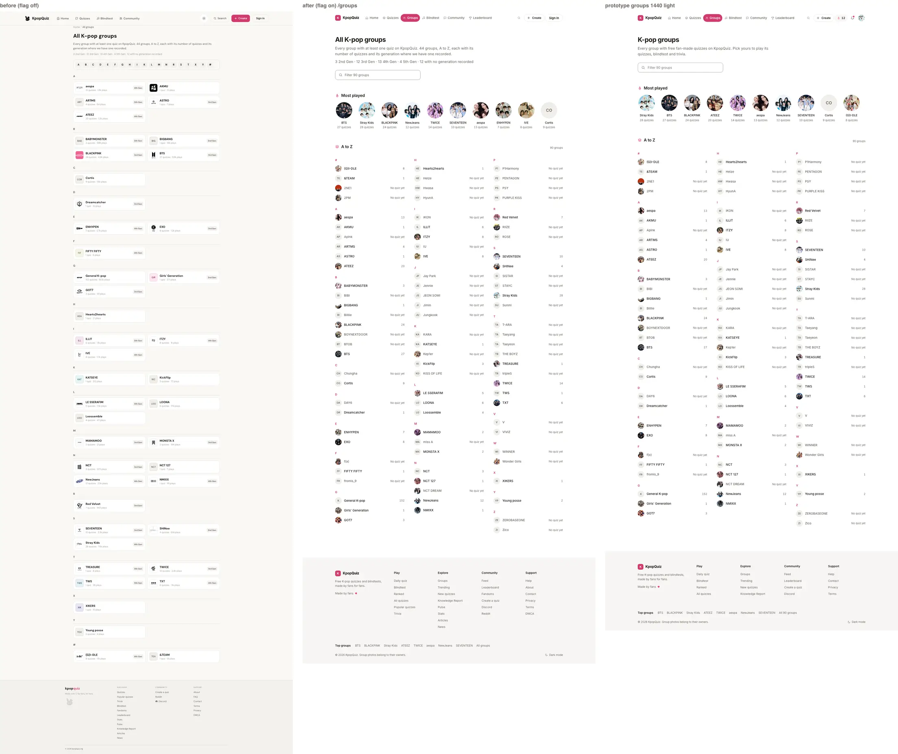 |
| groups 1440 dark | 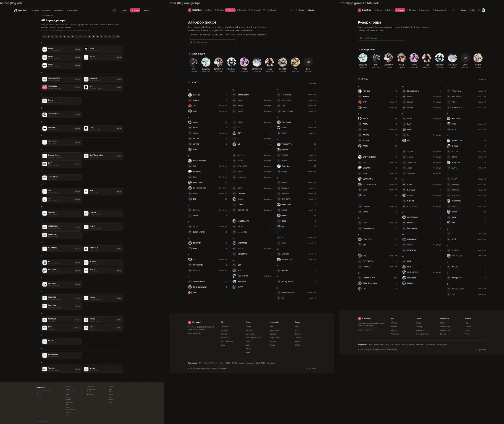 |
| groups 390 light | 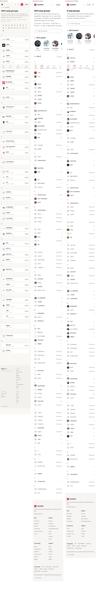 |
| groups 390 dark | 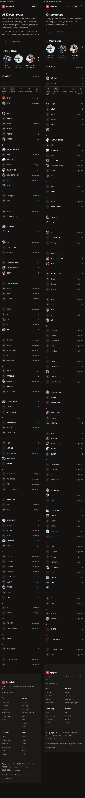 |
| hub-blackpink 1440 light | 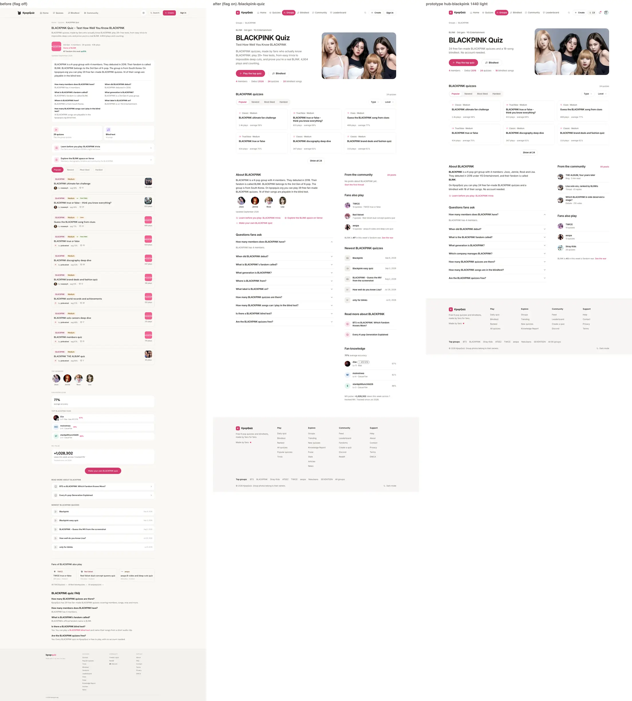 |
| hub-blackpink 1440 dark | 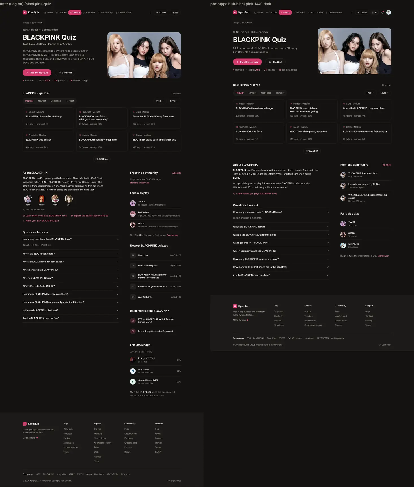 |
| hub-blackpink 390 light | 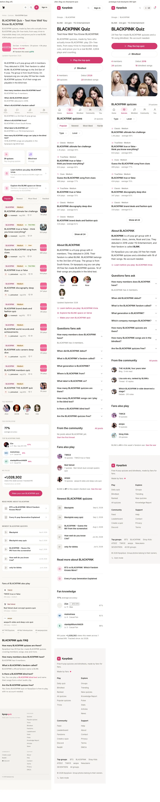 |
| hub-blackpink 390 dark | 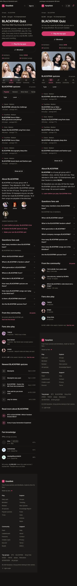 |
| hub-ateez 1440 light | 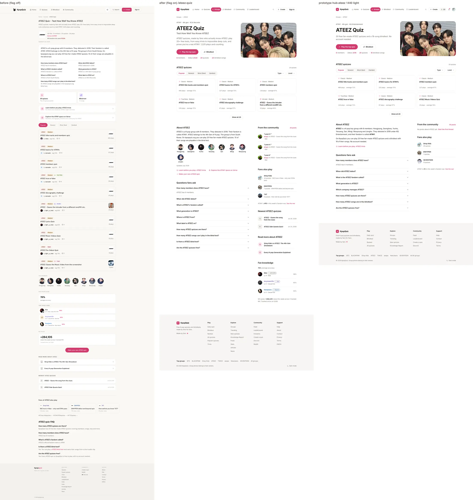 |
| hub-ateez 390 dark | 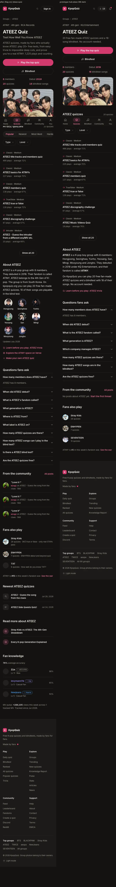 |
| hub-empty (Chungha) 1440 light | 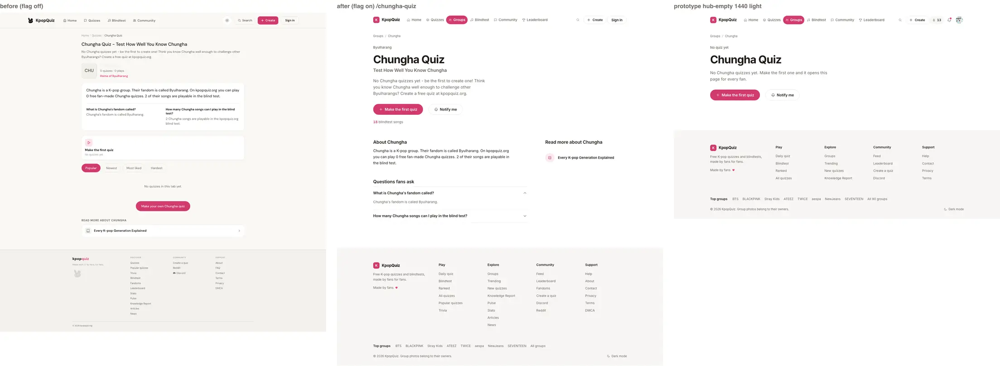 |
| hub-empty 1440 dark | 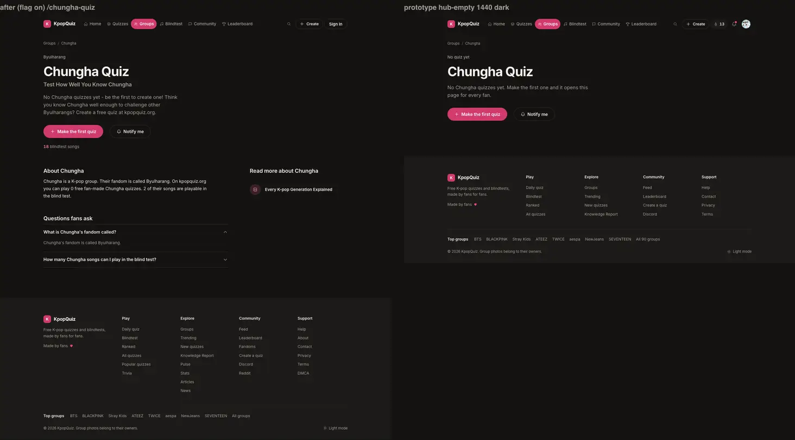 |
| hub-empty 390 light | 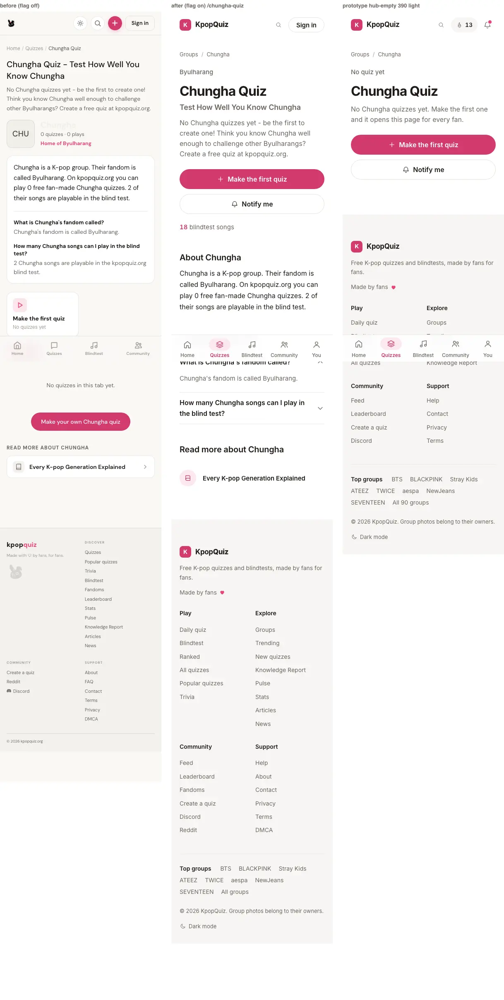 |
| hub-empty 390 dark | 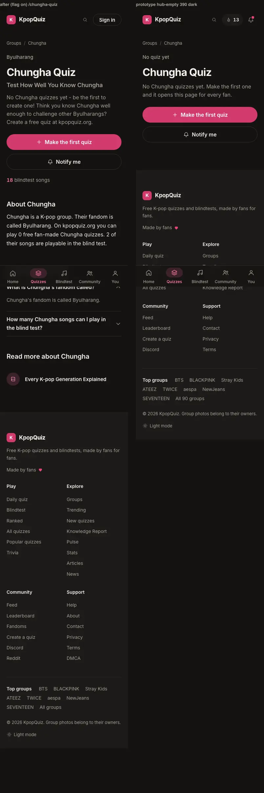 |

Computed styles vs `v11/checks/reference/styles.json` (C1 criterion), in `p3.spec.ts` at 1440 and 390, light and
dark: `.nav`, `.links a.on` (the Groups pill is active on `/groups`, the hubs and the trivia pages), `.sec-h h2`
(groups, hub-blackpink, hub-ateez), `.btn-primary` (Play the top quiz / Make the first quiz, 48px), `.tcard`
(width at 1440): see section 5 for the result.

Deliberate differences from the prototype, all forced by the SEO lock or real data: the H1 second line and the
longer intro (today's SEO texts), the /groups H1 "All K-pop groups" + intro + generation line (today's), the
visible crumb vs the kept BreadcrumbList, the About block's members / links, the FAQ has today's 5 to 10 questions
(the prototype's 8 are samples), and the side column's extra blocks (today's content and links that the link-set
rule keeps: newest quizzes, read more, fan knowledge with profile links, MV pulse).

## 3. Wiring proof

| Row (WIRING-MAP) | Wired to (real) | Proof | Status |
|---|---|---|---|
| 8 Breadcrumb, H1, intro | today's H1 text, today's `seo_intro` / `generateDefaultIntro`, today's BreadcrumbList | SEO diff SAME (h1, intro, JSON-LD); e2e H1 textContent + CollectionPage description = visible intro | done |
| 8 Photo hero | `public/idols/<Group>.jpg` (A0 `groupPhotoUrl`, 33 groups), next/image `sizes`; one column without a photo | e2e (img alt), screenshots (Chungha solo) | done |
| 8 Play the top quiz | `getQuizzesByGroup(id,'popular')[0]` (today's top quiz) | e2e href `/q/...` | done |
| 8 Blindtest N songs | `/blindtest/group-<slug>` (today's link); count from `songs` via `getAdvertisablePlaylists` (79 playable groups) | e2e href; facts line; SEO diff shows the link kept | done |
| 8 From the community | latest `quiz_comments` of the group's published quizzes (public, as on `/q`), flair via PersonName; All posts -> `/community` | e2e (rows link `/q/...` or the empty state), screenshots (ATEEZ rows) | done (posts feed = P8) |
| 8 Facts strip | roster count, `inception_date`, published count, playable songs; each hidden when unknown | unit `hubFacts`, e2e | done |
| 8 Updated month | `getGroupContentDate` (today's line and `<time>`) | SEO diff SAME (updated + dated content) | done |
| 8 Sort tabs | the live feed's 4 orders on the full published list | unit `sortHubQuizzes`, e2e (plays non-increasing, averages non-decreasing, aria-pressed) | done |
| 8 Type + level | types / levels present in the group | unit, e2e (every card of the picked type / level, "All" clears, keyboard) | done |
| 8 Quiz grid (avg %) | `total_score_sum / total_completions / question_count` | unit `averagePct`, e2e | done |
| 8 Show all N | native `<details>` (summary "Show all N") holding cards 13..N, all in the server HTML | e2e (card links = published count, 0 `noscript` links, no-JS context opens it natively, focus on card 13) | done (fix loop 1) |
| 8 FAQ (fact-gated) | today's `buildGroupFaqs` + W8 `buildAnswerChunks`, one list, FAQPage unchanged | SEO diff (FAQ pairs kept, W8 kept), e2e (FAQPage = visible text) | done |
| 8 Learn before you play | `/<slug>-trivia` when `hasTriviaPage` | e2e link, SEO link set | done |
| 8 Fandom war line | `getGroupWarRank`, `/leaderboard#fandom-war` | e2e | done |
| 8 Make a group quiz | `/create?group=<slug>` (About link; hero on empty hubs) | e2e | done (prefill = P5) |
| 8 Live room panel | rooms not shipped (16.7: removed until rooms ship) | - | not built |
| 8 Verse links | only for an open space (`verseSpaceOpen`: `verseHidden` / `spaceUnpublished`) | unit, e2e (no `/verse/` link on BLACKPINK / ATEEZ), dev HTML (BTS kept with VERSE_PUBLIC=true) | done (fix loop 1, C2-006) |
| v10 Split hero, 8 FAQ, trivia href, Show all N | server-rendered, counts from published quizzes | e2e, SEO diff | done |
| v10 Empty group | Make the first quiz + Notify me (pending migration); noindex NOT added | e2e (real route not live + stubbed toggle payloads `{ groupId, on }`, sign-in sheet X / Escape / backdrop + focus return) | done in code; store pending; noindex = owner decision 1 |
| 16.7 Groups index | filter, Most played hidden while filtering, A to Z, zero-quiz groups muted | e2e | done |

## 4. SEO diff and link set (flag off vs flag on)

`v11/reports/P3/seo-diff.mjs` (GET, Googlebot UA, scripts off). A = this branch built flag OFF (`next build` +
`next start` :4332), B = this branch built flag ON (:4333), same database, fetched together. Full output:
`v11/reports/P3/seo/seo-diff.txt` (+ `seo-diff-near-empty.txt`); both link sets per URL, every href:
`v11/reports/P3/seo/links-*.txt`.

| URL | title, description, robots, canonical, hreflang, og/twitter, JSON-LD, H1 | intro / genline / Updated / dated rows | FAQ pairs (off -> on) | W8 answer-first | link set off / on (unique hrefs) | lost | added |
|---|---|---|---|---|---|---|---|
| `/groups` | SAME | SAME | - | - | 85 / 143 | `/search` | 59 (the 46 empty hubs, 5 letters, shell) |
| `/blackpink-quiz` | SAME | SAME | 5 kept (10 shown) | lead + 7 kept | 62 / 76 | `/search` | 15 (`?page=2`, shell) |
| `/ateez-quiz` | SAME | SAME | 5 kept (10 shown) | lead + 7 kept | 58 / 73 | `/search` | 16 |
| `/bts-quiz` | SAME | SAME | 5 kept (10 shown) | lead + 7 kept | 65 / 80 | `/search` | 16 |
| `/cortis-quiz` (thin: placeholder fandom, no roster) | SAME | SAME | 2 kept | none today | 44 / 61 | `/search` | 18 (incl. `/blindtest/group-cortis`: playable in `songs`) |
| `/chungha-quiz` (no quiz) | SAME | SAME | - | lead + 2 kept | 24 / 39 | `/search` | 16 |
| `/hearts2hearts-quiz` (1 quiz, placeholder fandom) | SAME | SAME | 2 kept | none today | 26 / 41 | `/search` | 16 |
| `/akmu-quiz` (1 quiz) | SAME | SAME | 2 kept (3 shown) | lead + 1 kept | 25 / 41 | `/search` | 17 (incl. `/blindtest/group-akmu`) |
| `/blackpink-trivia` (today's page in the shell) | SAME | SAME | - | lead + 7 kept | 37 / 51 | `/search` | 15 |

"W8 answer-first kept": the flag-off question that the FAQ also asks ("What is BLACKPINK's fandom called?") is shown
once, with the FAQ answer (the one in the FAQPage JSON-LD); the W8 wording of that answer ("BLACKPINK's fandom is
called BLINK.") stays in the answer-first paragraph. The only lost link on every URL is `/search` (A0's shell;
request 1). Everything else in "added" is the shell's new links (`/community`, `/daily`, `/groups`, top groups,
`#main`, `/profile`, `/blindtest/ranked`) and P3 additions allowed by 16.10 (real hrefs for every group,
`?page=2`). The same diff on dev servers (and ATEEZ against kpopquiz.org, same flag-off code on main) gave the same
result before the builds.

## 5. Tests

Unit (vitest, `src/lib/ux-v1/p3/p3.test.ts`): **21 passed** after fix loop 1 (15 in phase 1; added: the /groups
directory numbers, intro and generation line, `read` / `failedReads` / `failClosed` at request time and at build,
`verseSpaceOpen`); P11's search tests, which import P3's index, pass too (52 with P3's). Phase 1 list: initials, hidden rows, A to Z order and anchor ids,
most played (published plays, no catch-all, no empty group), filter + count label, eyebrow (placeholder fandoms),
facts, average, the four sorts on a fixture (the live feed's rules), filters and present options, comment lines and
ages, the merged "Questions fans ask" (dedupe, FAQ answer wins, order, unknown questions last), the fail-soft
helpers of the Notify me route.

e2e after fix loop 1 (commit 53a4967, flag-on dev :3033 with a clean `.next`, retries 0): **39 passed, 0 failed,
0 flaky, 0 skipped** (5.3 min; 19 tests per width + setup). That covers the 88 x 138 tile, 12 visible cards, every
quiz as a card link, 0 `noscript` links, the no-JavaScript test, no `/verse/` link on a parked hub, the ATEEZ
comment door, and `styles.json` landmarks with 0 mismatches at 1440 and 390, light and dark. The run before it
(38.6 min, load average above 50) had 6 failures, and none of them was an assertion about this loop's changes. Four
were timeouts: a page that never finished loading on the loaded dev server. Two came from the stubbed "Notify me
live" route: the button never reached its live state, because the page's first render timed out before the stub
answered. The earlier runs of this loop (before 53a4967) passed 39 of 39 twice.

Phase 1: e2e `e2e/ux-v1/p3.spec.ts` (flag on, Chromium 1234, projects ux-1440 and ux-390, light and dark, every page under
`guardWrites`, retries 0): **35 passed, 0 failed, 0 flaky, 0 skipped** on the flag-on production build (`next start`
:4333, 57 s) and **35 passed** on the dev server :3033 (2.8 min); 17 tests per width + the setup project. Covered:
- `/groups`: SEO lock (title, description, canonical, H1, intro text pattern, BreadcrumbList), every visible group a
  `/<slug>-quiz` link (the count read from the page), no quarantine row, zero-quiz rows muted, letter anchors, 10 most
  played without the catch-all, active nav (Groups pill / Quizzes tab), no horizontal scroll, `styles.json`
  landmarks, `basicA11y`, axe, zero writes; the filter by keyboard (narrowing, count, Most played hidden, empty state,
  "/" typed stays text, clearing restores all).
- Hub (BLACKPINK): SEO lock (title, canonical, H1 textContent word for word, CollectionPage description = the visible
  intro, BreadcrumbList items, every FAQPage question visible with the same answer text, answers in the HTML, first
  open), hero (eyebrow, Play the top quiz `/q/...`, Blindtest `/blindtest/group-blackpink`, facts, photo alt), today's
  links (trivia, create, war, blind test, the three related hubs; no link to the parked Verse space), one real card
  link per published quiz (= the facts count) and no `<noscript>` link, landmarks, a11y, axe, zero writes; quizzes:
  12 visible cards, Show all label, Popular order (plays), Newest / Hardest (averages non-decreasing) / Most liked (aria-pressed, live region),
  Type dropdown (menu, first item focused, every card of the picked type, "All types" clears), Level by keyboard
  (Enter opens, arrows, Escape closes and returns focus), Show all (Enter on the summary: N cards, URL unchanged,
  focus on card 13, summary hidden, "N quizzes shown"); with JavaScript disabled: every card is a link, 12 visible,
  the summary opens the rest natively.
- Hub (ATEEZ): a question opens with Enter, community rows link `/q/...` (or the empty state, whose door is the top
  quiz, never "Start the first thread" for a parked space), no `/verse/` link, 3 fans also play with hub + top quiz
  links, war link, article link, landmarks.
- Empty hub (Chungha): SEO lock, Make the first quiz href, no quiz section, no community block, solo hero; the REAL
  notify route says not live and the click writes nothing; with the route stubbed live: the guest gets the sign-in
  sheet (Escape, X, backdrop close it, focus returns to the button), a fan toggles on then off (Enter) with the exact
  payloads `{ groupId, on: true }` / `{ groupId, on: false }` answered by the stub, zero writes reach the server.
- `/blackpink-trivia`: today's content inside the v11 shell, one H1, Groups pill, no horizontal scroll.
- Signed in (test user, read only, ux-1440 and ux-390): the account replaces Sign in, the real notify route says not
  live, the click opens no sheet and writes nothing, the hub renders; zero writes.

Prototype styles: every landmark comparison in the spec (`compareLandmarks` against `styles.json`: `.nav`,
`.links a.on`, `.sec-h h2`, `.btn-primary`, `.tcard` on the states groups, hub-blackpink, hub-ateez, hub-empty)
asserts `missing = []` and `mismatches = []`: 0 mismatches at 1440 and 390, light and dark, in both final runs.

Earlier runs on the loaded machine (load average 33 to 48) had failures that were all timeouts or a hub render that
lost a read (the dev server shares the production database; `safeFetch` falls back after 5 s). The spec now waits
for a COMPLETE hub (every data block of today's hub) and reloads otherwise; no assertion was relaxed.

Lint: `eslint-config-next` core-web-vitals + typescript on every P3 file: 0 problems (the only finding is an existing
`` warning in today's `group-quiz-page.tsx`, not changed). `tsc --noEmit`: 0 errors. Em / en dash grep on every
P3 file: none.

Data guard (read only, `apps/quiz/scripts/data-guard.ts`, 2026-09-26T02:35Z): profiles 258, quizzes 434, plays
67,715, quiz_comments 17, quiz_reactions 14, likes 2,833, follows 58, user_badges 1,404, creator_notifications 1,220,
notification_prefs 3, daily_blindtest_scores 84, daily_challenge_plays 0, blind_test_plays 140, activity_events
7,453, debate_votes 42: every count at or above P10's run (real players). The test user's own rows (read only):
`profiles.updated_at` 2026-09-22, `passport_snapshot_at` 2026-09-21, xp 32, 3 plays, 1 badge, 0 comments, following
2, 0 notifications; `group_quiz_alerts` does not exist (nothing stored).

## 6. Flag off = today's site

The flag-off code change is: an `if (UX_V1)` branch after today's read in `groups/page.tsx`, a `UX_V1 ?` choice in
`[slug]/page.tsx` (`-quiz` only), `export` on two builders of `group-quiz-page.tsx`, and imports of the P3 modules
(server components; the islands sit behind `next/dynamic` loaders).

Two production builds with the flag OFF (`next build`, then `next start`): A = the base `feat/ux-v1-v11` f054cd3
(:4331), B = this branch d4dcfea (:4332); render modes identical (`/groups` Static ISR 1 h, `/[slug]` SSG on
demand). A0's `flag-off-diff.mjs --structure`, pages fetched from A and B back to back:

```
IDENTICAL (structure)  /groups            status 200/200  normalised 125,135 = 125,135  js chunks 13/13
IDENTICAL (structure)  /blackpink-quiz    status 200/200  normalised  83,837 =  83,837  js chunks 13/13
IDENTICAL (structure)  /ateez-quiz        status 200/200  normalised 103,013 = 103,013  js chunks 13/13
IDENTICAL (structure)  /chungha-quiz      status 200/200  normalised  30,315 =  30,315  js chunks 13/13
IDENTICAL (structure)  /blackpink-trivia  status 200/200  normalised  75,946 =  75,946  js chunks 13/13
IDENTICAL (structure)  /bts-quiz          status 200/200  normalised  95,781 =  95,781  js chunks 13/13
IDENTICAL (structure)  /cortis-quiz       status 200/200  normalised  63,101 =  63,101  js chunks 13/13
all 7 pages identical after normalising build ids and hashed asset names
```

Byte level: the served HTML differs only in the RSC payload's client module ids (bundler numbering, e.g.
`I[42096,...]` vs `I[1485,...]`), as in A0's and P10's proofs. JS weight flag off (all `<script src>` chunks):

```
base /groups           13 files 685,837 B    P3 /groups           13 files 686,555 B   (+718 B)
base /blackpink-quiz   13 files 712,793 B    P3 /blackpink-quiz   13 files 713,551 B   (+758 B)
base /blackpink-trivia 13 files 712,793 B    P3 /blackpink-trivia 13 files 713,551 B   (+758 B)
```

The +0.7 KB is the three `next/dynamic` loader stubs (P10's loaders measured +1,091 B the same way); the islands
themselves are separate chunks that only flag-on pages load. Flag off, `GET /api/ux-v1/p3/notify` answers 404.

## 7. Not verified, and why

- Notify me writes (real `group_quiz_alerts` rows) and the delivery trigger: the table is a pending migration; the
  route's "not live" path is verified for real (guest and signed in), the "live" path only with stubbed responses
  (payload shapes, states, the sign-in sheet).
- A signed-in fan who already asked to be notified: needs the table.
- Real devices / Safari: Chromium only (the run's rule).
- The ISR risk the legacy hub already has: a read that fails during a render can bake a thin section into the
  hour-long ISR page, and today's `unstable_cache` reads that return `[]` on an error (for example the top fans of
  `getActiveFansByGroup`) keep that `[]` for an hour. P3's own reads throw on an empty read so they are never
  cached, and a failed full-list read never turns a hub into the empty state; today's reads are unchanged (not
  P3's files).
- The earlier e2e runs on the loaded machine (load average 33 to 48) failed only on timeouts; the final runs are
  green on dev and on the production build (section 5).

## 8. Open items and requests

- A0 request 1 (`v11/requests/P3.md`): the v11 shell has no `<a href="/search">`; it is the only link the P3 URLs
  lose (every page of the run loses it). Blocker by the link-set rule, outside P3's paths.
- `/community` (All posts) is P8's page. "Start the first thread" shows only for an open Verse space (C2-007) and
  opens P8's editor in Thread mode (fix 2, X1-005); a group preselect would need a `group=` param in P8's compose URL.
- The hub's Blindtest button opens `/blindtest/group-<slug>` (today's link): that legacy page's Play is the
  production bug ORCH recorded (RUN-STATE). A `?playlist=group-<slug>` deep link on the v11 `/blindtest` (P6) would
  let the hub start the run in the v11 game.
- From the community reads quiz comments until P8's posts exist (WIRING-MAP 8); switch the read to P8's feed when it
  lands (`lib/ux-v1/p3/data.ts` `getGroupComments`).
- Empty hubs follow the prototype (Make the first quiz + Notify me, no Blindtest button) even when the group has a
  playable blindtest (Chungha: "18 blindtest songs" in the facts). A Blindtest button there would link the legacy
  mode page (bug above); add it once the v11 deep link exists, if the owner wants it.

## 9. Owner decisions

1. Noindex for thin hubs: the worker prompt asks "noindex until 3 quizzes"; today's hubs have no robots rule, so it
   is an SEO diff outside 16.10 and is NOT shipped (brief). Note: the sitemap already leaves out hubs with
   `quiz_count` 0, and v11 `/groups` now links the 46 empty hubs (16.7: listed muted, open the empty page).
2. `groups.quiz_count` is stale (BTS 31 vs 27 published, BLACKPINK 29/24, Stray Kids 29/28, SEVENTEEN 11/10,
   ENHYPEN 8/7, ILLIT 7/6, ARTMS 5/4, BABYMONSTER 4/3, KATSEYE 2/1). Root cause, read in the database:
   `handle_new_quiz()` adds 1 on every quiz INSERT (drafts too) and nothing ever subtracts. The SEO-locked texts
   still read it (hub title "29+", intro "play 29+ free tests", FAQ "KpopQuiz has 29 ...", CollectionPage
   `numberOfItems`), so the page says 29 in those texts and 24 in the v11 counts. Fix (owner): recount the column
   and keep it in sync on publish / unpublish / delete, or switch those texts to the published count (flag off too).
3. Blind test counts in the SEO texts come from `blind_test_songs` (legacy, 349 rows: BLACKPINK 14, BTS 28, ATEEZ
   10), while the game plays from `songs` (18 each). v11 facts use `songs`; the FAQ / W8 texts are locked. Same fix
   path as 2.
4. `/groups` intro (locked) says "Every group with at least one quiz ... 44 groups ... each with ... its generation"
   while v11 lists the 90 visible groups (16.7) without a generation tag. Keep the text (today), or approve a new
   intro, e.g. "Every K-pop group on KpopQuiz, A to Z: 90 groups, 44 with free fan-made quizzes."
5. Hub crumb: v11 shows "Groups / <Group>" (prototype); the BreadcrumbList JSON-LD stays "Home > Quizzes > <Group>
   Quiz" (today's, SEO PR-I2). Align the JSON-LD to Groups or keep both.
6. Verse link: settled by ORCH in fix loop 1 (C2-006): the hub links `/verse/<slug>` only when the space is open.
   Flag off still links every roster group's space (a 404 for parked spaces, the teaser redirect while the Verse is
   hidden); the owner may want the same gate on today's hub.
7. Notify me: apply `docs/pending-migrations/v11-p3-group-quiz-alerts.sql` (table + RLS + delivery trigger), or
   only the table, or drop the feature (section 1).
8. Hub FAQ heading: v11 says "Questions fans ask" (prototype) instead of today's "BLACKPINK quiz: FAQ"; the questions
   and answers are unchanged.

## 10. Pending migration

`docs/pending-migrations/v11-p3-group-quiz-alerts.sql` (not applied): `group_quiz_alerts` (user_id, group_id,
created_at, notified_at; RLS: own rows only, nothing for anon), `notify_group_quiz_alerts()` (SECURITY DEFINER,
swallows every error) + two triggers on `quizzes` (insert published, status -> published); commented rollback.
