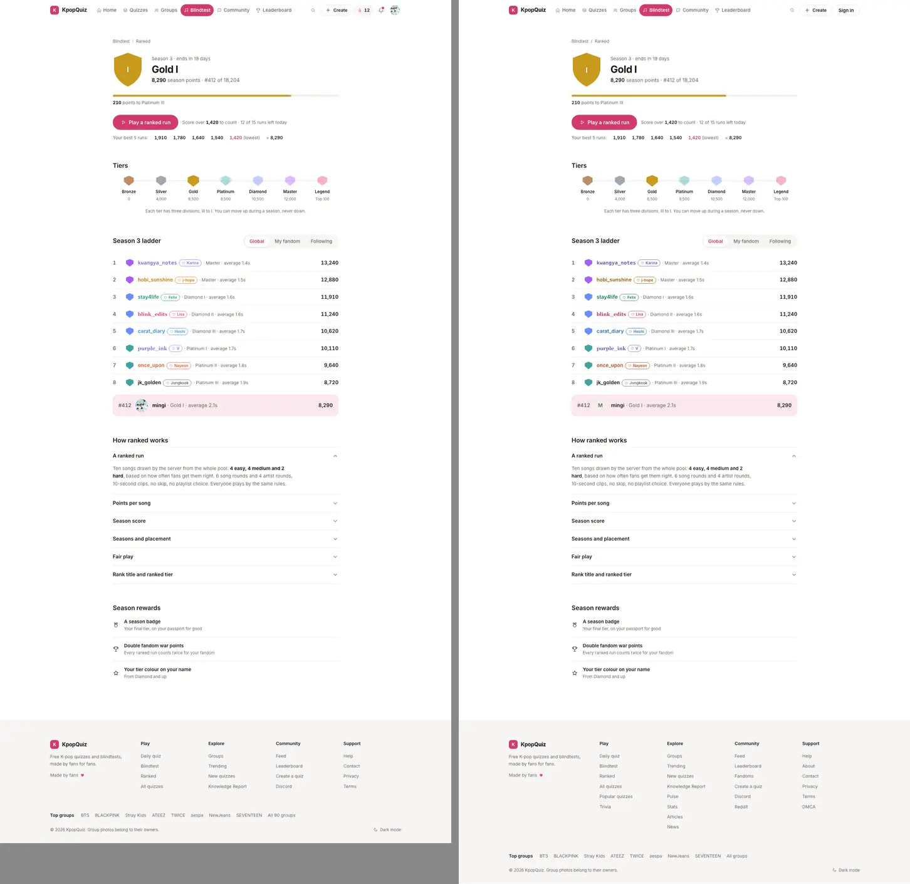
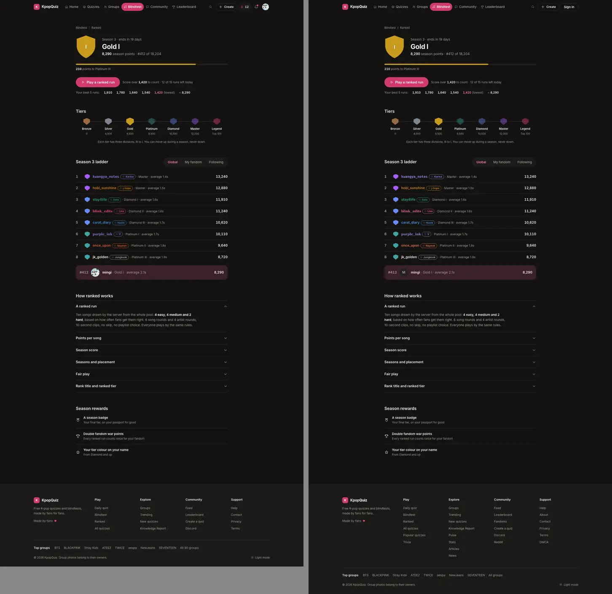
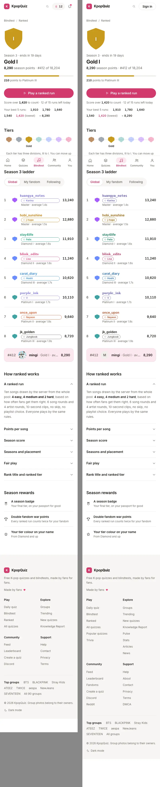
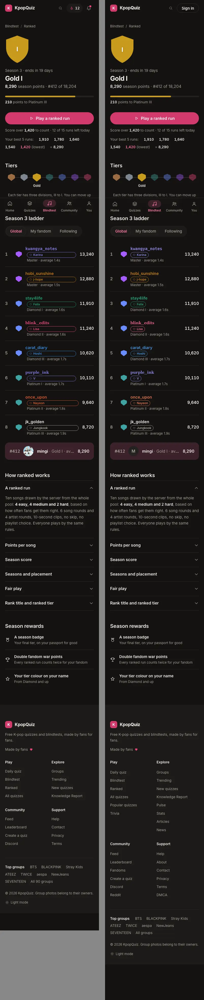
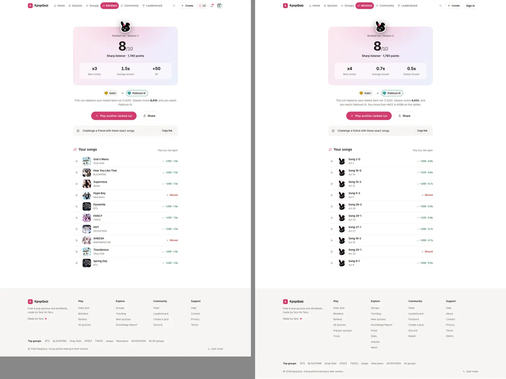
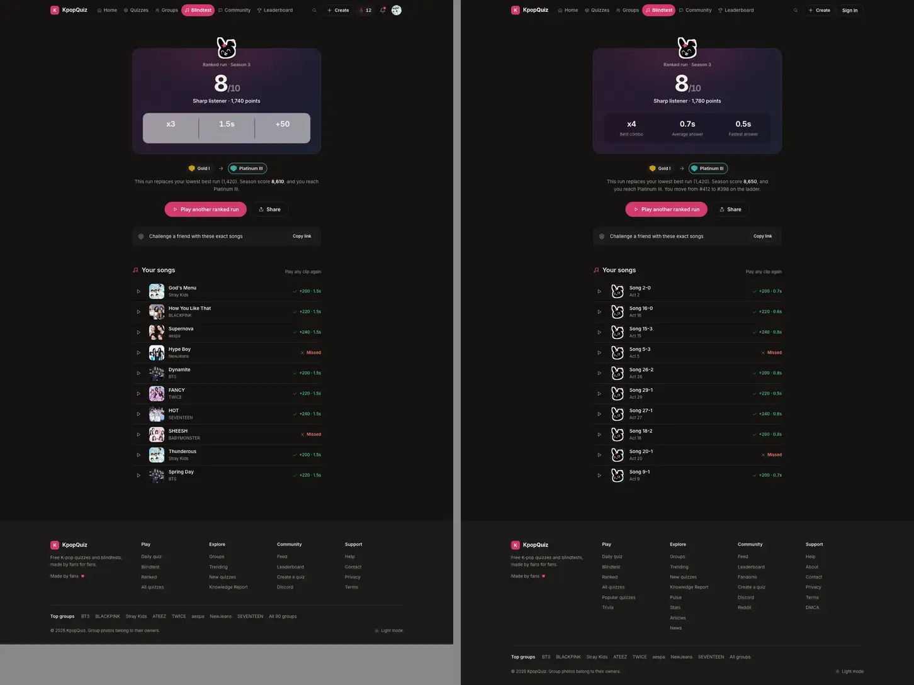
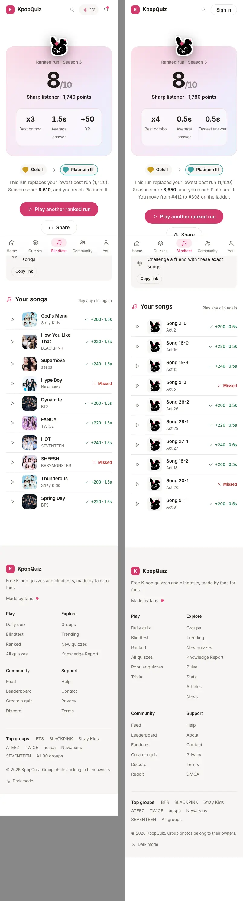
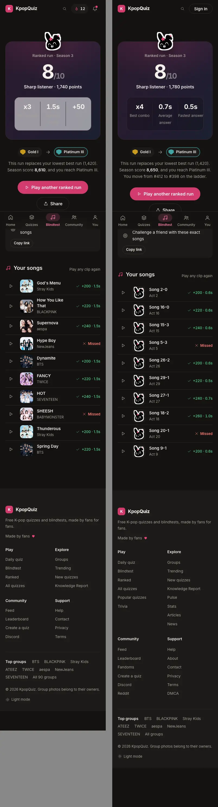
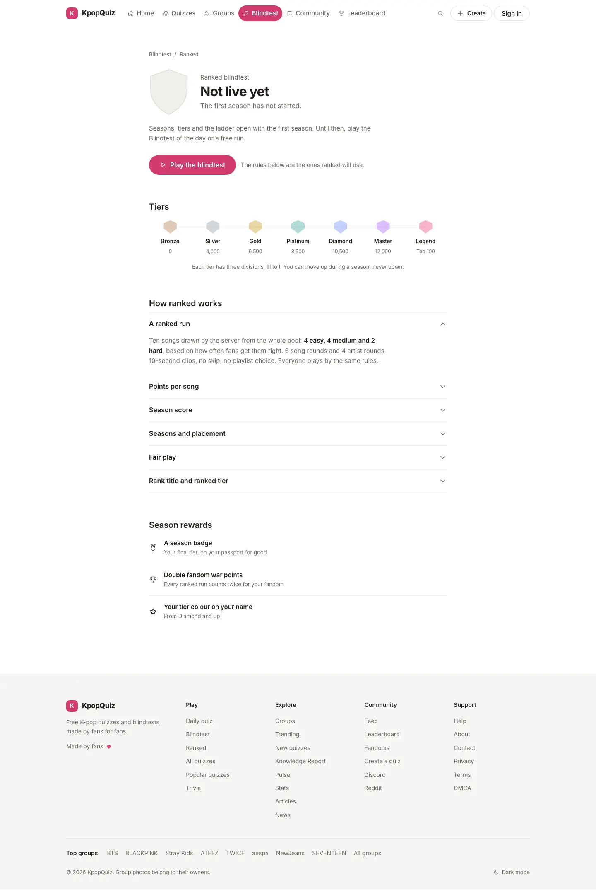
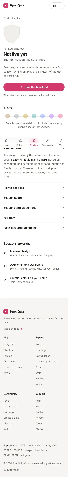

# P7 Ranked: report

## Progress

- **Done (pass 1, engine):** pure ranked engine in `apps/quiz/src/lib/ranked/`, fail-soft Supabase store, the
  `/api/ranked/*` routes, the pending migration `docs/pending-migrations/v11-p7-ranked.sql` (NOT applied).
- **Done (pass 2, UI, on A0's foundation):** `/blindtest/ranked` (flag off: 404 exactly like today; flag on: the
  page, noindex, out of the sitemap), the season card in every state (not live today, guest, placing, placed,
  no runs left, error), the tiers strip, the season ladder (Global / My fandom / Following, flair, pinned row) with
  its endpoint `GET /api/ranked/ladder`, How ranked works, Season rewards, and the ranked run on P6's `BtGame` +
  `BtResults` with the season impact block in the results `slot`. Checks: 245 vitest (engine + view models +
  render tests), e2e `p7.spec.ts` 35/35 (ux-1440 + ux-390, light + dark, guardWrites), every measured landmark of
  `#ranked` within 0.1px of the prototype at 1440 and 390, styles.json landmarks equal (page and btend-ranked),
  axe 0 serious / critical, tsc 0, eslint-config-next 0 problems on the 45 P7 files, flag-off diff and link set
  (section 6).
- **Next:** ORCH merge. At go-live (owner): apply the migration, insert season 1, then re-run `p7.spec.ts` and the
  populated pixel check against live data (NOT verified until then, section 7).
- **Blockers:** none. Ranked stays "Not live yet" (503) until the owner decisions of section 10.

## 1. Route shadowing (pass 1, re-checked)

`/blindtest/ranked` was a 404 before this work (`ranked` is not a `STATIC_MODES` id nor a `group-*` id, so
`/blindtest/[mode]` called `notFound()`). The static `app/(site)/blindtest/ranked/page.tsx` calls `notFound()` with
the flag off, so the URL still 404s; with the flag on it is the ranked page. No live page is shadowed;
`/blindtest/classic` and every other mode page are unchanged (section 6). `/pt/blindtest/ranked` is a 404 before
and after (no /pt mirror for a new noindex page; owner call, section 10).

## 2. What I built (pass 2)

| Area | Where |
|---|---|
| Page (server, static): crumb, card island, tiers, ladder island, How ranked works (6 native `<details>`, first open), Season rewards; `generateMetadata` = `{}` flag off, title "Ranked blindtest", robots noindex follow flag on | `app/(site)/blindtest/ranked/page.tsx`, `components/ranked/ux-v1/rules.tsx` |
| Client controller: reads `/api/ranked/me` + `/api/ranked/ladder`, owns the run, swaps the page for P6's game (focus mode) then P6's results | `components/ranked/ux-v1/controller.tsx`, `loader.tsx` (next/dynamic, A0's pattern) |
| Season card: shield (tier colour + division numeral), season line, H1 (the tier; "Not live yet", "Ranked blindtest", "3 / 5 placed" in the other states), points + ladder place, progress to the next division, Play a ranked run + score to beat + runs left, best 5 | `components/ranked/ux-v1/card.tsx` |
| Tiers strip (7 stops, current lit, passed dimmed; phones show only the current label, the others stay readable by screen readers) | `tiers.tsx`, `strip.tsx` |
| Ladder: Segmented Global / My fandom / Following, 8 rows (rank, tier gem, A0 `PersonName` with accent / font / bias chip and `/u/` link, tier + average, score), your row pinned (A0 `PinnedRow you`); hidden until someone is placed | `ladder.tsx` |
| Ranked run behind P6's `RunApi`: rounds released by `POST /api/ranked/run/start`, answers locked by `/answer` (server time check, server points, reveal), `/submit` at the end; quit, a lost connection or leaving the page closes the run (recorded) | `use-ranked-run.ts`, `api.ts` |
| Results: P6 `BtResults` with `kicker` "Ranked run · Season N", `slot` = season impact (tier chips before -> after on a promotion + the sentence), `primary` "Play another ranked run" (or "Back to ranked" at 0 runs left), `challenge` = P6's link with the run's songs | `controller.tsx`, `impact.tsx` |
| Ladder endpoint + SQL | `app/api/ranked/ladder/route.ts`, `lib/ranked/service.ts` `ladderView`, `public.ranked_ladder()` in the pending migration |
| View models (every number and sentence the page shows, from engine outputs) | `lib/ranked/view.ts` |
| Test fixtures (tests and e2e only): the prototype's sample season through the real engine; `FixtureRunServer` = the real run state machine | `lib/ranked/test-fixtures.ts` |
| Styles (not imported; A0's flag-gated route serves them) | `styles/ux-v1/p7.css` |

Copy is the prototype's; the only new lines are the states the prototype has no screen for (not live, guest,
placing, no runs left, errors) and they say only what is true.

## 3. Screenshots (prototype | implementation)

Implementation = the page fed with ENGINE OUTPUTS for the prototype's sample season (fixtures through stubbed
GETs; the run is a real state-machine run answered in the test). Live data does not exist yet (section 7).

| State | 1440 light | 1440 dark | 390 light | 390 dark |
|---|---|---|---|---|
| ranked (placed) |  |  |  |  |
| btend-ranked |  |  |  |  |
| not live (today, real API) |  | |  | |

Differences that are real data, not layout: the progress bar is the real distance to the next division (68.5% for
8,290 between Gold I at 7,834 and Platinum III at 8,500; the prototype's bar is a 79% sample), the third stat of
the results is "Fastest answer" (ranked awards no XP, section 10) where the prototype shows "+50 XP", the pinned
row shows the player's initial when there is no avatar, and the impact sentence adds the ladder move (15.4 "one
sentence (replaces your 5th best, ladder move)"). On phones the bias chip of a ladder row keeps its own width (the
prototype stretches it to the row).

## 4. Proofs

### 4.1 Landmark boxes vs the pinned prototype (C1 criterion)

A scratch measure (Chromium 1234, prototype `go('ranked')` vs the implementation with the sample season) of 23
landmarks (crumb, card, shield, season line, H1, points line, progress, next line, Play button, note, best 5,
Tiers H2, strip, current stop, help line, ladder header, ladder H2, segmented, first ladder row, pinned row, first
accordion, first reward row): **every box within 0.1px** (y, height, x, width) at 1440 and at 390.

### 4.2 e2e (`PLAYWRIGHT_BASE_URL=http://localhost:3037`, UX11_CHROMIUM, `--retries=0`)

```
npx playwright test e2e/ux-v1/p7.spec.ts --project=ux-1440 --project=ux-390
35 passed (setup + 17 per project; light and dark inside each)
```
Covered: not live (real API: title, noindex, one H1 "Not live yet", CTA to /blindtest, crumb, 7 stops none lit, no
ladder, 6 details first open, 3 rewards, no invented number, no horizontal scroll, basic a11y + axe, zero
writes); placed (card numbers, progress 68.5, score to beat, runs left, best 5 with the lowest flagged, Gold lit,
2 passed, ladder header, 8 rows with the profile link, accent class, bias chip, sub line, score, pinned #412,
styles.json landmarks `.sec-h h2` / `.btn-primary` / `.lrow` / `.pin` with width and height, axe); scopes (My
fandom without a main fandom = Settings link, Following = 3 rows ranked inside the scope + pinned #3, back to
Global; GET scope sequence); guest (H1, no numbers, 8 rows, no pin, sign-in sheet named "Sign in to play ranked",
Escape returns focus, My fandom asks to sign in, no ranked POST); placing; no runs left (button disabled); a full
run (focus mode, 10 segments, "Song 1 of 10", 8 right / 2 wrong, the reveal = the server's song, payloads in order:
issue, start {token, round} x10 interleaved with answer {token, round, choice, clientMs >= 300}, submit {token};
replay of the closed token refused by the engine; results kicker, 8/10, "Sharp listener · <engine points>
points", impact chips + sentence, Play another ranked run, challenge link, 10 song rows; styles.json landmarks of
btend-ranked `.btn-primary` / `.sec-h h2` / `.stats3`; axe); keys 1-4 + Enter; a 10 s timeout sends `{choice:
null, clientMs: null}`; Quit closes the run (engine status `quit`) with the toast "Run recorded with the songs you
answered"; a 429 start shows "No ranked runs left today. They come back at midnight UTC."; signed in as the test
user (real API): not live, zero writes. The only landmark property skipped: the dark results stats box
background (P6 decision 9).

### 4.3 Unit and render tests (vitest)

`vitest run src/lib/ranked src/components/ranked`: 11 files, **245 passed**. Pass 1's engine tables (211) plus
the ladder service (Global / fandom / following, guests, no user id in the answer), the view models (tier display
incl. Legend, ladder rows, card state, season line, progress, runs left, placement, best 5, the impact sentence
of the prototype and its variants) and **render tests** (`components/ranked/ux-v1/render.test.ts`): the card, the
ladder, the impact block and the rules sections server-rendered from engine outputs. What they prove: every
number and sentence on the page is the engine's, formatted as the prototype, in the right element (one H1, best 5
with the lowest flagged, flair and pinned row, the impact sentence "This run replaces your lowest best run
(1,420). Season score 8,610, and you reach Platinum III."). What they do not prove: pixels (4.1, 4.2) and live data
(section 7).

### 4.4 SQL (local throwaway Postgres 14, stub of the production tables; never production)

The migration applies and re-applies idempotently; pass 1's function checks plus `ranked_ladder()`: Global,
fandom (players with the asking player's main fandom), following (+ self), limit keeps the asking player's row,
banned accounts drop out of the standings (and so of Legend); anon cannot read the new tables nor execute.

### 4.5 Build hygiene

tsc 0; eslint-config-next (core-web-vitals + typescript) 0 problems on the 45 P7 files; no em / en dash in P7
paths; no new dependency; `p7.css` imported nowhere; data guard (read only) before / after in section 6.

## 5. Wiring (WIRING-MAP 14 + v10 + v11 rows)

| Row | Wired to | Status |
|---|---|---|
| Play a ranked run | `POST /api/ranked/run` (server draw 4/4/2, 6 + 4 rounds), then per round `/start` and `/answer`, then `/submit` | e2e payloads; server side = engine tests; live: 503 until the migration |
| Submit run (server recompute) | `/api/ranked/run/submit` -> `finalizeRun` + `ranked_finalize_run()` | engine + SQL tests |
| Daily cap 15 | `ranked_issue_run()` (atomic) + card "N of 15 runs left today" + 429 toast | tests |
| Quit = recorded | Quit button, lost connection, leaving the page -> submit; else next start / nightly | e2e (quit) + engine |
| Season score / best 5 / target | `/api/ranked/me` (`seasonCard`) | e2e (fixture) + render |
| Tiers + divisions, Legend | `tierFor`, `nextStep`, legends table (nightly) | tests |
| Ladder Global / My fandom / Following | `GET /api/ranked/ladder?scope=` -> `ranked_ladder()` (fandom = main ult group, following = follows) | e2e + service + SQL |
| Your card (tier, score, best 5, progress) | `/api/ranked/me` | e2e + render |
| Season impact on results | submit answer (`applyRun` + ladder before / after) in P6's `slot` | e2e + render |
| Placement 3/5 | `placement()` | e2e + render |
| Rewards | static rules text; the rewards themselves are NOT built (section 10) | owner |
| Rank title card | not on this page (P6 shows the rank title where `bt_players` has a row) | n/a |

## 6. Flag off, SEO and the link set

See 6.1 to 6.3 (filled from the flag-off production builds).

## 7. NOT verified, and why

- The populated page and results against LIVE data: `ranked_*` tables do not exist in production (migration
  pending), so every live call answers 503. Proven instead with engine fixtures (sections 3, 4); re-run
  `p7.spec.ts` and a live pixel check after go-live.
- The SQL functions on the production database (only on a local stub).
- Real Deezer previews in a ranked run (the fixture pool plays a silent clip; the audio path is P6's player).
- The nightly job (documented, not scheduled).
- Signed-in populated states as the test user (the test user has no ranked data; reads only).

## 8. Open items

- The live season card after a run refreshes from `/api/ranked/me`; the ladder refreshes with it.
- `/pt/blindtest/ranked`: none (owner call).

## 9. Requests to A0

None. P6's `BtGame`, `BtResults` and `BtChallengeLink` are used as they are (no P6 file edited).

## 10. Owner decisions

1. Ranked go-live: apply `docs/pending-migrations/v11-p7-ranked.sql` (after the backup point), insert the season 1
   row (commented statement in the file), enable the nightly job (one line in `apps/quiz/vercel.json`, needs
   `CRON_SECRET`), flag on.
2. Season rewards are shown as designed (prototype) but NOT built: season badge rows, double fandom war points for
   ranked runs, tier colour on the name from Diamond. Build them before the first season ends, or hide the
   section.
3. Should a ranked run award bt XP (rank title) and / or profile XP? Default: no (results show "Fastest answer").
4. `ranked_plays_insert` is open to PUBLIC since migration 059 (forged rows possible); the engine never reads
   scores from it. Tightening = RLS change on an existing table, owner only.
5. `/blindtest/ranked` is noindex and out of the sitemap; a `/pt` mirror does not exist.
6. Data: `songs` has no accuracy stats; the 4/4/2 draw uses the curated `songs.tier` until ranked answers build
   up `ranked_song_stats`.

## Pass 1 reference (engine)

### Engine API

All in `apps/quiz/src/lib/ranked/`. Numbers live in `constants.ts`.

| Module | What it does |
|---|---|
| `scoring.ts` | `speedBonus(ms)`: 100 under 2 s, then `round(100 x (10 - t) / 8)`, 0 at 10 s. `comboTenths(streak)`: x1.0 on the first right answer, +0.1 per right answer in a row, cap x2.0. `scoreRound`, `scoreRun` (quit run: missing rounds score 0), `maxRunPoints()` = 2,900. Integer-exact (tenths), round half up. |
| `tiers.ts` | `TIERS`, `tierFor(score)` with III/II/I as integer-exact thirds, `tierSteps()` (16 steps), `nextStep(score)`, `isPromotion`. |
| `season.ts` | best 5 (equal points: the earlier run keeps its place), `scoreToBeat`, `seasonAvgAnswerMs`, `placement`, `applyRun` (season impact), season calendar (56 days). |
| `limits.ts` | 15 runs STARTED per UTC day. |
| `timing.ts` | rejects `invalid_time`, `too_fast` (< 300 ms), `over_round` (> 10 s), `ahead_of_server` (+250 ms); effective = max(client, server - 1,500 ms); >= 10 s = timeout. |
| `ladder.ts` | order: score, average answer time, reached first, id; placed players only; Legend = top 100 Masters. |
| `select.ts` | difficulty by ranked accuracy (20 answers) else `songs.tier`; exact 4/4/2, distinct acts and titles; 6 song + 4 artist rounds; distractors from the pool. |
| `run.ts` | single-use state machine: start, answer, finalize; refusals `run_finished`, `run_expired`, `out_of_order`, `round_open`, `not_started`, `already_answered`, `invalid_choice` + timing. |
| `service.ts` | `issueRun`, `releaseRound`, `lockAnswer`, `submitRun`, `seasonCard`, `ladderView`, `runNightly` over a `RankedStore`. |
| `db.ts` / `http.ts` | Supabase store (service role, fail soft) and the route wrapper (flag 404, read-only liveness probe 503, auth 401). |
| `view.ts` | the page's view models (pass 2). |

### HTTP (all `force-dynamic`, `Cache-Control: no-store`)

| Route | Body | Returns |
|---|---|---|
| `POST /api/ranked/run` | none (signed in) | `{token, season, rounds, roundMs, expiresAt, runsToday, runsLeft}`; 429 `daily_limit`; 409 `run_in_progress` |
| `POST /api/ranked/run/start` | `{token, round}` | `{round, of, kind, prompt, choices[4], previewUrl, roundMs}` (never the answer) |
| `POST /api/ranked/run/answer` | `{token, round, choice or null, clientMs}` | reveal: correct, correctIndex, effectiveMs, points, speedBonus, comboTenths, streak, totalPoints, song, last; 422 impossible timing |
| `POST /api/ranked/run/submit` | `{token}` | status, points, correct, total, bestCombo, avgAnswerMs, songs, impact, ladder; replay 409 |
| `GET /api/ranked/me` | none | season (+ the player's card when signed in) |
| `GET /api/ranked/ladder?scope=` | none | `{season, scope, rows (top 8), me, total, needs}` (pass 2) |
| `GET /api/ranked/cron/nightly` | cron auth | expired runs closed + `ranked_nightly()`; not scheduled |

### Migration summary (`docs/pending-migrations/v11-p7-ranked.sql`, not applied)

Additive only, one transaction, commented rollback: `ranked_seasons`, `ranked_runs` (the run token),
`ranked_song_stats`, `ranked_legends`; `ranked_plays.season` + `run_token` (unique, FK) + index
`(player_id, season, score desc)`; eight service_role-only functions (issue, finalize, standings, player standing,
ladder, legends, season roll, nightly). RLS on every new table, no policy. Nightly job documented, not enabled.
