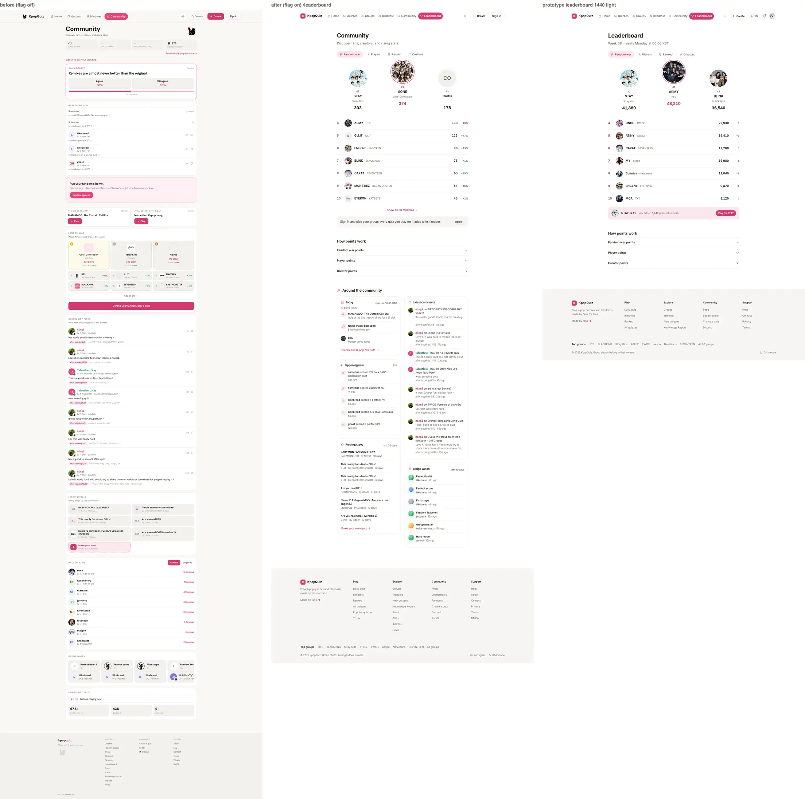
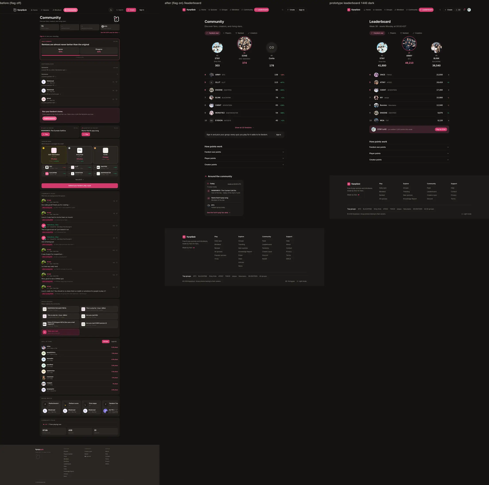
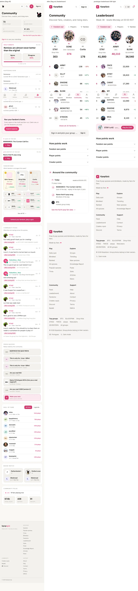
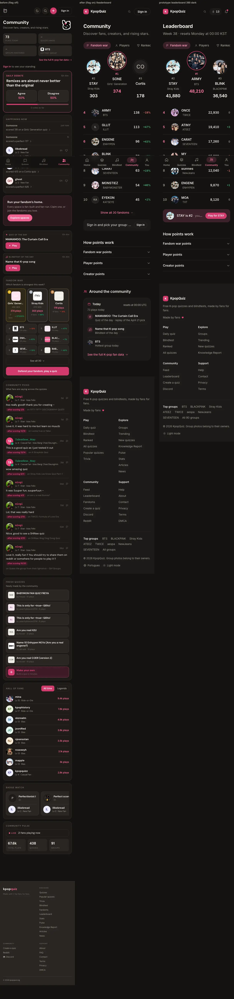
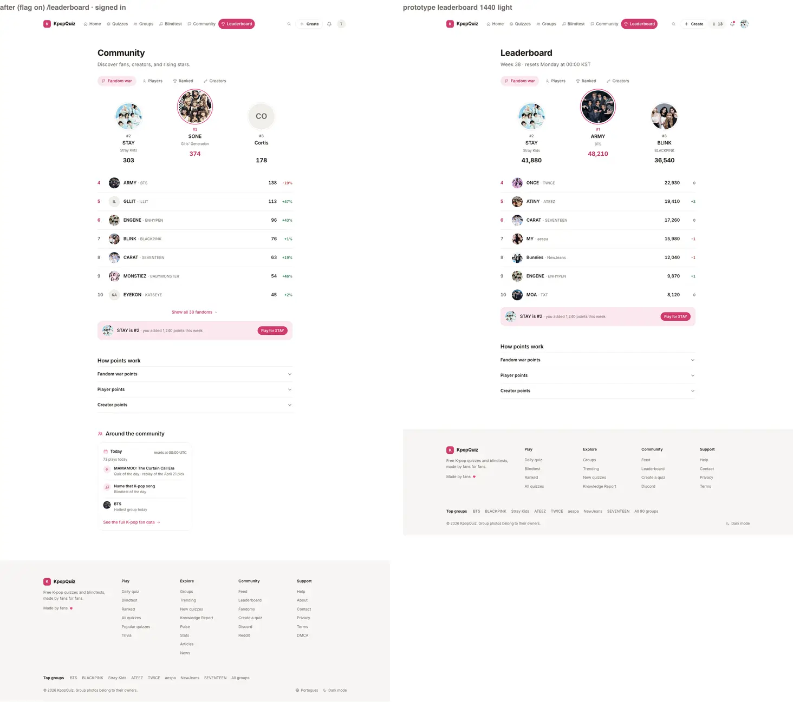
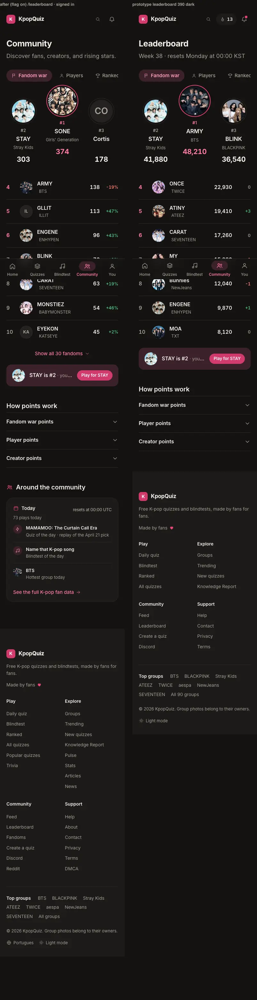
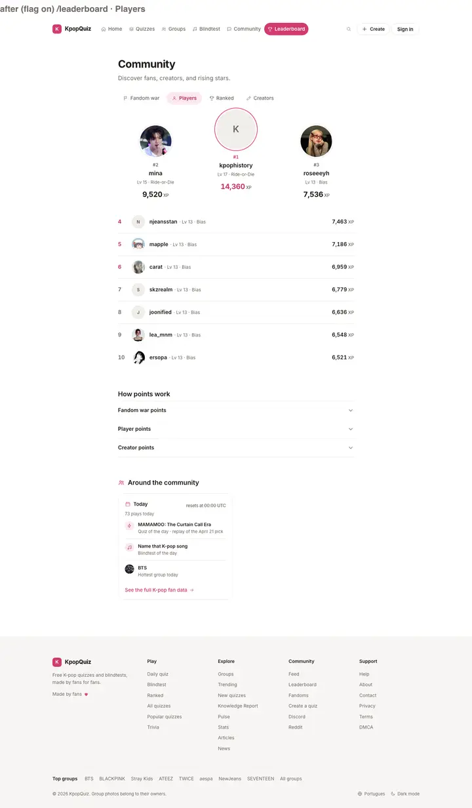
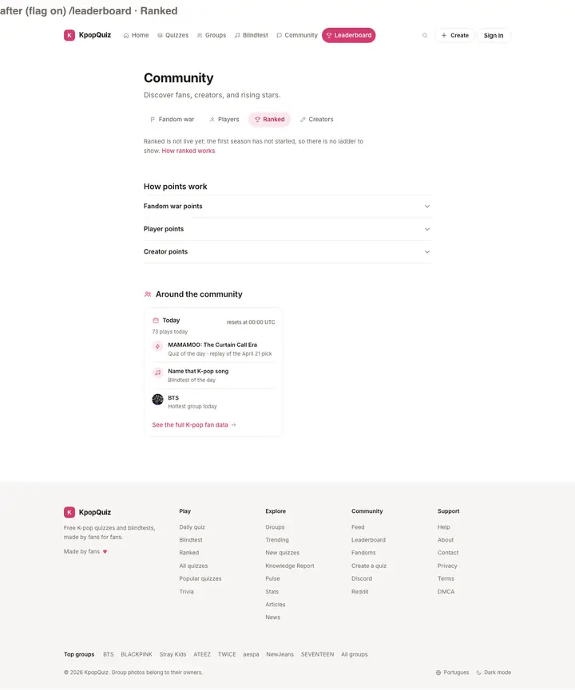
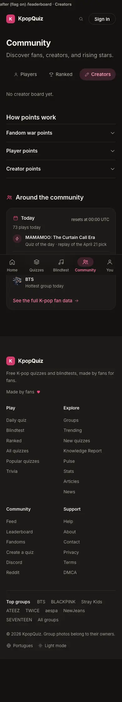

# P9 Leaderboard report (UX v11.2)

## Progress

- Done: `/leaderboard` v11 behind `NEXT_PUBLIC_UX_V1` (flag off: `CommunityContent` exactly as before): tabs Fandom
  war / Players / Ranked / Creators (A0 `UxTabs`), frameless podium, rows with the change since last week, pinned
  "you" rows (A0 `PinnedRow`, client islands + read-only `GET /api/ux-v1/p9/standing`), How points work with the
  real rules, Ranked's truthful not-live state on P7's API, and "Around the community" so every link of the live
  page is kept. Checks (section 5): landmarks 0.0px vs the prototype down to row 10 (the pin and How points work
  52px lower: the fold of the real 30-fandom board); `styles.json` 0 mismatches; e2e 41/41 on the flag-on
  production build; SEO identical and 0 lost links flag on vs off; flag off identical in structure on 5 URLs;
  whole-app tsc 0, eslint 0, vitest 767/767, axe 0 serious / critical. Merged `origin/feat/ux-v1-v11` b3d9e36.
- Next: ORCH merge (PR #54, https://github.com/P-Mingi/KpopQuizzV2/pull/54); owner decisions in section 9.
- Blockers: none.

## 1. What I built

| Area | Where |
|---|---|
| Flag branch on the route (metadata, canonical, `revalidate = 300` untouched; flag off renders `CommunityContent`) | `src/app/(site)/leaderboard/page.tsx` |
| Page body (server, static/ISR): the live H1 and intro (SEO lock), the four tabs, How points work, Around the community | `src/components/leaderboard/ux-v1/leaderboard.tsx` |
| Podium (DOM order #1, #2, #3; the grid puts #1 in the centre, raised 24px, pink ring and points) and rows (rank, avatar, name + sub, points, weekly change); group photos from `public/idols` through next/image, else initials | `board.tsx` |
| Fandom war (30 groups: podium, rows 4 to 10, rows 11 to 30 in a native `<details>` fold), Players (all-time XP), Creators (plays received; This week and Rising only when they clear the floor) | `panes.tsx`, `creators.tsx` |
| Tabs: A0 `UxTabs` (role=tab, arrow keys, Home / End), every pane server-rendered, the others `hidden`; `#fandom-war` / `#players` / `#ranked` / `#creators` open their tab (on load and on hash change) and the URL follows the tab | `tabs.tsx`, `tab-context.ts` |
| Pinned "you" rows (war: your main fandom's rank + the points you added this week + Play for it; players: your XP rank; creators: your plays-received rank), guest war pin with the sign-in sheet ("Join the fandom war") | `pins.tsx` |
| Ranked tab: P7's API as it is (`GET /api/ranked/me` + `/api/ranked/ladder?scope=global`), called once when the tab opens; not live today (503) = a plain sentence + How ranked works; live = season line, podium, rows, your row | `ranked.tsx` |
| How points work: three native `<details>` with the real rules (section 4) | `points.tsx` |
| Around the community: the live page's other blocks (today's numbers + daily quiz + daily blindtest + hottest group + `/stats`, Happening now, Fresh quizzes + `/create`, Latest comments, Badge watch) as v11 rail panels, each with the live floor | `around.tsx` |
| Islands behind next/dynamic (flag off: only the loader's bytes) | `islands.tsx` |
| Fail soft, and truthful about it: a board whose read fails or times out (safeFetch, 5 s) says "This board could not load right now. It refreshes within a few minutes." instead of an empty "nobody yet" board (seen live under this machine's load: the ISR regeneration timed out three reads once); a real zero keeps its own sentence; the community panels hide as on the live page | `leaderboard.tsx`, `panes.tsx` |
| Reads (public, cookie-free, cached; the live queries at the live sizes) and pure view helpers | `src/lib/ux-v1/p9/data.ts`, `format.ts` |
| Read-only standing endpoint (session read, head counts, 404 flag off) | `src/app/api/ux-v1/p9/standing/route.ts`, `src/lib/ux-v1/p9/standing.ts` |
| Styles (not imported; A0's flag-gated route serves them) | `src/styles/ux-v1/p9.css` |
| Tests | `src/lib/ux-v1/p9/p9.test.ts` (13), `src/components/leaderboard/ux-v1/render.test.ts` (16), `e2e/ux-v1/p9.spec.ts` (20 cases x 2 widths + setup) |
| Report tools | `v11/reports/P9/make-shots.mjs`, `v11/reports/P9/seo-diff.mjs` |

Nothing in `components/community/` was edited: the live page's components keep serving the flag-off page. The
v11 page reuses their reads and rules (`getFandomWarMap`, `getTopCreatorsAllTime` / `ThisWeek`,
`getRisingCreators`, `getHappeningNow`, `getCommunityComments`, `getNewQuizzes`, `getLatestBadgeEarns`,
`getTodayStats`, the quiz of the day, `YourStanding`'s fandom match) with the prototype's markup; their legacy
markup (inline styles on legacy tokens) is not the prototype.

## 2. Screenshots (before = flag off | after = flag on | prototype)

Full pages from production builds (`next build` + `next start`: before = the base `feat/ux-v1-v11` 89e1e94 flag
off, after = this branch flag on), real data (names, photos and numbers differ from the prototype's samples by
design), made by `P9/make-shots.mjs` (read only: every mutating request is answered locally; none was attempted).

| State | Image |
|---|---|
| Fandom war, guest, 1440 light |  |
| Fandom war, guest, 1440 dark |  |
| Fandom war, guest, 390 light |  |
| Fandom war, guest, 390 dark |  |
| Signed in with a main fandom (the prototype's state; standing fixture), 1440 light |  |
| Signed in with a main fandom, 390 dark |  |
| Players, 1440 light (after only) |  |
| Ranked, not live today, 1440 light (after only) |  |
| Creators, 390 dark (after only) |  |

Differences that are real data or rules, not layout: the H1 and the intro are the live page's (SEO lock, 9.1); the
board holds the live war map's 30 fandoms, so "Show all 30 fandoms" sits under row 10 and the pinned row and How
points work come 52px lower than in the prototype (section 5.1); the change column is the real percent ("-29%",
"new") instead of rank moves (9.4); points are the real quiz plays of the last 7 days; a group without a photo in
`public/idols` shows its initials and a fandom without a name shows the group name (4); below How points work sits
"Around the community" (9.2).

## 3. Wiring (WIRING-MAP 10 + v10 / v11 rows)

| Row | Wired to | Proof |
|---|---|---|
| Fandom war podium + board + weekly change | `getFandomWarMap(90)` (the war map RPC `get_fandom_war_map`, 1 h cache, the same entry as `getGroupWarRank`), top 30 as the live page; fandom names from `groups.fandom_name`; the change = the live percent vs the 7 days before | e2e (hub links = the live RPC read), render test |
| Your fandom (the war pin) | `GET /api/ux-v1/p9/standing`: `profiles.ult_groups[0]` (P7 / P10's main fandom), its rank on the same board, your quiz plays on its quizzes in the war's 7-day window | e2e (test user: no main group = Settings pin; fixture fan: "STAY is #2 · you added 1,240 points this week", Play for STAY) + read-only probe of the query shape |
| How points work | the real rules (section 4), sentence by sentence against the code | render test + e2e |
| Players tab | `profiles` by all-time XP (`xp > 0`, the live Legends board's filter and order), level from `getLevelInfo`, main fandom name | e2e (top 3 = a live anon read) |
| Your rank (players pin) | standing endpoint: 1 + profiles with more XP (head count) | e2e (= a live anon count) |
| Creators tab | `getTopCreatorsAllTime` (plays received), `getTopCreatorsThisWeek`, `getRisingCreators` (the live Hall of Fame's boards) | e2e (top 3 = a live anon read), render test |
| Ranked tab | P7's `GET /api/ranked/me` + `GET /api/ranked/ladder?scope=global` (read only), once, when the tab opens | e2e (real: 503 not live; fixture: P7 engine outputs) |
| Guest pin -> sign-in sheet | A0 `useSignIn()` ("Join the fandom war") | e2e (X, Escape, backdrop, focus return) |
| Last weeks (13.5) | not built: not in the v11 prototype | - |
| Streak leaders (13.5) | not built: not in the v11 prototype | - |
| WIRING-MAP "Players tab: weekly-leaderboard-padding.ts" | NOT used: that helper pads boards with FAKE_USERS (made-up fan names); the v11 board reads real XP only (section 9) | code |

## 4. Data truths behind the copy (DESIGN-SPEC 13.5: "confirm the real scoring rules")

- Fandom war points: `get_fandom_war_map` (migration 107) counts `plays` rows on quizzes of the group over the last
  7 days (`now() - interval '7 days'`, rolling, not a Monday reset), guests and replays included (`count(*)`), fans
  = distinct signed-in players. A `plays` row is written by `record_play` when a quiz is finished. The general
  K-pop bucket is excluded from the board (`NON_FANDOM_SLUGS`); blindtests are not in `plays`. `getFandomWarMap`
  caches the board for 1 h. So the page says: 1 point per finished quiz about the group, last 7 days, updated every
  hour, blindtests and general K-pop quizzes do not count. The prototype's 10 / +5 / 20 / x2 rules and the "resets
  Monday at 00:00 KST" line are not real and are not shown.
- The change since last week: the live war map's percent (`(week - prev) / prev`), "new" when the group had no
  plays the week before. The prototype's +3 / -1 are rank moves; the RPC only returns groups with plays this week,
  so a past rank cannot be computed exactly and is not invented.
- Player points: `profiles.xp` is all-time (no XP history table exists), so the board is all-time XP, not "XP
  this week". XP sources checked: `/api/quiz/[id]/play` (10, +5 at 70%, +15 perfect, first completion only; +1 to
  the creator per play by someone else until 500 plays), `/api/daily/complete` (streak: 5 a day + 3 / 7 / 14 / 30
  day bonuses), `/api/quiz/create` (25, 75 for the first quiz).
- Creator points: `profiles.total_plays_received` (+1 on every play of the creator's quizzes, `record_play`).
  "This week" = plays of quizzes published in the last 7 days (`getTopCreatorsThisWeek`, 3 creators today: below
  the floor, not offered); "Rising" = `get_rising_creators`, which answers PGRST202 (function missing) in
  production: migration 097 is not applied there (section 9), so the live Hall of Fame's Rising tab is empty too.
- Fandom names: `groups.fandom_name` defaults to `'fan'` (19 groups, Cortis among them): shown as unknown (the group
  name big, its generation small), never "fan is #3".

## 5. Checks

### 5.1 Landmark boxes vs the pinned prototype (`P9/proofs/landmarks.md`, `P9/landmarks.mjs`)

Prototype `go('leaderboard')` (signed in, and guest) vs the flag-on production build (signed in with a main fandom
through a standing fixture, and guest), 1440 x 900 and 390 x 844: H1, intro, tabs, selected tab, podium, podium #1,
both photo sizes, podium points, rows, row 4, row 10: **0.0px** difference (x, y, width, height). The pinned row,
How points work and the first rule sit **52px lower** (same sizes): the "Show all 30 fandoms" fold (44px + 8px)
under row 10 holds rows 11 to 30 of the real board (the live war map's 30 groups, whose hub links the link-set
rule keeps; the prototype has 10 sample fandoms). The guest pin is 60px at 1440 like the prototype's guest pin.

Computed styles vs `styles.json` (`leaderboard` state), asserted in `p9.spec.ts` at 1440 and 390, light and dark:
`.nav`, `.utabs button.on` (width and height), `.lrow` (width and height), `.pin` (width and height, the
signed-in pin), `.btn-primary` (Play for STAY; at 390 the height is skipped: the reference was captured with a fine
pointer, 32px, while the prototype's own coarse-pointer rule makes it 40px on phones): 0 mismatches.

### 5.2 e2e `e2e/ux-v1/p9.spec.ts` (flag on, `guardWrites` on every page, retries 0)

```
dev server :3039 (webpack)                     ux-1440 21/21, ux-390 21/21
flag-on production build (next start :4393)    41 passed (setup + 20 x 2)   P9/proofs/e2e-flag-on-build.txt
```
Covered, light and dark: SEO lock (title, description, canonical, hreflang, no robots, one H1 "Community", the
intro); four tabs, one selected, every pane in the HTML; podium order (#2 left, #1 centre raised, #3 right) with
DOM order #1, #2, #3; the 30 hub links = a live read of `get_fandom_war_map`; rows 4 to 10 (ranks 4 to 6
pink-ink), the fold (mouse and Enter, "Show all N fandoms" / "Show fewer"); the weekly change (sign or "new" + words
for screen readers); the guest pin and its sheet ("Join the fandom war": X, Escape and backdrop close, focus
returns); tabs by keyboard (arrows, Home, End), the URL hash follows, `#players` and `#fandom-war` deep links;
Players (top 3 = a live anon read, `/u/` links, "Lv N · ..." lines, XP unit, no guest pin); Creators (top 3 = a
live anon read, quizzes line, plays unit, the switch only with 2+ boards); Ranked not live (real API: the two GETs
happen only when the tab opens; the sentence and the How ranked works link; no number); Ranked live (P7 engine
outputs: season line, podium with tier gems, rows, your pinned row); How points work (three closed native
folds, mouse, Enter, Space, the real rule sentences, no dash); Around the community (only the live page's kinds of
links, every panel non-empty); signed in as the test user (read only): `GET /api/ux-v1/p9/standing` = the test
user, its player rank = 1 + a live anon count of profiles with more XP, the war pin (Settings: no main group), the
players pin (#rank, name, level line, XP), the creators pin ("You have not published a quiz yet" + Create a quiz),
one standing read per page, zero write attempts; a fan with a main fandom (standing fixture): "STAY is #2 · you
added 1,240 points this week", Play for STAY (the one filled pink button), the group photo, `#212` / `#38` pins;
no horizontal scroll; `basicA11y`; axe serious / critical = 0 on the page, the Players and Creators panes, Around
the community and the Ranked pane.

### 5.3 SEO + link set, flag on vs flag off (`P9/proofs/seo-link-diff.txt`, `P9/seo-diff.mjs`)

Production builds fetched back to back, server HTML without JavaScript:

| URL | SEO items (title, description, robots, canonical, hreflang, og, twitter, H1, intro, JSON-LD) | Links flag off | Links flag on | Lost |
|---|---|---:|---:|---|
| `/leaderboard` | identical | 84 (22 site, 30 hubs, 15 profiles, 15 quizzes, 2 external) | 97 (30 site, 30 hubs, 20 profiles, 15 quizzes, 2 external) | none |
| `/pt/leaderboard` (unowned) | identical | 25 | 41 | none |

Added on `/leaderboard`: the v11 shell's (`#main`, `/groups`, `/community`, `/daily`, `/blindtest/ranked`,
`/trending`, `/new`, `/profile`) and five more creator passports (the boards show 10 where the live Hall of Fame
shows 8). `/search` is kept (A0's shell fix, merged).

### 5.4 Flag off = today's site (`P9/proofs/flag-off.txt`)

Two production builds with the flag OFF: A = base `feat/ux-v1-v11` 89e1e94 (git archive), B = this branch; A0's
`flag-off-diff.mjs --structure`: `/leaderboard`, `/pt/leaderboard`, `/`, `/quizzes`, `/blindtest` **identical**
(DOM, head, meta, canonical, JSON-LD, text, links, stylesheets). Byte level: only the RSC payload's client module
ids differ (bundler numbering). JS on `/leaderboard`: 733,705 B (A) vs 733,877 B (B), +172 B = the island loader's
export names (every island sits behind next/dynamic; its code is not in the flag-off bundle). Render modes unchanged
(`○ /leaderboard` 5 min, `○ /pt/leaderboard` 5 min). `GET /api/ux-v1/p9/standing` answers 404 with the flag off.

### 5.5 Build hygiene

`pnpm exec tsc --noEmit -p .` in `apps/quiz` (whole app, e2e included, after merging the integration head
b3d9e36): 0 errors. eslint-config-next (core-web-vitals + typescript) on the 19 P9 .ts / .tsx files: 0 problems. vitest: the P9
files 29/29, the whole suite 767/767 (after merging b3d9e36). `check:routes` 331 reachable after the merge (the P9 API route adds one: 329 -> 330 against the 89e1e94 base). Production
builds green with the flag off and on. No em / en dash in P9 paths. No new dependency. `p9.css` imported nowhere.

### 5.6 Static / ISR

`/leaderboard` stays `○` static with `revalidate = 300` in both builds; the page reads no cookie. The per-viewer
parts are client islands: `useUxMe` (A0, the shared `/api/auth/me` read) and, signed in only, one `GET
/api/ux-v1/p9/standing`. Guests never call the standing endpoint; the Ranked tab calls P7's two GETs only when it
is opened.

### 5.7 Data safety

No request of this work writes production data: the page and its islands only GET; the standing endpoint only
selects and head-counts; every e2e page runs under `guardWrites` and asserts zero write attempts; the report images
ran with every mutating request answered locally (none attempted). Data guard (read only), before 04:26Z / after
08:21Z (`P9/proofs/data-guard-*.txt`): every count equal or up (plays 67,728 -> 67,767, activity_events 7,089 ->
7,128, creator_notifications 1,210 -> 1,211: live site traffic; the other tables unchanged). The parity test user's
row read back unchanged (xp 32, no main group, 0 quizzes, 3 plays in the last 7 days). Minting its session for the
signed-in specs writes Supabase auth bookkeeping (inherent to worker prompt 3b, as A0 noted).

## 6. NOT verified, and why

- Ranked with live data: P7's migration is pending, so `/api/ranked/*` answers 503 not_live in production. The
  live tab states are proven with P7's engine outputs (render test + e2e fixture); re-run `p9.spec.ts` after the
  owner applies `v11-p7-ranked.sql`.
- A real fan with a main fandom: the parity test user has no `ult_groups`, so its war pin is the Settings pin. The
  fandom pin is proven with a standing fixture (e2e) and the endpoint's query shapes with a read-only probe on the
  test user (`plays` head count through `quizzes!inner(group_id)` = the per-group count read row by row).
- The Creators "This week" and "Rising" views on live data: below the floor today (3 creators) / RPC missing
  (migration 097); proven by render tests only.
- No other account was used (worker rule 4); no request of this work wrote production data (section 5.7).
- Read timeouts in production: like the live page (safeFetch, 5 s, ISR 5 min), a regeneration whose reads time
  out bakes the fallback for one ISR window. Seen locally under a load average of 30 to 40 (the builds' own
  prerenders and one regeneration) and once with Supabase "upstream connect error ... connection timeout" during a
  build: that prerender showed "This board could not load right now" on Players and Creators (the truthful state
  above), and the next regeneration five minutes later served the full page. Vercel's timing is not measured here.

## 7. Open items

- "Around the community" duplicates what P8's `/community` rail will show (Happening now, Badge watch). Once P8's
  panels land, these blocks can reuse them; once `/community` is indexable and carries these links, the owner can
  drop the section from `/leaderboard` (the link-set rule then holds through `/community`).
- A shared accordion (`details.acc` + chevron) exists three times now (P6, P7, P9 CSS): request 1 to A0.
- `/pt/leaderboard` (unowned) renders inside the v11 shell with its current content under the flag (as every
  `/pt` page); it imports `app/(site)/leaderboard/leaderboard-tabs.tsx`, which P9 left untouched.

## 8. Requests to A0

1. (Low priority) A shared accordion item (native `<details class="ux-acc">`, 56px summary, chevron, `.ab` body)
   so the rules / FAQ blocks of P6, P7 and P9 stop carrying copies. Details in `v11/requests/P9.md`.

## 9. Owner decisions

1. SEO lock beats the prototype copy: the H1 stays "Community" and the intro "Discover fans, creators, and rising
   stars." (the live page's); the prototype's "Leaderboard" / "Week 38 · resets Monday at 00:00 KST" are not used
   (the week line is not true either: the war is a rolling 7 days). Changing the H1 is an SEO change: owner call.
2. "Around the community" (section 1) keeps every link of the live page on the flag-on `/leaderboard` (daily quiz
   and blindtest, feed, fresh quizzes, comments, badge watch, `/stats`, `/create`). Keep it, or drop it once
   `/community` is indexable.
3. The Players board is all-time XP: there is no XP history, so "XP this week" (prototype) cannot be shown. A
   weekly board needs an XP ledger (new table + writes in the XP paths): owner call, not built.
4. The change since last week is the live war map's percent change of points (real), not the prototype's rank
   moves (not computable from the RPC).
5. Migration `supabase/migrations/097_rising_creators.sql` is in the repo but not applied in production
   (`get_rising_creators` answers PGRST202): the live Hall of Fame's Rising tab and the v11 Rising view stay empty
   until it is applied (existing migration file, owner-run).
6. Real-data finding outside this run (flag off, live today): `/pt/leaderboard` pads its weekly creators board
   with made-up fan accounts (`lib/weekly-leaderboard-padding.ts`, `padWeeklyLeaderboard(weeklyRaw, 6)`,
   FAKE_USERS). Checked on the flag-off build (GET, 2026-09-26): `nctzen_mark`, `nevie_soyeon` and `once_mina` are
   listed, because only 3 real creators published this week. Unowned; flagged for a separate fix.
7. 19 groups carry the column default `fandom_name = 'fan'` (Cortis, Hearts2hearts, ARTMS, &TEAM...). P9 shows them as
   unknown; P10's passport war strip (`readFandomName`) would print "fan is #3" for a Cortis fan: a note for P10.
8. Ranked tab: live once the owner applies P7's migration and inserts season 1 (RUN-STATE decision 2).
